# Ærend agents (Ægil and the ops agents) — how they work, where they live, and what's missing

> **Audience:** Ærend developers (Flutter, Laravel, Node) working on anything an agent touches.
> **As of:** 2026-10-02 · all repos on branch `agil-1`: Hare-AdminPanel `ec1dfe8` · Aerend-app `824c478` · Aerend-Feed `d1f7a2f` · Hare-Driver `a71b33e` · Hare-Store `6ce38b3`.
> **Sources read:** `AEREND AEGIL AGENT SPEC FINAL VERSION.md` (v2.0, all sections) · `AEREND ORDER OPS SPEC FINAL STATEv3.md` §17 (agent layer, §17.1–17.9) · `aerend-ai-agents-spec.docx` · `aerend-support-refunds-feed-spec.docx` and `aerend-support-system-spec.docx` (agent parts) · plans `AGIL-2-PLAN`, `AGIL-3-PLAN`, `AGIL-3-REMAINING`, `AGIL-4-PLAN`, `AGIL-1-PLAN` (Phase 10/11), `AGIL-1-REMAINING`, `AGIL-CONTRACT`, `AGIL-UI-CONTRACT`, `8-10-WEEK-IMPLEMENTATION-PLAN` · backend docs `AGENTOPS_ARCHITECTURE.md`, `AGENTOPS_COURIER_COMMS.md`, `AGENT_PLATFORM_AUDIT.md`, `AGENT_PLATFORM_AUDIT_LIVE.md`, `SNURRE_STATUS.md`, `EVENT_CONTRACT.md`, `OPS_API.md`, `GEO_GUIDE.md` · designs `Ærend Kunde - agentfunksjoner C1-C4`, `Ærend Bud - agentfunksjoner B1-B4`, `Ærend Partner - agentfunksjoner P1-P5`, `Ærend leveranse 7 - Ærend AI`, `Ærend Partner - utviklervedlegg (ordre, kommunikasjon, agenter)` (grepped, not read in full) · code in all five repos (opened or grepped; cited inline).

## Table of contents

- [0. How to read this report](#0-how-to-read-this-report)
- [1. TL;DR](#1-tldr)
- [2. System context](#2-system-context)
- [3. The agent substrate: register, AgentInvoker, guardrails](#3-the-agent-substrate-register-agentinvoker-guardrails)
- [4. Ægil chat — two stacks (Snurre LLM chat and the rule-based agent/chat)](#4-ægil-chat--two-stacks-snurre-llm-chat-and-the-rule-based-agentchat)
- [5. Memory, preferences and onboarding (Minne, Det Ægil vet om deg)](#5-memory-preferences-and-onboarding-minne-det-ægil-vet-om-deg)
- [6. Autonomy levels, settings and pause (Nivå, Tillatelse)](#6-autonomy-levels-settings-and-pause-nivå-tillatelse)
- [7. Daily matching pipeline (signals → candidates → tray)](#7-daily-matching-pipeline-signals--candidates--tray)
- [8. Suggestion tray and Hjem surfaces (Brett, Dra ned for å spørre Ægil, dupper, Under kaien)](#8-suggestion-tray-and-hjem-surfaces-brett-dra-ned-for-å-spørre-ægil-dupper-under-kaien)
- [9. Fjordfiske deck, Vågen and Ægil velger](#9-fjordfiske-deck-vågen-and-ægil-velger)
- [10. Cart writes, level 3 merge and agent lines in Kurv](#10-cart-writes-level-3-merge-and-agent-lines-in-kurv)
- [11. Against-interest engine, reminders, availability, trust ledger (Mot egen interesse, Tillitsregnskap)](#11-against-interest-engine-reminders-availability-trust-ledger-mot-egen-interesse-tillitsregnskap)
- [12. Pushes, communication table, action log and occasions (Mens du var borte, Anledninger)](#12-pushes-communication-table-action-log-and-occasions-mens-du-var-borte-anledninger)
- [13. Chat content services and the tool allowlist](#13-chat-content-services-and-the-tool-allowlist)
- [14. Customer agent functions C1–C4](#14-customer-agent-functions-c1c4)
- [15. Ops agents A, B, C, E (proposal substrate and Agentsenter)](#15-ops-agents-a-b-c-e-proposal-substrate-and-agentsenter)
- [16. Courier agent functions B1–B4 (Bud)](#16-courier-agent-functions-b1b4-bud)
- [17. Partner agent functions P1–P5](#17-partner-agent-functions-p1p5)
- [18. Other registered agents, editorial, support and refund agents](#18-other-registered-agents-editorial-support-and-refund-agents)
- [19. How the LLM is called](#19-how-the-llm-is-called)
- [20. Admin panel screens for agents](#20-admin-panel-screens-for-agents)
- [21. How the other apps and services interact with the agents](#21-how-the-other-apps-and-services-interact-with-the-agents)
- [22. GAP analysis](#22-gap-analysis)
- [23. Configuration, flags and environment](#23-configuration-flags-and-environment)
- [24. Developer quick-start / where to look first](#24-developer-quick-start--where-to-look-first)
- [25. Glossary](#25-glossary)
- [Appendix: source index](#appendix-source-index)

---

## 0. How to read this report

**Status legend** (used in every feature section and the GAP table):

| Mark | Meaning |
|---|---|
| ✅ Built | Works end to end: backend + app (or backend + admin) wired and reachable. |
| 🟡 Partial | Some layers exist; a named piece is missing or not wired. |
| ❌ Not built | No code found (grep evidence given). |
| 🧪 Stub/mock only | Code exists but answers from fixtures, hardcoded copy, an identity function or a fake driver. |
| ⛔ Blocked | Waiting on a business decision, legal sign-off or an external credential. |

**"Spec says / code does / design shows"** are kept apart. A plan checkbox `[x]` is reported as a *claim*; the status in this report always comes from code that was opened or grepped.

**Link conventions.** This file lives in `aerend-app/Aerend-app/plans/reports/`. Links go to:
customer app `../../lib/…` · admin panel `../../../../Hare-AdminPanel/…` · feed `../../../../Aerend-Feed/…` · driver `../../../../Hare-Driver/…` · store `../../../../Hare-Store/…` · specs `../../../docs/…` · plans `../…` · designs `../../../../designs/21des/…`. Code is cited as `path` (`Class::method`). API paths are written as the app calls them (`/api/agent/...`).

**Naming trap.** The customer agent has three names. The spec and designs call it **Ægil**; the older Laravel subsystem and one Flutter screen call it **Snurre**; `aerend-ai-agents-spec.docx` §8 calls it **"Spør Ærend AI" / Agent D**. In code there are *two separate chat backends* (see §4). The ops agents are **Agents A, B, C, E** in `aerend-ai-agents-spec.docx` and the geo spec; they are unrelated to the C1–C4 / B1–B4 / P1–P5 codes, which come from Order Ops §17.7.

---

## 1. TL;DR

1. **There is one shared agent substrate** — the `agents` register, `agent_runs`, and [`AgentInvoker`](../../../../Hare-AdminPanel/app/Agent/AgentInvoker.php) (`deadline → deterministic fallback → code re-validation → agent_runs row`, PII scrubbed before any call). Every registered agent ships **disabled** (`AgentRegisterSeeder`, `AgentOpsRegisterSeeder`), so every `AgentInvoker` call today returns its fallback with `fallback_reason = kill_switch`.
2. **The only real LLM in the system is the Snurre chat** (`POST /api/customer/snurre/chat`) — Anthropic Messages API via [`AnthropicClient`](../../../../Hare-AdminPanel/app/Snurre/AnthropicClient.php), main model `claude-sonnet-4-6`, intent/meal-plan/menu matcher `claude-haiku-4-5-20251001`, 8 tools including **direct cart writes**. It does not consult Ægil's level, memory, tool allowlist or `AgentInvoker`.
3. **The Bergen Ægil screen (`/bergen/aegil`) talks to a different, rule-based backend**: `POST /api/agent/chat` ([`AegilAppController::chat`](../../../../Hare-AdminPanel/app/Http/Controllers/Agent/AegilAppController.php)) — keyword matching, no model. Hjem pull-down, Søk, Kategori, Kurv and Meg open this screen; the bottom-nav orb and the global floating launcher still open the legacy Snurre chat.
4. **Daily matching is built and deterministic**: `agent:match-daily` (05:30) → `SignalInterpreter` → `EligibilityFilter` → `Scorer` (threshold 0.35) → pool of 20 → tray of 5 → `GET /api/agent/me/suggestions`. The "model re-rank" is **shadow-only and an identity function** (`MatchingEngine::shadowRerank`).
5. **Signals come from fixtures locally**: `POINTS_SIGNAL_SOURCE` is unset in `.env`, so `FixtureSignalSource` replays the two frozen contract events (`tests/fixtures/events/feed.post.published.json`, `product.price_changed.json`) every day. With `=webhook` the source reads `ops_feed_inbox`, which only ever receives **inbound** feed events — Laravel's own `product.price_changed` goes outbound and would never be matched.
6. **Verified facts from the brief:** `?context=fiske` deals up to `agent.fiske_deck_size = 8` and every card carries `bydel`, `store_name`, `eta_minutes`, `price_ore` ([`SuggestionController::payload`](../../../../Hare-AdminPanel/app/Http/Controllers/Agent/SuggestionController.php)); a customer with no stated likes scores **0.30** on a feed offer (`new_in_category`) — under 0.35, so it is dropped. **But** the fixture price-drop scores **≈0.84** for everyone (`price_drop_watched` 0.65 + price-drop term 0.19), so every level ≥ 1 customer still gets one suggestion locally.
7. **Customer surfaces wired to live Ægil endpoints:** suggestion tray (Brett) from the Hjem finds card, Fjordfiske deck, Ægil velger, settings and level sheet, Minne + trust ledger, Mens du var borte, Anledninger (occasions), shopping list read.
8. **Biggest customer-side gaps:** level 3 never writes the cart (`cart_written: true` is returned but nothing merges); no agent push is ever delivered (the push gate only writes rows; the app has no agent push routing); the against-interest engine, reminders and availability subscriptions are backend-only and **never invoked** outside tests; the free-text interpreter is a stub that turns every chat message into a `note`; `aegil_level_max` is not enforced; the app's pause (`pause_days`) is silently ignored by the backend.
9. **Hard-constraint safety (allergens, age limit) is built but inert**: eligibility checks look up `agent_product_identities`, and nothing in the app code ever writes that table — so live candidates have no identity row and pass unchecked.
10. **Ops agents A (product onboarding), B (courier comms via WhatsApp), C (payment sorting), E (geo)** are built backend-side on a shared proposal model (`agtp_proposals`, "propose, never execute") with the **Agentsenter** admin screen. All are off (agent rows disabled + flags off), WhatsApp provider is `none` (logs only), model driver is `fake`. No Partner or Bud app UI exists for them.
11. **Courier B1–B4 and partner P1–P5 agent functions are spec + design only**: register rows exist, the Bud app has disabled "Ægil" / "Forklar" / "Si noe om døren" slots, the Partner app has a disabled "Ægil (kommer)" mic. Customer C1 (gift) and C2 (order issue) have no backend; C3 (photo) and C4 (door note) have rule-based stubs that the app never calls.
12. **Support/refund agents (F, G) and `agent.editorial` (X1)** are spec-only.
13. **Operational risks:** the production scheduler was confirmed not running on 2026-09-13 (`AGENT_PLATFORM_AUDIT_LIVE.md` P0-3), so every `agent:*` / `agentops:*` job is dead in prod until cron is fixed; the feed service's default webhook path `/api/internal/feed/events` does not exist in Laravel (route is `/api/ops/feed/events`); several `/api/agentops/*` partner/courier routes have no authentication.

---

## 2. System context

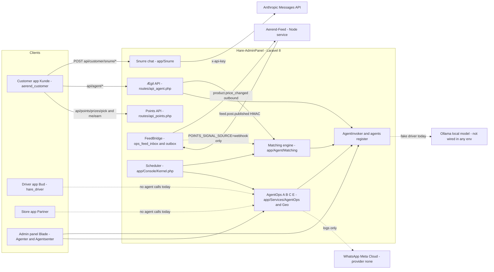

### 2.1 Agent landscape (diagram 1: which agents, which surfaces, which data)

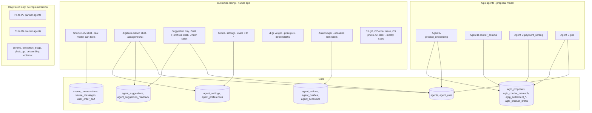

The two halves share only the substrate (`agents`, `agent_runs`, `AgentInvoker`, `PiiScrubber`). Customer Ægil tables are prefixed `agent_`; ops-agent tables are prefixed `agtp_` (AGIL-CONTRACT §3.3).

---

## 3. The agent substrate: register, AgentInvoker, guardrails

**What it is / why** — One wrapper through which every model call must pass, and one register that knows each agent's autonomy, scopes, caps, deadline and kill switch. It exists so that every agent "runs fully with the model off" (Ægil spec §1.9) and every run is auditable (Order Ops §17.4).

**Spec & design** — Order Ops §17.2 (autonomy L0 Draft / L1 Act-in-script / L2 Act-under-cap / L3 unused), §17.3 (register of 25 agents), §17.4 (scoped service tokens, `403 AGENT_SCOPE_DENIED`, deadlines 5 s for L1/L2, 60 s for L0, comms 90 s, vision 8 s), §17.5 (untrusted text fenced, caps per hour/per case, kill switch per agent, PII minimisation, no agent-to-agent chaining). `aerend-ai-agents-spec.docx` §2.1 puts runtime on a local Mac Studio with Ollama; §2.3 demands kill switches and configurable thresholds. AGIL-2-PLAN Phase 2 builds it.

**How it works today**

1. Caller builds `input`, a `model` closure, a deterministic `fallback` closure and an optional `validator`.
2. [`AgentInvoker::run`](../../../../Hare-AdminPanel/app/Agent/AgentInvoker.php) runs [`TextSanitiser::cleanArray`](../../../../Hare-AdminPanel/app/Agent/Support/TextSanitiser.php) then [`PiiScrubber::scrub`](../../../../Hare-AdminPanel/app/Agent/Support/PiiScrubber.php) and hashes the cleaned input.
3. `skipReason()` returns `agent_not_registered`, `kill_switch` (`agents.enabled = false`), `cap_per_hour` or `cap_per_day` → fallback is computed and an `agent_runs` row written with `validation_result = fallback`.
4. Otherwise the model closure runs. Exceptions → `model_error` fallback; elapsed > `deadline_ms` → `deadline_exceeded` fallback.
5. Output passes [`MoneyGuard::enforce`](../../../../Hare-AdminPanel/app/Agent/Support/MoneyGuard.php) (money fields must be policy keys, else `money_without_policy_key`) and the caller's validator (else `validator_rejected`). Rejected output is never stored.
6. An `AgentResult` (always with a usable value) is returned; one `agent_runs` row exists for every path.

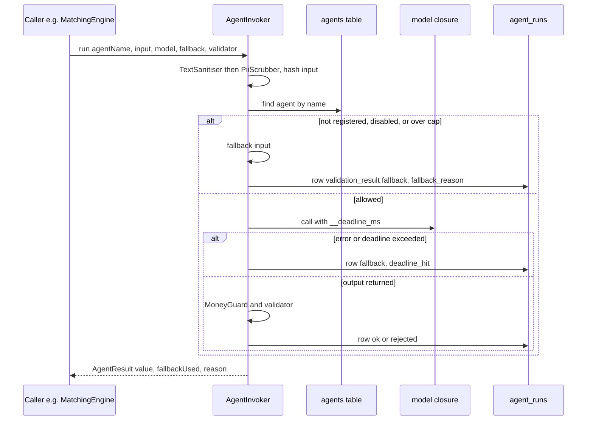

**Where in code**

| Layer | File | Key symbols |
|---|---|---|
| Backend | [`app/Agent/AgentInvoker.php`](../../../../Hare-AdminPanel/app/Agent/AgentInvoker.php) | `run`, `assertScope`, `skipReason`, `overCaseCap`, `fallbackResult`, `rejectedResult` |
| Backend | [`app/Agent/AgentResult.php`](../../../../Hare-AdminPanel/app/Agent/AgentResult.php) | value object (`fallbackUsed`, `fallbackReason`, `fromModel()`) |
| Backend | [`app/Agent/Support/`](../../../../Hare-AdminPanel/app/Agent/Support/) | `PiiScrubber`, `TextSanitiser`, `MoneyGuard`, `ConfigPolicyLookup` |
| Backend | [`app/Agent/AgentMetrics.php`](../../../../Hare-AdminPanel/app/Agent/AgentMetrics.php) | `runs`, `tray`, `scopeReview` (`SCOPE_REVIEW_THRESHOLD = 0.30`), `againstInterest`, `alerts` |
| Backend | [`app/model/Agent.php`](../../../../Hare-AdminPanel/app/model/Agent.php), [`AgentRun.php`](../../../../Hare-AdminPanel/app/model/AgentRun.php) | `hasScope`, `cap` |
| Migrations | [`2026_09_22_120000_create_agents_table.php`](../../../../Hare-AdminPanel/database/migrations/2026_09_22_120000_create_agents_table.php), [`…120100_create_agent_runs_table.php`](../../../../Hare-AdminPanel/database/migrations/2026_09_22_120100_create_agent_runs_table.php) | `agents (name, surface, autonomy L0/L1/L2, scopes, caps, enabled, token_hash, model, deadline_ms)`; `agent_runs (agent_name, input_hash, output, validation_result, deadline_hit, fallback_used, fallback_reason, duration_ms, tokens, cost, subject_*, case_key)` |
| Seeders | [`AgentRegisterSeeder.php`](../../../../Hare-AdminPanel/database/seeders/AgentRegisterSeeder.php), [`AgentOpsRegisterSeeder.php`](../../../../Hare-AdminPanel/database/seeders/AgentOpsRegisterSeeder.php) | 15 + 4 rows, all `enabled = false` |
| Console | [`AgentMetricsReport.php`](../../../../Hare-AdminPanel/app/Console/Commands/AgentMetricsReport.php) | `agent:metrics {--days=1} {--json}`, scheduled 07:00 |
| Route | [`routes/api_agent.php`](../../../../Hare-AdminPanel/routes/api_agent.php) | `GET /api/agent/ping` (`agent_scope:agent.ping`) — the only machine-to-machine Ægil route |
| Admin | [`Admin/AgentAdminController.php`](../../../../Hare-AdminPanel/app/Http/Controllers/Admin/AgentAdminController.php) | `/admin/agenter` index (register + runs), `toggle` (kill switch), `saveCaps` |

**The register (as seeded).** `AgentRegisterSeeder::register()`:

| name | surface | autonomy | caps h/d/case | Implementation that calls it |
|---|---|---|---|---|
| `aegil_customer` | customer | L1 | 120/600/3 | `MatchingEngine::shadowRerank`, `PreferenceInterpreter::interpret`, `MissionWordingService` (tests only) |
| `onboarding` | customer | L0 | 60/300/2 | none |
| `menu_copy`, `photo_enhance`, `campaign_planner`, `hours_exceptions` | partner | L1 | — | none |
| `photo_qa` | partner | L0 | 60/400/1 | deterministic fallback only (`DeliveryProofService::prevalidatePhoto`) |
| `bud_translate`, `bud_problem`, `bud_door` | bud | L1 | — | none |
| `bud_explain` | bud | L0 | — | none |
| `exception_triage` | admin | L1 | 60/400/3 | deadline + policy default only (`ProblemService::TRIAGE_DEADLINE_SECONDS = 60`) |
| `comms` | admin | L1 | — | none |
| `anomaly_explain` | admin | L0 | 30/200/1 | `AnomalyExplainService` (tests only) |
| `editorial` | admin | L0 | 0/0/0 | none (explicitly disabled) |

`AgentOpsRegisterSeeder` adds `product_onboarding` (partner), `courier_comms` (bud), `payment_sorting` (admin), `geo` (admin), all L1, scopes `proposals.write, proposals.read, runs.write, config.read`, `deadline_ms = 8000`.

**Spec vs code differences.** Order Ops §17.3 lists `agent.aegil_customer` as **L2**; the seeder registers it as **L1**. The spec names agents `agent.<name>`; code drops the prefix. `agent.settlement`, `agent.time_review`, `agent.aegil_partner`, `agent.aegil_bud`, `agent.support_triage`, `agent.order_issue`, `agent.gift`, `agent.reorder_photo`, `agent.door_interpret`, `agent.feed_moderation` from §17.3 are **not registered at all**.

**Use-case examples**
- An ops engineer flips `aegil_customer` on in `/admin/agenter`. The next `agent:match-daily` calls `shadowRerank`; the model closure is the identity, so `agent_runs.validation_result = ok` and `shadow_rank == engine_rank` for every row.
- With the agent left off (default), `/api/agent/chat` with text "jeg liker reker" writes one `agent_runs` row with `fallback_reason = kill_switch` and stores the sentence as a `note` preference.

**Status** — ✅ Built (substrate) / 🧪 every model closure that goes through it is a stub or a fixture driver. Evidence: `AgentInvoker.php`, `tests/Feature/Agent/AgentInvokerTest.php`, `AgentGuardrailsTest.php`, `AgentRegisterTest.php`.

---

## 4. Ægil chat — two stacks (Snurre LLM chat and the rule-based agent/chat)

**What it is / why** — The conversational face of Ægil ("Spør Ægil"): find products and stores, compare prices, build a cart from a goal, answer about the order. The spec makes chat one of only four bounded model uses (Ægil spec §15) with an allowlist of tools that map to endpoints a tap would call.

**Spec & design**
- Ægil spec §14 (chat content services, card per tweak T01–T34), §15 (chat tools allowlist; "never a model" for eligibility, scores, merges, charging), §21 (client requirements), Appendix C (tweak mapping).
- Design `Ærend leveranse 7 - Ærend AI.dc.html` frames 7a–7f: agent sheet at rest ("Lytter"), taco-night scenario with "Legg alt i kurven / Bytt butikk", Ægil states (Lytter, Tenker, Leter, Funn, La til/Fjernet, Spør, Beklager), eight card types (Forslagskort, Sammenlikning, Funn, Kvittering with Angre, Produktkort, Bytt, Kurvoversikt, Ikke funnet), first-run disclosure "Jeg er en AI…", age-gate via BankID, "Betal med Vipps" only in the cart strip. Default level in that design is **«Foreslå»** (level 1); the spec and code default to **level 2**.
- `aerend-ai-agents-spec.docx` §8 describes the same agent as "Agent D — Snurre (reference)", specified in a separate document ("Reen — Snurre AI Agent Spec v1.0") that is **not in the repo**.

**How it works today** — there are two independent backends:

| | **Stack 1: Snurre (LLM)** | **Stack 2: Ægil screen (rule-based)** |
|---|---|---|
| Endpoint | `POST /api/customer/snurre/chat` (+ `/context`, `/conversations/list`, `/conversations/messages`) | `POST /api/agent/chat` |
| Controller | [`Api/SnurreController::postChat`](../../../../Hare-AdminPanel/app/Http/Controllers/Api/SnurreController.php) → [`SnurreChatService::handleUserMessage`](../../../../Hare-AdminPanel/app/Snurre/SnurreChatService.php) | [`Agent/AegilAppController::chat`](../../../../Hare-AdminPanel/app/Http/Controllers/Agent/AegilAppController.php) |
| Model | Anthropic: Sonnet main turn + Haiku intent / meal plan / menu matcher | none — keyword lists (`AGE_WORDS`, `COMPARE_WORDS`, `GIFT_WORDS`, `SWAP_WORDS`) |
| Gate | `SNURRE_ENABLED` (true in `.env`) | customer auth only |
| Tools | 8: `search_stores`, `search_products`, `get_cart`, `add_to_cart`, `get_competitor_price`, `update_cart_quantity`, `remove_cart_line`, `clear_cart` | none; reads the tray via `SuggestionService::trayFor` |
| Cart | **writes the server cart directly** (`user_order_cart` with `snurre_*` metadata) at any Ægil level | never writes the cart |
| Ægil level / memory / allowlist | **not consulted** (no reference to `AgentSetting`, `ChatToolGate` or `AgentInvoker` in `app/Snurre/`) | free text → `PreferenceInterpreter::interpret` (stub → stored as `note`) |
| Response | `{status, conversation_id, title, blocks[]}` — block types `text`, `store_card`, `product_card`, `price_compare_card`, `ingredient_plan_card`, `cart_card` | `{state, reply, cards[], basket?, comparison?, door_note?, swap?, age_gate?, gift?, stored?}` with `state ∈ agForslag, agFunn, agSammen, agFiks, agIkkeFunnet, agAldersblokk` |
| App screen | [`lib/screens/snurre/snurre_chat_screen.dart`](../../lib/screens/snurre/snurre_chat_screen.dart) via [`snurre_repo.dart`](../../lib/screens/snurre/snurre_repo.dart) | [`lib/screens/bergen/aegil/aegil_screen.dart`](../../lib/screens/bergen/aegil/aegil_screen.dart) via [`lib/data/aegil/aegil_app_repo.dart`](../../lib/data/aegil/aegil_app_repo.dart) |
| Opened from | bottom-nav orb in search mode / long-press ([`bergen_nav.dart`](../../lib/screens/common/home/bergen/bergen_nav.dart) → [`home_main_v1.dart`](../../lib/screens/common/homeMainV1/home_main_v1.dart) `_openAegil`), the global floating launcher `_GlobalSnurreLauncher` in `lib/main.dart` (hidden on `/bergen/*` by [`snurre_launcher_policy.dart`](../../lib/screens/snurre/snurre_launcher_policy.dart)) | Hjem pull-down and handle tap (`bergen_home.dart` `_openAegil`), Søk "Spør Ægil", Kategori "Bestill fra bilde", Kurv, Mote, Meg rows |

### 4.1 Chat request sequence — Snurre (diagram 3)

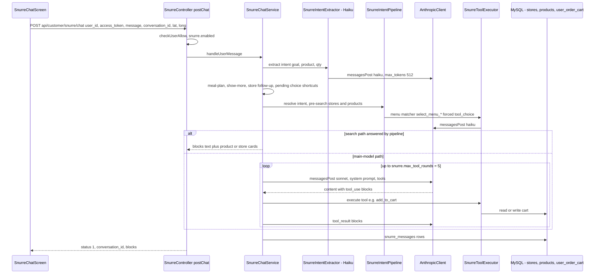

Search turns never call the Sonnet main model (`docs/SNURRE_STATUS.md` §1). Streaming (SSE) exists behind `SNURRE_STREAMING_ENABLED` **and** a `stream=true` request field; the app does not use it (it fakes a typewriter at 18 ms/char in `_animateAssistantMessage`).

### 4.2 Chat request sequence — Ægil screen (rule-based)

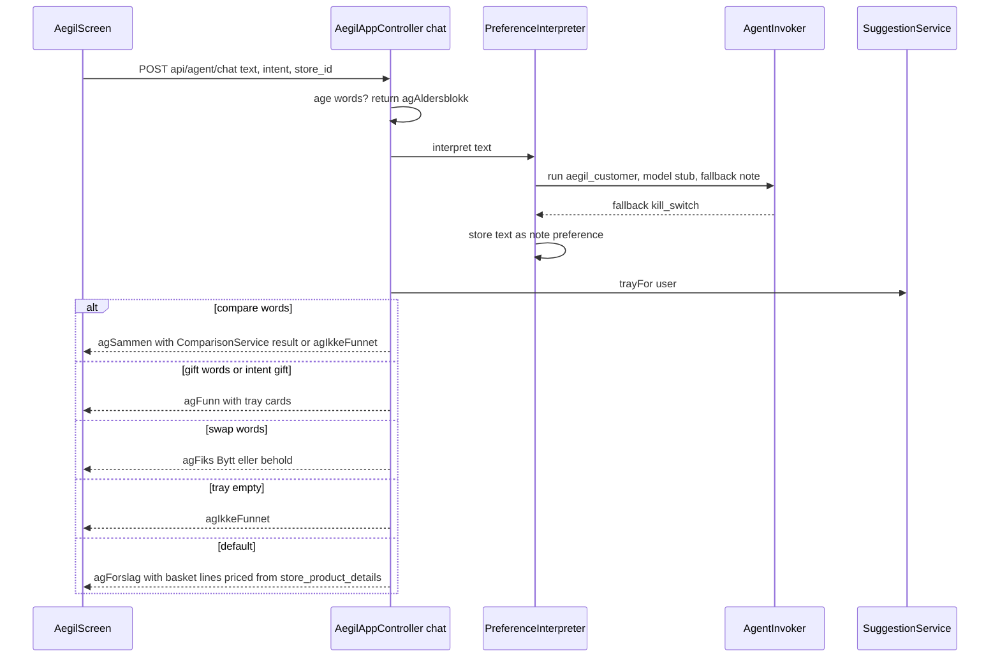

**Where in code**

| Layer | File | Key symbols |
|---|---|---|
| Backend Snurre | [`app/Snurre/SnurreChatService.php`](../../../../Hare-AdminPanel/app/Snurre/SnurreChatService.php) | `defaultSystemPrompt`, `handleUserMessage`, `anthropicToolDefinitions` (L1525–1666), tool loop (≈L577–690) |
| Backend Snurre | [`app/Snurre/SnurreToolExecutor.php`](../../../../Hare-AdminPanel/app/Snurre/SnurreToolExecutor.php) | `execute`, menu matchers `select_menu_items/categories/products`, cart writes with `snurre_conversation_id`, `snurre_flag_review` |
| Backend Snurre | [`app/Snurre/AnthropicClient.php`](../../../../Hare-AdminPanel/app/Snurre/AnthropicClient.php) | `messagesPost`, `messagesPostStream`, `API_VERSION = 2023-06-01` |
| Backend Ægil | [`app/Http/Controllers/Agent/AegilAppController.php`](../../../../Hare-AdminPanel/app/Http/Controllers/Agent/AegilAppController.php) | `chat`, `away`, `photoOrder`, `doorNote`, `trustLedger`, `basketLines` |
| Migrations | [`2026_05_13_160000_create_snurre_conversations_and_messages_tables.php`](../../../../Hare-AdminPanel/database/migrations/2026_05_13_160000_create_snurre_conversations_and_messages_tables.php), [`2026_05_21_110100_add_snurre_metadata_to_user_order_cart_table.php`](../../../../Hare-AdminPanel/database/migrations/2026_05_21_110100_add_snurre_metadata_to_user_order_cart_table.php) | `snurre_conversations`, `snurre_messages`; `user_order_cart.snurre_match_tier, snurre_flag_review, snurre_requested_label, snurre_matched_label, snurre_match_reason, snurre_conversation_id` |
| App | [`lib/screens/snurre/snurre_chat_screen.dart`](../../lib/screens/snurre/snurre_chat_screen.dart) | `SnurreChatScreen`, `SnurreChatSession.instance` (in-memory history), `_sendMessage`, `_addProductToCart` |
| App | [`lib/screens/bergen/aegil/aegil_screen.dart`](../../lib/screens/bergen/aegil/aegil_screen.dart) | `AegilScreen`, `_turnCard`, `_addBasket`, `_tillatelse` |
| App | [`lib/data/aegil/aegil_app_models.dart`](../../lib/data/aegil/aegil_app_models.dart) | `AegilTurn` |
| App | [`lib/screens/bergen/aegil/aegil_copy.dart`](../../lib/screens/bergen/aegil/aegil_copy.dart) | `A3AegilCopy.a3_aegil_kveld` (hardcoded evening cards) |

**Use-case examples**
- *Snurre:* a logged-in customer with a delivery address types "legg til 2 melk". The Haiku extractor returns goal `cart_edit`; the pipeline pre-searches; Sonnet calls `search_products` then `add_to_cart`; a `cart_card` block returns. The cart line carries `snurre_conversation_id`, so Kurv marks it as Ægil-added (`KurvLine.addedByAegil` in [`kasse_models.dart`](../../lib/data/ops/kasse_models.dart)) and offers "Angre" (`kurv_screen.dart` `_undoAegil`). This happens even if the customer's Ægil level is 0.
- *Ægil screen:* "hvor er det billigst å kjøpe skrei" → `COMPARE_WORDS` match → `ComparisonService::compare` on the product identities in the tray → `agSammen` with totals incl. delivery, or `agIkkeFunnet` when the tray has no identities (the usual case today).
- *Ægil screen:* "en flaske vin" → `agAldersblokk` "18+ · ikke verifisert. Bekreft alderen din med BankID…" before anything else runs.

**Known app-side gaps (verified in code):** `AegilScreen` never reads its route arguments, so `intent=photo|door` and the typed query from Søk/Kategori/Kurv are lost; the "FORSLAG I KVELD" cards are always the hardcoded `a3_aegil_kveld`; "Legg i kurven" only posts `/suggestions/{id}/add` (no cart write) yet toasts "N varer lagt i kurven"; `photoOrder()` and `doorNote()` exist in `AegilAppRepo` but have no callers; `listConversations()`/`conversationMessages()` in `SnurreRepo` have no callers (history lives in memory only). About a dozen agil-2 chat-card widgets in [`lib/screens/aegil/widgets/`](../../lib/screens/aegil/widgets/) (`ShoppingListCard`, `ComparisonCard`, `NewsCard`, `PointsExplainerCard`, `LevelRefusalCard`, `AgainstInterestLineCard`, `TrustLedgerCard`, `ActionLogList`, `RemindersCard`, `VaagenMoment`, `OnboardingChipBatch`) are only exercised by `test/aegil/*`.

**Status** — 🟡 Partial. Snurre LLM chat ✅ end to end (but ungated by Ægil rules). Ægil screen ✅ wired to a 🧪 rule-based backend; the design's model-driven chat (states, swap, gift, photo, door) is not implemented.

---

## 5. Memory, preferences and onboarding (Minne, Det Ægil vet om deg)

**What it is / why** — "Memory is the user's, shown in full" (Ægil spec §1.1). Everything Ægil uses to personalise must be readable and deletable; allergens and diets are hard constraints that are never inferred.

**Spec & design** — Ægil spec §3 (stated preferences, free-text interpretation with 5 s deadline → `note` fallback, learned patterns with confirm/reject, product identity), §4 (onboarding chip batch, 7-day re-invite, guests after first delivery), §17 Memory API (`GET /me/memory`, `POST /me/preferences`, `/batch`, `DELETE /me/preferences/{id}`, `GET /me/patterns`, `POST /me/patterns/{id}/confirm|reject`, `POST /me/memory/forget_all`), §22 privacy. Design `leveranse 7` frame 7f: "Det Ægil vet om deg", every item editable/deletable, "Ægil husker ingenting som ikke står på denne siden", "Glem alt".

**How it works today**
1. **Write paths:** (a) `POST /api/agent/me/preferences/batch` with `chips[{kind, value, label, weight?}]` → [`PreferenceService::rememberBatch`](../../../../Hare-AdminPanel/app/Agent/Services/PreferenceService.php) with source `onboarding`; (b) `POST /api/agent/me/interpret` and every `POST /api/agent/chat` turn → [`PreferenceInterpreter::interpret`](../../../../Hare-AdminPanel/app/Agent/Services/PreferenceInterpreter.php); (c) `SuggestionService::never` writes `exclusion_product` / `exclusion_store` with source `feedback`.
2. **Hard-constraint gate, three layers:** CHECK constraint on `agent_preferences`; `PreferenceService::remember` downgrades an `allergen`/`diet` from any source other than `stated`/`onboarding` to a `note` (`HARD_CONSTRAINT_REQUIRES_STATED`); the interpreter validator rejects model output claiming one.
3. **The interpreter is a stub.** `callModel()` returns `['note' => text]`, and the agent row is disabled anyway, so every free-text sentence becomes a `note` row (value truncated to 120 chars). "Jeg liker reker" does **not** become a `like`.
4. **Read path:** `GET /api/agent/me/memory` → `memory[]` (`id, kind, value, label, source, weight, hard_constraint`) + `hard_constraints[]`.
5. **Forget all:** `DELETE /api/agent/me/memory` → `PreferenceService::forgetAll` deletes `agent_preferences`, `agent_suggestions`, `agent_suggestion_feedback`, `agent_against_interest_events`, `agent_reminders`, `agent_availability_subscriptions`, `agent_actions`, `agent_shopping_list_items` for the user (not `agent_occasions`, not `agent_pushes`, not `snurre_*`).

**Where in code**

| Layer | File | Key symbols |
|---|---|---|
| Backend | [`app/Agent/Services/PreferenceService.php`](../../../../Hare-AdminPanel/app/Agent/Services/PreferenceService.php) | `remember`, `rememberBatch`, `memoryFor`, `hardConstraintsFor`, `forget` (no route), `forgetAll` |
| Backend | [`app/Agent/Services/PreferenceInterpreter.php`](../../../../Hare-AdminPanel/app/Agent/Services/PreferenceInterpreter.php) | `interpret`, `validate`, `callModel` (stub), `DEADLINE_MS = 5000` |
| Backend | [`app/model/AgentPreference.php`](../../../../Hare-AdminPanel/app/model/AgentPreference.php) | kinds `allergen, diet, like, dislike, exclusion_product, exclusion_store, note`; `EXPLICIT_SOURCES = [stated, onboarding]` |
| Backend | [`app/Http/Controllers/Agent/AegilMeController.php`](../../../../Hare-AdminPanel/app/Http/Controllers/Agent/AegilMeController.php) | `showMemory`, `forgetAll`, `storePreferencesBatch`, `interpret` |
| Migration | [`2026_09_22_160100_create_agent_preferences_table.php`](../../../../Hare-AdminPanel/database/migrations/2026_09_22_160100_create_agent_preferences_table.php) | `agent_preferences (user_id, kind, value, label, source, weight, meta, expires_at)`, unique `(user_id, kind, value)` |
| Migration | [`2026_09_22_160200_create_agent_product_identity_tables.php`](../../../../Hare-AdminPanel/database/migrations/2026_09_22_160200_create_agent_product_identity_tables.php) | `agent_product_identities (ean, name, brand, category, unit, age_restricted, allergens)`, `agent_reference_prices`, `store_product_details.product_identity_id` |
| App | [`lib/screens/bergen/aegil/minne_screen.dart`](../../lib/screens/bergen/aegil/minne_screen.dart) | `MinneScreen` (`/bergen/aegil/minne`): groups by kind, "Legg til" → `submitChips([kind:'like', value: <typed text>])`, "Glem alt" → `forgetAll()`, "Stemmer" local only |
| App | [`lib/data/aegil/aegil_repo.dart`](../../lib/data/aegil/aegil_repo.dart) | `fetchMemory`, `forgetAll` (POST `_method=DELETE`), `submitChips` |
| App (unmounted) | [`lib/screens/aegil/widgets/onboarding_chip_batch.dart`](../../lib/screens/aegil/widgets/onboarding_chip_batch.dart) | `OnboardingChipBatch`, `OnboardingReinvitePolicy` — tested, not mounted on any screen |

**Use-case examples**
- A customer opens Minne, taps "Legg til" and types "reker". A row `kind=like, value="reker", source=onboarding` is stored. The scorer matches likes against product identity id, category slug (e.g. `mat_fisk`) or store id **as strings** — "reker" matches none of them, so the like has no effect on scoring (see §7).
- A customer writes "jeg spiser vel alt uten nøtter" in the Ægil chat. It becomes a `note`; no allergen row is created (`PreferencesTest`).
- "Glem alt" clears suggestions and the action log too; the Hjem finds card disappears on the next refresh.

**Status** — 🟡 Partial. Stated memory, hard-constraint gate and forget-all ✅. Not built: free-text interpretation (stub), learned patterns (`learned_patterns` table, `/me/patterns/*`) ❌, per-entry delete route (`PreferenceService::forget` exists, no route; app has no "Fjern") ❌, onboarding chip flow in the app (widget unmounted) 🟡, mapping of free-text likes to categories ❌.

---

## 6. Autonomy levels, settings and pause (Nivå, Tillatelse)

**What it is / why** — The customer chooses how much Ægil may do on its own. The level is enforced server-side at execution time (Ægil spec §1.2).

**Spec & design** — Ægil spec §2 (five levels 0–4, default 2, `agent_settings` fields, `LEVEL_REQUIRES_RECURRING`, audited level changes and pauses), §17 (`GET|PATCH /me/agent_settings`, `POST /me/agent/pause`, `GET /me/agent_state`). Design `Ærend Kunde Bergen.dc.html` `NIVAAER` list gives the names; `leveranse 7` offers only Foreslå / "Handle i kurven" in the first sheet.

### 6.1 What each level permits (diagram 5)

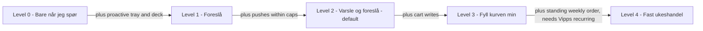

| Level | Name in code (`AgentSetting::LEVEL_NAMES`) | Spec permits | Code enforces (where) | Actually happens today |
|---|---|---|---|---|
| 0 | Bare når jeg spør | chat only, no persistent memory unless added | `acceptsProactive()` false → empty tray/deck; `EligibilityFilter` rejects `level_or_paused`; chat write tools `add_to_shopping_list`, `remove_from_shopping_list` | Tray empty. Snurre chat still writes the cart. Free text still stored as notes. |
| 1 | Foreslå | in-app highlights, tray when app open | tray/deck served; `set_reminder`, `subscribe_availability` allowed in `ChatToolAllowlist` | Tray and Fjordfiske deck work. |
| 2 | Varsle og foreslå | + tray while closed, pushes within caps, wait reminders | `acceptsPush()` (level ≥ 2, `push_mode != 'off'`, not paused) in `AgentPushGate::send` | No push is ever delivered (§12). Same as level 1 in practice. |
| 3 | Fyll kurven min | + cart merge while closed, receipted, undo | `mayWriteCart()` → `add` returns `cart_written: true`; `add_to_cart` tool allowed in allowlist | **Nothing writes the cart** (§10). |
| 4 | Fast ukeshandel | + standing weekly grocery order, recurring payment | `update` rejects level 4 without `recurring_agreement` → 422 `LEVEL_REQUIRES_RECURRING` | No weekly build, standing orders or Vipps recurring (`weekly_orders`, `standing_orders` tables absent). Meg "Se ukens kurv" is a toast. |

**How it works today**
1. `GET /api/agent/me/settings` → `settings` (level, level_name, allowed_store_mode, allowed_store_ids, allowed_categories, caps, quiet_hours, learning_enabled, paused_until, paused, push_mode, against_interest_enabled, read_aloud, recurring_agreement, may_write_cart) + `levels[]` from `AgentSettingsService::levelExplanations`.
2. `PATCH /api/agent/me/settings` (the app sends `POST` with `_method=PATCH`) accepts exactly: `level, allowed_store_mode, allowed_store_ids, allowed_categories, cap_per_order, cap_per_week, quiet_hours, learning_enabled, paused_until, push_mode, against_interest_enabled, read_aloud`. Level changes write `PtsAuditLog` (`agent_settings.level_change`).
3. `AgentSetting::forUser` creates a row with `level = 2` on first read — so any customer who opens settings once becomes eligible for `agent:match-daily` (which only iterates users that have a settings row with level ≥ 1).

**Where in code**

| Layer | File | Key symbols |
|---|---|---|
| Backend | [`app/model/AgentSetting.php`](../../../../Hare-AdminPanel/app/model/AgentSetting.php) | `LEVEL_NAMES`, `isPaused`, `acceptsProactive`, `acceptsPush`, `mayWriteCart`, `allowsStore` (mode `allowlist`), `allowsCategory`, `inQuietHours` |
| Backend | [`app/Agent/Services/AgentSettingsService.php`](../../../../Hare-AdminPanel/app/Agent/Services/AgentSettingsService.php) | `forUser`, `update`, `pause`, `resume` (no routes call `pause`/`resume`), `levelExplanations` |
| Backend | [`app/Http/Controllers/Agent/AegilMeController.php`](../../../../Hare-AdminPanel/app/Http/Controllers/Agent/AegilMeController.php) | `showSettings`, `updateSettings`, `settingsPayload` |
| Migration | [`2026_09_22_160000_create_agent_settings_table.php`](../../../../Hare-AdminPanel/database/migrations/2026_09_22_160000_create_agent_settings_table.php) | defaults: `level 2`, `allowed_store_mode 'all'`, `push_mode 'good_only'` |
| Flag | [`app/Points/FeatureFlags.php`](../../../../Hare-AdminPanel/app/Points/FeatureFlags.php) | `AEGIL_LEVEL_MAX`, `maxAegilLevel()` — **no caller** |
| App | [`lib/screens/aegil/widgets/aegil_settings_panel.dart`](../../lib/screens/aegil/widgets/aegil_settings_panel.dart) | `AegilSettingsPanel` (level tiles, three switches, quiet hours read-only, pause 7 days) |
| App | [`lib/data/aegil/aegil_repo.dart`](../../lib/data/aegil/aegil_repo.dart), [`aegil_models.dart`](../../lib/data/aegil/aegil_models.dart) | `fetchSettings`, `updateSettings`, `AegilSettings`, `AegilLevel` |
| App | [`aegil_screen.dart`](../../lib/screens/bergen/aegil/aegil_screen.dart) `_tillatelse`, [`meg_screen.dart`](../../lib/screens/bergen/meg/meg_screen.dart) `_aegilInnstillinger` | sheet hosts |

**Use-case examples**
- A customer taps "Fyll kurven min". The backend saves level 3 and audits it; `may_write_cart` becomes true; nothing else changes because no merge job exists.
- A customer taps "Pause i 7 dager". The app sends `{pause_days: 7}`. `updateSettings` ignores unknown keys, so `paused_until` stays null and the response is `status 1` — **the pause silently does nothing**.
- A customer taps level 4 without a Vipps agreement → 422 `LEVEL_REQUIRES_RECURRING`; the app's `post()` throws on 4xx and `AegilSettingsPanel.levelError` is never passed, so the customer sees no reason.

**Spec vs code differences.** Spec `allowed_store_mode ∈ {all_nearby, favourites, list}` vs code `all` / `allowlist`; spec `push_mode ∈ {never, daily, good_only}` vs code checks `'off'`; spec `POST /me/agent/pause` and `GET /me/agent_state` are not routed; `aegil_level_max` (set to 3 in `.env` and documented in `AGIL-1-REMAINING.md`) is never read when saving a level.

**Status** — 🟡 Partial. Levels 0–2 ✅ as tray gates; level 3/4 effects ❌; pause from the app broken 🟡; rollout cap flag not enforced ❌.

---

## 7. Daily matching pipeline (signals → candidates → tray)

**What it is / why** — Ægil's proactive engine: turn offers, arrivals and price drops into a small daily tray of explainable suggestions. Deterministic first; a model may only re-rank among validated candidates (Ægil spec §1.10, §5.3).

**Spec & design** — Ægil spec §5.1 (signal sources: `offer`, `arrival`, `rhythm`, `threshold`, `availability`), §5.2 (eligibility → score with `policy.agent.match_weights` → threshold → dedup per `(customer, identity, store)` → pool ≤ 20), §5.3 (`rerank_daily`, model returns ordered subset ≤ `tray_size`, validated in code, `rerank_source ∈ model|fallback`), §19 jobs, Appendix A sequence. AGIL-2-PLAN Phase 7.

### 7.1 Pipeline (diagram 2)

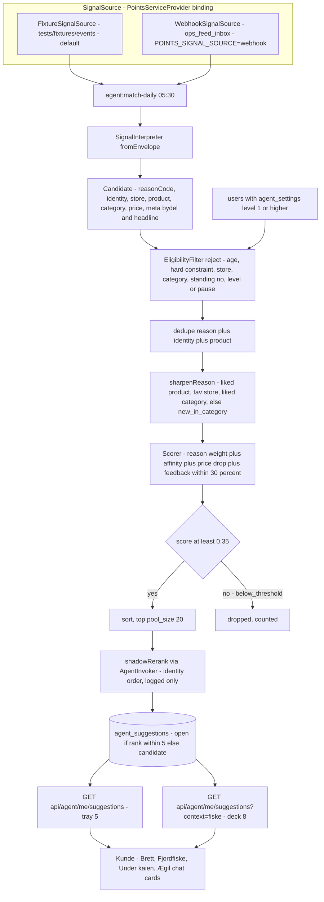

**How it works today**
1. **Trigger:** `agent:match-daily {--user=} {--dry-run}` scheduled `dailyAt('05:30')` in [`Kernel.php`](../../../../Hare-AdminPanel/app/Console/Kernel.php). No event-driven `evaluate_signals`, no hourly run, no `rerank_daily` per customer, no `rhythm_scheduler`.
2. **Signals:** the command reads `feed.post.published` and `product.price_changed` from the bound `SignalSource` ([`PointsServiceProvider::register`](../../../../Hare-AdminPanel/app/Providers/PointsServiceProvider.php): `env('POINTS_SIGNAL_SOURCE','fixtures') === 'webhook' ? WebhookSignalSource : FixtureSignalSource`). Fixture source = one envelope per file.
3. **Interpretation** ([`SignalInterpreter`](../../../../Hare-AdminPanel/app/Agent/Matching/SignalInterpreter.php)): `post_type ∈ {tilbud, tilbud_i_naerheten}` → `offer_liked_product`; `{ny_i_hyllene, dagens_rett, nytt_i_hyllene, ny_pa_aerend}` → `arrival_fav_store`; anything else (e.g. `butikk_i_fokus`) → nothing. `product.price_changed` with `new < old` → `price_drop_watched` with old/new øre. Prefixed contract ids (`s_77`, `p_3`, `pi_88`) are reduced to digits. `meta` keeps `post_type`, `headline`, `bydel`.
4. **Per user:** every user with an `agent_settings` row at level ≥ 1, the **same** candidate list.
5. **Eligibility** ([`EligibilityFilter::reject`](../../../../Hare-AdminPanel/app/Agent/Matching/EligibilityFilter.php)), in order: `age_restricted` (identity row), `hard_constraint` (identity allergens ∩ customer allergen/diet values), `store_not_allowed`, `category_not_allowed`, `excluded_by_customer` (exclusion_product/store), `level_or_paused`. **Checks 1–2 need an `agent_product_identities` row; nothing in app code writes that table**, so for live data they never fire.
6. **Reason sharpening** (`MatchingEngine::sharpenReason`): an offer becomes `offer_fav_store` if the customer has a `like` on the store id, else `new_in_category`; an arrival becomes `arrival_liked_category` / `new_in_category`.
7. **Score** ([`Scorer::score`](../../../../Hare-AdminPanel/app/Agent/Matching/Scorer.php)) = `reason weight` + `affinity` (Σ ±`weight ?? 0.5` per like/dislike whose value equals the identity id, category or store id) × 1.0 + `price_drop` (min(1, 2 × fractional drop) × 0.6) + `feedback` (Σ decayed deltas, clamped ±0.30, 90-day linear decay). Breakdown stored in `score_breakdown`.
8. **Threshold** `agent.match_threshold = 0.35`; pool `agent.pool_size = 20`; first `agent.tray_size = 5` stored `open` (with `served_at`), the rest `candidate`; `expires_at = pool_day + 3 days`; upsert key `(user_id, pool_day, reason_code, product_identity_id, store_product_id)`.
9. **Shadow re-rank:** `AgentInvoker::run('aegil_customer', model: fn() => order 0..n-1, fallback: same)`. `shadow_rank` is stored, `engine_rank` is served, `rerank_source = 'shadow_logged'`.

**Reason weights** (`config/agent.php` → `match_weights.reason`): `offer_liked_product 0.70`, `price_drop_watched 0.65`, `availability_back 0.60`, `rhythm_due 0.55`, `offer_fav_store 0.50`, `arrival_fav_store 0.45`, `rewards_threshold 0.40`, `arrival_liked_category 0.40`, `new_in_category 0.30`. Customer copy is in [`SuggestionReasons::COPY`](../../../../Hare-AdminPanel/app/Agent/SuggestionReasons.php). Spec reason codes differ (`offer_cheaper_elsewhere`, `rhythm_dinner_day`, `rhythm_recurring_item`, `threshold_free_delivery`, `threshold_varde` are spec-only; `price_drop_watched`, `new_in_category` are code-only). Only 6 of the 9 code reasons can ever be produced (`rhythm_due`, `rewards_threshold`, `availability_back` have no producer).

**Worked scores with the local fixtures** (`feed.post.published`: `tilbud`, store `s_77`, product `p_3`, identity `pi_88`, category `mat_fisk`, bydel Bergenhus, headline "Fersk skrei fra Torget"; `product.price_changed`: same product, 5900 → 4950 øre):

| Customer | Feed-post candidate | Price-drop candidate |
|---|---|---|
| No likes | `new_in_category` 0.30 → **dropped** (below 0.35) | 0.65 + 0.6 × min(1, 2 × 950/5900) = 0.65 + 0.193 = **0.843 → open** |
| Like on store "77" (weight null → 0.5) | `offer_fav_store` 0.50 + 0.5 = **1.00** | 0.843 + 0.5 = **1.343** |
| Like on identity "88" | `offer_liked_product` 0.70 + 0.5 = **1.20** | 1.343 |
| Like "reker" (free text from Minne) | 0.30 → dropped | 0.843 |
| `exclusion_product` "88" (after "Ikke for meg") | rejected `excluded_by_customer` | rejected |

**Where in code**

| Layer | File | Key symbols |
|---|---|---|
| Console | [`app/Console/Commands/AgentMatchDaily.php`](../../../../Hare-AdminPanel/app/Console/Commands/AgentMatchDaily.php) | `agent:match-daily`, `userIds` |
| Backend | [`app/Agent/Matching/MatchingEngine.php`](../../../../Hare-AdminPanel/app/Agent/Matching/MatchingEngine.php) | `run`, `trayFor`, `deckFor`, `sharpenReason`, `shadowRerank`, `store` |
| Backend | [`app/Agent/Matching/`](../../../../Hare-AdminPanel/app/Agent/Matching/) | `SignalInterpreter`, `EligibilityFilter`, `Scorer` (`FEEDBACK_BOUND`, `FEEDBACK_DECAY_DAYS`), `Candidate::dedupeKey` |
| Sources | [`app/Points/Sources/FixtureSignalSource.php`](../../../../Hare-AdminPanel/app/Points/Sources/FixtureSignalSource.php), [`WebhookSignalSource.php`](../../../../Hare-AdminPanel/app/Points/Sources/WebhookSignalSource.php) | `events(type)`; webhook reads `FeedBridge::INBOX_TABLE` (`ops_feed_inbox`), dedupes on `event_id`, unwraps envelopes |
| Fixtures | [`tests/fixtures/events/`](../../../../Hare-AdminPanel/tests/fixtures/events/) | `feed.post.published.json`, `product.price_changed.json` |
| Migration | [`2026_09_22_170000_create_agent_suggestion_tables.php`](../../../../Hare-AdminPanel/database/migrations/2026_09_22_170000_create_agent_suggestion_tables.php) | `agent_suggestions`, `agent_suggestion_feedback` |
| Tests | `tests/Feature/Agent/MatchingTest.php`, `TrayTest.php`, `RerankShadowTest.php`, `FiskeDeckTest.php`, `FeedbackTest.php` | — |

**Status** — 🟡 Partial. Deterministic engine ✅ (tested). 🧪 shadow re-rank is an identity function; ❌ rhythm, threshold, availability signals; ❌ learned patterns; ❌ live signals by default; ❌ product identities populated; ❌ expiry transition (`expires_at` is set but no job moves `open` → `expired`, and `trayFor`/`deckFor` do not filter on `expires_at` or `pool_day`, so stale open suggestions from earlier days stay in the tray until acted on).

---

## 8. Suggestion tray and Hjem surfaces (Brett, Dra ned for å spørre Ægil, dupper, Under kaien)

**What it is / why** — The tray ("Brett", drawer) is where proactive suggestions wait for a tap; Hjem is where the customer first meets Ægil.

**Spec & design** — Ægil spec §7 (tray `GET /me/suggestions?state=open` ≤ `tray_size`, actions `add | dismiss | never`, `never` → `exclusion_product`), §12.1 (feedback verdicts and reasons, bounded ±30 %, 90-day decay), §21. Design `Ærend Kunde Bergen.dc.html` Hjem pull handle, Ægil-relevanskort, brett, Napp-kort (≈L2115), dupper ("floats"). AGIL-3-PLAN Phase 7 design ledger rows Brett / Napp-kort / Mens du var borte.

### 8.1 Suggestion state machine (diagram 4)

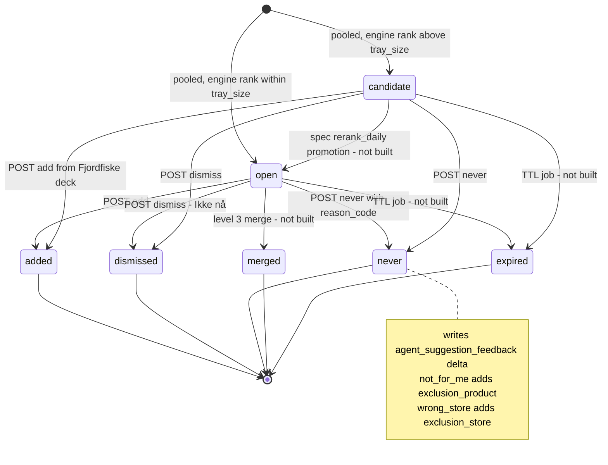

`merged` and `expired` exist as constants (`AgentSuggestion::MERGED`, `::EXPIRED`) and in the enum column but **no code path sets them**. Re-running the matcher on the same day upserts and can move an acted suggestion back to `open`/`candidate` (the upsert overwrites `state`).

**API**

| Method + path | Route name | Behaviour |
|---|---|---|
| `GET /api/agent/me/suggestions[?context=fiske]` | `agent.me.suggestions` | tray (≤5, `state=open`, by `engine_rank`) or deck (§9). Empty when level 0 or paused. Response `{suggestions[], context: 'tray'|'fiske', tray_size, deck_size}`; any other `context` value (`home`, `under_kaien`) returns the tray. |
| `POST /api/agent/me/suggestions/{id}/add` | `agent.me.suggestions.add` | state `added`; returns `cart_written` (= level ≥ 3 and not paused) and `item {store_product_id, store_id, product_identity_id}` |
| `POST /api/agent/me/suggestions/{id}/dismiss` | `agent.me.suggestions.dismiss` | state `dismissed` ("Ikke nå") |
| `POST /api/agent/me/suggestions/{id}/never` | `agent.me.suggestions.never` | state `never` + feedback row; body `reason_code` default `not_for_me` |

Card payload ([`SuggestionController::payload`](../../../../Hare-AdminPanel/app/Http/Controllers/Agent/SuggestionController.php)): `id, state, reason_code, reason (Norwegian copy), product_identity_id, store_id, store_product_id, category, post_id, headline, expires_at, bydel, store_name, eta_minutes, price_ore`. `price_ore` is read live from `store_product_details` (discount_type 1 = kroner off, 2 = percent off) and is null when the product belongs to another store; the signal's own `price_ore` is never shown.

**"Ikke for meg" reasons** ([`AgentSuggestionFeedback::DELTAS`](../../../../Hare-AdminPanel/app/model/AgentSuggestionFeedback.php)): `not_for_me −0.30` (+ standing `exclusion_product`), `not_interested −0.20`, `too_expensive −0.10`, `wrong_store −0.10` (+ `exclusion_store`), `already_have −0.05`, `wrong_time −0.05`. The app's `NotForMeReason` in [`lib/data/aegil/suggestion_models.dart`](../../lib/data/aegil/suggestion_models.dart) offers the same six. There is no "never-list" screen; standing exclusions show up in Minne as memory rows.

**Hjem surfaces (app)**

| Surface | File | Data | Status |
|---|---|---|---|
| "Dra ned for å spørre Ægil" pull handle | [`bergen_home.dart`](../../lib/screens/common/home/bergen/bergen_home.dart) `_PullHandle`, `_dragEnd` (> 110 px), `_handleTap` → `_openAegil` → `/bergen/aegil`; copy `BergenCopy.pullToAsk` in [`bergen_copy.dart`](../../lib/screens/common/home/bergen/bergen_copy.dart) | none (navigation) | ✅ |
| Ægil finds card → Brett | [`brett_entry.dart`](../../lib/screens/bergen/aegil/brett_entry.dart) `refreshAegilFindCount` (cold start/resume, skips guests), `showAegilBrett` → `SuggestionTray` | `GET …/suggestions?context=home` | ✅ (count after opening uses unfiltered `l.length`) |
| Tray widget | [`lib/screens/aegil/widgets/suggestion_tray.dart`](../../lib/screens/aegil/widgets/suggestion_tray.dart) `SuggestionTray`, `NotForMeSheet` | shows `reason` + `headline` only (not price/store/eta) | ✅ |
| Hjem floats ("dupper") | `bergen_home.dart` `_floats`, `_placeholderFloats` (`TODO(api): Ægil recommendations`), `_onFloatNever`, `_onFloatSunk` | first 3 items of `hare-swipe`, else hardcoded "Reker på tilbud / Torgboden 149" etc. | 🧪 not agent data; never/sink are session-local |
| Napp-kort from a float | [`lib/screens/bergen/poeng/napp_entry.dart`](../../lib/screens/bergen/poeng/napp_entry.dart) `showNappKort` | add/dismiss/never only if the id parses as int — float ids (`p123`, `b1`) do not, so no API call fires from Hjem | 🟡 |
| Under kaien | [`ops_customer_api.dart`](../../lib/networking/ops/ops_customer_api.dart) `underKaien()` → `GET api/agent/me/suggestions?context=under_kaien`; mapped in `bergen_home.dart` `_loadUnderKaien` | reads `title/product_name/name`, but the contract field is `headline` → title may be blank; two of three cards static ("Reker, 1 kg / 299 kr / Torgboden") | 🟡 |
| Mens du var borte | [`lib/screens/bergen/meg/borte_entry.dart`](../../lib/screens/bergen/meg/borte_entry.dart) → `GET api/agent/me/away` | see §12 | 🟡 |

**Use-case examples**
- *Level 2, no likes, local fixtures:* after `php artisan agent:match-daily` the customer has one `open` suggestion (price drop on product 3). Hjem shows "1 funn"; the Brett shows "Prisen har gått ned" + headline null (price-change candidates carry no headline).
- *"Ikke for meg → Aldri dette":* `POST …/never {reason_code: not_for_me}` stores an `exclusion_product` on identity 88; the next day both fixture candidates are rejected with `excluded_by_customer`.
- *Level 0:* `GET …/suggestions` returns `[]`; the finds card stays hidden.

**Status** — ✅ Built for tray + feedback (backend and app). 🟡 Hjem floats and Under kaien are mostly static; 🟡 tray never expires; ❌ spec's separate `/feedback` (verdict `good`) endpoint, ❌ notification item per open suggestion.

---

## 9. Fjordfiske deck, Vågen and Ægil velger

**What it is / why** — Gamified ways to meet Ægil's suggestions and prizes. **Fjordfiske** (fjord fishing) deals suggestion "catches"; **Vågen** (the bay) is the one-pull-a-day catch from the feed; **Ægil velger** (Ægil picks) chooses a prize from the customer's Premiehylla (prize shelf).

**Spec & design** — Ægil spec does not describe these; they come from the Points spec v2 and the design `Ærend Kunde Bergen.dc.html` (`fiske` ≈L6436–6640, `velger` ≈L6306, Napp-kort ≈L2115). AGIL-3-PLAN Phase 7 Points rows; contract event `suggestion.reeled` (`EVENT_CONTRACT.md`).

**How it works today**

| Function | Trigger | Inputs | Decision logic | Output | Surface | Backend | App | Route |
|---|---|---|---|---|---|---|---|---|
| Fjordfiske deck | customer opens `/bergen/fjordfiske` | user's suggestions | `MatchingEngine::deckFor(user, 8)`: all `open` by `engine_rank`, then the latest `pool_day`'s `candidate` rows, up to `agent.fiske_deck_size` (8); empty at level 0/paused | cards with `headline, store_name, price_ore, bydel, eta_minutes` | FjordfiskeScreen; missing fields fall back to the store menu (`_prefetchStore`), missing bydel → "Bergen" | [`SuggestionController::index`](../../../../Hare-AdminPanel/app/Http/Controllers/Agent/SuggestionController.php), [`SuggestionService::deckFor`](../../../../Hare-AdminPanel/app/Agent/Services/SuggestionService.php) | [`fjordfiske_screen.dart`](../../lib/screens/bergen/fiske/fjordfiske_screen.dart) `_load`, `_catchFor`; [`fiske_game.dart`](../../lib/screens/bergen/fiske/fiske_game.dart) `FiskeDeck`; [`fiske_cards.dart`](../../lib/screens/bergen/fiske/fiske_cards.dart) | `GET /api/agent/me/suggestions?context=fiske` |
| Catch actions | "Dra inn" / "Slipp" / "Lagre" / "Legg i kurven" | suggestion id | `_dra` earns points; `_slipp` → dismiss; `_lagre` → suggestion add + store favourite; `_kurv` → suggestion add + `BergenCart.add` | points ledger row, suggestion state | same | [`Points/FiskeController::earn`](../../../../Hare-AdminPanel/app/Http/Controllers/Points/FiskeController.php) (cap `points.fiske_maks` = 5/day, `dagens_napp` 5 points, idempotent per catch) | same | `POST /api/points/me/earn?rule=dagens_napp`, suggestion add/dismiss |
| Fiske status | screen load | user | daily-catch count vs cap, prize cadence | `{taken, left, …}` | header | [`Ops/CustomerController::fiske`](../../../../Hare-AdminPanel/app/Http/Controllers/Ops/CustomerController.php) | `ops_customer_api.dart` | `GET /api/ops/customer/fiske` (`ops.customer.fiske`) |
| Ægil velger | "Ægil velger" on Premiehylla | the customer's unlocked shelf | **deterministic**: dearest *affordable* prize, else dearest unlocked; fixed reason strings | `{prize, reason, value_hint: "Verdi minst 300 kr", affordable}` | [`aegil_velger_screen.dart`](../../lib/screens/bergen/poeng/aegil_velger_screen.dart); "Hent" → claim; "Bra" / "Ikke for meg" are **toasts only** | [`FiskeController::pick`](../../../../Hare-AdminPanel/app/Http/Controllers/Points/FiskeController.php) | [`points_app_repo.dart`](../../lib/data/points/points_app_repo.dart) `pick` | `POST /api/points/prizes/pick` (`points.prizes.pick`) |
| Vågen pull | tap on the Vågen card in the feed | `customer_id`, optional `post_id`, `suggestion_id` | one pull per customer per Oslo day (`ops_vaagen_reels`) | `suggestion.reeled` event via the feed outbox; Dagens napp points via `DagensNappRule` | `feed_home.dart` `_reelVaagen` | [`Ops/FeedBridgeController::reelVaagen`](../../../../Hare-AdminPanel/app/Http/Controllers/Ops/FeedBridgeController.php), `VaagenService::reel` | [`lib/networking/ops/ops_feed_api.dart`](../../lib/networking/ops/ops_feed_api.dart) | `GET /api/ops/feed/vaagen?customer_id=`, `POST /api/ops/feed/vaagen/reel` |

**Use-case examples**
- *A Bronse customer at level 2 with no likes* opens Fjordfiske after the 05:30 run: the deck holds the one price-drop suggestion (open) and nothing else; the card shows store name and ETA from `store_details`, live price from `store_product_details`, and bydel null (price-change signals carry no bydel) → rendered "Bergen".
- *Same customer at level 0:* the deck is empty; the screen shows fewer/no cards (no mock data).
- *Ægil velger with 1 200 points and an unlocked 900-point prize:* `pick` returns that prize with "Du har poeng nok, og dette er det beste på hylla di." No model is involved, and the customer's "Ikke for meg" on the pick is not stored.

**Notes** — The Vågen endpoints authenticate nothing but a `customer_id` query/body field (no access token). The `Agn` (bait) chip rail in the design needs a facet the suggestions API does not have (AGIL-3-REMAINING §3).

**Status** — ✅ Fjordfiske deck and catch earn are wired end to end; 🧪 Ægil velger is a rule, not an agent; 🟡 velger feedback not persisted.

---

## 10. Cart writes, level 3 merge and agent lines in Kurv

**What it is / why** — Below level 3 Ægil never touches the cart; at level 3 it may merge open suggestions into the server cart while the app is closed, with a receipt and undo (Ægil spec §1.3, §7, §10.4).

**Spec & design** — Ægil spec §7 (`merge_level3` on `suggestion.open` while closed; `cart_lines.added_by = agent`; respects `cap_per_order`, `cap_per_week`; never changes user lines; `merge_blocked_reason` when another store is in the cart; `POST /me/cart/lines/{id}/undo`), §13 action log `cart_merged`, §24 edge cases (`OFFER_EXPIRED`, sold out, level lowered). Design `leveranse 7` "Kvittering med Angre".

**How it works today**
1. `POST /api/agent/me/suggestions/{id}/add` sets state `added` and returns `cart_written = AgentSetting::mayWriteCart()` — **true at level 3 even though no cart row is written**. There is no `merge_level3` job, no `added_by` column on the cart (grep for `added_by` in `app/` finds only `ChatContentController`'s `added_by_agent` on shopping-list items), and no state transition to `merged`.
2. The only agent path that does write the cart is the **Snurre** tool loop (`add_to_cart`, `update_cart_quantity`, `remove_cart_line`, `clear_cart` in [`SnurreToolExecutor`](../../../../Hare-AdminPanel/app/Snurre/SnurreToolExecutor.php)), which ignores the level. Lines get `snurre_conversation_id` and optionally `snurre_flag_review` (best-guess substitutions).
3. In the app, [`kasse_models.dart`](../../lib/data/ops/kasse_models.dart) sets `KurvLine.addedByAegil` when a line has `snurre_conversation_id` or `added_by == 'aegil'`; [`kurv_screen.dart`](../../lib/screens/bergen/kasse/kurv_screen.dart) `_undoAegil()` removes such lines. Snurre's `cart_card` shows the `snurre_flag_review` badge.
4. The Ægil screen's "Legg i kurven" and the Fjordfiske "Legg i kurven" both call suggestion `/add`; only Fjordfiske also calls `BergenCart.add` (a client-side cart add, i.e. the customer's own tap).

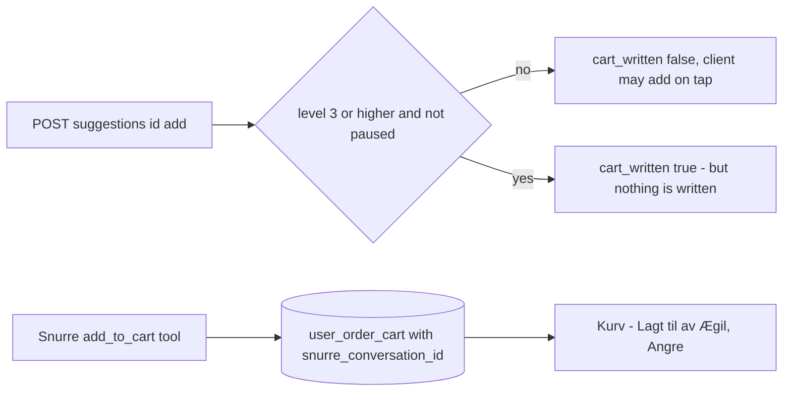

**Use-case examples**
- *Level 3 customer:* taps "Legg til" in the Brett → response `cart_written: true`. The app ignores the flag (`SuggestionTray` treats add as tray-only) and the backend wrote nothing, so the item never reaches the cart.
- *Level 0 customer in the Snurre chat:* "legg en pizza margherita i kurven" → Sonnet calls `add_to_cart`; the line appears in Kurv marked as Ægil-added with Angre.

**Status** — ❌ Level-3 merge not built (spec P5). 🟡 Chat cart writes exist but bypass the level model. ✅ Kurv shows and undoes Ægil-added lines.

---

## 11. Against-interest engine, reminders, availability, trust ledger (Mot egen interesse, Tillitsregnskap)

**What it is / why** — The feature that makes Ægil trustworthy: say "don't buy this here / now" when it costs Ærend a sale, log every evaluation, and show the customer a ledger of what that honesty saved them (Ægil spec §6, §9, §12.2).

**Spec & design** — Ægil spec §6.1 checks (`cheaper_elsewhere` ≥ 20 kr or ≥ 15 % incl. delivery share; `wait_for_offer` within 4 days or cyclic price confidence ≥ 0.7; `already_have` within 2 days for confirmed recurring items; `store_unreliable` window hit rate < 80 % over ≥ 10 orders; `threshold_trap`; `not_needed`), §6.2 (line rendered first in the turn; "Minn meg" creates a reminder; every evaluation logged whether or not it fired), §9.1 reminders, §9.2 availability subscriptions (60-day auto-cancel), §12.2 trust ledger. Design `Ægil-chatten - tweaks.dc.html` T21, T23, T28.

**How it works today**
- [`AgainstInterestEngine::evaluate(userId, item)`](../../../../Hare-AdminPanel/app/Agent/AgainstInterest/AgainstInterestEngine.php) runs six rule-based checks and writes one `agent_against_interest_events` row **per finding** (not per evaluation — non-firing checks leave no row, contrary to spec §6.2 and the AGIL-2-PLAN Phase 8 checkbox). `shown = !silenced && against_interest_enabled`. `visibleLines()` filters silenced checks.
- Check implementations differ from the spec:

| Check | Code condition | Data it needs | Producer of that data |
|---|---|---|---|
| `cheaper_elsewhere` | same identity at another allowed store, cheaper by > `agent.against_interest.cheaper_elsewhere_min_ore` (500 øre = 5 kr), observed within 7 days | `agent_reference_prices` | **none** in app code |
| `already_have` | `agent_actions` row `action='purchase'` with that identity in 14 days | `agent_actions` | **none** writes `purchase` |
| `wait_for_offer` | 90-day min reference price ≥ 15 % below current | `agent_reference_prices` | none |
| `not_needed` | identity in the customer's `exclusion_product` | `agent_preferences` | ✅ |
| `threshold_trap` | item fills a free-delivery gap but costs more than delivery | caller-supplied basket fields | caller |
| `store_unreliable` | ≥ 2 `agent_actions` `action='order_problem'` for that store in 90 days | `agent_actions` | none |

- **Nothing calls `evaluate()`** outside `tests/Feature/Agent/AgainstInterestTest.php` — no controller, cart hook or chat turn.
- [`ReminderService`](../../../../Hare-AdminPanel/app/Agent/Services/ReminderService.php): `waitForOffer`, `onPriceObserved`, `subscribeToAvailability`, `onAvailability`, `onDelivered`, `expireStale`. Only `expireStale` runs (from `agent:daily-maintenance`); the others have no caller and no routes (`POST /me/reminders`, `POST /me/availability_subscriptions` are not routed). The app's price alert calls `POST api/agent/availability-subscriptions` ([`ops_butikk_api.dart`](../../lib/networking/ops/ops_butikk_api.dart) `subscribeToPrice`) — **that route does not exist**, and the guarded wrapper swallows the 404.
- [`TrustLedgerService::compute`](../../../../Hare-AdminPanel/app/Agent/Services/TrustLedgerService.php) recomputes a month from `agent_against_interest_events` (`saved_kr` = taken savings, `finds_applied`, `against_interest_shown` = all events, `wait_recommended`, `cheaper_elsewhere_taken`); `rollUpAll` runs nightly; `GET /api/agent/me/trust-ledger` serves it; [`minne_screen.dart`](../../lib/screens/bergen/aegil/minne_screen.dart) shows it. With no events ever written in production, every number is 0.

**Where in code**

| Layer | File | Key symbols |
|---|---|---|
| Backend | [`app/Agent/AgainstInterest/`](../../../../Hare-AdminPanel/app/Agent/AgainstInterest/) | `AgainstInterestEngine` (`evaluate`, `visibleLines`, `silence`, `unsilence`), `AgainstInterestFinding` |
| Backend | [`app/Agent/Services/ReminderService.php`](../../../../Hare-AdminPanel/app/Agent/Services/ReminderService.php), [`TrustLedgerService.php`](../../../../Hare-AdminPanel/app/Agent/Services/TrustLedgerService.php) | see above; `markTaken` (no caller) |
| Migration | [`2026_09_22_180000_create_agent_against_interest_tables.php`](../../../../Hare-AdminPanel/database/migrations/2026_09_22_180000_create_agent_against_interest_tables.php) | `agent_against_interest_events`, `agent_reminders`, `agent_availability_subscriptions`, `agent_actions`, `agent_trust_ledger`, `agent_pushes` |
| App (unmounted) | [`lib/screens/aegil/widgets/against_interest_line.dart`](../../lib/screens/aegil/widgets/against_interest_line.dart) | `AgainstInterestLineCard`, `AgainstInterestTurn` (asserts line-first layout), `TrustLedgerCard` |
| App | [`lib/data/aegil/against_interest_models.dart`](../../lib/data/aegil/against_interest_models.dart) | models only |

**Use-case examples (as the engine is written)**
- A test seeds a reference price 30 kr lower at an allowed store and calls `evaluate` for a 149 kr item → finding `cheaper_elsewhere_same_product` "Den samme varen koster 30 kr mindre hos en butikk du bruker." with action "Bytt butikk"; an event row is written even if the customer silenced the line.
- In the running app, opening Kurv or chatting never triggers an evaluation, so no line is ever shown.

**Status** — 🧪 Backend-only engine with tests; ❌ not wired to any surface; ❌ reference prices / identities / purchase actions have no producer; ❌ reminders and availability routes; ✅ trust ledger read path (returns zeros).

---

## 12. Pushes, communication table, action log and occasions (Mens du var borte, Anledninger)

**What it is / why** — How Ægil speaks while the app is closed: capped pushes, in-app items, and the "while you were away" log (Ægil spec §8, §13, §16).

**Spec & design** — Ægil spec §8 (push on `suggestion.open`, `reminder.due`, `weekly.ready`, `cart.merged_by_agent` when level ≥ 2; `daily` = 1/day, `good_only` = 3 per 7 days; quiet hours default 21:00–08:00; deep links `aerend://item/{id}`; `agent_push_log`), §13 (`agent_actions`, `GET /me/agent_actions?unseen=true`, `/seen`, `/{id}/undo`, 30-day user view, 12-month audit), §16 (notification-centre rows). Points spec "Ægil communication table". AGIL-4-PLAN (Anledninger). Design `leveranse 7`: "Aldri chat-push. Ægil hentes, sendes ikke."

**How it works today**
- **Push gate** — [`AgentPushGate::send`](../../../../Hare-AdminPanel/app/Agent/Services/AgentPushGate.php) decides and records (`agent_pushes.state ∈ sent | suppressed | deferred`, `suppressed_reason ∈ push_off_or_level, no_deep_link, daily_cap, good_only_cap, quiet_hours`). It **never calls FCM or any sender** — "sent" means "would have been sent". `dueDeferred()` lists deferred rows; `agent:daily-maintenance` only counts them. `channelDefinition()` is the array meant for agil-1's notifications config (never appended — AGIL-2-PLAN Phase 8 "BLOCKED").
- **Communication table** — [`CommunicationRouter::route`](../../../../Hare-AdminPanel/app/Agent/Chat/CommunicationRouter.php) maps 10 points events to `in_app | push | chat` with Norwegian templates and dedupe keys; only `tier.review_warning` and `points.expiring` push. **No production caller** (only `CommunicationTest`).
- **Action log** — [`ActionLogService`](../../../../Hare-AdminPanel/app/Agent/Services/ActionLogService.php) `record`, `forUser` (visible window), `markSeen`, `unseenCount`, `purgeExpired` (nightly). Writers today: `agent:occasion-reminders` (`occasion.reminder`) and `POST /api/agent/door-note` (`door_note.set`, never called by the app). `GET /api/agent/me/away` returns ≤ 3 unseen items `{id, text, action, deep_link, undoable, at}`. There is **no** `seen` or `undo` route; the app's "Angre" in [`borte_entry.dart`](../../lib/screens/bergen/meg/borte_entry.dart) is local, and `deep_link` is ignored.
- **Occasions (Anledninger)** — [`OccasionController`](../../../../Hare-AdminPanel/app/Http/Controllers/Agent/OccasionController.php) `index|store|destroy` (`person`, `date`, `label`, `lead_days` default 7, `yearly` default true) on `agent_occasions` (migration [`2026_10_08_000000_a4_meg_tab.php`](../../../../Hare-AdminPanel/database/migrations/2026_10_08_000000_a4_meg_tab.php)). [`agent:occasion-reminders`](../../../../Hare-AdminPanel/app/Console/Commands/Agent/OccasionReminders.php) (daily 08:05) writes one `AgentAction` per occasion `lead_days` before it ("{person} har {label} {date} — om {n} dager. Vil du sende noe?", deep link `/bergen/kategori/gaver`), idempotent per year via `last_reminded_year`. App: [`meg_sheets.dart`](../../lib/screens/bergen/meg/meg_sheets.dart) `MegSheets.anledninger`, `_leggTilAnledning`; repo `AegilAppRepo.occasions/addOccasion/removeOccasion`.
- **App push handling** — [`push_notification_service.dart`](../../lib/services/push_notification_service.dart) `handleNotificationClick` routes feed, chat, wallet, transport and food-delivery pushes; there is **no branch for agent pushes**. Varsler ([`varsler_panel.dart`](../../lib/screens/bergen/meg/varsler_panel.dart)) classifies "Ægil" items by keyword from `mass-notification-list`.

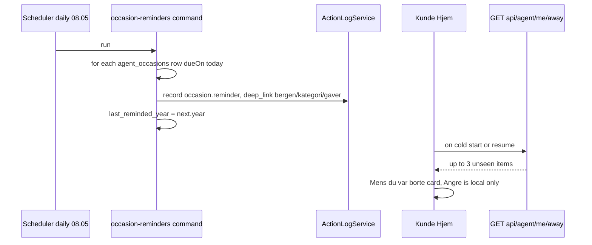

**Use-case example** — On 2026-10-02 a customer adds "Mamma, bursdag, 2026-10-09" with default lead 7. At 08:05 the next morning the command writes "Mamma har bursdag 9. oktober — om 7 dager. Vil du sende noe?". The customer sees it under the Hjem pull handle on next open; no push is sent; tapping does not navigate to Gaver.

**Status** — 🟡 Occasions ✅ end to end as an in-app item; action log read ✅, seen/undo ❌; push gate 🧪 records only; communication router 🧪 test-only; agent push delivery and app routing ❌.

---

## 13. Chat content services and the tool allowlist

**What it is / why** — Read models the chat can render as cards without a model (Ægil spec §14), plus the allowlist that says which tools a model may call at which level (§15).

**How it works today**

| Endpoint | Controller | Service | Notes |
|---|---|---|---|
| `GET /api/agent/me/shopping-list` | [`ChatContentController::shoppingList`](../../../../Hare-AdminPanel/app/Http/Controllers/Agent/ChatContentController.php) | [`ShoppingListService`](../../../../Hare-AdminPanel/app/Agent/Chat/ShoppingListService.php) | items `{id, text, qty, done, source, added_by_agent}`; app reads it in Meg "Ukeshandel" |
| `POST /api/agent/me/shopping-list` | `addToShoppingList` | gated by `ChatToolGate::check('add_to_shopping_list')` (level 0 ok) | repeated items merge qty |
| `POST /api/agent/me/shopping-list/{id}/toggle` | `toggleShoppingListItem` | | |
| `POST /api/agent/compare` | `compare` | [`ComparisonService::compare`](../../../../Hare-AdminPanel/app/Agent/Chat/ComparisonService.php) | needs ≥ 2 `product_identity_ids`; per-unit price from `agent_reference_prices`; allowlisted fields only; **not** the spec's per-store totals incl. delivery |
| `GET /api/agent/me/points-explainer` | `pointsExplainer` | | "Hvordan får jeg poeng?" |
| `GET /api/agent/me/monthly-summary` | `monthlySummary` | | earned / spent / expired |
| `POST /api/agent/me/tool-check` | `toolCheck` | [`ChatToolGate`](../../../../Hare-AdminPanel/app/Agent/Chat/ChatToolGate.php) | returns `{allowed, reason, copy, required_level}` and `available_tools` |

**Tool allowlist** ([`ChatToolAllowlist`](../../../../Hare-AdminPanel/app/Agent/Chat/ChatToolAllowlist.php)): read tools `get_shopping_list, get_order_status, get_points_balance, get_points_explainer, get_monthly_summary, get_reminders, get_suggestions, compare_products, get_feed_post, get_store_hours`; write tools with minimum level `add_to_shopping_list 0, remove_from_shopping_list 0, set_reminder 1, subscribe_availability 1, add_to_cart 3`; `NEVER_EXPOSED` = `check_eligibility, score_candidate, merge_suggestions, charge_customer, apply_payment, write_hard_constraint, set_allergen, override_policy, grant_points`. A refusal names the level: "Å legge ting i kurven krever nivå 3 — «Fyll kurven min». Du står på nivå 2, «Varsle og foreslå»…".

**The allowlist is not connected to any model.** No LLM loop reads `ChatToolAllowlist::for()`; Snurre defines its own 8 tools; `AegilAppController` has `ChatToolGate` injected but never calls it. It is a policy object exercised by `ChatToolsTest` and `tool-check`.

**Status** — 🟡 Read models ✅ (shopping list read used by the app; others unused by the app); allowlist 🧪 not enforced on the real LLM.

---

## 14. Customer agent functions C1–C4

**Spec & design** — Order Ops §17.7 "Customer app" (C1 `agent.gift` L0, C2 `agent.order_issue` L2 under cap, C3 `agent.reorder_photo` L1, C4 `agent.door_interpret` L0) and §17.9 customer API (`POST /gifts/brief`, `GET /gifts/candidates`, `POST /orders/{id}/issue`, `POST /reorder/scan`, `POST /addresses/{id}/door/parse`). Design [`Ærend Kunde - agentfunksjoner C1-C4.dc.html`](../../../../designs/21des/Ærend%20Kunde%20-%20agentfunksjoner%20C1-C4.dc.html) header contract: "motoren finner kandidater, modellen velger eller skriver, appen viser resultatet med grunn — og ingenting skjer uten brukerens trykk". The 8–10-week plan puts C1–C4 in the backlog ("BL"); AGIL-2-PLAN calls the design "reference only — C1–C4 are backlog".

| | C1 Gaveagenten (gift agent) | C2 Noe galt med bestillingen? (order issue) | C3 Bestill fra bilde (order from photo) | C4 Dørtolkning (door interpretation) |
|---|---|---|---|---|
| **Spec trigger** | "La Ægil finne en gave" chip on Gaver; chat | row on Levert after rating | photo button on Mat & fisk, Ægil field, Handleliste | free text in Meg → Adresser and checkout |
| **Inputs** | brief (til hvem, anledning, budsjett, når), memory, deterministic candidate set | order timeline, proof photo, customer photo + one line, issue history | package/barcode photo, product DB, allowed stores | one line of text or dictation |
| **Decision logic** | model picks ≤ 3 from engine candidates; budget, delivery date, age limit validated in code | classify (missing, wrong, damaged, cold/late, not delivered, other) → policy key → auto-credit within `policy.issue.max_auto_amount` else escalate; **never auto-deny** | EAN/recognition → ≤ 3 identities; < 0.6 confidence asks "Var det denne?" | text → floor, bell name, entrance, code chips; codes stored only with consent |
| **Outputs** | 3 cards with "Derfor:", card text draft | `order_issues` row; "Vi har lagt 89 kr på saldoen din" or "Vi ser på det" | "Legg til" card, nothing added without tap; photo deleted after 24 h | `door_profiles` proposal shown as "Dette er det budet ser" |
| **Code today** | `AegilAppController::chat`: `GIFT_WORDS` or `intent=gift` → `agFunn` with the ordinary tray cards. No candidates, no card text. | Not an agent. `POST /api/ops/customer/orders/{orderId}/problem` ([`Ops/CustomerController::problem`](../../../../Hare-AdminPanel/app/Http/Controllers/Ops/CustomerController.php)) records kinds `door, missing, wait, cancel` | `POST /api/agent/photo-order` (`AegilAppController::photoOrder`) takes a **text list** `items[]` and echoes the tray; no image, no OCR | `POST /api/agent/door-note` (`AegilAppController::doorNote`) truncates the note to 120 chars and logs an action; no parsing, no consent, no `door_profiles` write |
| **App today** | Kategori/Gaver push `kAegilRoute` with arguments that `AegilScreen` ignores | ops tracking problem sheet (agil-1) | Kategori "Bestill fra bilde" → `kAegilRoute {intent: photo}` (ignored); `AegilAppRepo.photoOrder` unused | `AegilAppRepo.doorNote` unused; Kurv `_tolk` pushes `{intent: door}` (ignored) |
| **Example** | "gave til mamma, 60 år, under 600 kr, til lørdag" → today: "Fant noe. Pakkes inn hvis du vil." with whatever the tray holds | "Manglet en vare" → today: a problem row for ops; no instant credit | — | "tredje etasje, ring på Hansen" → today: nothing is sent (no caller) |
| **Status** | 🧪 keyword stub | ❌ agent; ops problem path exists | 🧪 text stub, unused | 🧪 stub, unused |

**Conflict to resolve** — C2's instant "89 kr på saldoen" conflicts with `aerend-support-refunds-feed-spec.docx` §3.3 (auto-refund caps ship at 0 kr) and that spec's own open question that no saldo/wallet exists.

---

## 15. Ops agents A, B, C, E (proposal substrate and Agentsenter)

**What it is / why** — Back-office agents that keep orders moving and remove manual work, under one rule: **propose, never execute** (`aerend-ai-agents-spec.docx` §1). An agent writes a proposal; a human (or, for Agent B, a guarded auto-approval) decides; an existing service executes.

**Spec & design**
- `aerend-ai-agents-spec.docx`: §2 runtime (local Ollama on a Mac Studio, scoped Agent API, kill switch per agent, configurable thresholds, TTL), §3 common proposal model (`proposed → approved|rejected|expired`, `approved → executed|failed`, idempotency key `agent_key + subject + trigger window`), §4 Agent A product onboarding, §5 Agent B courier comms (T1 = 3 min, K = 3, W = 2, T2 = 2 min, quiet hours 22:00–07:00, auto-approve inside guardrails), §6 Agent C payment sorting (weekly batches, anomaly flags informational, "Du beholder X kr" framing), §7 shared UI strings (`agent_badge_proposed`, `agent_offer_from_ai`, `order_status_finding_courier`, …), §9 legal gate for WhatsApp consent, §11 build order, §12 open questions.
- `aerend-geo-coverage-spec.docx` §6 (Agent E). AGIL-3-PLAN Phases 1–3, 6. AGIL-CONTRACT §3.3.
- Design [`Ærend Partner - utviklervedlegg (ordre, kommunikasjon, agenter).dc.html`](../../../../designs/21des/Ærend%20Partner%20-%20utviklervedlegg%20%28ordre,%20kommunikasjon,%20agenter%29.dc.html) §3 agent matrix (data in `designs/21des/aerend-ordre.js` `AGENTER`): product_onboarding, courier_comms, payout_sorting, ask_aerend_ai.

**Shared substrate (built)**

| Piece | File | Notes |
|---|---|---|
| Proposal record | [`app/Models/AgentOps/Proposal.php`](../../../../Hare-AdminPanel/app/Models/AgentOps/Proposal.php), `ProposalStatus`, `ProposalType` | table `agtp_proposals` (`agent_key, proposal_type, subject_type, subject_id, payload_json, evidence_json, rationale, status, proposed_at, expires_at, decided_by_*, decision_reason, executed_at, execution_ref, error, idempotency_key unique`) |
| State machine | [`app/Services/AgentOps/ProposalService.php`](../../../../Hare-AdminPanel/app/Services/AgentOps/ProposalService.php) | `propose` (idempotent), `approve`, `reject`, `expire`, `markExecuted`, `markFailed`, `expireDue`; terminal → 422 `AGTP_TERMINAL`; every decision → `ops_audit_log` + event `agent.proposal_decided` v1 |
| Execution | [`ProposalExecutor.php`](../../../../Hare-AdminPanel/app/Services/AgentOps/ProposalExecutor.php) | `product_draft` → `DraftApprovalService`; `settlement_batch` → `SettlementExportService` (stops at `exported`); `courier_outreach` → `OutreachSender`; `geo_*` → `Geo\GeoProposalApplier` |
| Scoped Agent API | [`routes/api_agentops.php`](../../../../Hare-AdminPanel/routes/api_agentops.php), [`AgentOpsToken` middleware](../../../../Hare-AdminPanel/app/Http/Middleware/AgentOpsToken.php) | Bearer / `X-Agent-Token` sha256 vs `agents.token_hash`; 403 `AGENT_DISABLED` when the row is off |
| Model driver | [`app/Services/AgentOps/Model/`](../../../../Hare-AdminPanel/app/Services/AgentOps/Model/) | `ModelDriver::complete(task, input)`; `FakeModelDriver` reads `tests/fixtures/agentops/<task>.json`; `OllamaModelDriver` (unused in any env) |
| Flags | [`app/AgentOps/AgentOpsFlags.php`](../../../../Hare-AdminPanel/app/AgentOps/AgentOpsFlags.php) | 12 surface flags, all off |
| Policies | [`app/Services/AgentOps/AgtPolicyKeys.php`](../../../../Hare-AdminPanel/app/Services/AgentOps/AgtPolicyKeys.php) | `agt.courier_comms.t1_minutes 3`, `t2_minutes 2`, `k_per_wave 3`, `w_waves 2`, `quiet_hours ["22:00","07:00"]`, `agt.proposal_ttl_hours 24`, `agt.payment_sorting.cadence weekly`, `agt.product_onboarding.bulk_threshold 0.9`, `first_approval aerend` |
| Admin | [`Admin/AgentOpsAdminController.php`](../../../../Hare-AdminPanel/app/Http/Controllers/Admin/AgentOpsAdminController.php) | `/admin/agentsenter`, tabs `forslag, oppgjor, produkt, budkontakt, kjoringer, innstillinger` |

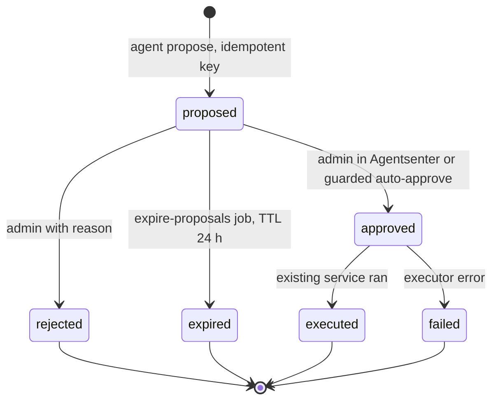

### 15.1 Per-agent detail (diagram 6: ops agent flows as built)

```mermaid
flowchart TB
  subgraph B["Agent B courier_comms - every minute"]
    B1["agentops:run courier_comms"] --> B2{"agent enabled and agt.courier_comms on"}
    B2 -->|"no"| B0["return, nothing"]
    B2 -->|"yes"| B3["orders accepted, seen or ready in last 6 h, aerend_courier, accepted more than T1 ago, no accepted assignment"]
    B3 --> B4["shortlist from CandidateSource - exclude no consent, on hold, contacted for order, contacted in 20 min"]
    B4 --> B5["courier_outreach proposal - wave n of W, K couriers, template slots"]
    B5 --> B6{"auto_approve flag and guardrails"}
    B6 -->|"no - default"| B7["waits in Agentsenter Budkontakt"]
    B6 -->|"yes"| B8["approve then OutreachSender"]
    B7 -->|"admin approves"| B8
    B8 --> B9["WhatsAppProvider none - logs template only"]
    B5 --> B10["CustomerTrackingReadModel finding_courier - Finner bud"]
  end
  subgraph E["Agent E geo - hourly"]
    E1["agentops:run geo"] --> E2["GeoAgent scan - waiting stores, hot demand cells, ETA p90 drift over 60 min, launch brief"]
    E2 --> E3["geo_* proposals with tool output as evidence"]
    E3 --> E4["Områder Forslag tab"] --> E5["GeoProposalApplier - ZoneService, place store, notify"]
  end
  subgraph C["Agent C payment_sorting - 06:10"]
    C1["agentops:settle --auto"] --> C2["PaymentSortingAgent proposePeriod - partner and courier batches, lines per order, anomaly over 2 sigma"]
    C2 --> C3["Agentsenter Oppgjør - batch or line decisions"] --> C4["SettlementExportService CSV - status exported"]
  end
  subgraph A["Agent A product_onboarding - on request"]
    A1["POST api/agentops/imports or panel import"] --> A2["sources - partner feed CSV or text or EAN, Kassal by EAN, own site only with authorization, denylist"]
    A2 --> A3["AgentInvoker product_onboarding - fake driver, confidence capped by rule floor"]
    A3 --> A4["agtp_product_drafts - never live"] --> A5["approve, edit or bulk approve over 0.9"] --> A6["DraftApprovalService - StoreProductDetails plus ProductChangeLogger"]
  end
```

| Agent | Trigger | Inputs | Decision logic | Output | Visible surface | Backend | App | Routes |
|---|---|---|---|---|---|---|---|---|
| **A** `product_onboarding` | `POST /api/agentops/imports` (partner), panel import, scheduled refresh (off: `agentops:run product_onboarding` only warns) | CSV / free text / EAN list / own-site URL | `PartnerFeedSource` → `KassalSource` (by EAN, `AGENTOPS_KASSAL_API_KEY`) → `OwnSiteSource` (needs `agtp_content_authorizations`; denylist incl. wolt, foodora, oda, rema…). `AgentInvoker('product_onboarding')` may lower but never raise the rule confidence; **never writes a price** | `agtp_product_drafts` + `product_draft` proposals | Agentsenter "Produkt" tab; Partner «AI-assistert import» **not built** | [`ProductOnboardingAgent::import`](../../../../Hare-AdminPanel/app/Services/AgentOps/ProductOnboardingAgent.php), [`DraftApprovalService`](../../../../Hare-AdminPanel/app/Services/AgentOps/DraftApprovalService.php), `Sources/*` | none | `/api/agentops/imports`, `imports/{ref}/drafts`, `imports/{ref}/approve-bulk`, `drafts/{id}/approve|reject` (**no auth**) |
| **B** `courier_comms` | every minute (`agentops:run courier_comms`) | open aerend-courier orders, candidates from the dispatch `CandidateSource` seam, consents, outreach history | see diagram; one proposal per wave; auto-approve only with `agt.courier_comms.auto_approve` (legal gate, off) and all guardrails | proposal → on approval `agtp_courier_outreach` rows + template `courier_order_offer_v1` (store, zone, ETA, earnings hint, `hare-driver://offer/{id}`, STOPP line; no PII, no price) | Customer/partner tracking "Finner bud" via `CustomerTrackingReadModel::findingCourier`; Bud badge "Fra Ærend AI" and WhatsApp consent toggle **not built** in Hare-Driver | [`CourierCommsAgent`](../../../../Hare-AdminPanel/app/Services/AgentOps/CourierCommsAgent.php) `scan`, `proposeWave`, `excludeReasons`, `mayAutoApprove`, `proposeShiftReminder`; [`OutreachSender`](../../../../Hare-AdminPanel/app/Services/AgentOps/OutreachSender.php); `WhatsApp/NoneProvider`, `MetaCloudProvider` | none | `GET /api/agentops/offers/{id}/badge`, `POST /api/agentops/couriers/{id}/whatsapp-consent` (**no auth**) |
| **C** `payment_sorting` | daily 06:10 `agentops:settle --auto` (cadence policy) | delivered orders, payout lines, settlement service, prior batches | per party lines (gross, deduction, delivery_income, tip, adjustment) in øre; anomaly = net > 2σ from trailing periods (flag only); rejected lines carry forward | `agtp_settlement_batches`, `agtp_settlement_lines`, `settlement_batch` proposal | Agentsenter "Oppgjør"; Partner «Oppgjør» and Bud «Utbetalinger» **not built** | [`PaymentSortingAgent`](../../../../Hare-AdminPanel/app/Services/AgentOps/PaymentSortingAgent.php) `proposePeriod`, `propose`, `summary`; [`SettlementExportService`](../../../../Hare-AdminPanel/app/Services/AgentOps/SettlementExportService.php) | none | `GET /api/agentops/settlements/partner/{storeId}`, `/courier/{courierId}` (**no auth**) |
| **E** `geo` | hourly `agentops:run geo` | store locations, demand lookups + waitlist, ETA stats, regions | four passes in `GeoAgent::scan`; low-confidence geocode (< 0.7) → `geo_placement` proposal (never a silent guess); `AgentInvoker('geo')` writes only the rationale text | `geo_zone_change`, `geo_placement`, `geo_eligibility`, … proposals | Admin «Områder» → Forslag | [`app/Services/Geo/GeoAgent.php`](../../../../Hare-AdminPanel/app/Services/Geo/GeoAgent.php), [`GeoProposalApplier`](../../../../Hare-AdminPanel/app/Services/Geo/GeoProposalApplier.php) | none | admin `/admin/omrader`; `routes/api_geo.php` (`/api/geo/*`) |

**Use-case examples**
- *Agent B, manual mode:* order #5512 has been `accepted` for 4 minutes with no courier. With `courier_comms` enabled and `agt.courier_comms` on, the next minute's scan proposes wave 1/2 to three consenting couriers. The rationale reads "Ordre #5512 har ventet uten bud. Bølge 1/2: 3 bud i nærheten med samtykke." It waits in Agentsenter → Budkontakt; once approved, `NoneProvider` logs three rendered templates and the customer's tracking shows "Finner bud".
- *Agent C:* at 06:10 on Monday the batch for last week is proposed; one partner's net is 3× its 8-week mean → flagged "Avvik: … (> 2σ)" but still approvable; approval exports CSV and stops at `exported`.
- *Agent A:* a partner uploads a 3-row CSV; three drafts appear with confidence ≤ the rule floor; none is live until approved; approval goes through `ProductChangeLogger`, so `product.price_changed` fires like any edit.

**Status** — 🟡 Built backend-only with tests (`tests/Feature/AgentOps/AgentApiTest`, `CourierCommsTest`, `GeoAgentTest`, `PaymentSortingTest`, `ProductOnboardingTest`, `ProposalTest`, `AgentsenterScreenTest`). All off by default. ⛔ WhatsApp provider and consent wording (legal), payout rails, Ollama host. ❌ Partner and Bud UIs. Security: partner/courier routes on `/api/agentops` trust ids from the request with no auth.

---

## 16. Courier agent functions B1–B4 (Bud)

**Spec & design** — Order Ops §17.7 "Bud" (B1 `agent.bud_translate` L1, B2 `agent.bud_problem` L2 classification only, B3 `agent.bud_door` L0, B4 `agent.bud_explain` L0) and §17.9 Bud API (`GET /translate?hash&lang`, `POST /assignments/{id}/problems/classify`, `POST /door_profiles/parse`, `POST /assignments/{id}/explain`). Design [`Ærend Bud - agentfunksjoner B1-B4.dc.html`](../../../../designs/21des/Ærend%20Bud%20-%20agentfunksjoner%20B1-B4.dc.html): "agenten klassifiserer, oversetter eller forklarer; budet bekrefter med ett trykk; ingenting sendes, lagres eller betales på agentens ord alene". 8–10-week plan Phase 8.6 (B4) and 9.5 (B1–B3); AGIL-1-PLAN Phase 10/11 marks them "blocked on sync-B" — the substrate has since landed, so they are now unblocked but unstarted.

| | B1 Flerspråklig live-modus (translate) | B2 Problem med stemme og bilde (problem by voice/photo) | B3 Dørnotat med stemme (voice door note) | B4 Forklar turen (explain the trip) |
|---|---|---|---|---|
| **Trigger** | `courier.language ≠ nb`, per field on render | hold the problem button; or "Problem" said to Ægil | optional row on trip summary after Levert (≤ 1/address/courier/week) | "Forklar" on trip summary and Inntekt rows; voice "hva tjener jeg på denne" |
| **Inputs** | stage fields, notes, offer texts | spoken line and/or photo at a live stage | spoken note, entrance photo | assignment payment lines, payout state |
| **Decision logic** | translate; numbers, codes (`Æ-42K`), addresses, times untouched; 3 s deadline → original with dotted underline | classify to the §13 taxonomy; confidence < 0.7 → two options; nothing filed without the tap | speech → chips (floor, code, bell); code stored only with customer consent | language only; every number must appear in the lines; 5 s → static policy text |
| **Outputs** | `translations` cache | `POST /assignments/{id}/problems` with `source = voice|photo`, `agent_run_id` | `door_profiles` update | explanation sheet + follow-up chips; "Noe er feil" → payment problem |
| **Surface** | all live screens; Innstillinger → Språk | live stage sheet | run summary | run summary, Inntekt |
| **Backend today** | register row `bud_translate` only | register row `bud_problem`; `ProblemService` accepts `source` but no classifier | register row `bud_door`; `ops_door_profiles` exists (agil-1) | register row `bud_explain` only |
| **App today** | not found | [`live_stage_screen.dart`](../../../../Hare-Driver/lib/screens/live/live_stage_screen.dart) L374 "Ægil" mic button `Key('bud-mic')` with `onVoice` — no caller passes it | [`run_summary.dart`](../../../../Hare-Driver/lib/screens/money/run_summary.dart) "Si noe om døren" `onDoorNote` — unwired | `run_summary.dart` "Forklar" `onExplain` — unwired |
| **Example** | A Polish courier sees "Hent ved disken" → spec: "Odbierz przy ladzie" with "Vis original"; today: bokmål only | "butikken er stengt" → spec: prefilled `store_closed` sheet; today: tap flow only | "inngang bak, kode 1234" → spec: chips + consent check; today: button does nothing | "hvorfor betaler denne 118?" → spec: per-line sentences; today: button does nothing |
| **Status** | ❌ | ❌ (slot only) | ❌ (slot only) | ❌ (slot only) |

---

## 17. Partner agent functions P1–P5

**Spec & design** — Order Ops §17.7 "Partner" (P1 `agent.menu_copy` L0, P2 `agent.photo_enhance` L2, P3 `agent.campaign_planner` L0, P4 `agent.onboarding` conversational L0, P5 `agent.hours_exceptions` L0) and §17.9 Partner API (`POST /items/{id}/menu_copy`, `POST /media/{id}/enhance`, `GET /stores/{id}/campaign_proposals`, `POST /campaign_proposals/{id}/publish|dismiss`, `POST /stores/{id}/onboarding_chat/turn`, `POST /stores/{id}/hours_exceptions/parse`). Design [`Ærend Partner - agentfunksjoner P1-P5.dc.html`](../../../../designs/21des/Ærend%20Partner%20-%20agentfunksjoner%20P1-P5.dc.html): "agenten lager utkast, butikken bekrefter med ett trykk… Allergener legges aldri inn automatisk." 8–10-week plan Phase 8.5 (P1, P5), 9.6 (P2–P4).

| | P1 Skriv beskrivelsen | P2 Bildeforbedring | P3 Kampanjeforslag | P4 Sett opp med Ægil | P5 Åpningstidsunntak |
|---|---|---|---|---|---|
| **Trigger** | item without description; button in editor; onboarding batch | photo uploaded | weekly Sunday 18:00 per store with ≥ 4 weeks of data; "Foreslå en kampanje" | onboarding step "Tider" | free text in Åpningstider; holiday card 12 days before |
| **Decision logic** | 1–2 sentences ≤ 240 chars, no prices/superlatives; allergens proposed **unchecked** | allowlisted ops (`crop, exposure, wb, bg_clean, resize`); perceptual-diff guard; never alters the food | deterministic forecast (e.g. 12 × 149 kr), discount within `policy.campaign.max_discount_pct`; model writes rationale + post draft | five questions → settings draft; nothing saved before "Stemmer" | text → date rows resolved to the current year; customer sentence rendered from rows, never from text |
| **Outputs** | `menu_copy_drafts` | `photo_enhancements` (original kept) | `campaign_proposals` + feed post draft | `store_settings`, prep defaults, capacity, hours, device roles | `hours_exceptions` rows |
| **Backend today** | register row `menu_copy` only | register row `photo_enhance`; `photo_qa` deterministic pre-check in `DeliveryProofService::prevalidatePhoto` (door photos, not menu photos) | register row `campaign_planner` only | register row `onboarding` only | register row `hours_exceptions`; `/api/ops/hours` is plain CRUD |
| **App today (Hare-Store)** | not found | not found | not found | not found | not found; the shell mic is disabled — [`ops_shell_screen.dart`](../../../../Hare-Store/lib/screens/ops/ops_shell_screen.dart) tooltip "Ægil (kommer)"; `voice_entry_sheet.dart` `VoiceInterpreter` is a local parser never instantiated |
| **Example** | "Fiskesuppe" with a photo → spec: draft "Kremet suppe med dagens fangst…" + unchecked chips "fisk, melk" | dark photo → spec: original preselected, reason "For mørkt" | "Tirsdager er stille. 15 % på fiskesuppe 16–18? Forventet 12 ekstra bestillinger." | "Da har jeg satt: 12 min normalt, 18 min travelt, 8 samtidige, åpent 10–22…" | "stengt julaften, kort dag nyttårsaften 10–15" → two rows |
| **Status** | ❌ | ❌ | ❌ | ❌ | ❌ |

The Hare-Store "sold-out suggestion" cards (`varer_screen.dart` `_SoldOutSuggestionCard`, `needs_you_list.dart`) are a server rule on `sold_last_hour`, not an agent.

---

## 18. Other registered agents, editorial, support and refund agents

| Agent | Spec | Code today | Status |
|---|---|---|---|
| `exception_triage` (Order Ops §17.3, L0) | timeline, classification, proposal with drafts within 60 s | [`ProblemService`](../../../../Hare-AdminPanel/app/Services/Ops/ProblemService.php) sets `triage_deadline_at = now + 60 s`; `ops:sweep` applies `ProblemType::defaultResolutionFor()` as the system actor. No model, no proposal. | 🧪 deterministic default only |
| `comms` (L1) | calls, SMS, WhatsApp to stores/couriers on the escalation ladder | escalation ladder is agil-1 deterministic code; no agent invocation | ❌ |
| `photo_qa` (L2) | photo spec check; delivery proof check | `DeliveryProofService::prevalidatePhoto` (size < 15 kB, brightness < 0.06, blur < 0.12) — documented as the agent's fallback | 🧪 fallback only |
| `anomaly_explain` (§17.7 X2, L0) | explain rule-flagged anomalies, never act | [`AnomalyExplainService::explain`](../../../../Hare-AdminPanel/app/Agent/Services/AnomalyExplainService.php) writes one column on a fraud flag and throws if the flag's state moved; validator rejects `decision/action/state` keys. **No caller** outside `AnomalyExplainTest` | 🧪 backend-only, unwired |
| Mission wording / goal proposals (AGIL-2 Phase 7 points hooks) | missions worded by `aegil_customer`; Ægil-proposed `point_goals` | [`MissionWordingService`](../../../../Hare-AdminPanel/app/Agent/Services/MissionWordingService.php), [`GoalProposalService`](../../../../Hare-AdminPanel/app/Agent/Services/GoalProposalService.php) — **no caller** outside `PointsHooksTest` | 🧪 backend-only, unwired |
| `editorial` (§17.7 X1, L2) | plan, write and publish Ærend's own feed posts per bydel with a 15-min hold, fairness rotation, store opt-in | registered with caps 0/0/0; `SignalInterpreter` ignores editorial post types; no planner, writer, `editorial_*` tables or `store_editorial_settings` | ❌ (8–10-week plan: backlog) |
| `onboarding` (customer summary, L0) | onboarding summary sentence (5 s, template fallback) | not invoked | ❌ |
| **Agent F — Support & Exceptions** (`aerend-support-refunds-feed-spec.docx` §2–3) | intake → evidence → classify → resolution from catalogue → route; auto-execute only under caps that **ship at 0 kr**; fraud always to a human; "no agent branding, sender is Ærend" | not found (`refund` appears only in `MoneyGuard`'s forbidden keys and non-agent ops code); no `support_case`, `resolution`, `refund` tables | ❌ |
| **Agent G — Feed content screening** (same spec §4) | screen posts ≤ 60 s: CLEAN → publish, HOLD → queue, PROPOSE REJECT → human | not found in Laravel; feed moderation is manual (agil-1) | ❌ |
| **Ærend assistant** (`aerend-support-system-spec.docx` §2–5) | chat front-end of Agent F: KB-grounded answers, "Snakk med et menneske" one tap away, AI disclosure, loop guard after 2–3 turns | not found | ❌ |

---

## 19. How the LLM is called

**Real model calls exist only in `app/Snurre/`.** Everything under `app/Agent/` and `app/Services/AgentOps|Geo/` goes through `AgentInvoker` with a stub closure or the fixture `FakeModelDriver`.

| Call site | Model (config key, default) | max_tokens | Purpose | Tools | Fallback |
|---|---|---|---|---|---|
| `SnurreChatService` main turn | `snurre.anthropic_model` ← `ANTHROPIC_MODEL`, **`claude-sonnet-4-6`** | `SNURRE_MAX_TOKENS` 1024 | conversational turn, tool loop ≤ `SNURRE_MAX_TOOL_ROUNDS` 5 | 8 Snurre tools (§4) | `RuntimeException` → generic "Snurre could not complete the request." |
| `SnurreIntentExtractor::extract` | `snurre.intent_extractor_model` ← `SNURRE_INTENT_MODEL`, **`claude-haiku-4-5-20251001`** | 512 | structured intent (goal, product, qty, store, service) | structured output shim | regex classifiers (`SNURRE_INTENT_EXTRACTOR=false` or failure) |
| `SnurreMealPlanService` | `snurre.meal_plan_model` (defaults to the intent model) | 2048 / 1536 edit | ingredient meal plans | — | — |
| `SnurreToolExecutor` menu matcher | intent model | — | `select_menu_items`, `select_menu_categories`, `select_menu_products` with forced `tool_choice`; merged matcher behind `SNURRE_MENU_MATCHER_MERGED`; SQL pre-filter floor 8 | forced single tool | unfiltered menu |
| `MatchingEngine::shadowRerank` | none — closure returns `range(0, n-1)` | — | shadow ordering | — | same order |
| `PreferenceInterpreter::callModel` | none — returns `['note' => text]` | — | free text → preferences | — | note |
| `ProductOnboardingAgent`, `GeoAgent` | `AGENTOPS_MODEL_DRIVER` = `fake` (fixtures) or `ollama` (`llama3.1` at `127.0.0.1:11434`) | — | draft confidence/description; zone rationale | — | rule-based |

**Transport** — [`AnthropicClient::messagesPost`](../../../../Hare-AdminPanel/app/Snurre/AnthropicClient.php) posts to `https://api.anthropic.com/v1/messages` with `x-api-key` (`ANTHROPIC_API_KEY`) and `anthropic-version: 2023-06-01`, timeout `SNURRE_REQUEST_TIMEOUT` 45 s, one retry on 429/529/5xx (`SNURRE_REQUEST_RETRIES`, backoff 500 ms), optional CA bundle (`SNURRE_SSL_CA_BUNDLE`). `messagesPostStream` drives an SSE parser from a cURL write callback. No SDK; no prompt caching; no `agent_runs` row for Snurre calls (timing goes to the `snurre.timing` log line when `SNURRE_TIMING=true`).

**System prompt** (`SnurreChatService::defaultSystemPrompt`) — persona "You are Snurre, the conversational assistant in the Ærend customer app…", rules: plain text only, never expose tools/IDs/JSON, reply in the user's language, never invent stores/products/prices, one store per cart (`store_switch_blocked` → ask, retry with `confirm_store_switch`), pass `requested_product_name` on `add_to_cart`, `match_tier exact|equivalent|best_guess` for substitutions, competitor prices only from `get_competitor_price`; then the catalogue block, the resolved-intent block and the coordinates. It does **not** say "Ægil", does not include memory or the customer's level, and does not contain the AI disclosure the spec requires on first use. On the app side, [`AegilDisclosure`](../../lib/screens/aegil/widgets/aegil_disclosure.dart) is mounted in `AegilSettingsPanel`, `SuggestionTray`, `OnboardingChipBatch` and the points `MissionCard`; `AegilScreen`'s permission sheet uses `A3AegilCopy.a3_aegil_tillatelse` ("…Jeg er en AI…"); `SnurreChatScreen` only labels itself "{appName} AI".

**Competitor price scraping** — `get_competitor_price` uses `CompetitorScraperManager` with a Wolt scraper (`SNURRE_WOLT_SCRAPER_ENABLED`, default off) and a Zalando stub. Note the contradiction with `config/agentops.php` `scrape_denylist` (wolt.com, foodora…) and `aerend-ai-agents-spec.docx` §4 "never Wolt, Foodora or other third-party sites" — the denylist is only enforced for Agent A.

**Spec vs code** — `aerend-ai-agents-spec.docx` §2.1 says "No cloud LLM is used" (local Ollama); Order Ops §17.6 allows a cloud fallback for sub-10-second user-facing paths. The only live model path is cloud Anthropic.

---

## 20. Admin panel screens for agents

| Screen | Route (web, prefix `/admin`, `auth:admin`) | Controller / view | What it does | Status |
|---|---|---|---|---|
| Agenter | `GET /agenter` (`get:admin:agents`), `POST /agenter/{id}/av-pa`, `POST /agenter/{id}/rammer` | [`Admin/AgentAdminController`](../../../../Hare-AdminPanel/app/Http/Controllers/Admin/AgentAdminController.php), `resources/views/admin/pages/super_admin/agents/index.blade.php` | register list, last-24 h runs, runs log, **kill switch** toggle, caps and autonomy editing | ✅ |
| Agentsenter | `GET /agentsenter` (`get:admin:agentops`) + decide, policy, settlement line, export, draft decide, bulk, authorization | [`Admin/AgentOpsAdminController`](../../../../Hare-AdminPanel/app/Http/Controllers/Admin/AgentOpsAdminController.php), `super_admin/agentops/{index,_forslag,_oppgjor,_produkt,_budkontakt,_kjoringer,_innstillinger}.blade.php` | proposal queue with evidence, approve / reject with reason, settlements, product drafts and source authorizations, courier outreach log and consents, runs, thresholds (policy change needs a reason) | ✅ (A, B, C) |
| Områder | `GET /omrader` (`get:admin:geo`) + decide, zone status, cells upload, policy | `Admin/GeoAdminController`, `super_admin/geo/index.blade.php` | zones map and Agent E's proposal queue | ✅ |
| Points → Svindel og avvik | (agil-2 Points admin) | `Admin/PointsAdminV2Controller` | fraud flags; `anomaly_explain` text would attach here | 🟡 (explainer unwired) |
| Ægil customer view / metrics | spec `GET /panel/agent/customers/{id}`, `GET /panel/agent/metrics`, `GET|POST /panel/policies` for `policy.agent.*`, exceptions `agent.weekly_payment_failed`, `agent.merge_blocked_repeat`, `agent.push_cap_anomaly`, `agent.rerank_violation_spike` | not found; `AgentMetrics` is only read by the `agent:metrics` console report | — | ❌ |

AI disclosure for admin-rendered agent text: `resources/views/components/agent/disclosure.blade.php`.

---

## 21. How the other apps and services interact with the agents

### 21.1 Integration matrix

| From → To | Channel | Agent-relevant payload | Auth | Status |
|---|---|---|---|---|
| Kunde → Laravel Snurre | `POST /api/customer/snurre/{context,chat,conversations/list,conversations/messages}` | message, conversation id, lat/long, address id | `user_id` + `access_token` in body | ✅ (list/messages unused by app) |
| Kunde → Laravel Ægil | `/api/agent/*` (§4–§13) | settings, memory, suggestions, chat, away, trust ledger, occasions, shopping list | `user_id` + `access_token` (body or query); `CustomerAuthenticator::check` | ✅ |
| Kunde → Laravel Points | `POST /api/points/prizes/pick`, `POST /api/points/me/earn?rule=dagens_napp` | prize pick, Fjordfiske catch | same | ✅ |
| Kunde → Laravel Ops | `GET /api/ops/customer/fiske`, `POST /api/ops/feed/vaagen/reel` | catch count, daily pull | Vågen: `customer_id` only | ✅ / ⚠ no token on Vågen |
| Kunde → Laravel (missing) | `POST /api/agent/availability-subscriptions` | price alert | — | ❌ route does not exist (404 swallowed by `OpsButikkApi` guard) |
| Feed → Laravel | HTTPS `POST {LARAVEL_INTERNAL_BASE}{FEED_EVENTS_WEBHOOK_PATH}` — `feed.post.published` | `post_id, store_id, store_product_id, product_identity_id, post_type, category, headline, price_ore, bydel, published_at, expires_at` | HMAC `X-Feed-Signature` with `OPS_FEED_WEBHOOK_SECRET` / `FEED_WEBHOOK_SECRET` | ⚠ path mismatch: feed default `/api/internal/feed/events`, Laravel route `/api/ops/feed/events` (`FeedBridgeController::receive`); `EVENT_CONTRACT.md` documents the non-existent path |
| Laravel → Feed | outbox `ops:feed-outbox` every minute → `OPS_FEED_BASE_URL` + `OPS_FEED_EVENTS_PATH` | `product.price_changed` (with `product_identity_id: null`), `suggestion.reeled` | `X-Service-Token` | ✅ (agil-1) |
| Laravel inbox → Ægil matching | `WebhookSignalSource` reads `ops_feed_inbox` | inbound envelopes only | — | 🟡 only when `POINTS_SIGNAL_SOURCE=webhook`; never sees Laravel's own `product.price_changed` |
| Laravel → Anthropic | `POST https://api.anthropic.com/v1/messages` | chat, intent, menu matcher, meal plan | `x-api-key` | ✅ |
| Laravel → WhatsApp (Meta Cloud) | `OutreachSender` → `WhatsAppProvider` | courier offer templates | `AGENTOPS_WHATSAPP_META_TOKEN` | 🧪 `none` provider logs only |
| Laravel → Slack | `SlackNotifier` | proposal decisions to `#agentsenter` | `AGENTOPS_SLACK_WEBHOOK` | 🧪 empty → log only |
| Laravel → Kassal / Kartverket / Brreg | Agent A and geo sources | EAN lookups, geocodes, org numbers | API keys | 🧪 fake clients by default |
| Bud → Laravel agentops | `GET /api/agentops/offers/{id}/badge`, `POST /api/agentops/couriers/{id}/whatsapp-consent` | "Fra Ærend AI" badge, WhatsApp consent | none | ❌ not called by Hare-Driver |
| Partner → Laravel agentops | `/api/agentops/imports*`, `/drafts/*`, `/settlements/partner/{id}` | AI-assisted import, Oppgjør | none | ❌ not called by Hare-Store |
| Kunde / Partner tracking ← Agent B | `CustomerTrackingReadModel::findingCourier` reads approved/executed `courier_outreach` proposals | "Finner bud" | — | ✅ backend; shown wherever the tracking read model is rendered |
| Admin → substrate | `/admin/agenter`, `/admin/agentsenter`, `/admin/omrader` | kill switch, caps, approvals, policies | admin session | ✅ |

### 21.2 Feed post to Ægil suggestion (merge-day path)

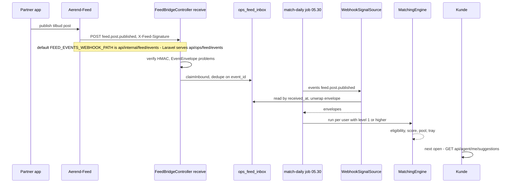

### 21.3 Courier outreach (Agent B) across apps

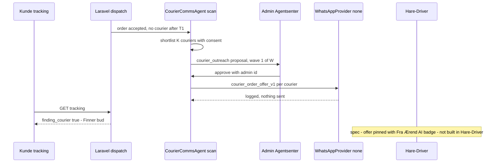

---

## 22. GAP analysis

Status values: ✅ Built · 🟡 Partial · ❌ Not built · 🧪 Stub/mock only · ⛔ Blocked.

### 22.1 Built end-to-end

| # | Feature / requirement | Spec / plan ref | Status | Evidence | What's missing / next step | Owner app(s) |
|---|---|---|---|---|---|---|
| 1 | Agent substrate (register, `AgentInvoker`, `agent_runs`, kill switch, caps, PII scrub) | Order Ops §17.2–17.5; AGIL-2 Ph 2 | ✅ | `app/Agent/AgentInvoker.php`; `/admin/agenter` | real model closures; register the 10 §17.3 agents that are missing | Admin |
| 2 | Snurre LLM chat with cart tools | agents spec §8; SNURRE_STATUS | ✅ | `SnurreController::postChat`, `SnurreChatService`, `snurre_chat_screen.dart` | gate tools by Ægil level/allowlist; `agent_runs` rows; memory; Ægil persona | Kunde, Admin |
| 3 | Suggestion tray + add/dismiss/never with feedback reasons | Ægil §7, §12.1 | ✅ | `SuggestionController`, `SuggestionService::never`, `brett_entry.dart`, `suggestion_tray.dart` | expiry, `good` verdict, notification items | Kunde, Admin |
| 4 | Fjordfiske deck (`?context=fiske`, 8 cards, live card facts) + catch points | AGIL-3 Ph 7 | ✅ | `MatchingEngine::deckFor`, `FiskeController::earn`, `fjordfiske_screen.dart` | bait facet | Kunde, Admin |
| 5 | Settings & levels 0–2 (read, update, audited level change) | Ægil §2 | ✅ | `AegilMeController`, `AgentSettingsService`, `aegil_settings_panel.dart` | see #23–#26 | Kunde, Admin |
| 6 | Memory read + forget-all + stated hard constraints | Ægil §3, §22 | ✅ | `PreferenceService`, `minne_screen.dart` | per-entry delete, patterns | Kunde, Admin |
| 7 | Occasions + `agent:occasion-reminders` → Mens du var borte | AGIL-4 | ✅ | `OccasionController`, `OccasionReminders`, `meg_sheets.dart`, `borte_entry.dart` | push; deep link; undo/seen | Kunde, Admin |
| 8 | Trust ledger read (Tillitsregnskap) | Ægil §12.2 | ✅ (zeros) | `AegilAppController::trustLedger`, `TrustLedgerService::compute`, `minne_screen.dart` | events never produced (#13) | Kunde, Admin |
| 9 | Ægil velger prize pick | AGIL-3 Ph 7 | ✅ (rule) | `FiskeController::pick`, `aegil_velger_screen.dart` | persist "Bra"/"Ikke for meg" | Kunde, Admin |
| 10 | Kurv shows/undoes Ægil-added lines | AGIL-1 v2 Kurv | ✅ | `kasse_models.dart` `addedByAegil`, `kurv_screen.dart` `_undoAegil` | only Snurre lines qualify | Kunde |
| 11 | Agentsenter + Agent A/B/C/E admin flows | agents spec §3–6; AGIL-3 Ph 1–3, 6 | ✅ admin side | `AgentOpsAdminController`, `GeoAdminController`, `tests/Feature/AgentOps/*` | turn on; partner/bud UIs (#31–#33) | Admin |

### 22.2 Built backend only

| # | Feature / requirement | Spec / plan ref | Status | Evidence | What's missing / next step | Owner app(s) |
|---|---|---|---|---|---|---|
| 12 | Daily matching on **live** signals | Ægil §5.1; AGIL-2 Ph 10 merge day | 🟡 | `PointsServiceProvider` binds `FixtureSignalSource` unless `POINTS_SIGNAL_SOURCE=webhook`; `.env` has no such key | set the env (as a `config()` key, not runtime `env()` — see §23), fix the feed webhook path, feed Laravel's own `product.price_changed` into matching | Admin, Feed |
| 13 | Against-interest engine (6 checks, silence, ledger) | Ægil §6; AGIL-2 Ph 8 | 🧪 | `AgainstInterestEngine::evaluate` has no caller outside tests | call on cart change/chat proposal; render `AgainstInterestTurn` in Kurv/chat; log non-firing evaluations; producers for `agent_reference_prices` and `purchase`/`order_problem` actions | Admin, Kunde |
| 14 | Reminders and availability subscriptions | Ægil §9 | 🧪 | `ReminderService` (only `expireStale` runs); no routes | `POST/DELETE /api/agent/me/reminders`, `/availability-subscriptions` (the app already calls the latter); hook `onPriceObserved`/`onAvailability` to price and stock events | Admin, Kunde |
| 15 | Agent push gate (caps, quiet hours, deferral) | Ægil §8 | 🧪 | `AgentPushGate::send` records rows, sends nothing; `CommunicationRouter` test-only | real sender (FCM via agil-1 notifications), release deferred pushes, push on `suggestion.open` | Admin, Kunde |
| 16 | Chat content services (compare, points explainer, monthly summary, tool-check) | Ægil §14 | 🟡 | `ChatContentController`; app uses only shopping-list read | mount `ComparisonCard`, `PointsExplainerCard`, `LevelRefusalCard`; compare per store incl. delivery as spec says | Kunde |
| 17 | Tool allowlist + level refusals | Ægil §15 | 🧪 | `ChatToolAllowlist`, `ChatToolGate`; not used by any model loop | apply to Snurre tools (`add_to_cart` ≥ 3) or retire Snurre | Admin |
| 18 | Anomaly explain, mission wording, goal proposals | Order Ops §17.7 X2; AGIL-2 Ph 7, 9 | 🧪 | `AnomalyExplainService`, `MissionWordingService`, `GoalProposalService` — test-only callers | call from fraud flags, `points:missions-weekly`, goal UI | Admin |
| 19 | Product identities and reference prices | Ægil §3.4 | 🟡 | tables + `store_product_details.product_identity_id`; no writer in `app/` | EAN-based identity import + price history writer (needed by #13, #20, compare) | Admin |
| 20 | Hard-constraint and age-limit eligibility | Ægil §5.2, §22 | 🟡 | `EligibilityFilter::reject` needs an identity row | inert until #19 exists | Admin |
| 21 | Ops Agents A/B/C/E partner/courier APIs | agents spec §4–6; AGIL-3 | 🟡 | `routes/api_agentops.php` | authentication on partner/courier routes; app screens | Admin, Partner, Bud |
| 22 | Free-text interpretation via model | Ægil §3.2, §15 | 🧪 | `PreferenceInterpreter::callModel` returns a note | real model call with the existing validator; stop storing every chat turn as a note | Admin |

### 22.3 Built app-side only, mock, or mis-wired

| # | Feature / requirement | Spec / plan ref | Status | Evidence | What's missing / next step | Owner app(s) |
|---|---|---|---|---|---|---|
| 23 | Pause Ægil | Ægil §2, §17 | 🟡 | app sends `pause_days`; `AegilMeController::updateSettings` accepts only `paused_until` | send `paused_until` or add `POST /me/agent/pause` → `AgentSettingsService::pause` | Kunde, Admin |
| 24 | Level 4 refusal shown to the customer | Ægil §2 | 🟡 | `AegilSettingsPanel.levelError` never passed; Dio throws on 422 | use `postAllowClientError`, show `LEVEL_REQUIRES_RECURRING` | Kunde |
| 25 | `aegil_level_max` rollout cap | AGIL-2 Ph 10; AGIL-1-REMAINING | ❌ | `FeatureFlags::maxAegilLevel` has no caller | enforce in `AgentSettingsService::update` and in the app's level list | Admin, Kunde |
| 26 | Tray expiry and stale suggestions | Ægil §7, §19 `expire` | ❌ | no job sets `expired`; `trayFor` ignores `expires_at`/`pool_day`; same-day re-run overwrites acted states | hourly expire job; filter by `expires_at`; do not overwrite acted rows | Admin |
| 27 | Ægil screen chat (states, intents, evening cards) | leveranse 7 7a–7f | 🧪 | `AegilScreen` ignores route args; `a3_aegil_kveld` hardcoded; rule-based backend | read arguments; drive cards from the tray/`context=evening`; model-backed turn | Kunde, Admin |
| 28 | Hjem floats and Under kaien | Kunde Bergen design | 🧪 | `_placeholderFloats` (`TODO(api)`), Under kaien reads `title` not `headline`, static fallbacks | feed floats from `/agent/me/suggestions`; map `headline` | Kunde |
| 29 | Mens du var borte undo/seen and deep links | Ægil §13 | 🟡 | `borte_entry.dart` undo local; no `/seen`, `/undo` routes | add routes, navigate `deep_link` | Kunde, Admin |
| 30 | Agent push routing in the app | Ægil §8, §21 | ❌ | `push_notification_service.dart` has no agent branch | route `aerend://item/*` deep links | Kunde |
| 31 | Bud agent slots (B2 mic, B3 door note, B4 Forklar) | Order Ops §17.7 B1–B4 | 🧪 | `live_stage_screen.dart` `onVoice`, `run_summary.dart` `onExplain`, `onDoorNote` unwired | backend endpoints §17.9 + wiring | Bud, Admin |
| 32 | Partner Ægil mic | Order Ops §17.7 P-series | 🧪 | `ops_shell_screen.dart` "Ægil (kommer)" disabled; `VoiceEntrySheet` never built into a screen | — | Partner |
| 33 | Ops-agent app surfaces ("Fra Ærend AI" badge, WhatsApp consent toggle, AI-assistert import, Oppgjør statuses) | agents spec §4.5, §5.6, §6.5, §7 | ❌ | no calls to `/api/agentops/*` in Hare-Driver or Hare-Store | build screens on the existing endpoints | Bud, Partner |
| 34 | Chat cards and transparency widgets (against-interest line, trust ledger card, action log list, reminders card, Vågen moment, onboarding chip batch) | Ægil §21 | 🧪 | `lib/screens/aegil/widgets/*` covered by `test/aegil/*` only | mount where the design places them | Kunde |

### 22.4 Spec only (no code)

| # | Feature / requirement | Spec / plan ref | Status | Evidence | What's missing / next step | Owner app(s) |
|---|---|---|---|---|---|---|
| 35 | Learned patterns (recurring item, dinner rhythm, usual time) | Ægil §3.3, §19 `learn_patterns` | ❌ | no `learned_patterns` table or routes | build after live order events | Admin, Kunde |
| 36 | Model re-rank live (`rerank_daily`, promotion candidate → open) | Ægil §5.3, §25 P2b | 🧪 | `shadowRerank` identity closure | real model + violation logging; go live when add-rate ≥ fallback | Admin |
| 37 | Level 3 cart merge with caps, receipt, undo | Ægil §7, §25 P5 | ❌ | `cart_written: true` with no write; no `merged` transition | `merge_level3` job, `cart_lines.added_by`, undo route — or hide level 3 until built | Admin, Kunde |
| 38 | Grocery: Handleliste sync, Middag, Ukens kurv, level 4 standing orders, Vipps recurring | Ægil §10–11, §25 P6–P7 | ❌ | only `agent_shopping_list_items` read/add/toggle exist | — | Admin, Kunde |
| 39 | Notification-centre items per proactive event | Ægil §16 | ❌ | no `notifications` writes from agent code | agil-1 notifications table + agent category | Admin, Kunde |
| 40 | C1 gift agent | Order Ops §17.7 C1 | ❌ (keyword stub) | `AegilAppController` `GIFT_WORDS` | candidates endpoint, card text, gift checkout | Kunde, Admin |
| 41 | C2 order issue self-service | Order Ops §17.7 C2; refunds spec | ❌ | ops problem route only | ⛔ refund caps 0 kr, no wallet | Kunde, Admin |
| 42 | C3 reorder by photo | Order Ops §17.7 C3 | ❌ (text stub) | `photoOrder` takes text list | vision/EAN pipeline, 24 h deletion | Kunde, Admin |
| 43 | C4 door interpretation with consent | Order Ops §17.7 C4 | ❌ (stub) | `doorNote` truncates text | parser, consent, `door_profiles` write | Kunde, Admin, Bud |
| 44 | Partner P1–P5 | Order Ops §17.7; 8–10-wk 8.5/9.6; AGIL-1 Ph 10–11 | ❌ | register rows only | P1 + P5 first (planned week 8), now unblocked by the substrate | Partner, Admin |
| 45 | Bud B1–B4 | Order Ops §17.7; 8–10-wk 8.6/9.5 | ❌ | register rows + unwired slots | B4 first (planned week 8) | Bud, Admin |
| 46 | `agent.editorial` (Ærend-authored feed posts) | Order Ops §17.7 X1 | ❌ | registered, caps 0 | backlog | Feed, Admin |
| 47 | Support Agent F, feed screening Agent G, Ærend assistant | support specs | ❌ | not found | ⛔ refund ledger first; caps at 0 | Admin, Kunde, Feed |
| 48 | Panel Ægil views (`/panel/agent/customers/{id}`, metrics dashboard, `policy.agent.*` editor, agent exceptions) | Ægil §17 Panel | ❌ | `AgentMetrics` only in `agent:metrics` CLI | admin screen | Admin |
| 49 | WhatsApp go-live for Agent B | agents spec §9, §12 #1–#2 | ⛔ | `AGENTOPS_WHATSAPP_PROVIDER=none`; auto-approve flag off | provider choice + legal sign-off on consent wording | Admin, Bud |

### 22.5 Top 10 gaps to close next (ranked by impact)

1. **Two chat backends; the LLM one ignores every Ægil rule.** Snurre writes the cart at level 0, has no memory, no allowlist, no `agent_runs`, no AI disclosure in the turn, while `/bergen/aegil` is keyword-based. Decide one stack: route all entry points to it, apply `ChatToolGate` to `add_to_cart`, and log runs. (#2, #17, #27)
2. **The production scheduler is not running** (`AGENT_PLATFORM_AUDIT_LIVE.md` P0-3). `agent:match-daily`, `agent:daily-maintenance`, `agent:occasion-reminders`, `agentops:*` and `geo:*` do nothing in prod until cron + `schedule:run` exist.
3. **No live signals reach matching.** Set `POINTS_SIGNAL_SOURCE=webhook` (read through `config()`, because `config:cache` nulls runtime `env()` — audit P0-2), align `FEED_EVENTS_WEBHOOK_PATH` with `/api/ops/feed/events`, set the HMAC secret on both sides, and feed Laravel's own `product.price_changed` into matching. (#12)
4. **Product identities and reference prices have no producer.** Without them allergen/age eligibility is inert, against-interest and comparison return nothing, and offers cannot be tied to a liked product. Build the EAN identity import and price-history writer. (#19, #20)
5. **Personalisation never fires for real customers.** Likes from Minne are free text that never equals a category slug or id; onboarding chips are unmounted; the interpreter is a stub; store favourites are not read. Result: every feed offer scores 0.30 and is dropped. Map likes to ids/categories, mount `OnboardingChipBatch`, use favourites. (#22, #34)
6. **Agent pushes are never delivered** and the app cannot route them; level 2 is indistinguishable from level 1. (#15, #30)
7. **Against-interest, reminders and availability are dead code paths**, and the app's price-alert call 404s. Wire `evaluate()` into Kurv/chat and add the reminder/availability routes. (#13, #14)
8. **Settings honesty:** pause does nothing, `aegil_level_max` is unenforced, level-4 refusal is invisible, level 3 promises cart writes that never happen, and the tray never expires. (#23–#26, #37)
9. **Security:** `/api/agentops` partner/courier routes (draft approval, WhatsApp consent, settlement reads) and the Vågen endpoints take ids from the request without authentication; an Anthropic API key value sits in the tracked `.env` / `.env.prod`. (#21)
10. **Partner P1/P5 and Bud B4 (and the ops-agent app screens)** were planned for week 8 and were only blocked on the substrate, which now exists. (#31–#33, #44, #45)

### 22.6 Contradictions found between spec, plan and code

| Topic | Spec / plan says | Code does |
|---|---|---|
| Against-interest logging | Ægil §6.2 and AGIL-2 Ph 8 `[x]`: "written on every evaluation" | writes one row per **finding** only |
| `aegil_customer` autonomy | Order Ops §17.3: L2 | seeded L1 |
| Ægil default level | Ægil spec §2: 2; leveranse 7 design: «Foreslå» (1) | 2 |
| Store mode / push mode enums | `all_nearby|favourites|list`, `never|daily|good_only` | `all|allowlist`, checks `'off'` |
| Reason codes | 10 spec codes | 9 code reasons, partly different names |
| Feed webhook path | `EVENT_CONTRACT.md` + feed default: `/api/internal/feed/events` | route `/api/ops/feed/events` (`OPS_API.md`) |
| AGIL-3 flag names | AGIL-3-REMAINING: `agentops.center`, `pd.enabled`, `geo.coverage.customer`, `agentops.courier_comms.auto` | `AgentOpsFlags`: `agt.*`, `pd.self_delivery`, `geo.customer.coverage`, `agt.courier_comms.auto_approve` |
| Runtime | agents spec §2.1: local Ollama only, no cloud LLM | the only live model is cloud Anthropic (Snurre) |
| Scraping | agents spec §4.2: never Wolt/Foodora | Snurre has a Wolt competitor scraper (off by default); denylist applies only to Agent A |
| WhatsApp approval | agents spec §5.4: auto within guardrails; partner appendix: "only after store approval"; `aerend-ordre.js`: "du godkjenner" | admin approval in Agentsenter (auto flag off) |
| Unaccepted-offer timer | agents spec T1 = 3 min | policy 3 min; partner appendix/design say 5 min |
| C2 refund | design: instant "89 kr på saldoen" | refunds spec caps at 0 kr; no wallet |
| Branding | refunds spec: "no agent branding, sender is Ærend"; support spec: AI label in first message; designs: "Ægil"; agents spec: "Snurre / Spør Ærend AI" | both "Ægil" and "Snurre / {appName} AI" in the app |
| AGIL-1 Ph 10/11 status | P1, P5, B4, P2–P4, B1–B3 "blocked on sync-B" | substrate is present on `agil-1` (`app/Agent/AgentInvoker.php`), so the block is gone; work not started |

---

## 23. Configuration, flags and environment

### 23.1 Laravel (`Hare-AdminPanel`)

| Key | Where read | Default | Effect | Local `.env` today |
|---|---|---|---|---|
| `SNURRE_ENABLED` | `config/snurre.php` | false | Snurre chat on/off | `true` |
| `ANTHROPIC_API_KEY` | `config/snurre.php` | '' | required for any Snurre turn | set (tracked file — move to secrets) |
| `ANTHROPIC_MODEL` | `config/snurre.php` | `claude-sonnet-4-6` | main chat model | unset |
| `SNURRE_INTENT_MODEL`, `SNURRE_MEAL_PLAN_MODEL` | `config/snurre.php` | `claude-haiku-4-5-20251001` | extractor, matcher, meal plan | unset |
| `SNURRE_MAX_TOKENS` / `SNURRE_MAX_TOOL_ROUNDS` / `SNURRE_REQUEST_TIMEOUT` / `SNURRE_REQUEST_RETRIES` | `config/snurre.php` | 1024 / 5 / 45 / 1 | | unset |
| `SNURRE_STREAMING_ENABLED` | `config/snurre.php` | false | SSE when request has `stream=true` | unset |
| `SNURRE_INTENT_EXTRACTOR`, `SNURRE_MENU_MATCHER_MERGED`, `SNURRE_MENU_SQL_PREFILTER`, `SNURRE_MENU_PREFILTER_FLOOR`, `SNURRE_TIMING` | `config/snurre.php` | true, true, true, 8, false | latency work (`docs/SNURRE_LATENCY_S1_*.md`) | unset |
| `SNURRE_WOLT_SCRAPER_ENABLED` | `config/snurre.php` | false | competitor prices | unset |
| `AGENT_MATCH_THRESHOLD` / `AGENT_POOL_SIZE` / `AGENT_TRAY_SIZE` / `AGENT_FISKE_DECK_SIZE` / `AGENT_SUGGESTION_TTL_DAYS` | `config/agent.php` | 0.35 / 20 / 5 / 8 / 3 | matching | unset |
| `AGENT_RERANK_SHADOW` | `config/agent.php` | true | shadow re-rank + `rerank_source=shadow_logged` | unset |
| `AGENT_PUSH_DAILY_CAP` / `AGENT_PUSH_GOOD_ONLY` | `config/agent.php` | 1 / 3 | push gate | unset |
| `AGENT_CHEAPER_MIN_ORE` / `AGENT_WAIT_DAYS` | `config/agent.php` | 500 / 14 | against-interest | unset |
| `POINTS_SIGNAL_SOURCE` | **runtime `env()`** in `PointsServiceProvider::register` | `fixtures` | `webhook` → read `ops_feed_inbox` | unset → fixtures. With `php artisan config:cache`, runtime `env()` returns null → always fixtures |
| `POINTS_ORDER_SOURCE` | runtime `env()` in `PointsServiceProvider::boot` | `legacy` | order completion source for points | unset |
| `FLAG_AEGIL_LEVEL_MAX` | `config/points.php` → `FeatureFlags` (or `ops_feature_flags.value`) | 0 | intended rollout cap | `3` — **not enforced** |
| `OPS_FEED_WEBHOOK_SECRET` / `OPS_FEED_BASE_URL` / `OPS_FEED_EVENTS_PATH` / `OPS_FEED_SERVICE_TOKEN` | `config/ops.php` | '' / '' / `/internal/events` / '' | inbound HMAC (503 if empty) and outbound outbox | — |
| `AGENTOPS_MODEL_DRIVER` (+ `AGENTOPS_OLLAMA_BASE_URL`, `AGENTOPS_OLLAMA_MODEL`) | `config/agentops.php` | `fake` (`http://127.0.0.1:11434`, `llama3.1`) | ops-agent model | `.env.example` only |
| `AGENTOPS_API_TOKEN_{PRODUCT_ONBOARDING,COURIER_COMMS,PAYMENT_SORTING,GEO}` | `config/agentops.php` | null | scoped Agent API tokens (sha256 in `agents.token_hash`) | — |
| `AGENTOPS_WHATSAPP_PROVIDER` (+ Meta token / phone id) | `config/agentops.php` | `none` | Agent B delivery | `none` |
| `AGENTOPS_SLACK_WEBHOOK`, `AGENTOPS_KASSAL_API_KEY` | `config/agentops.php` | null | notifications, EAN lookups | — |

**Database switches**
- `agents.enabled` per agent row — the kill switch (toggle in `/admin/agenter`). All rows seed `false`.
- Surface flags in `ops_feature_flags`, registered by `AgentOpsFlags::all()` (`ops:flags seed`): `agt.product_onboarding`, `agt.courier_comms`, `agt.courier_comms.auto_approve` (legal gate), `agt.payment_sorting`, `agt.geo`, `geo.engine`, `geo.engine.cutover`, `geo.customer.coverage`, `geo.courier.eligibility`, `geo.admin.omrader`, `pd.self_delivery`, `pd.customer.tracking_variant`. All off.
- Ops policies `agt.*` seeded by `php artisan agentops:seed-policies` (`AgtPolicyKeys`).
- Per-customer `agent_settings` (created at level 2 on first read).

**Scheduler** ([`app/Console/Kernel.php`](../../../../Hare-AdminPanel/app/Console/Kernel.php)):

| Command | Cadence | Does |
|---|---|---|
| `agent:daily-maintenance` | 04:40 | expire reminders/subscriptions, count deferred pushes, purge actions past 12 months, roll up trust ledger |
| `agent:match-daily` | 05:30 | build pool and tray for every user with level ≥ 1 |
| `agentops:settle --auto` | 06:10 | Agent C batch proposals |
| `agent:metrics --days=1` | 07:00 | console report of runs, fallback rate, tray, scope review, alerts |
| `agent:occasion-reminders` | 08:05 | occasion reminders into the action log |
| `agentops:run courier_comms` | every minute | Agent B scan |
| `agentops:run geo` | hourly | Agent E scan |
| `agentops:expire-proposals` | every 5 min | proposals past TTL → `expired` |

### 23.2 Aerend-Feed

`LARAVEL_INTERNAL_BASE` (required URL), `FEED_EVENTS_WEBHOOK_PATH` (default `/api/internal/feed/events` — must be changed to `/api/ops/feed/events` to reach Laravel), `FEED_WEBHOOK_SECRET` (must equal Laravel's `OPS_FEED_WEBHOOK_SECRET`; empty → `feed_event_not_sent_secret_missing` warning and no send). Source: [`src/config/env.ts`](../../../../Aerend-Feed/src/config/env.ts), [`src/feed/webhooks/outbound.ts`](../../../../Aerend-Feed/src/feed/webhooks/outbound.ts).

### 23.3 Customer app

- `BaseUrl.prodDomain` is hardcoded to `http://127.0.0.1:8000/` in [`lib/networking/api_constant.dart`](../../lib/networking/api_constant.dart) (L11); `ApiConst.baseAgentUrl` = `{domain}api/agent/` is rebuilt per call, so the Dev Environment override (`dev_api_override`, [`lib/screens/dev/dev_env_screen.dart`](../../lib/screens/dev/dev_env_screen.dart)) applies.
- `OpsCustomerApi.networkEnabled` ([`ops_customer_api.dart`](../../lib/networking/ops/ops_customer_api.dart) L30, default true) — when false, every guarded ops/agent call returns empty (used by tests).
- `A3Services` ([`lib/screens/bergen/meg/a3_services.dart`](../../lib/screens/bergen/meg/a3_services.dart)) — swappable factories `aegil`, `aegilRepo`, `points`; `a3Try` turns errors into null (failures look like empty states).

---

## 24. Developer quick-start / where to look first

### 24.1 File map

| If you are working on… | Start here |
|---|---|
| Snurre LLM chat | `Hare-AdminPanel/app/Snurre/SnurreChatService.php`, `SnurreToolExecutor.php`, `AnthropicClient.php`, `docs/SNURRE_STATUS.md`; app `lib/screens/snurre/` |
| Ægil screen | `app/Http/Controllers/Agent/AegilAppController.php`; app `lib/screens/bergen/aegil/`, `lib/data/aegil/` |
| Matching / tray / Fjordfiske | `app/Agent/Matching/*`, `app/Agent/Services/SuggestionService.php`, `app/Http/Controllers/Agent/SuggestionController.php`, `config/agent.php`; app `brett_entry.dart`, `fjordfiske_screen.dart`, `lib/screens/aegil/widgets/suggestion_tray.dart` |
| Settings / memory | `app/Agent/Services/{AgentSettingsService,PreferenceService,PreferenceInterpreter}.php`, `app/model/{AgentSetting,AgentPreference}.php`; app `aegil_settings_panel.dart`, `minne_screen.dart` |
| Against-interest / reminders / pushes | `app/Agent/AgainstInterest/`, `app/Agent/Services/{ReminderService,AgentPushGate,TrustLedgerService,ActionLogService}.php`, `app/Agent/Chat/CommunicationRouter.php` |
| Ops agents | `docs/AGENTOPS_ARCHITECTURE.md`, `docs/AGENTOPS_COURIER_COMMS.md`, `app/Services/AgentOps/*`, `app/Services/Geo/GeoAgent.php`, `routes/api_agentops.php`, `Admin/AgentOpsAdminController.php` |
| Register / kill switch | `database/seeders/AgentRegisterSeeder.php`, `AgentOpsRegisterSeeder.php`, `/admin/agenter` |
| Signals | `app/Points/Sources/{Fixture,Webhook}SignalSource.php`, `tests/fixtures/events/*.json`, `app/Services/Ops/FeedBridge.php` |

### 24.2 Run it locally

1. Backend: in `Hare-AdminPanel`, `php artisan migrate`, then seed the register and policies:
   `php artisan db:seed --class="Database\Seeders\AgentRegisterSeeder"`,
   `php artisan db:seed --class="Database\Seeders\AgentOpsRegisterSeeder"`,
   `php artisan agentops:seed-policies --reason="local"`. Serve with `php -S 0.0.0.0:8000 -t public server.php` (or `php artisan serve`).
2. Make a customer eligible: call `GET /api/agent/me/settings?user_id=…&access_token=…` once (creates `agent_settings` at level 2), or open the Ægil settings sheet in the app.
3. Build today's tray from the fixtures: `php artisan agent:match-daily --user=<id>`. Expect "2 candidate(s) from fixture" and, for a customer with no likes, "1 pooled, 1 served" (the price drop). Add a like on the store to see the feed offer too:
   `POST /api/agent/me/preferences/batch` with `chips: [{kind: "like", value: "77", label: "Fisk på Torget"}]`, then re-run.
4. Inspect: `GET /api/agent/me/suggestions` and `?context=fiske`; `SELECT state, reason_code, score, score_breakdown, engine_rank, shadow_rank FROM agent_suggestions`.
5. Exercise the runs log: enable `aegil_customer` in `/admin/agenter` and re-run step 3 → `agent_runs` rows with `validation_result = ok`.
6. Snurre chat: needs `SNURRE_ENABLED=true` and a valid `ANTHROPIC_API_KEY`; `POST /api/customer/snurre/context` then `/chat`.
7. Ops agents: enable the agent row in `/admin/agenter` **and** its flag (`php artisan ops:flags seed`, then e.g. `php artisan ops:flags on agt.courier_comms --reason="local"`), then `php artisan agentops:run courier_comms` / `geo`, `php artisan agentops:settle --auto`; decide in `/admin/agentsenter`.
8. App: point the app at the local backend (Dev Environment override; `adb reverse tcp:8000 tcp:8000` on a device). Hjem → pull down opens `/bergen/aegil`; the finds card opens the Brett; Utforsk → Fjordfiske.

### 24.3 Tests

- Backend: `php artisan test --filter=Agent` (`tests/Feature/Agent/*`: `MatchingTest`, `TrayTest`, `FiskeDeckTest`, `FeedbackTest`, `RerankShadowTest`, `PreferencesTest`, `InterpretTest`, `SettingsTest`, `AgainstInterestTest`, `RemindersTest`, `PushCapTest`, `TrustLedgerTest`, `ChatToolsTest`, `CommunicationTest`, `AnomalyExplainTest`, `PrivacyTest`, `AegilAppTest`, `AgentInvokerTest`, `AgentGuardrailsTest`, `AgentRegisterTest`, `AgentScopeTest`, `AgentAdminTest`, `PointsHooksTest`), `--filter=AgentOps` (`tests/Feature/AgentOps/*`), `tests/Feature/Ops/FeedSignalSeamTest.php`, `FeedBridgeTest.php`.
- App: `flutter test test/aegil test/a3 test/points test/meg`.
- Remember that green tests on `AgainstInterestEngine`, `CommunicationRouter`, `AnomalyExplainService`, `MissionWordingService` and `GoalProposalService` prove the services, not that anything calls them.

---

## 25. Glossary

| Term | Meaning |
|---|---|
| Ægil | The customer agent persona ("Spør Ægil") |
| Snurre | Older name of the customer AI chat; the Laravel `app/Snurre` subsystem and the `SnurreChatScreen` |
| Spør Ærend AI | Name of the customer agent (Agent D) in `aerend-ai-agents-spec.docx` |
| Hjem | Home tab |
| Meg | "Me" tab (profile, settings) |
| Utforsk | Explore tab (feed) |
| Kurv | Cart |
| Bud | Courier; also the courier app |
| Partner | Store; also the store app |
| Nivå | Level (Ægil autonomy level, or loyalty tier) |
| Bare når jeg spør / Foreslå / Varsle og foreslå / Fyll kurven min / Fast ukeshandel | Ægil levels 0–4: only when I ask / suggest / notify and suggest / fill my cart / standing weekly shop |
| Tillatelse | Permission sheet for Ægil's level |
| Minne / Det Ægil vet om deg | Memory screen ("what Ægil knows about you") |
| Glem alt | Forget everything |
| Stemmer | "That's right" (confirm) |
| Brett | Drawer (the suggestion tray) |
| Dra ned for å spørre Ægil | "Pull down to ask Ægil" (Hjem gesture) |
| Dupper | Floats/bobbers on Hjem (suggestion bubbles) |
| Under kaien | "Under the quay" (Hjem offers strip) |
| Napp / Napp-kort | A bite / the bite card (suggestion card rising from the water) |
| Fjordfiske | Fjord fishing (suggestion deck game) |
| Vågen | The bay (one daily pull from the feed) |
| Dagens napp | Today's catch (points rule) |
| Ægil velger | "Ægil picks" (prize pick) |
| Premiehylla | Prize shelf |
| Gullbilletten | The golden ticket (referral) |
| Ikke for meg | Not for me (standing no with a reason) |
| Ikke nå | Not now (dismiss) |
| Aldri dette | Never this (exclusion) |
| Legg til / Legg i kurven | Add / put in the cart |
| Angre | Undo |
| Mens du var borte | While you were away (action log card) |
| Anledninger | Occasions (birthdays etc.) |
| Mot egen interesse | Against (Ærend's) own interest |
| Tillitsregnskap | Trust ledger |
| Derfor-linje | "Because" line (reason shown on a card) |
| Handleliste | Shopping list |
| Ukeshandel / Ukens kurv | Weekly shop / this week's basket |
| Funn | A find |
| Bydel | City district (e.g. Bergenhus) |
| Agentsenter | Admin agent centre (proposal queue) |
| Områder | Areas/zones (geo admin) |
| Finner bud | "Finding a courier" (status) |
| Fra Ærend AI | "From Ærend AI" (courier offer badge) |
| Oppgjør / Utbetalinger | Settlement / payouts |
| Forklar | Explain |
| Dørnotat / Dørtolkning | Door note / door interpretation |
| Bestill fra bilde | Order from photo |
| Gaveagenten | Gift agent |
| Åpningstidsunntak | Opening-hour exceptions |
| Kampanjeforslag | Campaign suggestion |
| Bildeforbedring | Image enhancement |

---

## Appendix: source index

**Specs** (`aerend-app/docs/`)
- [`AEREND AEGIL AGENT SPEC FINAL VERSION.md`](../../../docs/AEREND%20AEGIL%20AGENT%20SPEC%20FINAL%20VERSION.md) — §0–§26, Appendices A–C (all used).
- [`AEREND ORDER OPS SPEC FINAL STATEv3.md`](../../../docs/AEREND%20ORDER%20OPS%20SPEC%20FINAL%20STATEv3.md) — §17.1–§17.9 (agent layer, register, C1–C4, P1–P5, B1–B4, X1, X2, agent API).
- [`aerend-ai-agents-spec.docx`](../../../docs/aerend-ai-agents-spec.docx) — §1–§12 (Agents A, B, C, D; proposal model; UI strings; legal; build order; open questions).
- [`aerend-support-refunds-feed-spec.docx`](../../../docs/aerend-support-refunds-feed-spec.docx) — §2 Agent F, §3.3 guardrails, §4 Agent G, §5 governance, §7 build order.
- [`aerend-support-system-spec.docx`](../../../docs/aerend-support-system-spec.docx) — §1, §2.1, §4.1–§4.3, §5 (Ærend assistant).
- `aerend-geo-coverage-spec.docx` — §6 Agent E (via AGIL-3-PLAN and `docs/GEO_GUIDE.md`).

**Plans** (`aerend-app/Aerend-app/plans/`)
- [`AGIL-2-PLAN.md`](../AGIL-2-PLAN.md) — §0–§1 (ownership, adapters), Phases 6–10 (Ægil) with notes.
- [`AGIL-3-PLAN.md`](../AGIL-3-PLAN.md) — Phases 0–3 and 6 (Agents A, B, C, E), Phase 7 (Ægil/Meg/Points screens, design ledger), Asks, Blocked.
- [`AGIL-3-REMAINING.md`](../AGIL-3-REMAINING.md) — §1–§4.
- [`AGIL-4-PLAN.md`](../AGIL-4-PLAN.md) — occasions, Meg settings rows.
- [`AGIL-1-PLAN.md`](../AGIL-1-PLAN.md) — Phase 10–11 (P1/P5/B4, P2–P4/B1–B3 blocked on sync-B).
- [`AGIL-1-PLAN-v2.md`](../AGIL-1-PLAN-v2.md) — Søk/Kategori/Kurv Ægil entry points, flags value column.
- [`AGIL-1-REMAINING.md`](../AGIL-1-REMAINING.md) — `FLAG_AEGIL_LEVEL_MAX=3`, §8 blocked decisions.
- [`AGIL-CONTRACT.md`](../AGIL-CONTRACT.md) — §2 ownership, §3.3 agents table.
- [`AGIL-UI-CONTRACT.md`](../AGIL-UI-CONTRACT.md) — Ægil route and folder ownership.
- [`8-10-WEEK-IMPLEMENTATION-PLAN.md`](../8-10-WEEK-IMPLEMENTATION-PLAN.md) — Week 8 (8.4–8.6), Week 9 (Ægil phases, 9.5–9.6), backlog table.

**Backend docs** (`Hare-AdminPanel/docs/`)
- [`AGENTOPS_ARCHITECTURE.md`](../../../../Hare-AdminPanel/docs/AGENTOPS_ARCHITECTURE.md), [`AGENTOPS_COURIER_COMMS.md`](../../../../Hare-AdminPanel/docs/AGENTOPS_COURIER_COMMS.md), [`AGENT_PLATFORM_AUDIT.md`](../../../../Hare-AdminPanel/docs/AGENT_PLATFORM_AUDIT.md) (§1–§8, risk register), [`AGENT_PLATFORM_AUDIT_LIVE.md`](../../../../Hare-AdminPanel/docs/AGENT_PLATFORM_AUDIT_LIVE.md) (P0-1, P0-2, P0-3, P0-8), [`SNURRE_STATUS.md`](../../../../Hare-AdminPanel/docs/SNURRE_STATUS.md) §1, [`EVENT_CONTRACT.md`](../../../../Hare-AdminPanel/docs/EVENT_CONTRACT.md), [`OPS_API.md`](../../../../Hare-AdminPanel/docs/OPS_API.md) (feed bridge row), [`GEO_GUIDE.md`](../../../../Hare-AdminPanel/docs/GEO_GUIDE.md).

**Designs** (`designs/21des/`, grepped)
- [`Ærend Kunde - agentfunksjoner C1-C4.dc.html`](../../../../designs/21des/Ærend%20Kunde%20-%20agentfunksjoner%20C1-C4.dc.html) — C1.1–C1.9, C2.1–C2.10, C3.1–C3.6, C4.1–C4.8.
- [`Ærend Bud - agentfunksjoner B1-B4.dc.html`](../../../../designs/21des/Ærend%20Bud%20-%20agentfunksjoner%20B1-B4.dc.html) — B1.1–B4.6, E.1–E.2.
- [`Ærend Partner - agentfunksjoner P1-P5.dc.html`](../../../../designs/21des/Ærend%20Partner%20-%20agentfunksjoner%20P1-P5.dc.html) — P1.1–P5.7.
- [`Ærend leveranse 7 - Ærend AI.dc.html`](../../../../designs/21des/Ærend%20leveranse%207%20-%20Ærend%20AI.dc.html) — frames 7a–7f, entry points.
- [`Ærend Partner - utviklervedlegg (ordre, kommunikasjon, agenter).dc.html`](../../../../designs/21des/Ærend%20Partner%20-%20utviklervedlegg%20%28ordre,%20kommunikasjon,%20agenter%29.dc.html) — §3 agent matrix; data in `designs/21des/aerend-ordre.js` (`AGENTER`, `FORSLAG_EKSEMPEL`).
- [`Ærend Kunde Bergen.dc.html`](../../../../designs/21des/Ærend%20Kunde%20Bergen.dc.html) — `NIVAAER`, Ægil ≈L3523–3800, Det Ægil vet ≈L3586, Napp-kort ≈L2115, fiske ≈L6436, velger ≈L6306, Mens du var borte ≈L7322 (line refs from AGIL-3-PLAN).

**Code (primary files opened)** — `Hare-AdminPanel`: `app/Agent/**`, `app/Snurre/{AnthropicClient,SnurreChatService}.php`, `app/Http/Controllers/Agent/*`, `app/Http/Controllers/Api/SnurreController.php`, `app/Http/Controllers/Points/FiskeController.php`, `app/Http/Controllers/Ops/{FeedBridgeController,CustomerController}.php`, `app/Services/AgentOps/{CourierCommsAgent,ProductOnboardingAgent}.php`, `app/Services/Geo/GeoAgent.php`, `app/Points/Sources/*SignalSource.php`, `app/Points/FeatureFlags.php`, `app/Providers/{AgentServiceProvider,PointsServiceProvider}.php`, `app/Console/Kernel.php`, `app/Console/Commands/{AgentMatchDaily,AgentDailyMaintenance,Agent/OccasionReminders}.php`, `app/AgentOps/AgentOpsFlags.php`, `config/{agent,agentops,snurre,ops}.php`, `routes/{api,api_agent,api_agentops,api_ops,api_points}.php`, `database/migrations/2026_09_22_1*_agent_*.php`, `database/seeders/Agent*Seeder.php`, `tests/fixtures/events/*.json`. `Aerend-app`: `lib/screens/{snurre,bergen/aegil,bergen/fiske,bergen/poeng,bergen/meg,aegil/widgets,common/home/bergen}/…`, `lib/data/aegil/*`, `lib/networking/{api_constant.dart,ops/*}`. `Aerend-Feed`: `src/config/env.ts`, `src/feed/webhooks/outbound.ts`, `.env.example`. `Hare-Driver`: `lib/screens/live/live_stage_screen.dart`, `lib/screens/money/run_summary.dart`. `Hare-Store`: `lib/screens/ops/ops_shell_screen.dart`.
