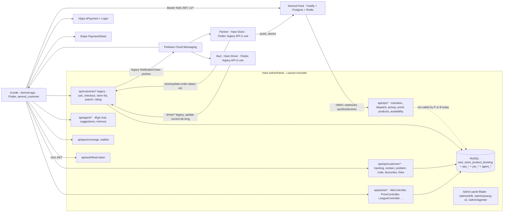
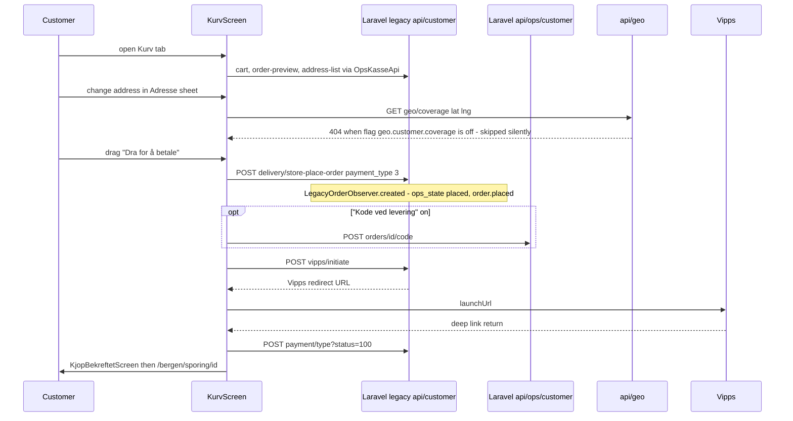
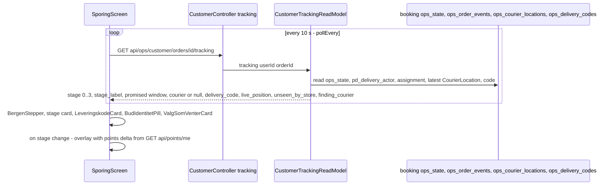
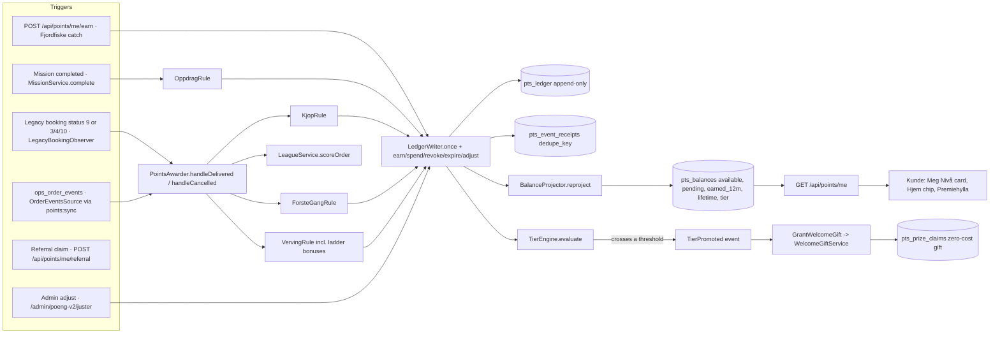
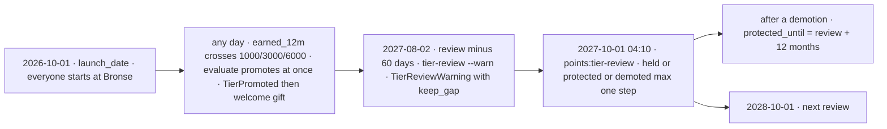
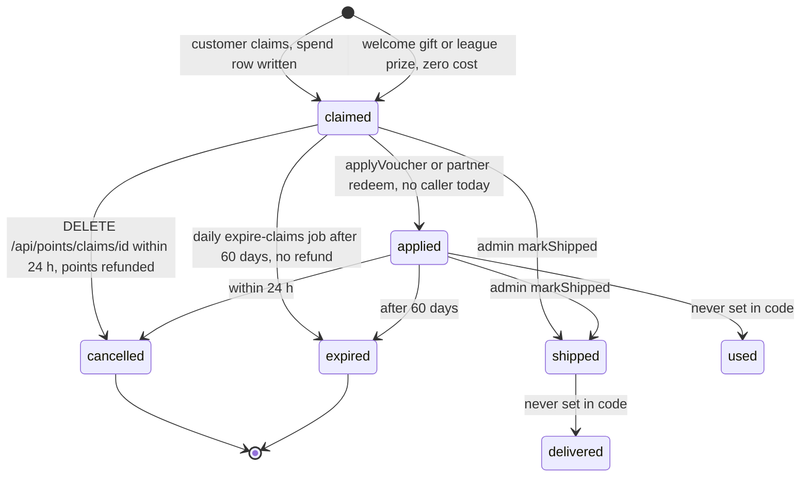
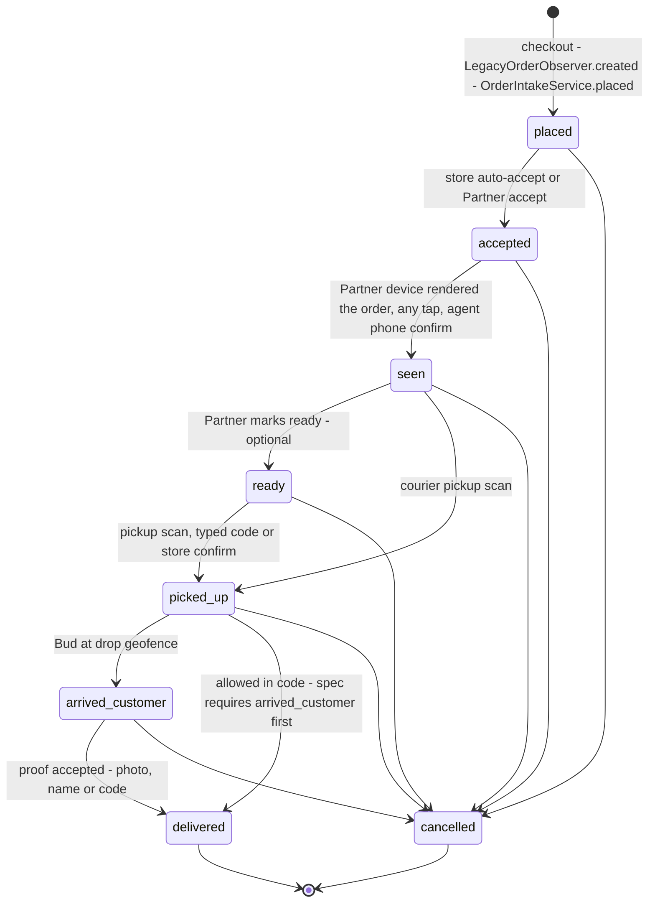
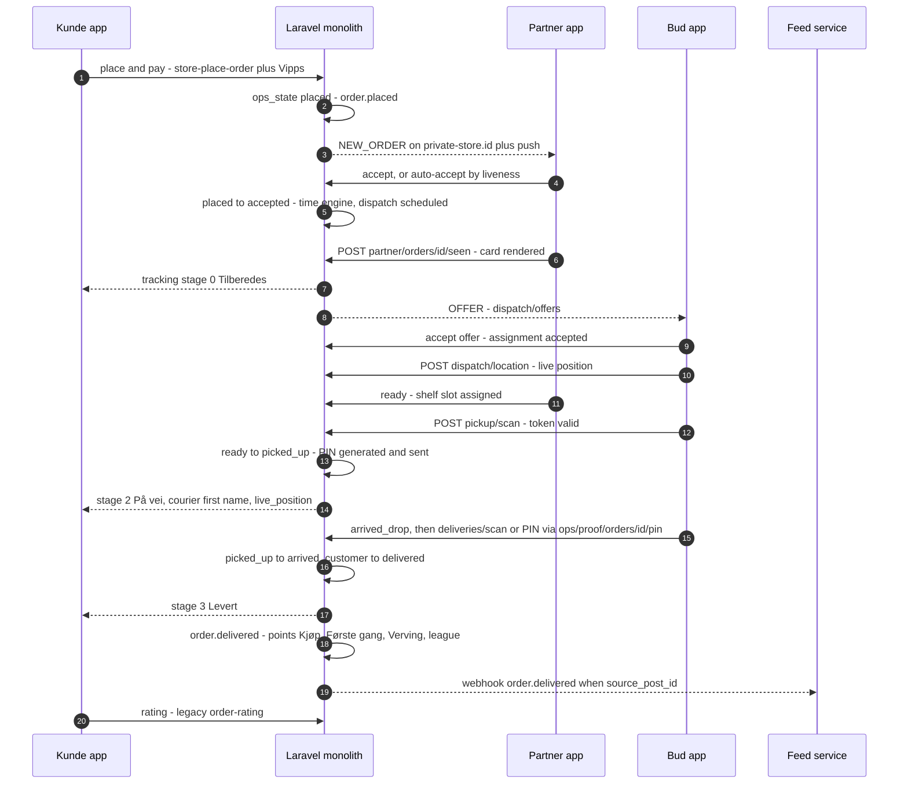
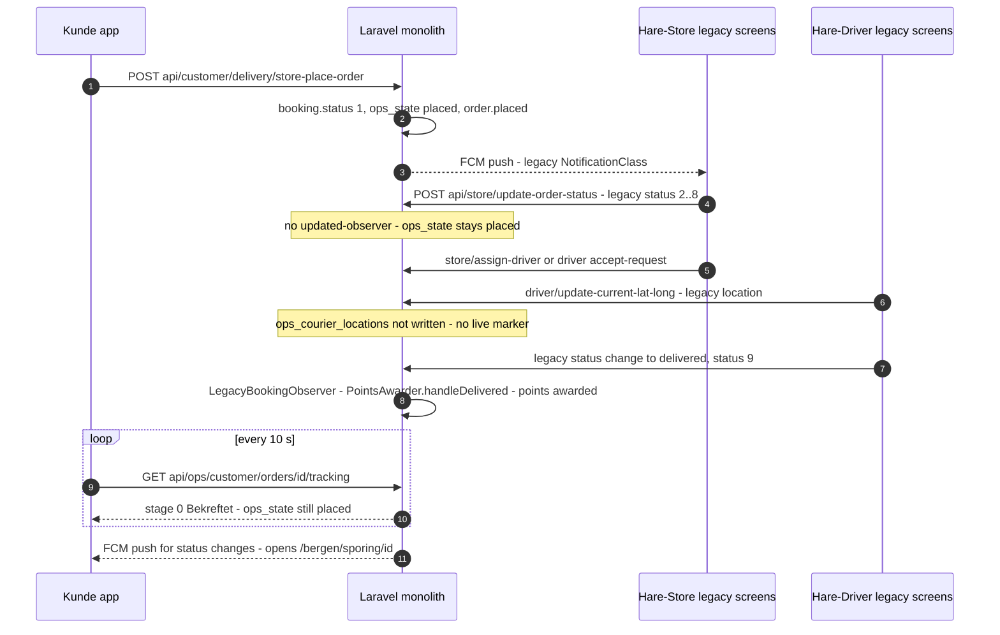

# Ærend customer app (Aerend-app) — features, points system, integrations and gaps

> **Audience:** developers on the Ærend team (Flutter, Laravel, Node).
> **As of:** 2026-10-02.
>
> **Repos, all on branch `agil-1`:**
>
> | Repo | Commit |
> |---|---|
> | `aerend-app/Aerend-app` | `824c478` |
> | `Hare-AdminPanel` | `ec1dfe8` |
> | `Aerend-Feed` | `d1f7a2f` |
> | `Hare-Store` | `6ce38b3` |
> | `Hare-Driver` | `a71b33e` |
>
> **Uncommitted changes in Aerend-app:**
> - `lib/networking/api_constant.dart`: `BaseUrl.prodDomain` is set to `http://127.0.0.1:8000/`.
> - `lib/networking/feed/feed_api_constant.dart`: `FeedBaseUrl.prodDomain` is set to `http://127.0.0.1:3000/`.
> - `pubspec.lock`.
>
> **Sources read:**
>
> | Kind | Documents |
> |---|---|
> | Specs (`aerend-app/docs/`) | `AEREND ORDER OPS SPEC FINAL STATEv3.md`, `AEREND POINTS SPEC v2 .md`, `AEREND AEGIL AGENT SPEC FINAL VERSION.md` (customer-facing parts), `aerendvstore feed update spec.md`, `AEREND PARTNER & BUD UPGRADE SPEC.md` (headings), `aerend-geo-coverage-spec.docx` §4, `aerend-partner-self-delivery-spec.docx` §5, `aerend-support-system-spec.docx` §6, `aerend-support-refunds-feed-spec.docx` §2 and §4 |
> | Plans (`plans/`) | `AGIL-1-PLAN-v2`, `AGIL-1-REMAINING`, `AGIL-3-PLAN` (Phase 7 and later), `AGIL-3-REMAINING`, `AGIL-4-PLAN`, `AGIL-UI-CONTRACT`, `AGIL-CONTRACT` §5 |
> | Backend docs | `Hare-AdminPanel/docs/AGIL2_API.md` |
> | Design | `designs/21des/Ærend Kunde Bergen.dc.html`, markers grepped |
> | Code | The code in all five repos |
> | Test runs | A full `flutter test` run on 2026-10-02 |

**Contents**

- [0. How to read this report](#0-how-to-read-this-report)
- [1. TL;DR](#1-tldr)
- [2. System context](#2-system-context)
- [3. App architecture](#3-app-architecture)
- [4. Hjem (home)](#4-hjem-home)
- [5. Søk (search)](#5-søk-search)
- [6. Butikk, Kategori and the product sheet (store pages)](#6-butikk-kategori-and-the-product-sheet-store-pages)
- [7. Kurv & Kasse (cart and checkout)](#7-kurv--kasse-cart-and-checkout)
- [8. Sporing, Hjelp and Levert (tracking, help, delivered)](#8-sporing-hjelp-and-levert-tracking-help-delivered)
- [9. Utforsk (explore: Feed, Forundringspose, Poseautomaten)](#9-utforsk-explore-feed-forundringspose-poseautomaten)
- [10. Fjordfiske (the daily fishing game)](#10-fjordfiske-the-daily-fishing-game)
- [11. Meg (the profile tab)](#11-meg-the-profile-tab)
- [12. Favoritter, Varsler and the Ægil entry points](#12-favoritter-varsler-and-the-ægil-entry-points)
- [13. The points system](#13-the-points-system-ærend-poeng-nivå-premiehylla-fløyen-ligaen)
- [14. How the other apps and services interact with the customer app](#14-how-the-other-apps-and-services-interact-with-the-customer-app)
- [15. GAP analysis](#15-gap-analysis)
- [16. Configuration, flags and environment](#16-configuration-flags-and-environment)
- [17. Developer quick-start / where to look first](#17-developer-quick-start--where-to-look-first)
- [18. Glossary](#18-glossary)
- [Appendix: source index](#appendix-source-index)

---

## 0. How to read this report

**Status legend**

| Mark | Meaning |
|---|---|
| ✅ Built | Wired end to end and reachable by a user. Evidence is a file and symbol that was opened or grepped. |
| 🟡 Partial | Built, but with a missing piece, a static fallback, or a data source that does not move in real life. |
| ❌ Not built | No code was found. |
| 🧪 Stub/mock only | A widget or endpoint exists, but it is fed by static or sample data, or reached only from tests. |
| ⛔ Blocked | Waiting on a business, legal or credential decision. |

**Three kinds of claim, kept apart:**

- "**Spec says**" is a requirement from `aerend-app/docs/`.
- "**Design shows**" is the prototype `Ærend Kunde Bergen.dc.html`.
- "**Code does**" is what was found on `agil-1`.

A plan checkbox (`[x]`) is treated as a claim, never as proof.

**Links** are relative to this file (`aerend-app/Aerend-app/plans/reports/`):

| Target | Relative path |
|---|---|
| App | `../../lib/…` |
| Admin panel / API | `../../../../Hare-AdminPanel/…` |
| Specs | `../../../docs/…` |
| Plans | `../…` |
| Design | `../../../../designs/21des/…` |

**Design line numbers.** The design file has grown from 10,691 to 15,983 lines since the plans were written, so the plans' `≈L…` numbers are stale. The numbers in this report come from `grep -n 'data-screen-label='` on 2026-10-02.

**Related reports in this series:**

| Report | Covers |
|---|---|
| [01-AGENTIC-WORKFLOW-REPORT.md](01-AGENTIC-WORKFLOW-REPORT.md) | Ægil and the AI agents in depth |
| `03-…` | The Partner app (Hare-Store) |
| `04-…` | The Bud app (Hare-Driver) |

This report summarises those topics and cross-references them.

---

## 1. TL;DR

- **What it is.** Aerend-app (package `aerend_customer`) is the customer app, "Kunde". It is a Flutter app with:
  - a four-tab shell: **Hjem** (home), **Utforsk** (explore), **Kurv** (cart) and **Meg** (me);
  - a search orb in the bottom nav;
  - about 25 "Bergen" screens under `/bergen/...` routes.

  It talks to the Laravel monolith (`Hare-AdminPanel`) through three API families, and to the Feed service with a short-lived JWT:

  | API family | Purpose |
  |---|---|
  | legacy `api/customer/*` | The original customer API |
  | `api/ops/customer/*` | The Ops (order operations) API |
  | `api/points/*` and `api/agent/*` | Points and the Ægil agent |
- **Built and reachable today.** Splash, onboarding, login (e-mail, Google, Apple, Vipps Login), Hjem, Søk, Kategori, both store pages (restaurant and Mote/gift), the product sheet, Poseautomaten, Kurv, Vipps or card payment, Sporing, Hjelp, Levert, Utforsk (Feed and Forundringspose), Fjordfiske, the whole Meg tab, Premiehylla, Liga, Ægil velger, and the Ægil chat screens. **Every `/bergen/*` screen is reachable from the shell**, so AGIL-1-REMAINING's "built but unmounted" problem is mostly solved for the customer app. The exceptions are the feed publisher tabs and the Vågen card, which only the dead `FeedHome` mounts (§9).
- **Orders are a hybrid.** Checkout still writes the legacy `user_store_product_booking` row (`UserController::postStorePlaceOrder`). `LegacyOrderObserver` stamps `ops_state = placed` and writes `order.placed`. After that, **only Ops endpoints move `ops_state`**. The Partner and Bud apps still update the legacy `status` column only, and there is no bridge from legacy status to `ops_state`. **So in real use, Sporing (tracking) stays on "Bekreftet" until someone calls the Ops API.** Today that means the debug demo panel, the escalation ladder, a customer cancel, or the partner self-delivery endpoints.
- **Points work on the legacy path.** Purchase points are awarded by `LegacyBookingObserver` when the legacy booking reaches status 9 (`POINTS_ORDER_SOURCE` unset). The Ops path (`order_events`) has no scheduled drain: `points:sync` is not in the Kernel.
- **The points system is broadly built on the backend:**
  - an append-only ledger with idempotency, FIFO expiry and a projection;
  - four tiers, **Bronse / Sølv / Gull / Platina at 0/1000/3000/6000**, per AGIL-4 and the design. The spec says Fløyen…Ulriken at 0/1000/3000/8000;
  - an annual review, the shelf with locked previews, claims, goals, missions, the league, fraud flags, an admin dashboard and a what-if simulator.

  The app reads all of it for real.
- **Points gaps that matter:**
  - A claimed "Gratis levering" voucher is **never applied at checkout**: `PrizeService::applyVoucher` has no caller.
  - `GET /api/points/rules` does not exist, so every "+N poeng" or "kr tilbake" hint on store pages stays hidden.
  - `points/me/ledger?order=` ignores the order filter.
  - League names chosen in "Navn i ligaen" are never shown.
  - Nivåopprykk (the promotion moment) never opens by itself.
  - The points rollout flags are not enforced anywhere.
- **Spec drift in points rates** (recorded nowhere except the code):

  | Rate | Spec | Code |
  |---|---|---|
  | Dagens napp | 5 once a day | 5 per catch × 5 catches a day |
  | Referral minimum | 150 kr | 200 kr |
  | Referral cap | 10 | 5 |
  | Første gang cap | 5 | 3 |

- **⛔ Kroner→points migration** is blocked on the conversion factor (`POINTS_MIGRATION_FACTOR_CONFIRMED`). That is a business decision.
- **Partner (Hare-Store) and Bud (Hare-Driver)** run on the legacy APIs. Their Ops screens (`OpsShellScreen`, `LiveStageScreen`, `TilbyPremieScreen`) exist but are not mounted. As a result:
  - No courier location reaches `ops_courier_locations`, so Sporing never shows a live courier marker.
  - No courier types the Ops PIN.
  - Self-delivery has no Partner UI.

  See [reports 03](03-STORE-APP-REPORT.md) and [04](04-DRIVER-APP-REPORT.md).
- **Realtime.** The app has **no socket client**. Sporing polls `GET /api/ops/customer/orders/{id}/tracking` every 10 s. Pushes are legacy FCM.
- **Tests (run 2026-10-02):** `flutter test` gives **522 passed, 2 failed**:
  - `test/bergen/utforsk_test.dart` "tapping the Fjordfiske segment opens the game over the feed" (L223);
  - `test/bergen/sok_test.dart` "standalone, the nav X closes the route" (L277).

  No test covers the Hjem Forundringspose card, which has a narrow-width overflow risk and static sample content.
- **Security issues found on the way** (backend, affect the customer):
  - `POST /api/ops/orders/{id}/transition` has **no auth** and takes `actor_type` from the request body.
  - The Vipps return `POST /api/customer/payment/{type}` sets `payment_status` from a `status=100` query parameter.
  - The app calls `vipps/confirm`, which does not exist on the backend.
- **Ops hygiene:**
  - The committed `BaseUrl.prodDomain` is a LAN IP (`http://10.224.247.180:8000/`).
  - The Dev Environment screen (`DevEnvScreen`) is unreachable, because its only entry, `Account`, is no longer imported.

---

## 2. System context



Notes:

- The Ops API is the target design ([Ops spec §2, §21](../../../docs/AEREND%20ORDER%20OPS%20SPEC%20FINAL%20STATEv3.md)). Only the customer app uses it today, for reads and for its own cancel, contact and problem calls.
- Broadcast channels `private-customer.{id}` and the others are authorised in `Hare-AdminPanel/routes/channels.php`. The customer app does not subscribe to them (§8).

---

## 3. App architecture

### 3.1 Entry and shell

**`main()` startup sequence** ([`lib/main.dart`](../../lib/main.dart)):

1. Stripe (`merchant.com.reen.customer`).
2. Intercom.
3. Timezone.
4. `initSharedPreferences()`, then `BaseUrl.restoreOverride()` and `FeedBaseUrl.restoreOverride()`.
5. Firebase and `PushNotificationService` (only when online).
6. `initStore()`: Redux with `redux_persist`, `AppState` = cart + searched location.
7. `runApp(MyApp(store))`.

**`MaterialApp` configuration:**

- `initialRoute` is the splash (`snurre-hide/splash`).
- `routes` merges `bergenRoutesAgil1()` and `bergenRoutesAgil3()`.
- `onGenerateRoute` handles, in order:
  1. the Vipps payment return → `VippsPaymentReturnScreen`;
  2. the Vipps login callback;
  3. `/invite?code=` → `Login` or `RedeemCode`;
  4. everything else → `BergenRoutes.generate`.
- Text scale is clamped to 1.0–1.15.
- `A3Services.reducedMotion` (the Konto "Roligere bevegelse" preference) sets `MediaQuery.disableAnimations` app-wide. This closes the AGIL-3-REMAINING ask.
- A global `_GlobalSnurreLauncher` overlay (a floating legacy Ægil chat pill) sits over every route not prefixed `snurre-hide/`.

**Shell** — [`lib/screens/common/homeMainV1/home_main_v1.dart`](../../lib/screens/common/homeMainV1/home_main_v1.dart) `HomeMainV1`. It is a `PageView` that cannot be swiped:

| Tab | Widget | File |
|---|---|---|
| 0 Hjem | `BergenHome` | `lib/screens/common/home/bergen/bergen_home.dart` |
| 1 Utforsk | `UtforskScreen` | `lib/screens/bergen/utforsk/utforsk_screen.dart` |
| 2 Kurv | `KurvScreen` | `lib/screens/bergen/kasse/kurv_screen.dart` |
| 3 Meg | `MegScreen` → `MegScreenBody` | `lib/screens/bergen/meg/meg_host.dart` |

**Bottom nav** — `BergenBottomNav` in `lib/screens/common/home/bergen/bergen_nav.dart`:

- `enum BergenTab { home, explore, cart, me }`.
- The cart badge reads `badgeCountNotifier` and shows «N varer». The prototype's «1 · 899 kr» is an open ask in [AGIL-UI-CONTRACT §5](../AGIL-UI-CONTRACT.md).
- **Søk is an overlay, not a tab.** The nav's text field sets `sokOpen`, which lays `SokScreen` over the PageView.
- The nav's Ægil action calls `_openAegil`, which opens the **legacy `SnurreChatScreen`**, not `/bergen/aegil` (see §12).
- Android back closes Søk first, then needs a double tap to exit.

### 3.2 Routing

- [`lib/screens/bergen/kit/bergen_routes.dart`](../../lib/screens/bergen/kit/bergen_routes.dart) `BergenRoutes`:
  - `resolve()` strips `?query` and a trailing id or slug: `/bergen/butikk/45` → `/bergen/butikk`, `/x/{id}/hjelp` → `/x/hjelp`.
  - `arguments()` builds `{id, slug, q}`.
  - `generate()` prefixes `snurre-hide/`.
  - `push()` shows a «Kommer snart» toast for an unregistered name; `pushOr(orElse:)` falls back to a legacy screen.
- Route maps:
  - [`bergen_routes_agil1.dart`](../../lib/screens/bergen/bergen_routes_agil1.dart): `/bergen/sok`, `kategori`, `butikk`, `automat`, `kurv`, `bestilling`, `sporing`, `sporing/hjelp`, `levert`, `kundeservice`, `utforsk` (`?tab=feed` → `FeedNyheterScreen`).
  - [`bergen_routes_agil3.dart`](../../lib/screens/bergen/bergen_routes_agil3.dart): `/bergen/poeng`, `premiehylla`, `premie`, `liga`, `opprykk`, `fjordfiske`, `aegil`, `aegil/minne`, `meg`, `meg/favoritter`, `meg/konto`, `meg/bestillinger`, `meg/varsler`.
- The only route constants are `kAegilRoute` and `kPoengRoute`. `test/contract/contract_names_test.dart` asserts that every registered route builds.
- `AegilVelgerScreen` has no named route; it is pushed with `MaterialPageRoute`.

### 3.3 Bergen kit and design tokens

- [`lib/theme/bergen_tokens.dart`](../../lib/theme/bergen_tokens.dart) holds two token sets:
  - `AerendBergenAuthTokens` for the pre-auth screens.
  - `BergenTokens` for the app: ink `#23201D`, paper `#F5F3EF`, teal `#1E4F5C`/`#2A6272`/`#173E48`/`#0F1F2B`, mint `#5CE0B8`, orange `#F26D3D`, lantern `#F2C14E`, the sea modes day/evening/rain, Plus Jakarta Sans display with Inter text, radii, and motion durations that respect reduced motion.
- [`lib/screens/bergen/kit/`](../../lib/screens/bergen/kit/):
  - `BergenArk` (the generic "Ark" bottom sheet), `BergenSheet`, `BergenChip`, `BergenCta3d`, `BergenToast`, `BergenUndoPill` («Angre»), `BergenOfflineBanner`, `BergenCard`, `BergenStepper`.
  - `BergenCart`: the single add-to-cart path for every product surface. It uses the legacy `StoreDetailRepo` and syncs the nav badge.
  - `BergenFavHeart`, `BergenRoutes`, and the CSS and keyframe helpers (`bergen_css.dart`, `bergen_css_shadow.dart`, `bergen_motion.dart`).
- Hjem has its own palette in `lib/screens/common/home/bergen/bergen_kit.dart`: `BergenColors`, `BergenWeather` (picked by time of day; there is no weather API) and `BergenCategoryLook`.

### 3.4 Networking

**Laravel base URL** — `BaseUrl` in [`lib/networking/api_constant.dart`](../../lib/networking/api_constant.dart):

- `domain` = the runtime override (SharedPreferences `dev_api_override`) or `prodDomain`.
- **Committed `prodDomain` is `http://10.224.247.180:8000/`, a LAN IP.** The real production line `https://api.ailogistics.no/` is commented out. The working tree points at `127.0.0.1`.
- Derived bases: `baseUrl` = `domain + api/customer/`, `ApiConst.basePointsUrl` = `api/points/`, `baseAgentUrl` = `api/agent/`.
- Dart-defines: `SHOW_VIPPS_PAY`, `SHOW_VIPPS_LOGIN`, `DEV_TUNNEL_CONNECT_TOKEN`.

**Dev override screen** — [`lib/screens/dev/dev_env_screen.dart`](../../lib/screens/dev/dev_env_screen.dart) `DevEnvScreen` picks presets or a custom URL for both Laravel and the Feed. **Its only entry point, a long-press on the legacy `Account` title, is dead code**: nothing imports `lib/screens/common/account/account.dart`. To test locally today you edit `prodDomain` and rebuild.

**Ops customer client** — [`lib/networking/ops/ops_customer_api.dart`](../../lib/networking/ops/ops_customer_api.dart) `OpsCustomerApi`:

- Base `api/ops/customer/`, with house auth (`user_id` + `access_token` as query parameters).
- `_guarded()` turns 404, failure or `status == 0` into `null`, so a missing backend feature hides UI instead of crashing it.
- `static bool networkEnabled` is the test kill-switch.
- Methods:

  | Group | Methods |
  |---|---|
  | Order tracking and help | `tracking`, `events`, `contact`, `problem`, `requestCode`, `orders` |
  | Agent and fishing | `awaySummary`, `fiske` |
  | Favourites | `favourites`, `setFavourite` |
  | Products and stores | `populaert`, `poser`, `driftNotice` |
  | Ægil | `underKaien` |
  | Points | `mission`, `pointsMe`, `pointsForOrder`, `referral`, `pointsRules` |
  | Search | `search` (legacy search endpoints), `trending`, `trendingItems` |
  | Coverage | `coverage`, `waitlist` |
  | Category and store pages | `categoryPulse`, `storePresence` |
  | Debug only | `transition`, `proofPin` |

**Other Ops clients:**

- [`ops_butikk_api.dart`](../../lib/networking/ops/ops_butikk_api.dart) `OpsButikkApi`: legacy home, store-list, store-details and topping calls, plus `GET api/ops/customer/products/{id}` and `POST api/agent/availability-subscriptions`.
- [`ops_kasse_api.dart`](../../lib/networking/ops/ops_kasse_api.dart) `OpsKasseApi`: legacy cart, preview, addresses, place-order and `vipps/initiate`.
- [`ops_feed_api.dart`](../../lib/networking/ops/ops_feed_api.dart): Vågen (`api/ops/feed/vaagen`, `/reel`). Only the unreachable `FeedHome` uses it (§9).

**Feed client** — [`lib/networking/feed/`](../../lib/networking/feed/):

- `FeedBaseUrl` (committed `https://aerend-feed-88chd.ondigitalocean.app/`, `apiBase` = `v1/`).
- `FeedApiHelper` is a Dio client with `FeedAuthInterceptor`, which adds `Bearer` + JWT and refreshes and retries once on a 401.
- `lib/services/feed_jwt_service.dart` `FeedJwtService` mints the token with `POST {BaseUrl.domain}api/auth/feed-token {access_token, actor_type: customer}`. It caches `feed_jwt` / `feed_jwt_exp` in secure storage and refreshes when less than 300 s remain.
- `FeedRepo` provides feed, tabs, stories, stores, posts, comments, follow, like, CTA and upload signing.

### 3.5 State and data

- **Redux** (`lib/redux/*`): the cart and the searched location only. Screens keep their own state (`StatefulWidget` / `ChangeNotifier`). The feed uses blocs.
- **`lib/data/`:**

  | Folder | Contents |
  |---|---|
  | `aegil/` | `AegilRepo`, `AegilAppApi` / `AegilAppRepo`, models |
  | `feed/` | DTOs |
  | `ops/` | `butikk_models.dart`, `favourite_stores.dart` (`FavouriteStores` singleton), `fiske_models.dart`, `kasse_models.dart`, `sok_models.dart`, `tracking_models.dart` (`OpsTracking`, `OpsCourier`, `OpsDeliveryCode`, `OpsPosition`) |
  | `points/` | `PointsRepo`, `PointsAppApi` / `PointsAppRepo`, models |

- No mocks ship in `lib/`. Test fakes are in `test/a3/a3_fakes.dart`, injected through `A3Services` (`lib/screens/bergen/meg/a3_services.dart`).

### 3.6 Localisation (l10n)

- `l10n.yaml`: template `intl_en.arb`, output class `AppLocalizations`.
- ARB files: `no`, `en`, `da`, `es`, `sv`. `no` and `en` have about 2,000 keys; `da`, `es` and `sv` have about 700. The global `languages` handle is set in `main.dart`.
- Copy facades, by source:

  | Facade | Source |
  |---|---|
  | `SokCopy`, `ButikkCopy`, `KasseCopy`, `UtforskCopy`, `FiskeCopy`, `SporingCopy` (plus about 30 inline `_t`), `HjemArkCopy` | ARB, read through `languages` |
  | `A3MegCopy`, `A3PoengCopy`, `A3AegilCopy` | Hard-coded Norwegian `static const`, mirrored in ARB |
  | `A4MegCopy` (`meg_copy_a4.dart`) | Hard-coded only |
  | `BergenCopy` (Hjem), `OnbCopy` (onboarding) | Inline `_t(no, en)`, so Danish, Spanish and Swedish users see Norwegian or English |

- AGIL-UI-CONTRACT §2 says "the ARB is the only place text lives". The Meg, A4 and Hjem facades break that rule.

### 3.7 Auth and onboarding

- **Splash.** `lib/screens/common/splash/splash.dart` is a 2.6 s sticker animation, a 1:1 port of the design's "Splash · klistremerke" (L1629). `SplashBloc` runs a version check, then `HomeMainV1` if logged in, otherwise `Login`.
- **Login** (`lib/screens/common/login/login.dart`):
  - Methods: Vipps Login (`VippsLoginHelper` → `vipps/login/start|complete`), Google, Apple, and e-mail.
  - Every method passes `ConsentGateScreen` once per device. "Avvis" continues as a guest.
  - E-mail registration continues to `OtpVerify` (Telefon → Kode → Ferdig).
  - A referral code from `/invite?code=` is stored as `prefPendingReferCode` and sent as `refer_code` on register.
- **Guest mode.** `isGuestUser()` hides the per-user parts of Hjem (Forundringspose, Ægil seams).
- Auth on every API is the house `user_id` + `access_token`. There is no token guard; `config/auth.php` has the `api` guard commented out ([`docs/AGIL2_API.md`](../../../../Hare-AdminPanel/docs/AGIL2_API.md)).

### 3.8 Legacy vs Bergen screens

**Legacy screens still reachable:**

| Legacy screen | How it is reached |
|---|---|
| `SnurreChatScreen` (legacy Ægil chat) | Nav pill, Søk "Spør Ægil", the global launcher, fallbacks |
| `deliveryService/checkout/CheckOut` | Card payment from Kurv |
| `TrackOrder` | After card checkout; as a fallback for pushes and the Hjem boat |
| `feed/postDetail/PostDetailScreen`, `StoreProfileScreen` | From the feed |
| `ManageAddress`, `ManageCard`, `OrderHistory`, `EditProfile`, the Notifications repo | From Meg |

**Fallback-only** (their Bergen routes exist): `DSHome`, `StoreDetail`, `Notifications`.

**Unreachable (dead):**

- `common/home/home_v1.dart` (`HomeV1`), and with it `feed/feed_shell_screen.dart` → `FeedHome`, which carries `FeedPublisherTabs` and `VaagenCard`.
- `feed/feed_reels_tab.dart`, `deliveryService/order_placed.dart`, `common/account/account.dart` (and so `DevEnvScreen`).
- Most of `rideService/` and `courierService/`.

---

## 4. Hjem (home)

**What it is / why.** Hjem is the home screen and tab 0: a scene of Vågen, the harbour in Bergen, with stores and products in a draggable sheet beneath it. It routes the customer to everything else.

**Spec & design.**

- Design `skjerm === 'hjem'` (`Ærend Kunde Bergen.dc.html` L11847) and its blocks:

  | Block | Line |
  |---|---|
  | "Sjø · hero" | L2000 |
  | "Fjordfiske-knapp" | L2107 |
  | "Napp-kort" | L2195 |
  | "Vindu · kategoriene" | L2221 |
  | "Dra ned for å spørre Ægil" | L2458 |
  | "Kategorirad" | L2467 |
  | "Forundringspose" | L2507 |
  | "Utforsk-kort" | L2527 and L2638 |
  | "Ægil-relevanskort" | L2535 |
  | "Se alle" | L2554 |
  | "Populært i kveld" | L2725 |
  | "Mens du var borte" | L7801 |

- Plan: [AGIL-1-PLAN-v2 Phase 2](../AGIL-1-PLAN-v2.md) "Hjem entry points" ledger.
- Commits `1a1530e` (the Bergen Hjem) and `de855d0` (both «Se alle» open the Ark).

**How it works today** (`BergenHome` in [`bergen_home.dart`](../../lib/screens/common/home/bergen/bergen_home.dart), 2,085 lines, plus 11 sibling files):

1. **Data at start-up:**

   | Need | Source |
   |---|---|
   | Categories | `HomeBloc.subjectHomeCat` (legacy `home`) |
   | Floats and "Populært i kveld" | `subjectHareSwipe` (`delivery/hare-swipe`) |
   | Stores per focused category | `BergenStoreRepo.fetch` → `delivery/store-list`, with `subjectHareExplore` as fallback |
   | The "PÅ VEI NÅ" boat | `subjectTrackOrder` |

2. `_refreshSeams()` calls `refreshAegilFindCount()` and `refreshMensDuVarBorte()` and reads the reduced-motion preference. This closes the AGIL-3 ask.
3. **Hero** (`BergenHero`, `bergen_hero.dart`): the sky is chosen by the hour of day. It shows Fløyen, the Bryggen houses (`bergen_painters.dart`), floats on the water (`BergenFloat`, `bergen_floats.dart`), Ægil on the pier with the Fjordfiske button, the lantern after 16:00, and a boat for an active order (→ `/bergen/sporing/{id}`). Tapping a float calls `showNappKort(NappOffer)` (§10).
4. **Category orbs:** `BergenCategoryRad` → `/bergen/kategori/{slug}`.
5. **Row under the orbs:**
   - the points chip `poengEntryCard` → `/bergen/poeng`;
   - `_AegilFindsCard`, shown only when `aegilFindCount() > 0` → `showAegilBrett` (the suggestion tray);
   - `mensDuVarBorteCard` ("Mens du var borte", while you were away) at the top when non-null.
6. **Forundringspose card** (surprise bag): `BergenSurpriseCard` (`bergen_cards.dart` L168).
   - Shown only for logged-in users between 11:00–14:00 and 16:00–21:00 (`_showSurprise`).
   - **Content is static:** `price 99`, `left 2`, `value 250` defaults, and `BergenCopy.surpriseUnder` = "Sandviken Bakeri · hentes 16–18".
   - "Sikre en" → `/bergen/automat`.
7. **"Butikker på Bryggen"** (`BergenCopy.storesIn(district)`; the district comes from the focused category's look): `BergenStoreRail`, falling back to `_placeholderStores()`. The "N åpne nå" pill comes from `kBergenLive`, marked `TODO(api)`.
8. **"Populært i kveld":** `BergenProductRail` from the swipe feed, falling back to three hard-coded products (`TODO(api)`).
9. **Both "Se alle"** call `_openArk()`, which shows `HjemArk` (`bergen_hjem_ark.dart`) with stores and «Populært i {kategori}» from `GET api/ops/products?kind=populaert&service_category_id=`.
10. **Pull-to-ask:** `_PullHandle` shows "Dra ned for å spørre Ægil" → "Slipp — Ægil åpner" → `BergenRoutes.pushOr(kAegilRoute)`, i.e. `AegilScreen`. Dragging up switches to Utforsk.
11. **"Under kaien"** (under the quay): `BergenUnderQuay` shows the first real find from `GET api/agent/me/suggestions?context=under_kaien`, otherwise the design's sample.
12. **Header:** the address sheet, and a bell → `/bergen/meg/varsler`.
13. **Demo panel:** a 5-tap on the greeting opens `DemoPanelTapTarget` (debug builds only, `lib/screens/bergen/hjelp/demo_panel.dart`).

**Where in code**

| Layer | File | Key symbols |
|---|---|---|
| Screen | `lib/screens/common/home/bergen/bergen_home.dart` | `BergenHome`, `_refreshSeams`, `_showSurprise`, `_openArk`, `_openStore`, `_openProduct`, `_openAegil`, `kBergenLive`, `BergenHomeSlug` |
| Widgets | `bergen_hero.dart`, `bergen_floats.dart`, `bergen_cards.dart`, `bergen_rails.dart`, `bergen_category_rad.dart`, `bergen_hjem_ark.dart`, `bergen_nav.dart`, `bergen_painters.dart`, `bergen_kit.dart` | `BergenHero`, `BergenFloat`, `BergenNappCard`, `BergenSurpriseCard`, `BergenExploreCard`, `BergenUnderQuay`, `BergenStoreRail`, `BergenProductRail`, `HjemArk`, `BergenBottomNav` |
| Copy | `bergen_copy.dart` | `BergenCopy` (inline `_t`) |
| Data | `bergen_store_repo.dart`; `lib/networking/ops/ops_customer_api.dart` | `BergenStoreRepo.fetch`, `OpsCustomerApi.populaert`, `underKaien` |
| Seams | `poeng/poeng_entry.dart`, `aegil/brett_entry.dart`, `meg/borte_entry.dart`, `poeng/napp_entry.dart` | `poengEntryCard`, `aegilFindCount`, `showAegilBrett`, `mensDuVarBorteCard`, `showNappKort` |

**API / events / data**

- Legacy:
  - `POST api/customer/home`
  - `POST api/customer/delivery/store-list`
  - `delivery/hare-swipe`
  - `delivery/hare-explore`
- Ops and agent:
  - `GET api/ops/products?kind=populaert` (Hare-AdminPanel commit `a0882ba`)
  - `GET api/agent/me/suggestions?context=under_kaien|home`
  - `GET api/agent/me/away`
  - `GET api/points/me`

**Use-case examples**

1. A guest opens the app at 17:00. Hjem shows the scene, categories and store rails. There is no Forundringspose card and no Ægil seams (`isGuestUser()`).
2. A logged-in customer with an active order sees the boat. Tapping it opens `/bergen/sporing/{id}`, which polls tracking (§8).
3. The customer drags the sheet down past the threshold, and Ægil's chat (`AegilScreen`) opens.

**Status:** 🟡 Partial.

- **Built:** the scene, navigation and real store rails.
- **Static or sample content:**
  - the Forundringspose card content (store, price, count, value);
  - the "N åpne nå" counts;
  - the placeholder floats, stores and products when the APIs return nothing.
- **Missing:** the design's "Vindu · kategoriene" houses (accepted in the Phase 2 ledger).
- **Overflow risk in the Forundringspose card:**
  - In the meta row (`bergen_cards.dart` L287–331) only the last text is `Flexible`. The «N igjen i kveld» pill and «verdi minst N kr» are fixed width, beside a fixed 56 px bag and the price button.
  - At 360 px or with text scale 1.15, that row can overflow by a few pixels. This is the likely cause of the reported overflow; it was **not reproduced** here.
  - There is no Hjem widget test. The 360-px overflow guard exists only for Meg (`test/meg/a4_meg_tab_test.dart`).

---

## 5. Søk (search)

**What it is / why.** Søk is free-text search for stores and products in Bergen. A query that reads like an errand is handed to Ægil instead.

**Spec & design.**

- Design `skjerm === 'sok'` (L12016) and its blocks: "Søk · treff" (L4296), "Søk · Spør Ægil" (L4370), "Søk · Nylige søk" (L4385), "Søk · Populært nå" (L4393), "Søk · Ukens oppdrag" (L4402).
- Plan: [AGIL-1-PLAN-v2 Phase 3](../AGIL-1-PLAN-v2.md).
- Later commits: `8297871` (Søk 1:1 with the Flesland hero; the orb opens it in the shell), `d8d7c47` (search every category), `6246f80` and `824c478` (Søk → store → product sheet).

**How it works today** ([`lib/screens/bergen/sok/sok_screen.dart`](../../lib/screens/bergen/sok/sok_screen.dart) `SokScreen`, 2,692 lines):

1. It opens as an overlay from the nav field, or standalone at `/bergen/sok`.
2. **Empty state (`sokTom`):**
   - Spør Ægil card;
   - Nylige søk: the last 8 searches, stored in prefs;
   - Populært nå: `GET api/ops/search/trending`, using `items` with per-term counts (commit `26d8e4c`);
   - Ukens oppdrag (this week's mission): `GET api/points/mission`.
3. **Typing:** `OpsCustomerApi.search(q)` calls legacy `delivery/search-store` and `delivery/search-product` with `serviceCatId: 0`. It returns at most 4 stores and 6 products, giving states `sokHarTreff` (hits) and `sokIngen` (no hits).
4. **Wish rule (`sokOnske`):** a query of 4 or more words, a `?`, or an errand word shows "Dette høres ut som et ærend". This and the "Spør Ægil" links open the legacy **`SnurreChatScreen`** with the draft.
5. **Result taps:** a store row → `/bergen/butikk/{id}`; a product row → the store with the product sheet open.

**Where in code**

| Layer | File | Key symbols |
|---|---|---|
| Screen | `lib/screens/bergen/sok/sok_screen.dart` | `SokScreen`, `SokScreenState.submit`, `readRecent` |
| Copy | `sok_copy.dart` | `SokCopy` (`ops_sok_*`) |
| Data | `lib/data/ops/sok_models.dart`; `ops_customer_api.dart` | `SokTreff`, `SokButikk`, `SokProdukt`, `SokTrend`; `search`, `trendingItems`, `mission` |
| Backend | `Hare-AdminPanel/app/Http/Controllers/Ops/SearchController.php` | `trending` → route `ops.search.trending` |

**API.** `GET /api/ops/search/trending` (`ops.search.trending`), legacy `POST api/customer/delivery/search-store|search-product`, `GET /api/points/mission`.

**Use-case examples**

1. Typing "pizza" lists Casa Maria and its pizzas. Tapping a pizza opens the store page with the product sheet.
2. Typing "noe godt til middag under 300 kr" shows the errand banner, which opens Ægil with that text.

**Status:** 🟡 Partial.

- **Built and reachable.**
- **Gaps:**
  - The "Alle N" category count is `TODO(api)` (line ≈2042).
  - Fees on store rows are omitted.
  - The mic only focuses the field; there is no speech input.
  - **`test/bergen/sok_test.dart` "standalone, the nav X closes the route" fails.** The hard-coded tap offset (bottom-right −(43, 45)) no longer hits the orb after the redesign. Root cause **not verified**.

---

## 6. Butikk, Kategori and the product sheet (store pages)

**What it is / why.** These are the shopping surfaces:

- a category page;
- two store-page layouts: restaurant, and Mote (fashion) or gift;
- the food product sheet and the Klede (clothing) sheet;
- an info sheet.

**Spec & design.**

- Design blocks: `{{ butSideLabel }}` (L2867), "Dreieskiven" (L2924), "Seilas · Burger King" (L3305), "Kjøkkenluka" (L3407), "Gaver-kategori" (L4962), "Mote-utstilling" (L5040), "Tilvalg" (L7717), "Ofte kjøpt med" (L7734).
- Plan: [AGIL-1-PLAN-v2 Phase 4](../AGIL-1-PLAN-v2.md) with its design ledger.
- Commits `6246f80` (product sheet 1:1 with the prototype) and `824c478` (restaurant 1:1).

**How it works today:**

1. **`/bergen/butikk/{id}`** → [`butikk_screen.dart`](../../lib/screens/bergen/butikk/butikk_screen.dart) `ButikkScreen`. It loads `OpsButikkApi.store(id)` (legacy `delivery/store-details` → `BergenStoreInfo`) and picks a layout by category:
   - [`restaurant_body.dart`](../../lib/screens/bergen/butikk/restaurant_body.dart) `RestaurantButikkBody` (5,269 lines):
     - hero, kitchen state from `GET api/ops/store/availability`;
     - "N kikker nå" (people looking now) from `GET api/ops/customer/stores/{id}/presence`;
     - SEILASEN DIN, a voyage bar against the store's real minimum order and free-delivery threshold;
     - Kjøkkenluka specials;
     - category chips, the menu and the mini basket.
   - [`mote_butikk_screen.dart`](../../lib/screens/bergen/butikk/mote_butikk_screen.dart) `MoteButikkScreen`: `Dreieskiven` (turntable), cross-sell, shelf grid, gift variant, "Spør butikken".
2. **`/bergen/kategori/{slug}`** → [`kategori_screen.dart`](../../lib/screens/bergen/butikk/kategori_screen.dart) `KategoriScreen`:
   - Butikker and Produkter tabs, filter chips;
   - live strip from `GET api/ops/customer/categories/{slug}/pulse`;
   - Gaver and Mote variants;
   - "Bestill fra bilde" → `kAegilRoute` with `intent=photo`.
3. **Product sheet** — [`produkt_sheet.dart`](../../lib/screens/bergen/butikk/produkt_sheet.dart) `showProduktSheet` / `ProduktSheet`:
   - the menu row, options from `get-topping-option` (`OpsButikkApi.options`), and detail from `GET api/ops/customer/products/{id}` (route `ops.customer.product`; allergens per item added in Hare-AdminPanel `ec1dfe8`);
   - "Legg til" → `BergenCart.add`.
4. **Other sheets:** [`klede_sheet.dart`](../../lib/screens/bergen/butikk/klede_sheet.dart) (size, colour, stock), [`info_sheet.dart`](../../lib/screens/bergen/butikk/info_sheet.dart).
5. **Price alerts:** `Dreieskiven`'s heart → `POST api/agent/availability-subscriptions` ("Lagre · si fra hvis prisen faller").
6. **Store hearts** → `ops.customer.favourites.set` (§12).

**Where in code**

| Layer | File | Key symbols |
|---|---|---|
| Screens | `lib/screens/bergen/butikk/*.dart` | `ButikkScreen`, `RestaurantButikkBody`, `MoteButikkScreen`, `KategoriScreen`, `Dreieskiven`, `ProduktSheet`, `KledeSheet`, `InfoSheet`, `AutomatScreen` |
| Copy | `butikk_copy.dart` | `ButikkCopy` (`ops_butikk_*`) |
| Data | `lib/data/ops/butikk_models.dart`, `lib/networking/ops/ops_butikk_api.dart` | `BergenStoreInfo`, `OpsButikkApi.store/options/productDetail/subscribeToPrice` |
| Backend | `Hare-AdminPanel/app/Http/Controllers/Ops/CustomerProductController.php`, `CustomerController::categoryPulse`, `storePresence` | routes `ops.customer.product`, `ops.customer.categories.pulse`, `ops.customer.stores.presence` |

**Use-case examples**

1. From Hjem, a customer taps Casa Maria. The restaurant page shows "Åpen", 3 people looking now, and the voyage bar at 0/150 kr.
2. The customer opens a pizza, picks "Stor +29" and an add-on, and taps "Legg til · 228 kr". `BergenCart.add` updates the nav badge.
3. On a Mote store, the customer hearts a jacket on the Dreieskiven. An availability subscription is created through the agent API (needs agil-2's route to answer, otherwise guarded).

**Status:** ✅ Built, with data-driven omissions accepted in the Phase 4 ledger:

- no "bestiller nå" or VIDEO badges;
- no fee on shop cards;
- "38 ærend i dag" is not shown;
- the staff quote is not shown;
- the voyage's Dessert / 10 % / 800 kr tiers are omitted.

Kjøkkenluka's "+Y kr" and the product sheet's "+N poeng" are **always hidden**, because `GET /api/points/rules` does not exist (§13.12).

---

## 7. Kurv & Kasse (cart and checkout)

**What it is / why.** Kurv is the cart (tab 2) and the checkout: delivery or pickup, address, time, payment, tip, door note, delivery code, then pay with Vipps or card.

**Spec & design.**

- Design `skjerm === 'kurv'` (L15491), "Seilas · kassen" (L5183), "Levert · vervebillett" (L5456), "Bekreftet" (L7592).
- [Ops spec §11.4.1](../../../docs/AEREND%20ORDER%20OPS%20SPEC%20FINAL%20STATEv3.md) "Krev kode ved levering" and the code-at-door rule.
- [Geo coverage spec §4](../../../docs/aerend-geo-coverage-spec.docx) (customer side):
  - the address resolves to a cell;
  - only covering stores are shown;
  - not covered → «Vi leverer ikke hit ennå — si fra, så gir vi beskjed» with a one-tap waitlist.
- [Self-delivery spec §5](../../../docs/aerend-partner-self-delivery-spec.docx): same fee whoever delivers.
- Plan: [AGIL-1-PLAN-v2 Phase 5](../AGIL-1-PLAN-v2.md). Commit `2bf447d` ("Kurv rebuilt 1:1 to the prototype").

**How it works today** ([`kurv_screen.dart`](../../lib/screens/bergen/kasse/kurv_screen.dart) `KurvScreen`; parts `kurv_seilas.dart`, `kurv_parts.dart`, `kurv_betal.dart`, `kasse_sheets.dart`):



1. **Cart data** comes through `OpsKasseApi`: legacy `cart`, `order-preview`, `address-list`.
2. **Sheets** (`kasse_sheets.dart`): `showAdresseSheet`, `showNyAdresseSheet`, `showLeveringSheet` (slots computed from now + ETA, not from `ops_store_hours`), `showBetalingSheet` (Vipps = 3, card = 2).
3. **Coverage.** `checkCoverage` calls `GET api/geo/coverage` and, if not covered, offers `POST api/geo/waitlist` (`kurv_screen.dart` L389).
   - Both answer **404 unless the flag `geo.customer.coverage` is on** (`GeoController::coverageOn`).
   - Coverage is checked only at checkout. Hjem and Søk do not filter stores by coverage, although spec §4 asks for that.
4. **Pay with Vipps:** `OpsKasseApi.placeOrder(paymentType: 3)` → `requestCode` (if "Kode ved levering" is on) → `vippsRedirect` (`vipps/initiate`) → `launchUrl`. The deep-link return goes to `VippsPaymentReturnScreen` → `KjopBekreftetScreen` ([`kjop_sekvens.dart`](../../lib/screens/bergen/kasse/kjop_sekvens.dart)) → `/bergen/sporing/{id}`.
5. **Pay by card:** the legacy Stripe `CheckOut` screen (`deliveryService/checkout/checkout.dart`, `flutter_stripe` PaymentSheet).
6. **Other details:**
   - The tip (0/15/25/40) goes to the courier.
   - The door note's "Tolk" chip pushes `kAegilRoute` with `intent=door`.
   - The Ægil-added lines (cart rows with `snurre_conversation_id`) show "Angre" via `BergenUndoPill`.
   - The points line uses 1 point per 10 kr computed locally (the doc comment on `kurv_screen.dart` L168).
7. **After delivery:** `showVervebillett` (the Levert referral ticket) shows once per order, using `GET api/points/me/referral`.
8. **Order details:** [`bestilling_sheet.dart`](../../lib/screens/bergen/kasse/bestilling_sheet.dart) `BestillingScreen` at `/bergen/bestilling/{id}` reads `ops.customer.orders`.

**Where in code**

| Layer | File | Key symbols |
|---|---|---|
| Screens | `lib/screens/bergen/kasse/*.dart` | `KurvScreen._pay`, `KurvBetal`, `showBetalingSheet`, `checkCoverage`, `KjopBekreftetScreen`, `showVervebillett`, `BestillingScreen` |
| Data | `lib/data/ops/kasse_models.dart`, `lib/networking/ops/ops_kasse_api.dart` | `KurvLine`, `KurvState`, `KasseSlot`, `OpsKasseApi` |
| Legacy | `lib/screens/deliveryService/checkout/checkout_repo.dart`, `checkout_bloc.dart` | `callStorePlaceOrderApi`, `getPaymentIntentApi`, `initiateVippsViaBackend`, `confirmVippsViaBackend` |
| Backend | `Hare-AdminPanel/app/Http/Controllers/Api/Store/UserController.php` | `postStorePlaceOrder` (≈L2003) |
| Backend | `app/Services/Ops/LegacyOrderObserver.php`, `OrderIntakeService.php` | `created`, `placed` |
| Backend | `app/Http/Controllers/Api/VippsApiController.php` | `initiate` |
| Backend | `app/Http/Controllers/Api/PaymentApiController.php` | `postCheckPaymentStatus` |
| Backend | `app/Http/Controllers/Api/StripeApiController.php` | `postPaymentSheet`, `handleWebhook` |

**API**

- Legacy, under `api/customer/`: `POST delivery/store-place-order`, `POST vipps/initiate`, `POST payment/{type}`, `POST payment-intent`.
- Ops: `POST api/ops/customer/orders/{id}/code` (`ops.customer.code`).
- Geo: `GET api/geo/coverage`, `POST api/geo/waitlist`.
- Webhooks: `POST api/webhook/stripe`.

**Use-case examples**

1. A customer with "Kode ved levering" on pays with Vipps. The order is placed, then `ops.customer.code` → `DeliveryProofService::assignProof` with `customer_requested_code` issues a PIN that Sporing will show.
2. A customer whose address is outside every zone, with `geo.customer.coverage` turned on, sees «Vi leverer ikke hit ennå» and taps to join the waitlist. Only the cell is logged.
3. A store on self-delivery whose radius excludes the address answers checkout with 422 `PD_OUTSIDE_RADIUS`. Kurv offers pickup.

**Status:** 🟡 Partial.

**Built:**

- the cart, sheets, Vipps and card payment, the delivery-code request, and the referral ticket.

**Missing or risky:**

- **No prize voucher at checkout.** "Premie: gratis levering" has no source, and the backend never applies a claimed voucher (§13.6).
- **"Krev alltid kode" (always require a code) is not read at placement.** `DeliveryProofService::VALUE_THRESHOLD_ORE = 150000` (1,500 kr) is a constant. Meg shows "kreves over 300 kr". `customer_prefs.always_code` has no reader outside the points controller.
- **Vipps return is not verified with Vipps.** `PaymentApiController::postCheckPaymentStatus` sets `payment_status = 1` when the query has `status=100`. There is no customer-order Vipps webhook (the Vipps webhooks in `routes/api.php` are for campaign, club shop and donation).
- `confirmVippsViaBackend` calls `vipps/confirm` (`ApiConst.endPointVippsConfirm`), which has **no backend route**.
- **Payment method on order detail.** `BestillingScreen` shows every order as paid by Vipps, because the order payload has no payment-method field.
- The gift block (`kGave`) is not built.
- Apple Pay and Google Pay rows from the design do not exist.

---

## 8. Sporing, Hjelp and Levert (tracking, help, delivered)

**What it is / why.** Live tracking of one order:

- a stepper with four stages;
- an ETA window;
- courier identity, or "Leveres av {butikk}" (delivered by the store) for self-delivery;
- a delivery code (QR + PIN);
- "Valg som venter" (choices waiting) when the store has not seen the order;
- a help sheet (call, message, can't find the door, something missing, customer service);
- the Levert (delivered) screen with points and rating.

**Spec & design.**

- [Ops spec §4.1](../../../docs/AEREND%20ORDER%20OPS%20SPEC%20FINAL%20STATEv3.md) (states and customer labels), §11.4 (delivery code: QR from a pre-fetched token batch plus PIN, auto-shown at `arrived_customer`), §11.5 (courier first name, photo and "BankID-verifisert" badge from `en_route_drop`), §13 (problems).
- [Self-delivery spec §5](../../../docs/aerend-partner-self-delivery-spec.docx): label, stages, ETA from the store, no fake live map, store contact, no courier notifications.
- [Support system spec §6](../../../docs/aerend-support-system-spec.docx) and [support & refunds spec §2.4](../../../docs/aerend-support-refunds-feed-spec.docx): an AI-first support chat with «Snakk med et menneske», case status on the order («Vi ser på det» → «Løst · 89 kr refundert»), and «Ikke løst» to reopen.
- Design blocks:

  | Block | Line |
  |---|---|
  | "Sporing · stadieskifte" | L5494 |
  | "Sporing · Bekreftet / Tilberedes / På vei / Levert" | L5515–5883 |
  | "Bestillingsdetaljer" | L5994 |
  | "Ægil-veileder" | L6086 |
  | "Sporing · stadier" | L6094 |
  | "Sporing · Avslutt" | L6119 |
  | "Poeng for denne ordren" | L6265 |
  | "Ring / Melding til {{ kontaktRolle }}", "Finner ikke døra", "Noe mangler", "Kundeservice" | L7467–7543 |
  | "Support-chat" | L7553 |
  | "Gjest · finn bestillingen" | L7558 |
  | "Bud-identitet", "Leveringskode", "Valg som venter" | L7773–7788 |
  | "Sak på ordren" | L8015 |

- Plan: [AGIL-1-PLAN-v2 Phase 6](../AGIL-1-PLAN-v2.md). Payload contract: [AGIL-CONTRACT §5.1](../AGIL-CONTRACT.md).

**How it works today:**



1. [`sporing_screen.dart`](../../lib/screens/bergen/sporing/sporing_screen.dart) `SporingScreen` polls every 10 s (`pollEvery`). It also refreshes when connectivity returns, and shows `BergenOfflineBanner` with the last payload. **There is no socket client** (no pusher or socket package in `pubspec.yaml`).
2. **The server derives the stage.** [`CustomerTrackingReadModel::tracking`](../../../../Hare-AdminPanel/app/Services/Ops/CustomerTrackingReadModel.php) reads `$order->ops_state ?: placed` (L115) and `pd_delivery_actor`. The app never maps states itself; `sporing_test.dart` asserts this over 32 cases.
3. **Live courier marker.** The marker is drawn only when `live_position != null`. That value comes from the latest `CourierLocation` (`ops_courier_locations`), and only at `picked_up` or `arrived_customer`. Only `DispatchService` writes that table, through `POST api/ops/dispatch/location`. **The Bud app does not call it**, so in practice there is never a live marker.
4. **Delivery code.** [`leveringskode_card.dart`](../../lib/screens/bergen/sporing/leveringskode_card.dart) `LeveringskodeCard` draws a 7×7 visual code from `qr_payload` plus the PIN (PIN only when offline). The PIN can be recovered because of `ops_delivery_codes.pin_ciphertext`. The spec's `GET /orders/{id}/delivery_tokens` batch of JWS tokens is **not built**.
5. **Valg som venter.** When `unseen_by_store` is true, "Vent" → `problem kind=wait` and "Avbestill" → `problem kind=cancel`. A cancel goes through `OrderTransitionService` to `cancelled` with `actor_type = customer`; it is refused after `ready`.
6. **"Finner bud" (finding a courier).** When `finding_courier` is true, the top line uses the copy key `order_status_finding_courier`. It needs agent B (`courier_outreach`) proposals; see [report 01](01-AGENTIC-WORKFLOW-REPORT.md).
7. **Hjelp sheet** ([`hjelp_sheet.dart`](../../lib/screens/bergen/sporing/hjelp_sheet.dart) `HjelpScreen` at `/bergen/sporing/{id}/hjelp`, `KundeserviceScreen` at `/bergen/kundeservice`):
   - Ring and Melding → `POST …/contact` (`kind=call|message`). It creates an `ops_relay_calls` row; with no relay provider, the masked number is shown.
   - Finner ikke døra and Noe mangler → `POST …/problem` (`kind=door|missing`).
   - Kundeservice → the existing "Kontakt oss" screen and a phone number.
8. **Levert** ([`levert_screen.dart`](../../lib/screens/bergen/sporing/levert_screen.dart) `LevertScreen`):
   - "{tid} Levert", minutes early, from `promised_end` vs `delivered_at`;
   - the points line from `points/me/ledger?order=` (see §13.12);
   - "Takk til {bud}" for courier orders only;
   - star rating through the legacy `ReviewDialogRepo.callOrderRatingApi` (`api/customer/delivery/order-rating`);
   - "Noe galt med bestillingen?" → Hjelp.
9. **Entry points:** push notifications for food categories 5–10 (`lib/services/push_notification_service.dart` ≈L377) and the Hjem boat open `/bergen/sporing/{id}`.

**Where in code**

| Layer | File | Key symbols |
|---|---|---|
| Screens | `lib/screens/bergen/sporing/*.dart` | `SporingScreen.pollEvery`, `LeveringskodeCard`, `BudIdentitetPill`, `ValgSomVenterCard`, `HjelpScreen`, `KundeserviceScreen`, `LevertScreen` |
| Copy | `sporing_copy.dart` | `SporingCopy` (`ops_sporing_*`, `order_status_finding_courier`, `a1_sporing_notif_store_*`) |
| Data | `lib/data/ops/tracking_models.dart` | `OpsTracking`, `OpsCourier`, `OpsDeliveryCode`, `OpsPosition` |
| Backend | `Hare-AdminPanel/app/Http/Controllers/Ops/CustomerController.php` | `tracking`, `events`, `contact`, `problem`, `code`, `orders`, `awaySummary` |
| Backend | `app/Services/Ops/CustomerTrackingReadModel.php` | `tracking`, `livePosition` (≈L611) |
| Backend | `app/Services/Ops/DeliveryProofService.php` | `assignProof`, `VALUE_THRESHOLD_ORE` |
| Debug | `lib/screens/bergen/hjelp/demo_panel.dart` | `BergenDemoPanel.register`; it calls `POST api/ops/orders/{id}/transition` and `POST api/ops/proof/orders/{id}/pin` |

**API** (all under `api/ops/customer/`, auth done inside the controller):

| Method | Path | Route name |
|---|---|---|
| GET | `orders/{id}/tracking` | `ops.customer.tracking` |
| GET | `orders/{id}/events` | `ops.customer.tracking.events` (defined in the app, **no screen calls it**) |
| POST | `orders/{id}/contact` | `ops.customer.contact` |
| POST | `orders/{id}/problem` | `ops.customer.problem` |
| POST | `orders/{id}/code` | `ops.customer.code` |
| GET | `orders` | `ops.customer.orders` |
| GET | `away-summary` | `ops.customer.away` (no screen caller found) |

**Use-case examples**

1. **Self-delivery order (`delivery_actor = partner`).**
   - The screen shows "Leveres av Sandviken Bakeri", no courier name, and no map marker.
   - Contact goes to the store.
   - The ETA is the store's estimate from the "På vei" event.
2. **Code order.** After `picked_up` the PIN card shows "4821". Offline, it shows the PIN only with "Uten nett vises bare PIN.".
3. **Today, on a real order handled in Hare-Store.** The store accepts and the driver delivers through the legacy APIs. `ops_state` stays `placed`, so the stepper stays on "Bekreftet". Only the legacy push opens the screen. The customer never sees "Levert" here (see §14).

**Status:** 🟡 Partial. The customer side is built to the contract and test-covered. It is **fed by a state machine that the Partner and Bud apps do not drive yet**.

**Not built:**

- the socket subscription;
- the JWS delivery-token batch;
- the support-case surfaces from the support specs ("Sak på ordren", case status, «Ikke løst», Support-chat; `support_case` and Agent F are **not found** in the backend);
- "Gjest · finn bestillingen" (guest order lookup);
- C2 `agent.order_issue` instant resolution (see [report 01](01-AGENTIC-WORKFLOW-REPORT.md)).

---

## 9. Utforsk (explore: Feed, Forundringspose, Poseautomaten)

**What it is / why.** Utforsk is tab 1, the discovery tab. It has three segments:

- **Feed:** store posts nearby, with follow and like.
- **Fjordfiske:** a door to the fishing game (§10).
- **Forundringspose:** surprise bags with pickup windows, and a link to **Poseautomaten**, a claw-machine way to buy a bag.

**Spec & design.**

- [Store & feed update spec §3](../../../docs/aerendvstore%20feed%20update%20spec.md):
  - two publisher tabs, «Publisert av butikker» and «Publisert av Ærend»;
  - category chips;
  - live prices only;
  - stories not to be built until confirmed (open question #1).
- [Support & refunds spec §4.5](../../../docs/aerend-support-refunds-feed-spec.docx): pre-publication screening by Agent G. **No change for the customer app**, which only ever sees published posts.
- Design: `skjerm === 'utforsk'` (L15519), "Feed-media" (L4626), `skjerm === 'automat'` (L15914).
- Plan: [AGIL-1-PLAN-v2 Phase 2](../AGIL-1-PLAN-v2.md). Commits `13e0e0f` ("rebuild the Feed tab to the Bergen prototype") and `8b3a0d0` ("the Fjordfiske segment opens the game; no landing card").

**How it works today:**

1. [`utforsk_screen.dart`](../../lib/screens/bergen/utforsk/utforsk_screen.dart) `UtforskScreen` reads `?tab=feed|fiske|pose`. Tapping the Fjordfiske segment pushes `/bergen/fjordfiske` (the design's `segFiske`) and keeps the Feed underneath.
2. **Feed segment** — [`feed_tab.dart`](../../lib/screens/bergen/utforsk/feed_tab.dart) `UtforskFeedTab`:
   - posts from `FeedRepo.fetchFeedTab(tab: 'naerheten')` (`GET /v1/feed/tabs?tab=naerheten`);
   - store open state and minutes from `OpsButikkApi.store`;
   - "Du bestilte …" hint from `ops.customer.orders`;
   - the promo bag from `poser()`;
   - follow and unfollow through `FeedRepo`;
   - post tap → legacy `PostDetailScreen`.
3. **The older `FeedHome` is unreachable.** It has `FeedPublisherTabs` (Nærheten / Følger / Fra Ærend) and `VaagenCard` (the daily Vågen pull, `POST api/ops/feed/vaagen/reel`, which emits `suggestion.reeled`). Only `feed_shell_screen.dart` mounts it, and only `HomeV1` mounts that; `HomeV1` is imported nowhere. So **the "Fra Ærend" publisher tab and the Vågen pull are not in the running app.** AGIL-1-PLAN-v2 Phase 2's acceptance ("`FeedPublisherTabs`, `VaagenCard` each used by `feed_home.dart`") is literally true, but they are no longer reachable.
4. **"Nytt fra butikkene"** — `/bergen/utforsk?tab=feed` → [`feed_nyheter_screen.dart`](../../lib/screens/bergen/utforsk/feed_nyheter_screen.dart) `FeedNyheterScreen`. The CTA reads "Se", not "Bestill · N kr". Aerend-Feed commit `d1f7a2f` says tab items now carry product, price and video fields; whether the app uses them is **not verified**.
5. **Forundringspose segment:** bags from `GET api/ops/products?kind=pose` (`OpsCustomerApi.poser`), with the "Poseautomaten" link to `/bergen/automat`.
6. **Poseautomaten** — [`automat_screen.dart`](../../lib/screens/bergen/butikk/automat_screen.dart) `AutomatScreen`. "Trekk i spaken · 99 kr" (pull the lever) reveals a bag; "Sikre posen" adds it to the cart. "verdi minst" (worth at least) = 2 × price + 52, because value is not tracked.
7. **Drift notice** (the pinned "Ærend · Drift" ops notice): `FeedDriftNotice` / `driftNotice` read `GET api/ops/store/availability`. It is hidden when there is no note; that endpoint is per store and carries no weather or pause note (`TODO(api)`).

**Where in code**

| Layer | File | Key symbols |
|---|---|---|
| Screens | `lib/screens/bergen/utforsk/*.dart`, `butikk/automat_screen.dart` | `UtforskScreen`, `UtforskFeedTab`, `FeedPostCard`, `FeedNyheterScreen`, `AutomatScreen` |
| Copy | `utforsk_copy.dart` | `UtforskCopy` (`ops_utforsk_*`, `ops_feed_*`) |
| Feed | `lib/networking/feed/feed_repo.dart`, `lib/services/feed_jwt_service.dart` | `FeedRepo.fetchFeedTab`, `followStore`, `FeedJwtService.getValidToken` |
| Backend | `Hare-AdminPanel/app/Http/Controllers/Ops/ProductController.php` | `index` with `kind=pose|populaert` |
| Unreachable | `lib/screens/feed/feedHome/feed_home.dart`, `feed/components/vaagen_card.dart`, `feed_publisher_tabs.dart` | `FeedHome`, `VaagenCard`, `FeedPublisherTabs` |

**Use-case examples**

1. A customer opens Utforsk and sees nearby store posts. Following Sandviken Bakeri makes its posts show up (Feed service).
2. At 20:30 the customer taps Forundringspose, then Poseautomaten, pulls the lever, and secures a 99 kr bag, which lands in Kurv.

**Status:** 🟡 Partial.

**Built:**

- the Feed (Nærheten only), bags, and Poseautomaten.

**Missing:**

- the «Publisert av Ærend» tab;
- the Vågen pull;
- category filtering of followed posts (the feed has no per-post category);
- the Drift notice data;
- bag stock ("N igjen").

**Failing test:** `test/bergen/utforsk_test.dart` "tapping the Fjordfiske segment opens the game over the feed" (L223). After tapping `a1_fiske_tilbake` (whose handler is `Navigator.maybePop()`, `fjordfiske_screen.dart` L834) and pumping 400 ms, the `a1_fiske_screen` key is still found. The likely causes are a longer route transition or a pop guard, but the root cause is **not verified**.

---

## 10. Fjordfiske (the daily fishing game)

**What it is / why.** Fjordfiske is a small game. You cast, wait for a bite, and reel in an offer card ("Fangst", the catch) or a prize from your shelf ("Premiefangst", prize catch). It is the app's implementation of **Dagens napp** (today's catch) points.

**Spec & design.**

- [Points spec §1](../../../docs/AEREND%20POINTS%20SPEC%20v2%20.md): Dagens napp, 5 points once per day.
- Design `skjerm === 'fiske'` (L8579) and blocks L6818–7006: "Fjordfiske", "Bryggen · fiske", "Sjø · fiske", "Ægil snakker", "Fangst", "Premiefangst", "Fiske-kontroller", "Agn".
- [AGIL-UI-CONTRACT §5](../AGIL-UI-CONTRACT.md): Fjordfiske is owned by agil-1 since 2026-09-26.
- Commits `89883a9` … `57633a0`, and `489feac` (card facts, deck and prize art).

**How it works today:**

1. [`fjordfiske_screen.dart`](../../lib/screens/bergen/fiske/fjordfiske_screen.dart) `FjordfiskeScreen` at `/bergen/fjordfiske`, with `fiske_scene`, `fiske_sjo`, `fiske_line`, `fiske_cards`, `fiske_controls`, `fiske_game` (`FiskeDeck`, `FiskePrizeRules`) and `fiske_motion`.
2. **Daily state:** `GET api/ops/customer/fiske` (`ops.customer.fiske`, [`FiskeDayReadModel`](../../../../Hare-AdminPanel/app/Services/Ops/FiskeDayReadModel.php)) returns the catches today, the cap (`points.fiske_maks`, 5) and the prize cadence.
3. **The deck** comes from `AegilAppApi.suggestions(context: 'fiske')`; it is empty when there are no offers.
4. **Each catch** calls `POST api/points/me/earn {rule: dagens_napp, catch, suggestion_id}`. That earns 5 points, idempotent per catch number, up to 5 a day.
5. A **prize catch** every Nth cast uses the shelf, `prizes/pick` and `claim`.

**Where in code**

| Layer | File | Key symbols |
|---|---|---|
| Screen | `lib/screens/bergen/fiske/*.dart` | `FjordfiskeScreen`, `FiskeDeck`, `FiskePrizeRules`, `FiskeCopy` |
| Data | `lib/data/ops/fiske_models.dart` | `FiskeDay` |
| Data | `points_app_repo.dart` | `PointsAppRepo.earn` |
| Backend | `Hare-AdminPanel/app/Http/Controllers/Points/FiskeController.php` | `earn`, `pick` |
| Backend | `app/Services/Ops/FiskeDayReadModel.php` | |

**Use-case examples**

1. A customer casts three times. They catch a Torgboden offer (+5) and "Legger i kurven" (adds it to the cart), then catch a prize card on cast 4.
2. On the sixth catch of the day, the server answers `capped: true` and the end card shows "Kast ut igjen i morgen" (cast again tomorrow).

**Status:** 🟡 Partial.

**Built and wired:**

- the game, the daily cap, earning points, and prize catches.

**Problems:**

- The points model diverges from the spec: up to 25 points a day instead of 5.
- **Every customer who catches twice in a day is flagged by `FraudDetectors::dailyCatchAbuse`** (more than one napp a day, high severity), and an open flag excludes them from league prizes.
- **The prize cadence defaults disagree:** `FiskeDayReadModel` falls back to every 8th cast from cast 3, while config has every 4th from cast 2. The config value wins whenever the key resolves.
- The `earn` hook of `showNappKort` is never passed, so the Hjem bobber shows no "+5".

---

## 11. Meg (the profile tab)

**What it is / why.** Meg is tab 3. It holds identity, points, tier, referral, settings and links to orders, addresses, payment, notifications, favourites and help.

**Spec & design.**

- Design `skjerm === 'meg'` (L15520), "Poeng" (L6332), "Meg-rader" (L6385), the `kArkVals` Ark sheets, and the `billett` and `NIVAA` data (L14427, L14617).
- Plans: [AGIL-4-PLAN](../AGIL-4-PLAN.md) Phases 1–3 and [AGIL-3-PLAN Phase 7](../AGIL-3-PLAN.md).
- Spec: [Ops spec §11.4.1](../../../docs/AEREND%20ORDER%20OPS%20SPEC%20FINAL%20STATEv3.md) "Krev kode ved levering" in Meg.

**How it works today** ([`meg_screen.dart`](../../lib/screens/bergen/meg/meg_screen.dart) `MegScreenBody`). `_load()` makes 11 calls in parallel; each is wrapped in `a3Try`, so a failure gives `null`:

- `PointsAppApi`: `balance`, `shelf`, `mission`, `league`, `referral`, `prefs`, `claims`.
- `AegilRepo` / `AegilAppApi`: `fetchSettings`, `occasions`.
- `A3Services`: `addressLine`, `paymentLine`.

| Block | Widget / sheet | Data | Notes |
|---|---|---|---|
| Hero | `MegHero` (`meg_hero.dart`, `meg_stadium.svg`) with Ægil's goal bubble | `shelf.goal` | |
| Header | "{fornavn} fra Møhlenpris · Bergenhus" | prefs plus **constants** `A4MegCopy.a4_meg_bydel` / `a4_meg_region` | Bydel (district) not wired to geo, although `GET api/geo/coverage` returns `zone.name` |
| Prize chip | `_PremieChip` "Premie: gratis levering" | `claims` (`isGift && state == claimed`) | The label is fixed whatever the gift is |
| **Gullbilletten** (the golden referral ticket) | `_GullbillettCard`; `MegSheets.billett` with `_BillettBoard`, `_LadderStep`, `_FriendTicket` | `points/me/referral` | Share sheet or clipboard. The ladder is from the server. "Maks N i måneden". |
| **Nivå card** (tier) | `MegNivaaCard`, `MegLadder`, `MegMedal` (`meg_nivaa_card.dart`) | `points/me` `tiers[]` | "N poeng til …", POENG Å BRUKE, "Opptjent i alt" (`lifetime`), pending, goal %, "Hent premien", Premiehylla, Slik får du poeng |
| Nivå sheet | `MegSheets.nivaa` | balance, `shelf.previews` | Medal ladder, the next tier's three prizes, next review, the promise |
| Meg-rader | `_MegRow` | | Nivå, Fløyen-ligaen → `/bergen/liga`, **Ukens oppdrag** (Godta / Ikke dette), Gullbilletten |
| Ægil occasions | `MegSheets.anledninger` | `GET/POST/DELETE api/agent/me/occasions`; scheduler `agent:occasion-reminders` 08:05 | |
| Ukeshandel, Fast bestilling | `MegSheets.ukeshandel`, `nivaa4` | `agent/me/shopping-list`; nivaa4 is static | Level 4 (weekly basket) is deferred: needs a Vipps recurring agreement |
| "Så mye kan Ægil gjøre" | `AegilSettingsPanel` | `AegilRepo.fetchSettings/updateSettings` | See [report 01](01-AGENTIC-WORKFLOW-REPORT.md) |
| **Krev alltid kode** (always require a code) | `MegSheets.kodeInnst` | `POST api/points/me/prefs {always_code}` | Saved, **not read** by ops (§7). The copy says "over 300 kr"; ops uses 1,500 kr. |
| Adresser, Betaling | `MegSheets.adresser/betaling` → legacy `ManageAddress`, `ManageCard` | `A3Services.addresses/cards` | Card brand hard-coded as "Visa •• NNNN" |
| Varsler | `showVarslerPanel` (§12) | legacy notifications; `updatePrefs(markNotificationsSeen)` | |
| **Navn i ligaen** (your name in the league) | `MegSheets.ligaNavn` | `POST api/points/league/opt-in`, `POST api/points/league/name` | Names generated locally; visibility `alle`, `bydel` or `skjult` |
| Språk (language) | `MegSheets.spraak` → `setChangedLanguage` | | `no`, `en`, `sv`, `da`, `es` |
| Favoritter | row → `/bergen/meg/favoritter` | count from `points/me/prefs` `counts.favourites` | |
| Nytt fra butikkene | → `/bergen/utforsk?tab=feed` | | AGIL-UI-CONTRACT §5 ask, done |
| Hjelp og kontakt | `MegSheets.hjelp` / `omAegil` | | "Snakk med et menneske" → `/bergen/kundeservice` (fixed text "Svar innen 2 timer") |
| Konto | `/bergen/meg/konto` (`konto_screen.dart`) | prefs | "Varsler om krysningen" is local only; "Hjelp og personvern" is a toast; logout is the legacy API |
| Bestillinger | `/bergen/meg/bestillinger` (`bestillinger_screen.dart`) | none | **"PÅ VEI NÅ" never shows** (`liveCount` defaults to 0 and is never passed). Every row opens legacy `OrderHistory`, although `OpsCustomerApi.orders()` exists. |

**Where in code.** All files under [`lib/screens/bergen/meg/`](../../lib/screens/bergen/meg/): `meg_screen.dart`, `meg_sheets.dart`, `meg_ark.dart` (`showMegArk`, `MegArk*`), `meg_nivaa_card.dart`, `meg_hero.dart`, `meg_mark.dart`, `meg_pill.dart`, `meg_shine.dart`, `a3_services.dart`, `a3_scaffold.dart`, `konto_screen.dart`, `bestillinger_screen.dart`, `favoritter_screen.dart`, `varsler_panel.dart`, `borte_entry.dart`, `meg_copy.dart`, `meg_copy_a4.dart`.

The backend for the agil-4 Meg additions is `Hare-AdminPanel/app/Http/Controllers/Points/CustomerPrefsController.php`, `MissionController::accept`, `LeagueController::name`, plus `tests/Feature/Points/MegTabTest.php`.

**Use-case examples**

1. A Sølv customer opens Meg. They see "1 240 poeng til Gull", the Gullbilletten with code `AB12CD34` (share → `GET /verv/{code}` landing page), and "Ukens oppdrag · Prøv en ny butikk · +40", and tap Godta.
2. The customer turns on "Krev alltid kode". The preference is stored, but the next 400 kr order gets **no** code, because ops reads only the order-level request or the 1,500 kr threshold.

**Status:** ✅ Built and wired to real APIs, with these exceptions:

- the hard-coded bydel and region;
- Bestillinger is legacy;
- Krev alltid kode is not enforced;
- several rows are local-only (Varsler swipe, Konto toggles).

Tests: `test/meg/a4_meg_tab_test.dart` (13 tests, including a 360-px overflow guard) and `test/meg/a3_meg_screens_test.dart`.

---

## 12. Favoritter, Varsler and the Ægil entry points

### 12.1 Favoritter (favourite stores)

**What it is.** Store hearts on every Bergen surface, and a Favoritter list.

**Code:**

- [`lib/data/ops/favourite_stores.dart`](../../lib/data/ops/favourite_stores.dart) `FavouriteStores.instance`: loaded once per session, exposes `ValueNotifier<Set<int>> ids`, writes optimistically and rolls back on error.
- The heart widget is [`lib/screens/bergen/kit/bergen_fav_heart.dart`](../../lib/screens/bergen/kit/bergen_fav_heart.dart) `BergenFavHeart`. A popping heart that froze the app was fixed in `5425df0`.
- The backend is `Hare-AdminPanel/app/Http/Controllers/Ops/FavouriteController.php`:
  - `GET api/ops/customer/favourites` (`ops.customer.favourites`) returns `store_ids` and `stores[]`.
  - `POST api/ops/customer/favourites/{storeId}` (`ops.customer.favourites.set`, `{is_favourite: 1|0}`). It was introduced as "one favourites API for every Bergen heart" in `251e9ab`.
- The list is [`favoritter_screen.dart`](../../lib/screens/bergen/meg/favoritter_screen.dart) `FavoritterScreen`; tapping a store opens `/bergen/butikk/{id}`.
- Test: `test/bergen/favourites_test.dart`.

**Status:** ✅ Built.

### 12.2 Varsler (notifications)

**What it is.** The notification centre, plus push notifications.

**Code:**

- [`varsler_panel.dart`](../../lib/screens/bergen/meg/varsler_panel.dart): `showVarslerPanel`, `VarslerScreen` (`/bergen/meg/varsler`), `VarslerBody`.
- Data is the legacy mass-notification list, `NotificationsRepo().callNotificationsApi(1, perPage: 30)`.
- The filters (Alle / Ordre / Tilbud / Ægil) are a **keyword heuristic** on title and message.
- Swipe-to-remove and "Angre" are **local only**; there is no mute-by-kind endpoint.
- Push: `lib/services/push_notification_service.dart` routes food orders to `/bergen/sporing/{id}` and feed pushes (`feedNewPost`) to `PostDetailScreen`.

**Spec.**

- [Points spec §8](../../../docs/AEREND%20POINTS%20SPEC%20v2%20.md) lists event-driven lines: `points.earned`, `tier.promoted`, `points.expiring` and others.
- [Ægil spec §16, §17](../../../docs/AEREND%20AEGIL%20AGENT%20SPEC%20FINAL%20VERSION.md) defines `GET /me/notifications`, `POST /me/notifications/{id}/read | mute_type`.

**Code check.** The backend fires `TierPromoted`, `TierDemoted`, `TierReviewWarning`, `PointsExpiring` and `PointsReleased` as Laravel events (`app/Events/Points/`). **The only listener registered for any of them is `GrantWelcomeGift`**, on `TierPromoted` (`PointsServiceProvider::boot`; nothing in `EventServiceProvider`). So none of the spec's points lines ("+34 poeng", "120 poeng utløper …", "Du er på Rundemanen") reach Varsler or push today. No `mute_type` route was found either.

**Status:** 🟡 Partial.

### 12.3 Ægil entry points (customer-facing summary)

[Report 01](01-AGENTIC-WORKFLOW-REPORT.md) covers Ægil in depth. This is only what the customer app exposes.

**Two chat screens coexist:**

| Entry points | Screen |
|---|---|
| The **nav pill**, Søk's "Spør Ægil" and wish banner, `_GlobalSnurreLauncher`, and the fashion page's "Spør butikken" | Legacy **`SnurreChatScreen`** (`lib/screens/snurre/`) |
| **Hjem pull-down**, the greeting, Kategori "Bestill fra bilde", the Kurv "Tolk" chip, and Meg | [`AegilScreen`](../../lib/screens/bergen/aegil/aegil_screen.dart) at `/bergen/aegil` (`kAegilRoute`), backed by `AegilAppRepo` (`api/agent/chat`, suggestions, `photo-order`, `door-note`) |

**Other Ægil surfaces:**

- `MinneScreen` (`/bergen/aegil/minne`, "Det Ægil vet").
- The tray, `showAegilBrett`, from `agent/me/suggestions?context=home`.
- "Mens du var borte" (`agent/me/away`).
- The Napp-kort (`agent/me/suggestions/{id}/add|dismiss|never`).
- Availability subscriptions.

**Not built in the app** ([AGIL-3-REMAINING §4](../AGIL-3-REMAINING.md)):

- voice input;
- the Tweaks sheet;
- the "Alle butikker" picker;
- the in-chat onboarding chips;
- the basket bar → `/bergen/kurv` hand-off;
- the camera flow for `intent=photo`.

The backend model driver is `fake` unless `AGENTOPS_MODEL_DRIVER=ollama`. All agents seed disabled.

**Status:** 🟡 Partial. See [01-AGENTIC-WORKFLOW-REPORT.md](01-AGENTIC-WORKFLOW-REPORT.md).


---

## 13. The points system (Ærend-poeng, Nivå, Premiehylla, Fløyen-ligaen)

This section covers the points system end to end: the spec, the Laravel backend in `Hare-AdminPanel/app/Points/`, the customer screens, and the admin panel. It is the largest section because the points system is the only customer-facing loyalty mechanism and it touches checkout, tracking, Meg, Utforsk and the admin panel.

### 13.1 What it is / why

**What it is / why.** Ærend-poeng (Ærend points) are one currency, earned by shopping and activity and **spent only on prizes, never converted to money** ([Points spec §0](../../../docs/AEREND%20POINTS%20SPEC%20v2%20.md)). The points a customer *earned* over 12 months decide their **Nivå** (tier). The tier decides which prizes appear on the **Premiehylla** (prize shelf), and nothing else. Separately, a monthly opt-in league, **Fløyen-ligaen**, ranks customers by points earned that month. Ægil (the in-app agent) explains the system, proposes the weekly mission and picks the surprise prize, but never invents points.

**Naming decision you must know first.** The spec and the code disagree on tier names and the top threshold. **The code follows the design.**

| Source | Tier names | Thresholds (`earned_12m`) |
|---|---|---|
| [Points spec v2 §3.1](../../../docs/AEREND%20POINTS%20SPEC%20v2%20.md) | Fløyen · Løvstakken · Rundemanen · Ulriken | 0 / 1 000 / 3 000 / 8 000 |
| Design `NIVAA` array ([`Ærend Kunde Bergen.dc.html`](../../../../designs/21des/Ærend%20Kunde%20Bergen.dc.html) ≈L14617–14620) | Bronse · Sølv · Gull · Platina | 0 / 1000 / 3000 / 6000 |
| [`AGIL-4-PLAN.md`](../AGIL-4-PLAN.md) "Decisions" | Bronse / Sølv / Gull / Platina, "replacing the AGIL-2 mountains" | 0 / 1000 / 3000 / 6000 |
| **Code** — [`config/points.php`](../../../../Hare-AdminPanel/config/points.php) `tier_names`, `keys.tier_thresholds` | `['Bronse','Sølv','Gull','Platina']` | `[0, 1000, 3000, 6000]` |
| Migration `2026_10_08_000100_a4_tier_thresholds_6000` | rewrites a stored `ops_policies` `points.tier_thresholds` row from 8000 to 6000, only if the old seed value is still there | — |
| Stale docs | [`docs/AGIL2_API.md`](../../../../Hare-AdminPanel/docs/AGIL2_API.md) and `AGIL2_ROLLOUT.md` still say 8000; the comments inside `config/points.php` still say "mountains … 8000 … the plan is authoritative" | — |

The league keeps its mountain name (Fløyen-ligaen). The app's points model falls back to the tier name `'Fløyen'` when the payload has none (`lib/data/points/points_models.dart`, `PointsBalance`).

### 13.2 Architecture: earn → ledger → balance → tier



Every write goes through **one class**, [`LedgerWriter`](../../../../Hare-AdminPanel/app/Points/LedgerWriter.php). Its private `append()` stamps `policy_version`, then calls `BalanceProjector::reproject()` and `TierEngine::evaluate()`. So the balance and the tier are always recomputed after each row.

### 13.3 Earning rules — spec vs code

Rates are read through [`PointsPolicy`](../../../../Hare-AdminPanel/app/Points/Policy/PointsPolicy.php). It reads `ops_policies` rows whose key matches `points.%`, and falls back to `config('points.keys.*')`.

| Rule (Norwegian) | Spec ([Points spec §1](../../../docs/AEREND%20POINTS%20SPEC%20v2%20.md)) | Code: key and value | Where in code | Difference |
|---|---|---|---|---|
| **Kjøp** (purchase) | 1 point per 10 kr of subtotal, excluding delivery fee, tips and prize value. `pending` from `placed`, `available` at `delivered`. Cancellation voids; partial refund recomputes. | `kjop_per_10kr` = 1. `points = intdiv(totalOre, 1000) * 1`. `available_at` = return-window end (legacy path: delivered + `legacy_source.return_window_days` = **7 days**). | [`Rules/KjopRule.php`](../../../../Hare-AdminPanel/app/Points/Rules/KjopRule.php) `points()`, `onDelivered()`, `onCancelled()` (revokes every earn for the order) | The base is `total_pay` ex tip ([`Sources/LegacyBookingSource.php`](../../../../Hare-AdminPanel/app/Points/Sources/LegacyBookingSource.php) L85–86); whether `total_pay` contains the delivery fee is **not verified**. No pending row is written at `placed`; points stay pending for 7 days after delivery. Partial refunds: **not found**. |
| **Dagens napp** (today's catch) | 5 points, **once per calendar day** (Europe/Oslo). Triggered by `suggestion.reeled` or by Ægil's daily line. | `dagens_napp` = 5 per catch. `fiske_maks` = 5 catches per Oslo day, so **up to 25 points a day**. | [`Http/Controllers/Points/FiskeController.php`](../../../../Hare-AdminPanel/app/Http/Controllers/Points/FiskeController.php) `earn()` (dedupe `dagens_napp:{user}:{day}:{catch}`); [`Rules/DagensNappRule.php`](../../../../Hare-AdminPanel/app/Points/Rules/DagensNappRule.php) `onReeled()` exists, but `PointsAwarder::handleReeled()` has no caller | 5× the spec's daily amount. It also conflicts with `FraudDetectors::dailyCatchAbuse`, which flags **more than one** napp a day (`havingRaw('COUNT(*) > 1')`) as high severity. A fraud flag excludes the customer from league prizes. |
| **Verving** (referral) | 200 to the referrer and 200 to the friend, when the friend's first order of at least 150 kr is delivered. Monthly cap 10. | `verving` 200, `verving_referee` 200, `verving_min_order` **20000 øre (200 kr)**, `verving_monthly_cap` **5** | [`Rules/VervingRule.php`](../../../../Hare-AdminPanel/app/Points/Rules/VervingRule.php) `codeFor()`, `claim()`, `onDelivered()` | Minimum order and cap differ from the spec. |
| **Gullbillett ladder** (not in spec; from the design's `billett` sheet) | — | `verving_trapp`: at 3 → Bronsebillett +100, 10 → Sølvbillett +500, 25 → Gullbillett +1500, 50 → Bryggebillett +4000, each paid once | `VervingRule::ladderBonuses()` (ref_id `trapp:{at}`), `ladder()`, `qualifiedTotal()`; test `tests/Feature/Points/VervingLadderTest.php` | Read from config directly, so it **cannot be overridden** through `ops_policies`. |
| **Første gang** (first time) | 50 points per first delivered order in a new category, and separately per new store. Cap 5 per month. | `forste_gang` 50, `forste_gang_monthly_cap` **3** | [`Rules/ForsteGangRule.php`](../../../../Hare-AdminPanel/app/Points/Rules/ForsteGangRule.php) | Cap differs. |
| **Ægils oppdrag** (missions) | 20–100 points, weekly, one active | Per template. `MissionTemplateSeeder` seeds 4: quiet hours 30, new store 40, category 40, pickup 35 | [`MissionService.php`](../../../../Hare-AdminPanel/app/Points/MissionService.php), [`Rules/OppdragRule.php`](../../../../Hare-AdminPanel/app/Points/Rules/OppdragRule.php), `database/seeders/MissionTemplateSeeder.php` | Template choice is "highest weight", not the spec's business-goal × memory scoring with an agent pick. |
| **Velkomstgave** (welcome gift on promotion) | One prize from the new band's pool, chosen by Ægil; ledger row `tier_gift` with 0 delta | `welcome_gift.pool`: tier 0 → gratis-levering, klistremerker; tiers 1–3 → forundringspose. Deterministic pick: sha256 of `user:tier`. | [`WelcomeGiftService.php`](../../../../Hare-AdminPanel/app/Points/WelcomeGiftService.php), listener `App\Listeners\Points\GrantWelcomeGift` | Gift is a zero-cost claim with an `ÆG` code. Pool is config-only. |
| **Liga-premie** (league prize) | Top 3 get prizes; top 10 get `league.top10_points` = 100 | Top 3 get zero-cost claims (`ÆL` codes), capped at `league.top3_cap_per_year` = 2 | [`LeagueService.php`](../../../../Hare-AdminPanel/app/Points/LeagueService.php) `monthEnd()` | Top-10 bonus: **not found**. |
| **Partner prizes** ("Tilby en premie") | Partner proposes, panel approves and prices | `PartnerPrizeService::propose/approve/reject/redeem` | [`PartnerPrizeService.php`](../../../../Hare-AdminPanel/app/Points/PartnerPrizeService.php); routes `points.partner.proposals(.store)` | No reachable Partner UI (see §14). `redeem()` has no caller. |
| **Kroner → poeng migration** | Convert any kroner balance once at `migration.kr_to_points` (proposed 3) | `migration.factor_placeholder` = 1.0; a live run throws unless `POINTS_MIGRATION_FACTOR_CONFIRMED=true` | [`KronerMigration.php`](../../../../Hare-AdminPanel/app/Points/KronerMigration.php) `run()`; command `points:migrate-kroner` | ⛔ Blocked on the conversion factor (business decision). |

The **league counting cap** is `league_cap_per_order` = 200, matching the spec (`LeagueService::scoreOrder`).

### 13.4 The ledger

**Tables** (migrations `2026_09_22_1000xx`–`1503xx`; models in `app/model/Pts*.php`, lowercase `model`):

| Table | Purpose | Key columns |
|---|---|---|
| `pts_ledger` | Append-only ledger. `PtsLedger` throws on update and delete. | `kind` (earn, spend, expire, revoke, adjust), `rule_key`, `amount`, `ref_type`, `ref_id`, `policy_version`, `available_at`, `expires_at`, `revokes_ledger_id`, `meta` |
| `pts_event_receipts` | Idempotency | `dedupe_key` (unique), `event_type`, `event_id`, `result` |
| `pts_balances` | Projection, rebuildable | `available`, `pending`, `earned_12m`, `lifetime`, `tier`, `tier_since`, `protected_until`, `tier_reviewed_at` |
| `pts_referrals`, `pts_prizes`, `pts_prize_claims`, `pts_point_goals`, `pts_donations`, `pts_mission_templates`, `pts_missions`, `pts_league_months`, `pts_league_entries`, `pts_league_prizes`, `pts_fraud_flags`, `pts_partner_prize_proposals`, `pts_policy_versions`, `pts_audit_log` | See the subsections below | |
| `customer_prefs` (agil-4) | `always_code`, notifications-seen timestamp | |

**Spec vs code.** The spec's `customer_tiers` and `tier_events` tables are **not built**. The tier lives as columns on `pts_balances`, and tier changes are fired as events (`TierPromoted`, `TierDemoted`, `TierReviewWarning`) without a dedicated history table. Whether `pts_audit_log` records every tier change is **not verified**.

**Idempotency.** `LedgerWriter::once($dedupeKey, …)` inserts the receipt and the ledger row in one transaction. MySQL error 1062 (duplicate key) means "already done". The keys in use:

| Dedupe key | Writer |
|---|---|
| `order.delivered:{orderId}` and `order.cancelled:{orderId}` | `PointsAwarder` |
| `dagens_napp:{user}:{day}` | `DagensNappRule` |
| `dagens_napp:{user}:{day}:{catch}` | `FiskeController::earn` |
| `mission.completed:{missionId}` | `OppdragRule` |
| `points.expiring:{user}:{lotIds}` | the `points:expire` warning |

**FIFO and expiry** ([`FifoAllocator.php`](../../../../Hare-AdminPanel/app/Points/FifoAllocator.php)):

- A *lot* is an earn row or a positive adjust.
- Spends and negative adjusts consume available lots oldest first, and skip pending ones.
- `revoke` and `expire` rows target their own lot (`revokes_ledger_id`).
- `earn()` sets `expires_at` = now + `expiry_months` (12).
- `points:expire` (daily 03:10) writes `kind=expire`.
- The 30-day warning (`expiry_warning_days`) fires `PointsExpiring` once per set of lots.

**Projection** ([`BalanceProjector.php`](../../../../Hare-AdminPanel/app/Points/BalanceProjector.php)):

- `available` = lots not yet consumed and not pending.
- `pending` = earns whose `available_at` is in the future.
- `earned_12m` = earns plus revokes within the last `expiry_months`. Spend and expiry never reduce it.
- `drift()` and the daily `points:integrity --fix` (03:40) catch projection drift.
- "Rebuild balance" exists in the panel (`post:admin:points_v2_rebuild`) and as `points:rebuild {user?}`.

### 13.5 Nivå (tiers) and the annual review

[`TierEngine.php`](../../../../Hare-AdminPanel/app/Points/TierEngine.php):

- `thresholds()`, `names()`, `tierFor(earned12m)`, `pointsToNext()`.
- `evaluate()` runs after every ledger append and **only promotes**. It fires `TierPromoted`, which grants the welcome gift.
- `nextReview()` is the **anniversary of `points.launch_date`** (env `POINTS_LAUNCH_DATE`, default 2026-10-01), the same date for everyone. The spec says the review should be each customer's own tier anniversary.
- `review($userId, $dryRun)` returns `held`, `protected` or `demoted`. A demotion is at most one step (`max(entitled, current − 1)`) and sets `protected_until` = now + `tier_protection_months` (12). It fires `TierDemoted`.
- `warnIfAtRisk()` fires `TierReviewWarning` `tier_review_warning_days` (60) before the review. It includes a mission recommendation line ("Ukens oppdrag lukker gapet — N poeng, om lag X kr i handel.").
- **`keep_gap`** is computed in `MeController::keepGap()`: threshold(tier) − earned_12m as it will stand at the review date. It is 0 at tier 0 or while protected.

**Scheduler** ([`app/Console/Kernel.php`](../../../../Hare-AdminPanel/app/Console/Kernel.php) L72–94): `points:tier-review` runs daily at 04:10 and does nothing except on the anniversary; `points:tier-review --warn` runs daily at 08:00.

**The first review timeline at today's config:**



**Spec vs code:**

| Area | Spec | Code |
|---|---|---|
| `earned_12m` exclusions | Excludes `tier_gift` and `league_prize`. | Gifts are zero-cost claims, not earn rows, so they cannot lift a tier anyway. Prize-cancel refunds go through `adjust('prize_claim_refund')`, which does not raise `earned_12m`. |
| `protected_until` | Set from the panel (goodwill), audited. | Set automatically after a demotion. A panel override for it: **not found**. The panel's tier-review button is dry-run only (`runTierReview`). |
| Seeding at launch | `earned_12m` seeded from the last 12 months of delivered orders. | `KronerMigration` writes an earn/spend pair (`migration_earned_12m` / `_offset`) to seed the tier. It is blocked with the migration. |

### 13.6 Premiehylla (prize shelf), claims and goals

**Catalogue.** `database/seeders/PrizeCatalogueSeeder.php` seeds two groups:

- **5 active prizes** at the plan's prices: gratis-levering 100, klistremerker 150, forundringspose 250 and klubbdonasjon 500 (all band 0), plus baat-i-vaagen 2000 (band 3, `identity`, name review).
- **11 inactive partner prizes** at the design's prices (for example kanelboller 500 in band 0, fiskesuppe 900 in band 2, Fløibanen 2000 in band 3). The seeder marks these prices as not confirmed.

**Shelf** — `PrizeService::shelfFor($userId, $previewLimit = 3)` in [`PrizeService.php`](../../../../Hare-AdminPanel/app/Points/PrizeService.php) returns three lists:

| List | Contents |
|---|---|
| `unlocked` | Prizes with `tier_band <= tier`, each carrying `claimable` and `blocked_reason` |
| `previews` | The next band only, most expensive first, at most 3, `blurred: true`, `points_to_unlock` |
| `locked` | Any higher band, cheapest first, at most 3 |

**Claim** (`PrizeService::claim`, `POST /api/points/prizes/{id}/claim`):

- Errors: `PRIZE_INACTIVE`, `PRIZE_TIER_LOCKED`, `PRIZE_SOLD_OUT`, `PRIZE_USER_CAP`, `PRIZE_INSUFFICIENT_POINTS`, `PRIZE_NOT_FOUND`, `PRIZE_NAME_REQUIRED`.
- One transaction with `lockForUpdate`: a spend row (`rule_key = prize_claim`), an inventory decrement and the claim row.
- The claim gets `cancel_deadline_at` = +24 h (`claim_cancel_hours`), `expires_at` = +60 days (`claim_expiry_days`) and a voucher code `Æ…` for auto-apply and code prizes.
- Donation prizes also create a `pts_donations` row.

**Claim lifecycle** (`app/model/PtsPrizeClaim.php`; `OPEN_STATES = [claimed, applied, shipped]`):



What this means today:

- A claimed **Gratis levering** voucher is **never applied at checkout**. `PrizeService::applyVoucher` and `pendingVoucherFor` exist but have no caller, and the app's Kurv shows no prize line.
- The states `delivered` and `used` are never written.
- `markShipped` has no state guard, so an admin can mark any claim shipped.

**Goal** ("Sett som mål", set as goal) — [`GoalService.php`](../../../../Hare-AdminPanel/app/Points/GoalService.php):

- `PUT /api/points/goal` with `kind` = `prize`, `tier` or `none`. One active goal per customer.
- Progress is measured against available points for a prize goal, and against `earned_12m` for a tier goal.
- The app sends `POST goal` with `_method=PUT` (`PointsRepo.setGoal`).
- The spec's "Ægil proposes a goal from memory" (`set_by aegil`) is **not found**.

**Ægil velger** (Ægil's pick, the surprise prize) — `POST /api/points/prizes/pick`, [`FiskeController::pick`](../../../../Hare-AdminPanel/app/Http/Controllers/Points/FiskeController.php):

- Picks the most expensive *affordable* unlocked prize, otherwise the most expensive unlocked one.
- Returns a reason text and a fixed `value_hint` "Verdi minst 300 kr".
- The spec (§5) calls for a `surprise_pool`, a `value_floor_kr` filter, deterministic scoring on preferences and novelty, and an agent tie-break among the top three. None of that is built.
- Legal review against lotteriloven (the Norwegian lottery act) is an open decision in spec §14.

### 13.7 Fløyen-ligaen (the monthly league)

[`LeagueService.php`](../../../../Hare-AdminPanel/app/Points/LeagueService.php):

- **Months and opt-in.** Months are `Y-m` in Europe/Oslo. Opt-in is per month (`POST /api/points/league/opt-in`); opt-out deletes the entry.
- **Scoring.** `scoreOrder()` is tier-blind and capped at 200 per order.
- **Standings.** `standings()` returns the top 10, your own rank and `din_bydel` (your district).
- **Name and visibility (agil-4).** `POST /api/points/league/name` takes `display_name` (max 40 characters) and `visibility` (`alle`, `bydel` or `skjult`). `nameFor()` falls back to "Klatrer N".
- **Month end.** `monthEnd()` freezes the month, excludes open fraud flags, grants top-3 claims (respecting the twice-a-year cap) and closes it. The scheduler runs `points:league-month-end` on the 1st at 06:00.

**App gap.** [`liga_screen.dart`](../../lib/screens/bergen/poeng/liga_screen.dart) L131 renders every row as "Deg" or "Klatrer" plus the district, so the names customers choose in "Navn i ligaen" are **never displayed**. AGIL-4-PLAN "Deferred" says the opposite ("the table already prints `LeagueStanding.label`"). The four monthly prizes on the screen are static copy (`A3PoengCopy.a3_poeng_liga_premie_liste`), not `pts_league_prizes`.

### 13.8 Ægils oppdrag (weekly missions)

[`MissionService.php`](../../../../Hare-AdminPanel/app/Points/MissionService.php):

- Weeks are ISO `GGGG-WWW`.
- `assign()` (`points:missions-weekly`, Monday 05:00, for every user with a `pts_balances` row) picks the highest-weight template.
- `accept()` (agil-4) sets `accepted_at`.
- `decline()` allows one per week (`MISSION_DECLINE_LIMIT`) and auto-assigns a replacement.
- `progress()` and `complete()` → `OppdragRule`. Stale missions expire.
- States: `active`, `completed`, `declined`, `expired`. The spec's `proposed` state is not used.

**App.** The Meg row `_MissionRow` in [`meg_screen.dart`](../../lib/screens/bergen/meg/meg_screen.dart) does Godta (accept, `POST points/mission/accept`) and Ikke dette (decline, `POST points/mission/decline`, shows the replacement). Any decline error, including `MISSION_DECLINE_LIMIT`, still shows the "declined" toast. Søk's "Ukens oppdrag" banner reads `GET /api/points/mission`.

**Not verified.** Which events mark progress (`POST /mission/progress` exists; `ApiConst.endPointPointsMissionProgress` is defined in the app but unused).

### 13.9 Fraud detectors and admin

**Fraud** — [`FraudDetectors::runAll()`](../../../../Hare-AdminPanel/app/Points/FraudDetectors.php), run by `points:fraud-scan` daily at 02:30. The detectors only raise `pts_fraud_flags` rows; none of them ever changes a balance.

| Detector | Trigger | Default |
|---|---|---|
| `selfReferral` | Shared `device_token` or `contact_number` (high severity) | — |
| `referralRing` | Referrals per week | ≥ 5 |
| `velocity` | Points per day | ≥ 2000 |
| `dailyCatchAbuse` | Dagens napp rows per day | > 1 |
| `missionFarming` | Missions per week | > 2 |
| `tierGaming` | Revokes in 30 days | ≥ 3 |

The thresholds live in `config('points.fraud.*')` with `POINTS_FRAUD_*` env overrides. The admin reviews flags at `post:admin:points_v2_flag_review` (reviewed or dismissed).

**Admin panel** — `/admin/poeng-v2` (`PointsAdminV2Controller@index`, [`routes/web.php`](../../../../Hare-AdminPanel/routes/web.php) L545–557, sidebar "Poeng & Ægil → Poeng v2"). Tabs: dashboard, ledger, prizes, fulfilment, rules, niva, oppdrag, liga, svindel, partner.

- **Metrics** — [`AdminMetrics.php`](../../../../Hare-AdminPanel/app/Points/AdminMetrics.php): `issuance()`, `liability($breakage)` = Σ available × (1 − breakage) with breakage default 0.20 (`POINTS_BREAKAGE`), `redemptions()`, `tierDistribution()`, `fulfilmentQueueSizes()`.
- **What-if simulator** — [`WhatIfSimulator::run($overrides, $days = 30)`](../../../../Hare-AdminPanel/app/Points/WhatIfSimulator.php) replays earn rows arithmetically for `kjop_per_10kr`, `forste_gang`, `dagens_napp`, `verving` and `verving_referee`. It writes nothing. It does not simulate tier thresholds, which is the spec's own example ("if Rundemanen becomes 3 500").
- **Rule editing does not change rates.** `saveRule` (`/poeng-v2/regel`) only logs to `pts_policy_versions` and `pts_audit_log`; the flash message tells the admin to change the policy table or config. The effective value changes only through `ops_policies` (the agil-1 policy UI or `PolicyService::set()`) or config.

### 13.10 Order-completion sources (`POINTS_ORDER_SOURCE`)

| `POINTS_ORDER_SOURCE` | What awards Kjøp / Første gang / Verving | Status |
|---|---|---|
| unset or `legacy` (**today's `.env`**) | `UserProductBooking::observe(LegacyBookingObserver)`, registered in [`PointsServiceProvider::boot`](../../../../Hare-AdminPanel/app/Providers/PointsServiceProvider.php). On a `status` change: 9 means delivered, 3, 4 or 10 mean cancelled. `LegacyBookingSource` builds the DTO. | Works as long as the Partner or Bud app sets legacy status 9. |
| `order_events` | `OrderEventsSource` reads `ops_order_events`. **No listener or job drains it.** Only `points:sync --since` does, and that command is **not in the scheduler**. | Flipping the env var today turns purchase points off, unless someone also schedules `points:sync`. |

**Related env vars:**

- `POINTS_SIGNAL_SOURCE` = `fixtures` (default) or `webhook` decides where Ægil's offers come from (`WebhookSignalSource` reads `ops_feed_inbox`).
- Both variables are read with raw `env()` in the service provider, so **`php artisan config:cache` would silently reset them to the defaults**.

**Which path an order takes today.** An order placed in the app is written to `user_store_product_booking` by the legacy checkout. Its `ops_state` only moves when an Ops endpoint is called (see §14). The legacy observer path is therefore the one that actually awards purchase points today. MergeIntegrationTest proves the `order_events` path against a fixture, not in production.

### 13.11 Rollout flags (not enforced)

`config('points.flags.*')` holds `FLAG_POINTS`, `FLAG_PREMIEHYLLA`, `FLAG_MISSIONS`, `FLAG_LEAGUE` and `FLAG_AEGIL_LEVEL_MAX`. [`App\Points\FeatureFlags`](../../../../Hare-AdminPanel/app/Points/FeatureFlags.php) reads `ops_feature_flags` (agil-1 Phase 0 unified the tables) and otherwise config.

**But no points controller, rule, awarder or scheduled command checks these flags.** The only reader is `AgentMetricsReport`. The local `.env` sets all four to `true` and `FLAG_AEGIL_LEVEL_MAX=3`, but turning them off would not hide any points endpoint. The customer app has no flag check either. Every points screen is reachable whenever the API answers.

### 13.12 Customer API (`/api/points/*`)

Routes: [`routes/api_points.php`](../../../../Hare-AdminPanel/routes/api_points.php), mounted by `PointsServiceProvider` under `/api` with `setLocaleLang`. Every request carries `user_id` + `access_token` (`App\Points\Support\CustomerAuthenticator`). The response envelope is `status: 1|0`.

| Method | Path | Route name | Used by (app) |
|---|---|---|---|
| GET/POST | `/me` | `points.me` | `PointsRepo.fetchBalance` (Meg Nivå card, Hjem `poengEntryCard`, Premiehylla); `OpsCustomerApi.pointsMe` (Sporing stage overlay delta) |
| GET/POST | `/me/ledger` | `points.me.ledger` | `OpsCustomerApi.pointsForOrder` (Levert) — **the `order` query parameter is ignored** by `MeController::ledger` |
| GET / POST | `/me/referral` | `points.me.referral.show` / `points.me.referral` | Meg Gullbilletten, Levert vervebillett |
| GET/POST | `/prizes` | `points.prizes` | Premiehylla, Nivå sheet |
| POST | `/prizes/{id}/claim` | `points.prizes.claim` | Premiehylla `_krevArk`, `PremieScreen` |
| GET | `/claims` | `points.claims` | Premiehylla "Mine premier", Meg prize chip |
| DELETE | `/claims/{id}` | `points.claims.cancel` | **No app caller** |
| PUT | `/goal` | `points.goal` | "Sett som mål" |
| GET | `/mission` | `points.mission` | Meg mission row, Søk banner |
| POST | `/mission/accept`, `/mission/decline`, `/mission/progress` | `points.mission.*` | accept and decline only |
| GET | `/league` | `points.league` | Liga, Meg row |
| POST | `/league/opt-in`, `/league/opt-out`, `/league/name` | `points.league.*` | Liga join sheet, "Navn i ligaen" |
| POST | `/prizes/pick` | `points.prizes.pick` | Ægil velger |
| POST | `/me/earn?rule=dagens_napp` | `points.me.earn` | Fjordfiske |
| GET / POST | `/me/prefs` | `points.me.prefs(.update)` | Meg: Krev alltid kode, Varsler seen, counts |
| GET/POST | `/partner/proposals` | `points.partner.proposals(.store)` | Partner app only (UI unreachable) |
| — | `/api/points/rules` | **not found** | `OpsCustomerApi.pointsRules` calls it (guarded), so Kjøkkenluka's "+Y kr", the product sheet's "+N poeng" and Kurv's "Gir N kr tilbake" stay hidden |

**Spec endpoints not built:** `GET /me/tier`, `GET /me/points/rules`, `DELETE /me/points/goal` (use `PUT /goal` with `kind=none`), `POST /me/daily_catch` (replaced by `/me/earn`), `POST /me/boat_name` (the name is sent as `identity_name` on claim), `GET /league/{month}`, the Partner `/stores/{id}/prize_offers|prize_redemptions`, and the panel `/panel/points/*` JSON API (the panel is Blade only).

**Registry.** `names.agil3.json` owns `points.prizes.pick` and `points.me.earn`; `names.agil4.json` owns the agil-4 additions. There is **no `names.agil2.json`**, so the core routes (`points.me`, `points.prizes`, …) are not protected by `ContractNamesTest`.

### 13.13 Customer screens for points

| Screen (route) | File | Data | Notes |
|---|---|---|---|
| Hjem points chip | [`poeng/poeng_entry.dart`](../../lib/screens/bergen/poeng/poeng_entry.dart) `poengEntryCard`, `kPoengRoute` | `points/me` | Static "Poeng" chip until the API answers |
| Poeng hub `/bergen/poeng` | [`poeng/poeng_screen.dart`](../../lib/screens/bergen/poeng/poeng_screen.dart) `PoengScreen` | balance, shelf, mission, league | Reuses the legacy `MegPointsCard`, `MissionCard` and `LeagueCard`. Its Nivå tap opens `/bergen/opprykk`, and its "Ægil velger" row opens Premiehylla. |
| Meg Nivå card | [`meg/meg_nivaa_card.dart`](../../lib/screens/bergen/meg/meg_nivaa_card.dart) `MegNivaaCard`, `MegLadder`, `MegMedal` | `points/me` `tiers[]` | No expiry notice (the legacy card had one). `medalFor()` also maps the old mountain names. |
| Nivå sheet, Slik får du poeng | [`meg/meg_sheets.dart`](../../lib/screens/bergen/meg/meg_sheets.dart) `MegSheets.nivaa`, `slikPoeng` | balance, shelf previews | The earning rates in "Slik får du poeng" are **static copy** (`a4_meg_poengrater`), not `/rules`. |
| Premiehylla `/bergen/premiehylla` | [`poeng/premiehylla_screen.dart`](../../lib/screens/bergen/poeng/premiehylla_screen.dart) | balance, shelf, claims | Claim sheet, set-goal, locked list, ticket stamps (KLAR, SENDT, LEVERT, UTLØPT, ANGRET, BRUKT). It does not show `name_review`, the cancel action or the voucher code on the ticket. Validity text "60 dager" is static. |
| Premie `/bergen/premie` | [`poeng/premie_screen.dart`](../../lib/screens/bergen/poeng/premie_screen.dart) | shelf, claim | Shows the backend error code raw (for example `PRIZE_SOLD_OUT`) |
| Ægil velger (pushed, no named route) | [`poeng/aegil_velger_screen.dart`](../../lib/screens/bergen/poeng/aegil_velger_screen.dart) | `prizes/pick`, claim | "Bra" and "Ikke for meg" are toast-only. Poses are placeholder images. |
| Liga `/bergen/liga` | [`poeng/liga_screen.dart`](../../lib/screens/bergen/poeng/liga_screen.dart) | league | Names never shown (see §13.7) |
| Nivåopprykk `/bergen/opprykk` | [`poeng/opprykk_screen.dart`](../../lib/screens/bergen/poeng/opprykk_screen.dart) | route argument | Only reached from `PoengScreen`. **No push or tier-delta trigger opens it automatically.** |
| Gullbilletten (Meg card and sheet) | `meg_screen.dart` `_GullbillettCard`; `meg_sheets.dart` `MegSheets.billett`, `_BillettBoard`, `_LadderStep`, `_FriendTicket` | `points/me/referral` (`ladder[]`, `friends[]`, `qualified_total`, `monthly_cap`) | Share sheet with a clipboard fallback; the link goes to `GET /verv/{code}` (route `verv`) |
| Levert points line | [`sporing/levert_screen.dart`](../../lib/screens/bergen/sporing/levert_screen.dart) | `points/me/ledger?order=` | The backend returns the whole first ledger page whatever the order. Whether the screen filters by `ref_id`: **not verified**. |
| Sporing stage overlay "+X poeng" | [`sporing/sporing_screen.dart`](../../lib/screens/bergen/sporing/sporing_screen.dart) | `points/me` delta | Real delta, not the design's +8/+8/+8/+34 |
| Fjordfiske catch | [`fiske/fjordfiske_screen.dart`](../../lib/screens/bergen/fiske/fjordfiske_screen.dart) | `ops.customer.fiske`, `points/me/earn` | See §10 |
| Napp-kort | [`poeng/napp_entry.dart`](../../lib/screens/bergen/poeng/napp_entry.dart) `showNappKort` | `agent/me/suggestions/{id}/add` and related | The `earn` hook is never passed, so there is no "+5" toast |

**Data layer:** [`lib/data/points/points_repo.dart`](../../lib/data/points/points_repo.dart) `PointsRepo` and [`points_app_repo.dart`](../../lib/data/points/points_app_repo.dart) `PointsAppApi` / `PointsAppRepo`. Models are in `points_models.dart` and `league_models.dart`; the base URL is `ApiConst.basePointsUrl`. There is no caching, no flag check and no mock in `lib/`; the fakes live in `test/a3/a3_fakes.dart`. `PointsAppApi.claim` does not expose `donationTarget`, so donation prizes are claimed without a club.

**Legacy agil-2 widgets** in `lib/screens/points/widgets/`:

- Still used: `MegPointsCard`, `MissionCard`, `LeagueCard` and `WelcomeMoment`.
- Dead outside tests: `MonthlySummaryCard`, `PremiehyllaShelf`, `PrizeCard`, `PrizePreviewCard` and `VoucherChip`.

### 13.14 Use-case examples

1. **A new Bronse customer with 0 points orders a 349 kr pizza.**
   - At checkout the legacy booking is created (`ops_state = placed`).
   - The store app later sets legacy status 9.
   - `LegacyBookingObserver::updated` → `PointsAwarder::handleDelivered` → `KjopRule` writes +34 earn rows with `available_at` = delivered + 7 days, plus 50 for Første gang if the category is new.
   - The Meg card shows "34 venter" (pending) for a week. `earned_12m` counts immediately, so the tier ladder moves at once.
2. **A Sølv customer (1 200 earned in 12 months, 900 available) claims "Gratis levering" (100) on Premiehylla.**
   - `POST /api/points/prizes/{id}/claim` writes a spend of −100 FIFO from the oldest lot, creates claim `Æ…` in state `claimed`, and the shelf stamps it KLAR.
   - The tier is unchanged ("Nivået påvirkes aldri av at du bruker poeng", from `MeController` `note`).
   - At the next checkout **nothing applies the voucher** (`applyVoucher` has no caller). The claim expires after 60 days without a refund.
3. **A customer at 6 100 `earned_12m` opens the app on 2 August 2027 with `keep_gap` > 0.**
   - `points:tier-review --warn` fires `TierReviewWarning` that morning.
   - On 1 October 2027 at 04:10 `points:tier-review` demotes them at most one step to Gull and sets `protected_until` to 2028-10-01.

### 13.15 Status

🟡 **Partial.**

- **Backend:** ledger, projection, tiers, shelf, claims, goals, missions, league, fraud and admin are built and tested (`tests/Feature/Points/*`: 25 test classes plus the `PointsTestCase` base; the backend suite was not run for this report).
- **App:** the shelf, Meg, Liga, Ægil velger and Fjordfiske screens are wired to the real API.
- **Missing:**
  - voucher application at checkout;
  - claim fulfilment states (`delivered`, `used`);
  - `/points/rules`;
  - per-order ledger lookup;
  - the league names in the table;
  - automatic Nivåopprykk;
  - flag enforcement;
  - spec-faithful Ægil velger and mission selection;
  - the kroner migration (⛔ blocked on the factor).
- **Rates differ from the spec** in five places (napp, referral minimum and cap, first-time cap, tier names and threshold). These were decided in agil-4, not in the spec, and the spec has not been updated.

---

## 14. How the other apps and services interact with the customer app

The Partner (Hare-Store) and Bud (Hare-Driver) apps never call the customer app directly. Everything goes through the Laravel monolith: shared tables, `ops_order_events`, legacy status columns and FCM pushes. [Reports 03](03-STORE-APP-REPORT.md) and [04](04-DRIVER-APP-REPORT.md) cover those two apps in depth. This section covers only what the customer sees as a result.

### 14.1 The order state machine (code)

[`Hare-AdminPanel/app/Ops/OrderState.php`](../../../../Hare-AdminPanel/app/Ops/OrderState.php) (`OrderState::TRANSITIONS`, `canTransition`, `eventTypeFor` → `order.{state}`, `arbKeys`) defines the states. They are applied only by [`OrderTransitionService::transition()`](../../../../Hare-AdminPanel/app/Services/Ops/OrderTransitionService.php). That method, in one transaction:

1. locks the `user_store_product_booking` row;
2. checks the transition;
3. writes `ops_order_events`;
4. updates `ops_state`;
5. fires `OrderEventBroadcast`.



| `ops_state` | Customer stage (`CustomerTrackingReadModel`) | Customer label |
|---|---|---|
| placed / accepted / seen | 0 | Bekreftet / Tilberedes |
| ready | 1 | Tilberedes (pickup: Klar for henting) |
| picked_up / arrived_customer | 2 | På vei |
| delivered | 3 | Levert |

For a partner (self-delivered) order, stage 2 is the store's "På vei". This mapping is from [AGIL-CONTRACT §5.1](../AGIL-CONTRACT.md) and asserted in `CustomerTrackingTest`.

**Code differs from spec:**

- `picked_up → delivered` is legal in code. Spec §4.1 requires `arrived_customer` first.
- `problem` is a sub-state (`ProblemType`), not a stage.

### 14.2 One order end to end — the spec's target



### 14.3 One order end to end — what actually happens on `agil-1` today



**Consequences for the customer app:**

| What the customer expects | What happens today | Why (code) |
|---|---|---|
| The stepper advances | It stays on Bekreftet | Nothing copies legacy `status` into `ops_state`. `LegacyOrderObserver` has `created()` only. `StoreController`, `DriverController` and `UserController` have no `ops_`, `OrderState` or `OrderTransitionService` references. |
| A live courier marker | None | `ops_courier_locations` is written only by `DispatchService` (`POST api/ops/dispatch/location`). Hare-Driver posts to legacy `driver/update-current-lat-long`. |
| Courier name and "BankID-verifisert" | Null until an Ops assignment exists | The assignment is created by Ops dispatch, which Bud does not call. |
| The PIN works at the door | The PIN is issued (`ops.customer.code`) but the courier never types it into Ops | Bud uses a legacy OTP dialog (`lib/dialog/orderOTPVerifyDialog/`). `POST api/ops/proof/orders/{id}/pin` is called only by the customer app's debug demo panel. |
| "Valg som venter" when the store has not seen the order | Can trigger | The escalation ladder (scheduler) runs on `ops_seen_at`, and Partner never sends `seen`. This needs `php artisan schedule:work`. |
| Points after delivery | ✅ Awarded | Legacy status 9 → `LegacyBookingObserver` |
| Store paused shows "Åpner igjen snart" | Only if `store_details.ops_availability_state` is set | Partner pauses through legacy `store/update-current-status`. `EscalationLadder::availabilityState` reads the Ops column. |

### 14.4 Integration matrix

| Interaction | Spec (owner) | Backend on agil-1 | Partner (Hare-Store) today | Bud (Hare-Driver) today | Customer app effect |
|---|---|---|---|---|---|
| Accept / seen / ready | [Ops §4.1, §7](../../../docs/AEREND%20ORDER%20OPS%20SPEC%20FINAL%20STATEv3.md) | `POST api/ops/orders/{id}/transition` (**no auth**, `actor_type` from the body), `POST api/ops/partner/orders/{id}/seen` | Legacy `store/update-order-status`. `OpsApi.transition/markSeen` exist in `lib/networking/ops/ops_api.dart` but only `OpsHeartbeatService` uses the client, and nothing instantiates it. `OpsShellScreen` is not mounted. | — | Stepper frozen at stage 0 |
| Store availability, pause | Ops §4.3 | `api/ops/store/availability|pause|resume` | Legacy `store/update-current-status` | — | The restaurant page reads Ops availability, otherwise the legacy status |
| Catalogue, prices, sold out | [Feed update spec §2](../../../docs/aerendvstore%20feed%20update%20spec.md) | `api/ops/products/*` | Legacy `store/product-list`, `update-product-status`. Ops `varer_screen.dart` is not mounted. | — | The customer reads legacy store-details and `ops.customer.product` |
| Feed posts | Feed update spec §2.4; Agent G screening (support & refunds spec §4) | Aerend-Feed `store/posts`, `stories`; bridge `api/ops/feed/events` | ✅ `lib/networking/feed/store_feed_repo.dart`, composer reachable from `home_screen.dart` | — | ✅ Utforsk Feed shows them |
| Forundringsposer (surprise bags) | Feed update spec §2.3 | `GET api/ops/products?kind=pose` | Creation UI: not verified (see [report 03](03-STORE-APP-REPORT.md)) | — | Utforsk segment, Poseautomaten |
| Self-delivery | [Self-delivery spec](../../../docs/aerend-partner-self-delivery-spec.docx) | `routes/api_partner_delivery.php` (`pd.*`); `CustomerTrackingReadModel` honours `pd_delivery_actor` | **No UI** ("Partner UI is deferred") | — | Partner variant of Sporing is built and tested from payloads |
| Courier assignment and offers | Ops §9 | `api/ops/dispatch/*` | Legacy `store/assign-driver` | Legacy `accept-request` | `courier: null` in tracking |
| Pickup handoff (QR) | Ops §10 | `api/ops/pickup/*` | Not wired | Not wired (no QR package) | — |
| Live location | Ops §9.6 | `POST api/ops/dispatch/location` → `ops_courier_locations` | — | Legacy `update-current-lat-long` | No marker |
| Delivery proof / PIN | Ops §11.4 | `ops.proof.pin`, `DeliveryProofService` | — | Legacy OTP dialog | PIN shown but never consumed by Ops |
| Partner prize offers ("Tilby en premie") | [Points spec §10](../../../docs/AEREND%20POINTS%20SPEC%20v2%20.md) | `points.partner.proposals(.store)` | `lib/screens/points/tilby_premie_screen.dart` `TilbyPremieScreen` is **not mounted** | — | Partner prizes stay inactive in the seeder |
| Support cases | Support system spec §6 | **Not found** | — | — | Hjelp uses contact/problem only |
| Realtime | Ops §5 | `OrderEventBroadcast` on `private-customer.{id}`, `store`, `courier` (`routes/channels.php`); `BROADCAST_DRIVER=log` by default | FCM only | FCM only | Polling every 10 s |

**Cross-reference:** [report 03](03-STORE-APP-REPORT.md) (Hare-Store) and [report 04](04-DRIVER-APP-REPORT.md) (Hare-Driver) list the unmounted Ops screens (`OpsShellScreen`, `LiveStageScreen`, `proof_capture.dart`, `vakt/*`) and the missing snapshot endpoint for a store's current orders ([AGIL-1-REMAINING §3](../AGIL-1-REMAINING.md)). Until they land, the customer app's Sporing, the courier identity, the PIN and the live map can only be exercised through the debug demo panel (`BergenDemoPanel`), which calls the unauthenticated transition endpoint.

### 14.5 Feed service

- **Auth:** the customer gets a feed JWT from `POST api/auth/feed-token` (`FeedJwtService`). The feed service verifies it via JWKS ([`Hare-AdminPanel/docs/FEED_JWT_KEYS.md`](../../../../Hare-AdminPanel/docs/FEED_JWT_KEYS.md)).
- **Data:** posts, stories, follows, likes and comments live in Aerend-Feed (Postgres). Pushes for followed stores run through the monolith gateway (`GET /api/internal/feed-device-tokens`).
- **Not verified:** T1/T2 in [AGIL-1-REMAINING §8](../AGIL-1-REMAINING.md) — the prod route check and the two-phone push E2E — are still marked "PENDING — HUMAN".

---

## 15. GAP analysis

Status values: ✅ Built · 🟡 Partial · ❌ Not built · 🧪 Stub/mock only · ⛔ Blocked.

**Owner app abbreviations:**

| Code | Repo |
|---|---|
| K | Aerend-app (Kunde, the customer app) |
| L | Hare-AdminPanel (Laravel) |
| P | Hare-Store (Partner) |
| B | Hare-Driver (Bud) |
| F | Aerend-Feed |

### 15.1 Shell, platform and hygiene

| # | Feature / requirement | Spec / plan ref | Status | Evidence | What's missing / next step | Owner |
|---|---|---|---|---|---|---|
| 1 | Four-tab shell, search orb, `/bergen/*` routes | AGIL-1-REMAINING §3; AGIL-UI-CONTRACT §3 | ✅ | `home_main_v1.dart` `HomeMainV1`; `bergen_routes_agil1/3.dart`; `contract_names_test.dart` | — | K |
| 2 | Production base URL | — | 🟡 | `api_constant.dart` committed `prodDomain = http://10.224.247.180:8000/` | Commit the prod URL (`https://api.ailogistics.no/`) or move it to `--dart-define`. Never ship a LAN IP. | K |
| 3 | Dev environment switch | memory / local test setup | ❌ unreachable | `DevEnvScreen` is opened only from `account.dart:56`; `Account` is imported nowhere | Add an entry (for example a long-press on the Meg title in non-release builds) | K |
| 4 | Single Ægil chat | Ægil spec §21; AGIL-3-PLAN Phase 7 | 🟡 | Nav, Søk and launcher → `SnurreChatScreen`; Hjem and Meg → `AegilScreen` | Point the nav pill and Søk at `kAegilRoute`, then retire Snurre (see [report 01](01-AGENTIC-WORKFLOW-REPORT.md)) | K |
| 5 | All user text in ARB | AGIL-UI-CONTRACT §2 | 🟡 | `BergenCopy`, `OnbCopy` use inline `_t`; `A4MegCopy` is hard-coded | Move to `intl_*.arb` (da, es, sv users see no/en today) | K |
| 6 | Realtime tracking (socket) | Ops spec §5 | ❌ | `SporingScreen.pollEvery = 10 s`; no socket package in `pubspec.yaml` | Add a Pusher/Soketi client for `private-customer.{id}`; the server side exists | K |
| 7 | Flutter suite green | AGIL-1-PLAN-v2 acceptance | 🟡 | Run 2026-10-02: 522 passed, 2 failed (`utforsk_test.dart` L223, `sok_test.dart` L277) | Fix or update both tests | K |

### 15.2 Hjem, Søk and stores

| # | Feature / requirement | Spec / plan ref | Status | Evidence | What's missing / next step | Owner |
|---|---|---|---|---|---|---|
| 8 | Hjem scene, categories, rails, Ark, pull-to-ask | Design L2000–2725; AGIL-1-PLAN-v2 Phase 2 | ✅ | `bergen_home.dart` | — | K |
| 9 | Hjem Forundringspose card: real data and no overflow | Design L2507 | 🧪 + 🟡 | `BergenSurpriseCard` defaults 99/2/250; `BergenCopy.surpriseUnder` is a fixed store; non-flexible meta row L287–331; no Hjem test | Feed it from `ops/products?kind=pose`; make the pill and value `Flexible` or wrap them; add a 360-px pump test | K |
| 10 | "N åpne nå", placeholder floats, stores and products | Design Kategorirad | 🧪 | `kBergenLive`, `_placeholderFloats`, `_placeholderStores` (`TODO(api)`) | Open-now counts endpoint; hide placeholders in production | K, L |
| 11 | Store list filtered by coverage (bydel, ETA from the zone) | Geo spec §4 | ❌ | Coverage is called only in `kasse_sheets.dart` `checkCoverage`; Hjem uses legacy `delivery/store-list` | Use `CoverageService::lookup` (`stores[]`, `eta_minutes`, `fee_ore`) for Hjem, Kategori and Søk once `geo.customer.coverage` is on | K, L |
| 12 | Søk results, trending, mission banner | Design L4296–4402 | ✅ | `sok_screen.dart`, `ops.search.trending` | Fee on rows; "Alle N" count | K, L |
| 13 | Store pages, product sheet, Poseautomaten | AGIL-1-PLAN-v2 Phase 4 | ✅ | `restaurant_body.dart`, `mote_butikk_screen.dart`, `produkt_sheet.dart`, `automat_screen.dart` | Accepted data omissions (ledger) | K |
| 14 | Points hints on store and product ("+N poeng", "+Y kr") | Points spec §12 `GET /me/points/rules` | ❌ | `OpsCustomerApi.pointsRules` → `api/points/rules`; no such route in `routes/api_points.php` | Add `GET /api/points/rules` (rates + thresholds) and use it in "Slik får du poeng" too | L, K |

### 15.3 Kurv, Sporing and support

| # | Feature / requirement | Spec / plan ref | Status | Evidence | What's missing / next step | Owner |
|---|---|---|---|---|---|---|
| 15 | Kurv, Vipps and card payment | AGIL-1-PLAN-v2 Phase 5 | ✅ | `kurv_screen.dart` `_pay`; `OpsKasseApi` | Vipps test-environment round trip not run (plan note) | K |
| 16 | Vipps payment verification | VIPPS_GAP.md | 🟡 security | `PaymentApiController::postCheckPaymentStatus` trusts `status=100`; no customer-order Vipps webhook; app calls missing `vipps/confirm` | Verify with `VippsService::getPayment` server-side; add a webhook; remove or implement `vipps/confirm` | L, K |
| 17 | Prize voucher applied at checkout | Points spec §4.3 | ❌ | `PrizeService::applyVoucher` / `pendingVoucherFor` have no caller; Kurv doc L168 "no source" | Apply in `postStorePlaceOrder` (or preview) and show "Premie: gratis levering"; set claim `applied` then `used` | L, K |
| 18 | "Krev alltid kode" honoured | Ops spec §11.4.1; AGIL-4-PLAN asks | ❌ | `customer_prefs.always_code` has no reader in ops; `DeliveryProofService::VALUE_THRESHOLD_ORE = 150000` | Read the pref in `assignProof`; move the threshold to a policy key (`proof.value_threshold_ore`) and align with Meg's "300 kr" | L |
| 19 | Sporing stages move in real orders | Ops spec §4; AGIL-CONTRACT §5.1 | 🟡 blocked by P/B | No legacy → Ops bridge; P and B call legacy only | Either wire Partner and Bud to `transition` / seen / pickup / proof, or add a temporary `LegacyOrderObserver::updated` mapping legacy status → `ops_state` | P, B, L |
| 20 | Courier live position and identity | Ops spec §9.6, §11.5 | 🟡 | `CustomerTrackingReadModel::livePosition` reads `ops_courier_locations`; Bud never writes it | Bud posts `api/ops/dispatch/location`; Ops assignment on accept | B |
| 21 | Delivery code QR token batch | Ops spec §11.4.2 | ❌ | `delivery_tokens` route not found; app renders a QR-like visual from `qr_payload` | Implement the JWS batch, or document the deviation | L, K |
| 22 | Transition endpoint auth | Ops spec §19, §21 | ❌ security | `routes/api_ops.php` L43; `OrderStateController::transition` takes `actor_type` from the request | Add device, courier, customer and admin auth plus actor checks | L |
| 23 | Support system (AI-first chat, case status, «Ikke løst») | Support system spec §6; support & refunds spec §2.4 | ❌ | `support_case` / Agent F not found; design L7553, L8015 | Build per those specs (see [report 01](01-AGENTIC-WORKFLOW-REPORT.md)) | L, K |
| 24 | Guest order lookup "Gjest · finn bestillingen" | Design L7558 | ❌ | Not found | Decide if v1 | K, L |
| 25 | Levert per-order points line | AGIL-1-PLAN-v2 asks of agil-3 | 🟡 | `MeController::ledger` ignores `order` | Filter by `ref_type`/`ref_id` = order, or a documented 404 | L |

### 15.4 Utforsk, Fjordfiske and Meg

| # | Feature / requirement | Spec / plan ref | Status | Evidence | What's missing / next step | Owner |
|---|---|---|---|---|---|---|
| 26 | Feed publisher tabs «Fra Ærend» | Feed update spec §3.1 | ❌ unreachable | `FeedPublisherTabs` only in `FeedHome`; `FeedHome` only in the unreachable `feed_shell_screen.dart`; `UtforskFeedTab` uses `tab=naerheten` | Add the tab to `UtforskFeedTab` | K |
| 27 | Vågen daily pull (`suggestion.reeled`) | Points spec §1 Dagens napp | ❌ unreachable | `VaagenCard`, `OpsFeedApi.reel` used only by `FeedHome` | Decide: Fjordfiske replaces Vågen (then remove), or mount it | K |
| 28 | Utforsk Drift notice | AGIL-1-PLAN-v2 Phase 2 ledger | 🧪 | Hidden; availability carries no note | Ops notice endpoint | L |
| 29 | Fjordfiske game | AGIL-UI-CONTRACT §5 | 🟡 | `fjordfiske_screen.dart`, `FiskeController::earn`; failing test `utforsk_test.dart` L223 | Fix the test; align earn rules with the spec or update the spec; fix the fraud-detector conflict (#41) | K, L |
| 30 | Meg tab (hero, Gullbilletten, Nivå, rows, sheets) | AGIL-4-PLAN Phases 2–3 | ✅ | `meg_screen.dart`, `meg_sheets.dart`, `MegTabTest` | — | K, L |
| 31 | Meg bydel / region | AGIL-4-PLAN asks | 🧪 | `A4MegCopy.a4_meg_bydel = 'Møhlenpris'` | Use `geo/coverage` `zone.name` for the default address | K |
| 32 | Bestillinger "PÅ VEI NÅ" and Bergen order rows | AGIL-3-REMAINING §2 | ❌ | `BestillingerScreen.liveCount = 0`; rows → `OrderHistory` | Use `OpsCustomerApi.orders()`; rows → `/bergen/sporing/{id}` or `/bergen/bestilling/{id}` | K |
| 33 | Varsler mute by kind; points notifications | Ægil spec §17; Points spec §8 | ❌ | Local swipe only; no listener for `PointsExpiring`, `TierReviewWarning`, `TierDemoted` | Notification rows and pushes from points events; a `mute_type` endpoint | L, K |
| 34 | Konto toggles, "Hjelp og personvern" | Design `konto` | 🧪 | Local prefs; toast | Back them with prefs API / a page | K, L |
| 35 | Cart pill «1 · 899 kr» | AGIL-UI-CONTRACT §5 | ❌ | `BergenCopy` «N varer» | Show the total | K |

### 15.5 Points

| # | Feature / requirement | Spec / plan ref | Status | Evidence | What's missing / next step | Owner |
|---|---|---|---|---|---|---|
| 36 | Ledger, FIFO, expiry, projection | Points spec §2 | ✅ | `LedgerWriter`, `FifoAllocator`, `BalanceProjector`, `points:expire`, `points:integrity`; `LedgerTest`, `ExpiryTest` | — | L |
| 37 | Tiers + annual review + warning | Points spec §3 | 🟡 | `TierEngine`; review on the `launch_date` anniversary for everyone; no `tier_events` table; panel review is dry-run only | Decide on per-customer anniversaries; add a tier history; panel `protected_until` override | L |
| 38 | Tier names and threshold | Points spec §3.1 vs design | 🟡 doc drift | `config/points.php` Bronse…Platina, 6000; spec mountains, 8000; `AGIL2_API.md` says 8000 | Update the spec and docs, or reverse the decision; fix the stale config comments | L, docs |
| 39 | Earning rates match the spec | Points spec §1 | 🟡 | Napp 5 per catch × 5; referral 200 kr / cap 5; Første gang cap 3 | Business confirms the values, then update spec or policy | L |
| 40 | Purchase points on the Ops path | AGIL-2 merge-day switch | 🟡 | `POINTS_ORDER_SOURCE=order_events` needs `points:sync`, which is not scheduled | Schedule `points:sync` (or a listener on `order.delivered`) before flipping; move env reads into config (config:cache safe) | L |
| 41 | Fraud detector vs Fjordfiske | — | ❌ conflict | `dailyCatchAbuse` flags > 1 napp a day; `/me/earn` allows 5 | Raise the detector threshold to `fiske_maks` | L |
| 42 | Premiehylla shelf, claim, goal | Points spec §4 | ✅ | `PrizeService::shelfFor`, `claim`, `GoalService`; `premiehylla_screen.dart` | Claim cancel UI; `name_review` and voucher code on tickets | K |
| 43 | Claim fulfilment states (`applied`, `delivered`, `used`) | Points spec §4.3 | 🟡 | `markShipped` only; no code sets `delivered` or `used`; no state guard | Fulfilment transitions + guards; partner redeem path | L, P |
| 44 | Ægil velger per spec (pool, value floor, scoring, agent reason) | Points spec §5 | 🟡 + ⛔ | `FiskeController::pick` = most expensive affordable; static "Verdi minst 300 kr"; legal review open | Implement `surprise_pool` + scoring after the lotteriloven review | L |
| 45 | League names visible | AGIL-4-PLAN Phase 1 | 🟡 | Backend `nameFor`; app `liga_screen.dart` L131 prints "Deg" or "Klatrer" | Render `LeagueStanding.label` | K |
| 46 | League top-10 bonus and monthly prizes from data | Points spec §7 | ❌ / 🧪 | No `top10` in `LeagueService`; app prizes are static copy | Add `league.top10_points`; read `pts_league_prizes` | L, K |
| 47 | Nivåopprykk (promotion moment) shown automatically | Points spec §8 `tier.promoted` | ❌ | `OpprykkScreen` reached only from `PoengScreen` | Open on the tier delta from `points/me` or on a push | K, L |
| 48 | Missions per spec (goal × memory, agent wording, `proposed`) | Points spec §6 | 🟡 | `MissionService::assign` = highest weight; 4 seeded templates | Scoring, agent pick (see [report 01](01-AGENTIC-WORKFLOW-REPORT.md)) | L |
| 49 | Points rollout flags enforced | AGIL2_ROLLOUT §3 | ❌ | `App\Points\FeatureFlags` read only by `AgentMetricsReport` | Gate the routes and jobs, or drop the flags from the runbook | L |
| 50 | Panel rule editing changes rates | Points spec §9.3 | 🟡 | `saveRule` only logs | Write through `PolicyService::set` | L |
| 51 | What-if for thresholds | Points spec §9.3 | 🟡 | `WhatIfSimulator` covers earn keys only | Add a tier-threshold simulation | L |
| 52 | Kroner→points migration | Points spec §11; Appendix B | ⛔ | `KronerMigration::run` throws unless `POINTS_MIGRATION_FACTOR_CONFIRMED=true` | Business decides the factor; dry-run reconciliation then live | business, L |
| 53 | Partner prizes | Points spec §10 | 🟡 | Backend `PartnerPrizeService`; `TilbyPremieScreen` unmounted; 11 seeded prizes inactive with unconfirmed prices | Mount in Partner; confirm prices; VAT and settlement decision (⛔ §14 of the spec) | P, L, business |
| 54 | Registry coverage for core points routes | AGIL-CONTRACT §3 | 🟡 | No `names.agil2.json` | Add the agil-2 routes and tables to the registry | L |

### 15.6 Top 10 gaps to close next (ranked by customer impact)

1. **#19 + #20: drive `ops_state` from real orders.** Without this, Sporing, courier identity, the PIN and "Levert" are invisible to real customers. The fastest unblock is a guarded legacy-status → Ops mapping observer. The proper fix is the Partner and Bud Ops wiring ([reports 03](03-STORE-APP-REPORT.md) and [04](04-DRIVER-APP-REPORT.md)).
2. **#22 + #16: close the two payment and state security holes.** The unauthenticated `transition` endpoint, and the Vipps return trusting `status=100`.
3. **#17: apply prize vouchers at checkout.** Today the only Bronse prize, "Gratis levering", is spent points with no effect.
4. **#2 + #3: shippable base URL and a reachable dev switch.** The committed LAN IP will break any release build.
5. **#14: `GET /api/points/rules`.** One endpoint lights up four hidden UI elements and makes "Slik får du poeng" data-driven.
6. **#41 + #39: Fjordfiske vs the spec and the fraud detector.** Today every engaged customer is flagged as a fraud risk and excluded from league prizes.
7. **#33 + #47: points notifications and the automatic promotion moment.** The spec's whole communication layer (§8) has no listener.
8. **#18: honour "Krev alltid kode"** and align the threshold copy (300 kr vs 1,500 kr).
9. **#9 + #7: Hjem Forundringspose card** (real data, no overflow) **and the two failing tests.**
10. **#40 + #49: make the points cutover safe.** Schedule `points:sync` before `POINTS_ORDER_SOURCE=order_events`; enforce or delete the points flags.

---

## 16. Configuration, flags and environment

### 16.1 Customer app (Aerend-app)

| Setting | Where | Default | Effect |
|---|---|---|---|
| `BaseUrl.prodDomain` | `lib/networking/api_constant.dart` | committed `http://10.224.247.180:8000/` (working tree `127.0.0.1`) | Laravel host for every API |
| `dev_api_override`, `dev_feed_api_override` | SharedPreferences, set by `DevEnvScreen` | empty | Runtime override, restored in `main()`. The screen is currently unreachable. |
| `FeedBaseUrl.prodDomain` | `lib/networking/feed/feed_api_constant.dart` | `https://aerend-feed-88chd.ondigitalocean.app/` | Feed service host (`v1/`) |
| `--dart-define=SHOW_VIPPS_PAY`, `SHOW_VIPPS_LOGIN` | `AppFeatureFlags` | `true` | Shows the Vipps payment and Vipps login buttons |
| `--dart-define=DEV_TUNNEL_CONNECT_TOKEN` | `BaseUrl.devTunnelAuthorizationHeader` | empty | Microsoft dev-tunnel auth |
| `OpsCustomerApi.networkEnabled` | static | `true` | Test kill-switch; `OpsButikkApi` and `OpsKasseApi` read it too |
| `FeedPostCard.loadImages`, `A3Services.*` | static | real | Test seams (AGIL-UI-CONTRACT §4) |
| `kDebugMode` | `BergenDemoPanel` | debug builds only | Demo triggers that call `transition` and `proof/pin` |
| Prefs `a3_konto_rolig`, `prefTermsAccepted`, `prefPendingReferCode`, `vipps_pending_order_id` | SharedPreferences | — | Reduced motion, consent gate, referral on register, Vipps return |

### 16.2 Backend (Hare-AdminPanel), what the customer app depends on

| Setting | Default | Effect on the customer app |
|---|---|---|
| `POINTS_ORDER_SOURCE` | `legacy` (unset) | `legacy` = points from booking status 9. `order_events` = needs `points:sync` scheduled (§13.10). |
| `POINTS_SIGNAL_SOURCE` | `fixtures` | `webhook` reads `ops_feed_inbox` for Ægil offers (tray, Napp-kort, Fjordfiske deck) |
| `FLAG_POINTS`, `FLAG_PREMIEHYLLA`, `FLAG_MISSIONS`, `FLAG_LEAGUE`, `FLAG_AEGIL_LEVEL_MAX` | false / 0 in config; **true / 3 in the local `.env`** | Points flags are **not enforced** (§13.11). `aegil_level_max` is used by the agent layer ([report 01](01-AGENTIC-WORKFLOW-REPORT.md)). |
| `POINTS_LAUNCH_DATE` | `2026-10-01` | Annual tier review date |
| `POINTS_MIGRATION_FACTOR`, `POINTS_MIGRATION_FACTOR_CONFIRMED` | 1.0, false | ⛔ migration guard |
| `POINTS_POLICY_VERSION`, `POINTS_BREAKAGE`, `POINTS_DONATION_RATE`, `POINTS_LEAGUE_TOP3_CAP`, `POINTS_FRAUD_*` | see `config/points.php` | Policy version stamp, liability, donations, league, fraud |
| `ops_policies` rows `points.*` | seeded by `PointsPolicySeeder` (re-running it overwrites admin values via `updateOrInsert`) | Override any `points.keys.*` except `verving_trapp` and the config-only groups |
| `ops:flags` surface flags `ops.customer.tracking|sporing|kasse|butikk|sok|utforsk|vaagen` | seeded off | **Registered but not checked** by `CustomerController` or the app: documentation-only today |
| `geo.customer.coverage` (`AgentOpsFlags::GEO_CUSTOMER_COVERAGE`) | off | `GET api/geo/coverage` and `POST api/geo/waitlist` answer 404 → Kurv skips coverage silently |
| `BROADCAST_DRIVER`, `PUSHER_*` | `log` | Server broadcasts; the app polls anyway |
| `QUEUE_CONNECTION` | `sync` | — |
| Scheduler (`php artisan schedule:work`) | not running | Needed for points release, expiry, tier review, missions, league month-end, fraud scan, the escalation ladder ("Valg som venter") and `agent:match-daily` |
| `AGENTOPS_MODEL_DRIVER` | `fake` | Ægil chat answers from fixtures ([report 01](01-AGENTIC-WORKFLOW-REPORT.md)) |
| `VIPPS_*`, `STRIPE_*` | `.env` | Payments. Note: `.env` is tracked; `VIPPS_LOGIN_REDIRECT_URI` points at `127.0.0.1` on `agil-1` (AGIL-1-REMAINING §9). |

### 16.3 Seeds a fresh database needs (from AGIL-1-REMAINING §2 and AGIL-3-REMAINING §1)

```
php artisan migrate
php artisan ops:seed-policies
php artisan db:seed --class=PointsPolicySeeder
php artisan db:seed --class=MissionTemplateSeeder
php artisan db:seed --class=PrizeCatalogueSeeder
php artisan db:seed --class=AgentRegisterSeeder
php artisan ops:flags seed
php artisan agentops:seed-policies && php artisan geo:seed-policies && php artisan pd:seed-policies
```

---

## 17. Developer quick-start / where to look first

### 17.1 File map (customer app)

| You want to change… | Start here |
|---|---|
| App start, deep links, routes | `lib/main.dart` (`onGenerateRoute`), `lib/screens/bergen/kit/bergen_routes.dart`, `lib/screens/bergen/bergen_routes_agil1.dart`, `bergen_routes_agil3.dart` |
| Tabs and bottom nav | `lib/screens/common/homeMainV1/home_main_v1.dart`, `lib/screens/common/home/bergen/bergen_nav.dart` |
| Hjem | `lib/screens/common/home/bergen/bergen_home.dart` (+ `bergen_cards.dart`, `bergen_rails.dart`, `bergen_hero.dart`) |
| Søk / Butikk / Kategori | `lib/screens/bergen/sok/`, `lib/screens/bergen/butikk/` |
| Cart, checkout, payment | `lib/screens/bergen/kasse/kurv_screen.dart`, `kasse_sheets.dart`, `lib/networking/ops/ops_kasse_api.dart`, legacy `lib/screens/deliveryService/checkout/` |
| Tracking, help, delivered | `lib/screens/bergen/sporing/`, `lib/data/ops/tracking_models.dart` |
| Utforsk / Feed | `lib/screens/bergen/utforsk/`, `lib/networking/feed/`, `lib/services/feed_jwt_service.dart` |
| Fjordfiske | `lib/screens/bergen/fiske/` |
| Meg, points, Ægil | `lib/screens/bergen/meg/`, `lib/screens/bergen/poeng/`, `lib/screens/bergen/aegil/`, `lib/data/points/`, `lib/data/aegil/` |
| Shared UI | `lib/screens/bergen/kit/`, `lib/theme/bergen_tokens.dart` |
| Copy | `lib/l10n/intl_no.arb`, `intl_en.arb` + the screen's `*_copy.dart` facade |

### 17.2 File map (backend parts the customer app uses)

| Area | Files |
|---|---|
| Customer Ops | `Hare-AdminPanel/routes/api_ops.php` (prefix `ops/customer`), `app/Http/Controllers/Ops/CustomerController.php`, `app/Services/Ops/CustomerTrackingReadModel.php`, `FavouriteController.php`, `CustomerProductController.php`, `SearchController.php` |
| Order state | `app/Ops/OrderState.php`, `app/Services/Ops/OrderTransitionService.php`, `LegacyOrderObserver.php`, `OrderIntakeService.php`, `DeliveryProofService.php` |
| Points | `routes/api_points.php`, `app/Points/*`, `app/Http/Controllers/Points/*`, `config/points.php`, `app/Providers/PointsServiceProvider.php`, `app/Console/Kernel.php` L72–94, `app/Http/Controllers/Admin/PointsAdminV2Controller.php` |
| Legacy checkout and payments | `app/Http/Controllers/Api/Store/UserController.php` (`postStorePlaceOrder`), `VippsApiController.php`, `PaymentApiController.php`, `StripeApiController.php` |
| Geo | `routes/api_geo.php`, `app/Http/Controllers/Geo/GeoController.php`, `app/Services/Geo/CoverageService.php` |

### 17.3 Run locally

**1. Backend:**

```
cd D:/work/hare/Hare-AdminPanel
php artisan migrate
# run the seeds in §16.3
php -S 0.0.0.0:8000 -t public server.php     # or: php artisan serve --host=0.0.0.0
php artisan schedule:work                     # optional: release/expiry/escalation
```

**2. App:**

1. Set `BaseUrl.prodDomain` (`lib/networking/api_constant.dart`) to your host:
   - `http://10.0.2.2:8000/` for the Android emulator;
   - `http://127.0.0.1:8000/` with `adb reverse tcp:8000 tcp:8000` for a USB device.
2. Do the same for `FeedBaseUrl` if the feed service runs locally (needs Docker: Postgres + Valkey).
3. Run:

   ```
   cd D:/work/hare/aerend-app/Aerend-app
   flutter pub get
   flutter run
   ```

**3. Demo panel.** To see Sporing move without the Partner and Bud apps, use a debug build: 5-tap the Hjem greeting to open the demo panel, open an order's Sporing, and trigger "next stage". This calls `POST api/ops/orders/{id}/transition`.

### 17.4 Tests

| Command | What it runs |
|---|---|
| `flutter test` | All widget tests (2026-10-02: 522 passed, 2 failed) |
| `flutter test test/contract` | Every `/bergen/*` route builds |
| `flutter test test/bergen/sporing_test.dart` | 32 stage cases from server-shaped payloads |
| `flutter test test/meg test/points` | Meg and points screens with `A3Services` fakes |
| `flutter test integration_test/…` | Device runs (Butikk, Fiske, Hjem Ark, Kurv, Produkt sheet, Søk) |
| `cd Hare-AdminPanel && bash scripts/rebuild_test_db.sh && php artisan test --filter=Points` | Backend points suites (`tests/Feature/Points/*`). Rebuild the test DB first or about a third of the suite fails on schema drift (AGIL-1-REMAINING §5). |
| `php artisan test --filter=CustomerTracking` | Tracking read model |
| `php artisan ops:contract-check --strict` | Name registry (`tests/fixtures/contract/names.*.json`) |

---

## 18. Glossary

| Norwegian | English gloss / meaning in this system |
|---|---|
| Ærend | "Errand"; the product and brand |
| Kunde | Customer; the customer app (Aerend-app) |
| Partner | The store app (Hare-Store) and its users |
| Bud | Courier; the driver app (Hare-Driver) |
| Ægil | The in-app shopping agent and mascot (`agent.aegil_customer`); legacy chat is "Snurre" |
| Snurre | The legacy Ægil chat (`SnurreChatScreen`) |
| Hjem | Home tab |
| Utforsk | Explore tab (Feed, Fjordfiske, Forundringspose) |
| Kurv | Cart tab |
| Kasse | Checkout |
| Meg | "Me"; the profile tab |
| Søk | Search |
| Butikk | Store (page) |
| Kategori | Category page |
| Sporing | Order tracking |
| Hjelp | Help sheet |
| Levert | Delivered (screen) |
| Bestilling(er) | Order(s) |
| Kundeservice | Customer service |
| Varsler | Notifications |
| Favoritter | Favourite stores |
| Adresser | Saved addresses |
| Betaling | Payment |
| Språk | Language |
| Konto | Account |
| Ark | A bottom sheet in the Bergen design system (`BergenArk`, `MegArk`) |
| Vågen | The harbour in Bergen; the sea scene on Hjem, and the daily "pull" (`VaagenCard`) |
| Bryggen | The wharf in Bergen; scene and default district name |
| bydel | City district (for example Bergenhus, Møhlenpris) |
| sone / zone | Delivery zone made of geo cells (geo spec) |
| Forundringspose | Surprise bag (leftover goods at a fixed price) |
| Poseautomaten | The claw-machine screen for surprise bags |
| Fjordfiske | The fishing mini-game that awards Dagens napp |
| Dagens napp | "Today's catch"; daily activity points |
| Napp-kort | The offer card that rises from the water |
| Under kaien | "Under the quay"; Ægil's finds at the bottom of Hjem |
| Mens du var borte | "While you were away"; Ægil's action log card |
| Ærend-poeng / poeng | Points |
| Nivå | Tier (Bronse, Sølv, Gull, Platina = Bronze, Silver, Gold, Platinum) |
| Fløyen, Løvstakken, Rundemanen, Ulriken | Bergen mountains; the spec's tier names (not used in code) |
| Premiehylla | The prize shelf |
| Premie | Prize |
| Sett som mål | "Set as goal" |
| Ægil velger | "Ægil chooses"; the surprise prize |
| Nivåopprykk | Tier promotion moment |
| Fløyen-ligaen | Monthly opt-in points league |
| Navn i ligaen | Your display name in the league |
| Ukens oppdrag / Ægils oppdrag | Weekly mission |
| Godta / Ikke dette | Accept / Not this one (mission) |
| Verving | Referral |
| Gullbilletten | "The golden ticket"; the referral card and ladder (Bronse-, Sølv-, Gull-, Bryggebillett) |
| Første gang | First-time bonus |
| Kjøp | Purchase (points rule) |
| Slik får du poeng | "How you earn points" |
| Krev (alltid) kode | (Always) require a delivery code |
| Leveringskode | Delivery code (QR + PIN) |
| Valg som venter | "Choices waiting" (store hasn't seen the order) |
| Finner bud | "Finding a courier" |
| Finner ikke døra | "Can't find the door" (help item) |
| Noe mangler | "Something is missing" (help item) |
| Leveres av | "Delivered by" (self-delivery label) |
| Egenlevering | Partner self-delivery |
| Drift | Operations (admin "Drift" screens, Utforsk "Ærend · Drift" notice) |
| Tilby en premie | "Offer a prize" (Partner) |
| Anledninger | Occasions (birthdays and similar, Ægil reminders) |
| Ukeshandel / Ukens kurv | Weekly shopping / this week's basket |
| Dreieskiven | The turntable showcase on fashion pages |
| Kjøkkenluka | "Kitchen hatch"; specials rail on restaurant pages |
| Seilas | "Voyage"; progress bar to minimum order and free delivery |

---

## Appendix: source index

**Specs** (`aerend-app/docs/`):

| Spec | Sections used |
|---|---|
| [`AEREND POINTS SPEC v2 .md`](../../../docs/AEREND%20POINTS%20SPEC%20v2%20.md) | §0–§15 (all) |
| [`AEREND ORDER OPS SPEC FINAL STATEv3.md`](../../../docs/AEREND%20ORDER%20OPS%20SPEC%20FINAL%20STATEv3.md) | §3 identifiers; §4.1–4.4 state machines; §5 events and realtime; §10.8 self-pickup; §11.1–11.5 delivery proof, code, courier identity; §15 notifications; §17.7 "Customer app" agents C1–C4; §21 API surface; §22 client requirements; Appendix A |
| [`AEREND AEGIL AGENT SPEC FINAL VERSION.md`](../../../docs/AEREND%20AEGIL%20AGENT%20SPEC%20FINAL%20VERSION.md) | §0–§2; §17 API; §18 events; §19 jobs; §20 data model; §21 client requirements |
| [`aerendvstore feed update spec.md`](../../../docs/aerendvstore%20feed%20update%20spec.md) | §3.1–3.2 customer feed |
| [`AEREND PARTNER & BUD UPGRADE SPEC.md`](../../../docs/AEREND%20PARTNER%20%26%20BUD%20UPGRADE%20SPEC.md) | Headings only (for cross-reference) |
| [`aerend-geo-coverage-spec.docx`](../../../docs/aerend-geo-coverage-spec.docx) | §4 Customer side |
| [`aerend-partner-self-delivery-spec.docx`](../../../docs/aerend-partner-self-delivery-spec.docx) | §5 Customer app required changes |
| [`aerend-support-system-spec.docx`](../../../docs/aerend-support-system-spec.docx) | §1 principles; §6 surfaces per app |
| [`aerend-support-refunds-feed-spec.docx`](../../../docs/aerend-support-refunds-feed-spec.docx) | §2.1–2.4 Agent F; §4.5 feed screening (customer: no change) |

**Plans** (`aerend-app/Aerend-app/plans/`):

| Plan | Sections used |
|---|---|
| [`AGIL-1-PLAN-v2.md`](../AGIL-1-PLAN-v2.md) | Phases 0–8 and design ledgers; asks of agil-3; blocked |
| [`AGIL-1-REMAINING.md`](../AGIL-1-REMAINING.md) | §1–§11 (post-merge header, reachability, merge defects, blocked items) |
| [`AGIL-3-PLAN.md`](../AGIL-3-PLAN.md) | Phase 5 (geo customer routes), Phase 7 (Meg/Points/Ægil screens and ledger), Phase 8, asks, blocked |
| [`AGIL-3-REMAINING.md`](../AGIL-3-REMAINING.md) | §1–§5 |
| [`AGIL-4-PLAN.md`](../AGIL-4-PLAN.md) | Decisions (tier names), Phases 1–3, asks, deferred |
| [`AGIL-UI-CONTRACT.md`](../AGIL-UI-CONTRACT.md) | §1–§5 |
| [`AGIL-CONTRACT.md`](../AGIL-CONTRACT.md) | §5.1 tracking payload, §5.4 seam types |
| `AGIL-1-PLAN.md`, `AGIL-2-PLAN.md`, `8-10-WEEK-IMPLEMENTATION-PLAN.md` | Not read in full (state is captured by the REMAINING files) |

**Backend docs:**

- [`Hare-AdminPanel/docs/AGIL2_API.md`](../../../../Hare-AdminPanel/docs/AGIL2_API.md) (stale tier threshold).
- `AGIL2_ROLLOUT.md`, `OPS_API.md`, `EVENT_CONTRACT.md` (via subagent read), `VIPPS_GAP.md` (header).

**Design.** [`designs/21des/Ærend Kunde Bergen.dc.html`](../../../../designs/21des/Ærend%20Kunde%20Bergen.dc.html), 15,983 lines:

| Area | Labels and lines |
|---|---|
| Splash, onboarding | Splash L1629, Onboarding L1691 |
| Hjem | L2000–2725 |
| Store pages | Butikk L2867–3407 |
| Ægil | L3773–3810 |
| Søk | L4296–4402 |
| Feed | Feed-media L4626 |
| Kategori | Gaver L4962, Mote L5040 |
| Kurv | Seilas · kassen L5183, Levert · vervebillett L5456 |
| Sporing | L5494–6119, Bestillingsdetaljer L5994 |
| Points and Meg | Poeng for denne ordren L6265, Poeng L6332, Meg-rader L6385, Nivåopprykk L6478, Premiehylla L6532, Ægil velger L6688–6719, Fløyen-ligaen L6750 |
| Fjordfiske | L6818–7006 |
| States and help | Pauset L7330, Ikke dekket ennå L7331, Hjelp states L7467–7592, Bud-identitet / Leveringskode / Valg som venter L7773–7788, Mens du var borte L7801, Sak på ordren L8015, Demo L8265 |
| Data arrays | `billett` ladder L14427, `NIVAA` L14617–14620 |
| Screen switch | `skjerm ===` values L8579–15914 |

**Code read or grepped.** The files cited inline throughout. Test run log: the full `flutter test --reporter expanded` output from 2026-10-02 (522 passed, 2 failed).
