# Ærend store app (Hare-Store, Partner) — features, workflows, integrations and gaps

> **Audience:** Flutter, Laravel and Node developers on the Ærend team · **As of:** 2026-10-02 ·
> **Repos / `agil-1` SHAs:** `Hare-Store` `6ce38b3` (package `temp`) · `Hare-AdminPanel` `ec1dfe8` ·
> `Aerend-app/Aerend-app` `824c478` · `Aerend-Feed` `d1f7a2f` · `Hare-Driver` `a71b33e` ·
> **Sources read:** Hare-Store `lib/`, `test/`, `README.md`, `DEPLOY_IOS.md`, `scripts/`, `git log`;
> Hare-AdminPanel `routes/api.php`, `routes/api_ops.php`, `routes/api_partner_delivery.php`,
> `routes/api_agentops.php`, `routes/api_geo.php`, `routes/api_points.php`, `routes/channels.php`,
> `routes/web.php`, `app/Ops/*`, `app/Services/Ops/*`, `app/Http/Controllers/Ops/*`,
> `app/Services/PartnerDelivery/*`, `app/Services/FeedSync/*`, `app/Console/Kernel.php`,
> `docs/OPS_API.md`, `docs/PARTNER_DELIVERY_GUIDE.md`, `docs/GEO_GUIDE.md`, `docs/OPS_POLICY_KEYS.md`,
> `tests/Feature/FeedInternalStoreTest.php`, `database/seeders/AgentRegisterSeeder.php`;
> Aerend-Feed `src/routes/store-publish.ts`, `src/feed/store-publish/schemas.ts`,
> `src/queues/store-sync-worker.ts`, `src/moderation/check.ts`; customer app
> `lib/data/ops/butikk_models.dart`; specs `AEREND ORDER OPS SPEC FINAL STATEv3.md`,
> `AEREND PARTNER & BUD UPGRADE SPEC.md`, `aerendvstore feed update spec.md`,
> `aerend-partner-self-delivery-spec.docx`, `aerend-support-system-spec.docx`,
> `aerend-support-refunds-feed-spec.docx`, `aerend-geo-coverage-spec.docx`, `aerend-ai-agents-spec.docx`;
> plans `AGIL-1-PLAN.md`, `AGIL-1-PLAN-v2.md`, `AGIL-1-REMAINING.md`, `AGIL-2-PLAN.md`, `AGIL-3-PLAN.md`,
> `AGIL-3-REMAINING.md`, `AGIL-CONTRACT.md`, `8-10-WEEK-IMPLEMENTATION-PLAN.md`; designs in
> `designs/21des/` (Partner, P1–P5, utviklervedlegg, register og system, inventar steg 1, leveranser steg 4,
> Partner app).

---

## Table of contents

- [0. How to read this report](#0-how-to-read-this-report)
- [1. TL;DR](#1-tldr)
- [2. System context](#2-system-context)
- [3. App architecture: two screen trees, one shipping app](#3-app-architecture-two-screen-trees-one-shipping-app)
- [4. Login, session and store selection (Innlogging)](#4-login-session-and-store-selection-innlogging)
- [5. Live order queue — the shipping flow (Ordrekø)](#5-live-order-queue--the-shipping-flow-ordrekø)
- [6. Ops order board — Kasse, Kjøkken, Henting (Drift)](#6-ops-order-board--kasse-kjøkken-henting-drift)
- [7. Devices, heartbeat, seen-signal and escalation (Enheter, sett-signal, eskaleringsstige)](#7-devices-heartbeat-seen-signal-and-escalation-enheter-sett-signal-eskaleringsstige)
- [8. Pickup handoff — QR, samle-QR, hylleplass, fallbacks (Henting)](#8-pickup-handoff--qr-samle-qr-hylleplass-fallbacks-henting)
- [9. Timing and Autodrift (+5/+10/+15, Autodrift-nivå)](#9-timing-and-autodrift-51015-autodrift-nivå)
- [10. Availability, pause and opening hours (Åpen/Stengt, Travelmodus, Åpningstider)](#10-availability-pause-and-opening-hours-åpenstengt-travelmodus-åpningstider)
- [11. Problems and exceptions (Trenger deg, Avvik)](#11-problems-and-exceptions-trenger-deg-avvik)
- [12. Catalogue — products, prices, sold-out, change log, AI import (Varer)](#12-catalogue--products-prices-sold-out-change-log-ai-import-varer)
- [13. Surprise bags (Forundringspose / Poser)](#13-surprise-bags-forundringspose--poser)
- [14. Feed publishing (Feed, Innlegg, Historier)](#14-feed-publishing-feed-innlegg-historier)
- [15. Partner self-delivery (Egenlevering, Leveringsvisning)](#15-partner-self-delivery-egenlevering-leveringsvisning)
- [16. Money — Innsikt, Oppgjør, wallet, payouts](#16-money--innsikt-oppgjør-wallet-payouts)
- [17. Staff, devices, settings, photos and onboarding (Tilgang, Enheter, Innstillinger, Bilder, Kom i gang)](#17-staff-devices-settings-photos-and-onboarding-tilgang-enheter-innstillinger-bilder-kom-i-gang)
- [18. Voice, Ægil and partner agents P1–P5](#18-voice-ægil-and-partner-agents-p1p5)
- [19. Support, chat and refunds (Support, Hjelp)](#19-support-chat-and-refunds-support-hjelp)
- [20. Partner prizes (Tilby en premie)](#20-partner-prizes-tilby-en-premie)
- [21. Geo placement and footprint (Hentested, Område)](#21-geo-placement-and-footprint-hentested-område)
- [22. Offline outbox, realtime and push](#22-offline-outbox-realtime-and-push)
- [23. How the other apps/services interact with the store app](#23-how-the-other-appsservices-interact-with-the-store-app)
- [24. GAP analysis](#24-gap-analysis)
- [25. Configuration, flags and environment](#25-configuration-flags-and-environment)
- [26. Developer quick-start / where to look first](#26-developer-quick-start--where-to-look-first)
- [27. Glossary](#27-glossary)
- [Appendix: source index](#appendix-source-index)

---

## 0. How to read this report

**Status legend** (used in every feature section and in the GAP table):

| Mark | Meaning |
|---|---|
| ✅ Built | Works end-to-end in the code a partner would actually run (or in the backend, when the row says "backend"). |
| 🟡 Partial | Part of the chain exists (typically backend yes, app no — or app widget yes, no data/route). |
| ❌ Not built | Nothing found in code. |
| 🧪 Stub/mock only | A widget, model or class exists and is unit/widget-tested, but nothing in the running app constructs it, or it runs on hand-built props / mock data only. |
| ⛔ Blocked | Waits on a business decision or an external agreement. |

**One distinction matters more than any other in this report.** `Hare-Store` contains two
generations of code:

- **The shipping app** — `lib/screen/` (singular), the legacy "Reen Store" app: Splash → Login →
  `HomeScreen` with three order tabs, all talking to the legacy `POST /api/store/*` endpoints.
  This is what a partner sees when they install the app today.
- **The agil-1/agil-2 Partner redesign** — `lib/screens/ops/*`, `lib/screens/points/*`,
  `lib/data/ops/*`, `lib/networking/ops/*`, `lib/services/ops/*`. These are well-tested, pure,
  prop-driven widgets. **None of them is reachable from the running app** (verified by grepping every
  constructor; see [§3](#3-app-architecture-two-screen-trees-one-shipping-app)). The only new-generation
  surface that is reachable is the feed composer (`lib/screens/feed/*`).

So when this report says "the app does X", it means the shipping app. When a feature exists only as an
unmounted widget it is marked 🧪, even when the plan has it ticked `[x]`.

**Link conventions.** The report lives in `aerend-app/Aerend-app/plans/reports/`. Store-app links go to
`../../../../Hare-Store/...`, backend links to `../../../../Hare-AdminPanel/...`, feed links to
`../../../../Aerend-Feed/...`, customer-app links to `../../lib/...`, spec links to `../../../docs/...`,
plan links to `../...`, design links to `../../../../designs/21des/...` (spaces as `%20`). `.docx` specs
were read through their text conversion and are cited by their original `.docx` name.

**Spec / plan / code.** "Spec says" = a requirement in `aerend-app/docs`. "Plan says" = a checkbox or
note in `plans/*.md` (a claim, not proof). "Design shows" = a screen in `designs/21des`. "Code does" =
what I opened or grepped.

---

## 1. TL;DR

1. **The Partner app a store runs today is the legacy Reen Store app** (`lib/screen/`, bundle id
   `com.reen.store`): login with e-mail/password, three order tabs (Ny / Behandles / Utsendelse), accept /
   reject with reason, "start processing", Sunmi receipt printing, product availability toggle, offers,
   settings (opening time, auto-accept, radius), wallet, bank details, live chat (Firebase RTDB), FCM push
   with a ring sound and 20-second polling. All of it calls legacy `POST /api/store/*` routes.
2. **The only new-spec surface that is live in the app is the store feed** (posts + stories +
   comments + profile stats) against the Aerend-Feed service with a Laravel-minted store JWT —
   but it posts *caption + media*, **not product-linked posts** as the feed spec requires.
3. **The full Partner redesign was built as 23 tested widgets and never mounted**: `OpsShellScreen`
   (Drift/Butikk, role pill, banners), `KasseBoard`, `KjokkenView`, `HentingScreen`, `AutodriftPanel`,
   `NeedsYouList`, `VarerScreen`, `ForundringsposeScreen`, `FeedComposerFlow`, `StorePostListScreen`,
   `InnsiktScreen`, `OppgjorScreen`, `ApningstiderScreen`, `BilderScreen`, `EnheterScreen`,
   `TilgangScreen`, `InnstillingerScreen`, `PartnerOnboarding`, `VoiceEntrySheet`, `TilbyPremieScreen`
   and more. Each constructor appears only in its own file and in `test/`. `AGIL-1-REMAINING.md` §3
   records the same finding ("Partner app — feed yes, ops no").
4. **Why they are not mounted:** the widgets take `required List<OpsOrder> orders` plus callbacks, and
   there is **no endpoint that returns a store's current orders** in the ops shape. The spec's
   `GET /stores/{id}/live` snapshot does not exist. `OpsApi` has `heartbeat`, `devices`, `markSeen`,
   `transition`, `eventsSince` — no list call.
5. **The backend for the new Partner is mostly there** under `/api/ops/*`: server state machine
   (`App\Ops\OrderState`), single write path (`POST /api/ops/orders/{id}/transition`), device heartbeat
   and liveness, seen-signal, escalation ladder (`ops:sweep`), ES256 pickup tokens + scan + all fallbacks,
   shelf slots, time engine + `+N min` + Autodrift level, needs-you list, pause/resume, opening hours,
   products + change log, insights, settlement + CSV export, staff roles. Also `/api/partner-delivery/*`
   (self-delivery), `/api/agentops/imports` (AI product import), `/api/geo/stores/{id}/place`.
6. **Two parallel order state machines exist and are not bridged.** The live store app moves the legacy
   `user_store_product_booking.status` (1..10) through `store/update-order-status`; the ops machine reads
   and writes `ops_state`. `LegacyOrderObserver` only hooks `created` (→ `placed`). Nothing maps legacy
   accept/ready/dispatch into `ops_state`, so for real orders `ops_state` stays `placed`, the
   escalation ladder never starts (it keys on `ops_state = accepted`), and customer tracking stages
   derived from `ops_state` cannot advance from store actions.
7. **Two parallel "open/closed" truths.** The customer app's Åpen/Stengt reads legacy `store_status`
   (computed from `store_timings` + `provider_services.current_status`); the ops pause
   (`store_details.ops_availability_state`) and the new hours grid (`ops_store_hours`) are not read by it,
   and checkout does not block a paused store.
8. **Partner self-delivery is backend-complete and has zero app UI**: settings, per-order actor, På vei,
   Levert with PIN or reason, delivery view, reminders, admin `/admin/egenlevering` — all built and
   feature-tested in Laravel; no Dart code calls `/api/partner-delivery/*`.
9. **The ops Partner endpoints are unauthenticated.** `/api/ops/partner/*`, `/api/ops/orders/{id}/transition`,
   `/api/ops/products/*`, `/api/ops/hours/*`, `/api/partner-delivery/*`, `/api/agentops/imports` take
   `store_id` from the request; money gating reads a client-supplied `X-Ops-Actor-Id` header. The spec
   requires bearer tokens + `X-Device-Id`. This must be fixed before any of it is wired.
10. **Agents P1–P5** (menu copy, photo enhance, campaign planner, onboarding chat, hours exceptions) are
    registered (disabled) in `AgentRegisterSeeder` and drawn in the P1–P5 design; **no implementation**
    exists in backend or app. Voice entry is a local pattern matcher with no speech engine attached.
11. **Support / refunds / feed screening** specs (Agent F, Agent G, partner disputes, "Til gjennomgang")
    have no store-side code and no backend tables; the app's support is the legacy support pages + live
    chat.
12. **Biggest gaps, in one line:** a store snapshot endpoint + auth on `/api/ops/*`, then containers that
    mount the existing widgets; bridge legacy ↔ ops status (or retire legacy writes); one source of truth
    for open/closed; self-delivery UI; product-linked feed posts.

---

## 2. System context

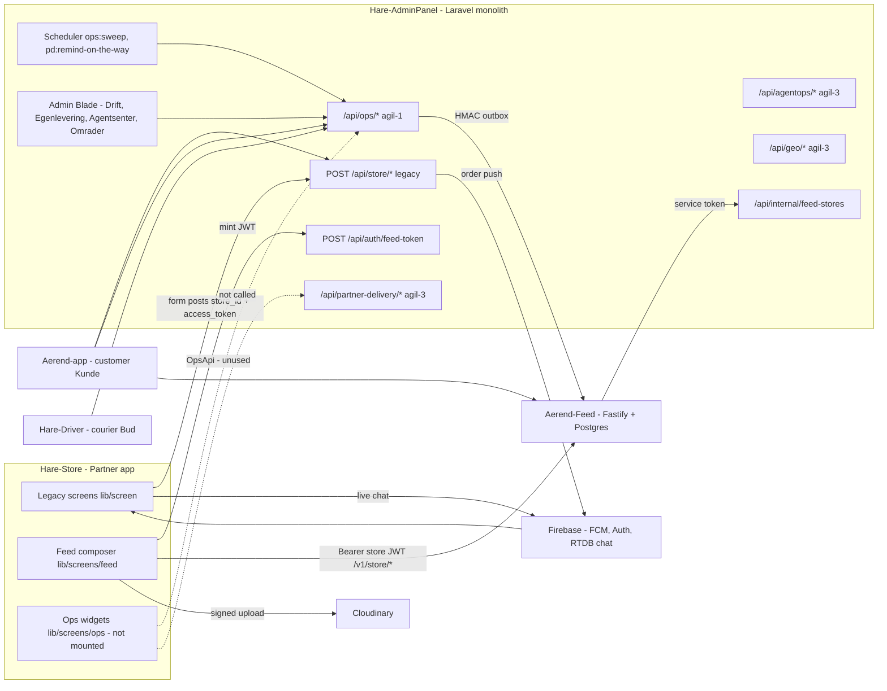

Solid arrows are calls that happen today; dashed arrows exist only as client code that nothing invokes.
The driver-side (Bud) picture is in [report 02](02-CUSTOMER-APP-REPORT.md); the customer side in [report 01](01-AGENTIC-WORKFLOW-REPORT.md)/04; the feed internals in
the feed report. This report covers the store-facing edges.

---

## 3. App architecture: two screen trees, one shipping app

**What it is / why** — Hare-Store is a Flutter app (package name `temp`, bundle/application id
`com.reen.store`, display name "Reen Store" in `DEPLOY_IOS.md`). It uses a hand-rolled BLoC pattern with
rxdart: `*_bloc.dart` (BehaviorSubjects), `*_repo.dart` (HTTP), `*_dl.dart` (data/JSON). There is no
router package; navigation is `navigationPage()` / `openScreenWithClearPrevious()` against a global
`navigatorKey`.

**Spec & design** — `AGIL-1-PLAN.md` "Context" says Hare-Store uses the custom bloc pattern with order
tabs in `lib/screen/home`, products in `lib/screen/products`, feed in `lib/screens/feed/*`, and that
agil-1 owns "everything (`lib/screens/ops/*`, `feed/*`, `butikk/*`, onboarding)". The register design
(`Ærend Bud og Partner - register og system.dc.html`, partner table) maps every legacy capability to a
place in the redesign (Drift, Butikk, Mer).

**How it works today**

1. [`lib/main.dart`](../../../../Hare-Store/lib/main.dart) initialises Firebase, signs in anonymously
   (for RTDB rules), initialises `PushNotificationService`, reads the FCM token, then `runApp(MyApp)`
   whose `home` is `SplashScreen`.
2. `SplashScreen` → `splash_bloc.dart` checks service status (`store/check-service-status`) and routes to
   `HomeScreen`, `PendingScreen` (blocked/rejected/pending approval) or login.
3. `HomeScreen` ([`home_screen.dart`](../../../../Hare-Store/lib/screen/homeScreen/home_screen.dart)) is
   the hub: three order tabs plus a drawer with Products, Wallet, Cards, Order history, Bank detail,
   Profile, Change password, Select store, Chat with admin, Support, Offer, Settings, Live chat, Logout.
   The app bar's one new-generation entry is the feed profile button → `StoreFeedProfileScreen`.
4. Nothing else from `lib/screens/ops`, `lib/screens/points` or `lib/services/ops` is constructed.

**Reachability audit** (grep of each class name across `lib/` excluding `.bak`; "lib refs" lists files
that mention the class):

| Class | Lib refs outside own file | Test refs | Reachable from app |
|---|---|---|---|
| `OpsShellScreen` | none | 1 | No |
| `KasseBoard`, `KjokkenView` | only `ops_shell_screen.dart` | yes | No (shell unreachable) |
| `HentingScreen`, `AutodriftPanel`, `NeedsYouList`, `VarerScreen`, `ForundringsposeScreen` | none | yes | No |
| `InnsiktScreen`, `OppgjorScreen`, `ApningstiderScreen`, `BilderScreen`, `EnheterScreen`, `TilgangScreen`, `InnstillingerScreen` | none | yes | No |
| `FeedComposerFlow`, `StorePostListScreen` | none | yes | No |
| `PartnerOnboarding` / `OnboardingFlow` | only each other | yes | No |
| `VoiceEntrySheet` | none | yes | No |
| `TilbyPremieScreen` | none | 0 | No |
| `OpsApi` | only `ops_heartbeat_service.dart` | 0 | No |
| `OpsHeartbeatService`, `OfflineOutbox` | none | 0 / 1 | No |
| `StoreFeedProfileScreen` | `home_screen.dart`, `push_notification_service.dart` | 0 | **Yes** |
| `FeedManagementScreen` | `feed_create_options_sheet.dart` | yes | **Yes** (via profile) |
| `FeedUploadTestScreen` (dev) | none | 0 | No |

Even inside `OpsShellScreen`, only the Drift tab is real: the Varer, Poser, Feed and Mer tabs render
`'Kommer i en senere fase'` and Butikk mode renders `'Butikk — Varer, Feed og innstillinger (Phase 7–9)'`;
the mic button has `onPressed: null` ([`ops_shell_screen.dart`](../../../../Hare-Store/lib/screens/ops/ops_shell_screen.dart)
`_body`, `build`).

**Where in code**

| Layer | File | Key symbols |
|---|---|---|
| Entry | [`lib/main.dart`](../../../../Hare-Store/lib/main.dart) | `main`, `MyApp`, `navigatorKey` |
| Legacy hub | [`lib/screen/homeScreen/home_screen.dart`](../../../../Hare-Store/lib/screen/homeScreen/home_screen.dart) | `HomeScreen`, drawer `navigationPage(...)` |
| Legacy HTTP | [`lib/network/api_base_helper.dart`](../../../../Hare-Store/lib/network/api_base_helper.dart), [`endpoints.dart`](../../../../Hare-Store/lib/network/endpoints.dart) | `ApiBaseHelper`, `EndPoint.baseUrl` |
| Ops HTTP | [`lib/networking/ops/ops_api.dart`](../../../../Hare-Store/lib/networking/ops/ops_api.dart) | `OpsApi.heartbeat/devices/markSeen/transition/eventsSince` |
| Feed HTTP | [`lib/networking/feed/*`](../../../../Hare-Store/lib/networking/feed/) | `StoreFeedRepo`, `StoreFeedApiHelper`, `FeedBaseUrl` |
| Ops models | [`lib/data/ops/*`](../../../../Hare-Store/lib/data/ops/) | `OpsOrder`, `OpsOrderState`, `KasseSection`, `OpsDeviceRole`, `AutodriftLevel`, `OpsProduct`, `OpsFeedPost`, `FeedCompliance`, `ops_business.dart` |
| Ops widgets | [`lib/screens/ops/*`](../../../../Hare-Store/lib/screens/ops/) | see table above |

**Use-case examples**
- A developer adds `OpsShellScreen()` to the drawer: it does not compile — `orders` is required
  (`AGIL-1-REMAINING.md` §3 records this exact attempt).
- A tester opens the Partner app on `agil-1` expecting the redesigned Kasse board: they get "Live
  Orders" with three tabs, the legacy screen.

**Status** — 🟡 Partial. Legacy app ✅ works; redesign 🧪 (widgets + tests, no data, no routes). Note also
`.bak` copies of almost every legacy file are committed alongside the originals.

---

## 4. Login, session and store selection (Innlogging)

**What it is / why** — A store owner signs in to one or more stores (`provider_services`) and the app
keeps `store_id`, `access_token` and `store_service_id` in SharedPreferences for every later call.

**Spec & design** — Order Ops §21 / Partner&Bud §18: "bearer tokens per app; Partner devices carry
`X-Device-Id`". Partner design "Kom i gang" / Onboarding replaces sign-up with a 7-step flow (BankID,
e-sign, payout, menu, photos, hours, devices, Autodrift, test order). The register design keeps
"Butikkbytte" (store switch) unchanged under Mer › Butikker.

**How it works today**

1. `LoginRepo.loginApi` posts `store/login` with `email`, `password`, `login_type`, `device_token` (FCM),
   `login_device`, language, country code and currency
   ([`login_repo.dart`](../../../../Hare-Store/lib/screen/loginScreen/login_repo.dart)).
2. Every later legacy call sends `store_id` + `access_token` in the form body **and**
   `Authorization: Bearer <access_token>`, `X-localization`, `X-currency`, `X-timezone`, `X-Platform`
   headers (`ApiBaseHelper` header builder).
3. The backend validates with `StoreClassApi::checkStoreRegisterAllow(store_id, access_token, store_service_id)`
   (e.g. `StoreController::postStoreUpdateCurrentStatus`).
4. Store switching: drawer "Select store" → `store/get-provider-stores`.
5. Firebase Auth: besides anonymous sign-in, `firebaseAuth()` in
   [`common_util.dart`](../../../../Hare-Store/lib/utils/common_util.dart) signs in / creates a Firebase
   user `d_<email>` with the hard-coded password `"123456"` for RTDB chat. That is a security smell worth
   removing.
6. Registration (`store/register`) and OTP verification screens exist; the web panel URL
   `EndPoint.storeWebPanelUrl` → `/store-admin/register` is also offered.

**Where in code**

| Layer | File | Key symbols |
|---|---|---|
| App | [`lib/screen/loginScreen/*`](../../../../Hare-Store/lib/screen/loginScreen/) | `LoginBloc`, `LoginRepo.loginApi`, `callLogoutApi` |
| App | [`lib/utils/shared_preferences_util.dart`](../../../../Hare-Store/lib/utils/shared_preferences_util.dart) | `prefStoreId`, `prefAccessToken`, `prefStoreServiceId`, `setFireToken` |
| Backend | [`routes/api.php`](../../../../Hare-AdminPanel/routes/api.php) `store` prefix | `post:store:login`, `post:store:register`, `post:store:logout`, `post:store:check_service_status` |
| Backend | `app/Http/Controllers/Api/Auth/LoginController.php` | `postStoreLogin` |

**API / events / data** — `POST /api/store/login`, `/logout`, `/register`, `/contact-verification`,
`/forgot-password-request`, `/forgot-change-password`, `/change-password`, `/check-service-status`
(+ snake alias `/check_service_status`), `/get-provider-stores`, `/app_version_check`.

**Use-case examples**
- A pizza shop owner with two outlets logs in, picks outlet B from "Select store"; all order calls now
  carry outlet B's `store_service_id`.
- A device that later calls `/api/ops/partner/devices/heartbeat` would not need any of these
  credentials — see [§24 row P1](#24-gap-analysis).

**Status** — ✅ Built (legacy). The spec's device identity (`X-Device-Id`, device registration with role)
is ❌ in the app and the ops routes do not use the legacy token either.

---

## 5. Live order queue — the shipping flow (Ordrekø)

**What it is / why** — The screen every partner uses today: new orders ring, the store accepts or
rejects, starts processing, and the order moves to dispatch. Delivery orders are then handled by the
legacy driver dispatch; takeaway orders are completed by the store.

**Spec & design** — The register design maps "Ordrekø" (`home_screen.dart` — TabController(length: 3):
Ny · Behandles · Utsendelse) to Drift with the instruction that "fanene blir kø-seksjoner så en ny ordre
ikke er skjult bak en fane" (tabs become always-visible sections). "Utsendelse / hentekode" is flagged
**N** (new): today's only action is "fullfør" when `userTakenType == 2`; no code, scan or courier ETA.

**How it works today**

1. `HomeBloc` loads `store/home` on start, every **20 s** (`_startAutoRefreshTimer`) and whenever
   `PushNotificationService.refreshStream` fires.
2. `setOrderList` buckets orders by legacy `order_status`: `1` → Ny (pending), `2/5/6` → Behandles
   (processing), `7/8` → Utsendelse (dispatch) ([`home_bloc.dart`](../../../../Hare-Store/lib/screen/homeScreen/home_bloc.dart)).
3. Ny: Accept → `updateOrderStatus(..., changeOrderAccept=2)`; Reject → reason dialog
   (`rejectDialog/`) → status `3` with `rejected_reason`. After accept the app jumps to the Processing tab.
4. Behandles: "Start process" (`2 → 5`). Any order not in `2` is auto-pushed to `8` (dispatch) once per
   order by `_autoDispatchKey` in
   [`processing_orders.dart`](../../../../Hare-Store/lib/screen/homeScreen/orders/processingOrder/processing_orders.dart).
   For takeaway (`userTakenType == 2`) the card also offers a direct "dispatch" action.
5. Utsendelse: for takeaway only, "complete" → status `9`
   ([`dispatch_orders.dart`](../../../../Hare-Store/lib/screen/homeScreen/orders/dispatchOrder/dispatch_orders.dart)).
6. Order detail (`OrderDetailScreen`) shows items, customer, totals and the same status actions, and
   prints a receipt on a Sunmi device (`OrderDetailBloc.printInvoice`, `SunmiPrinter.*`) once
   `orderStatus >= 5` and the printer is bound.
7. Backend `StoreController::postStoreUpdateOrderStatus` accepts `update_status ∈ {2,3,4,5,6,8,9}`; on
   accept (`1 → 2`) it calls `notificationClass->driverRequestNotification(...)` (legacy driver dispatch);
   on reject/cancel it handles refunds for card/Vipps payments.
8. `HomeRepo.assignDriver` / `store/assign-driver` and `store/assignable-driver-list` exist but no UI calls
   them (removed in commit `ce4a815 order route remove`).

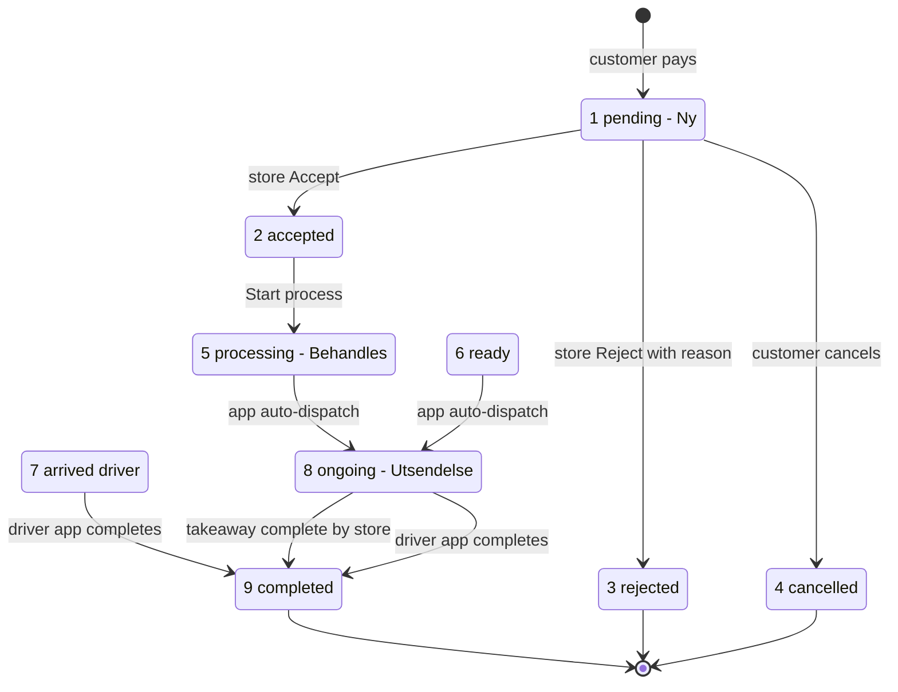

**Where in code**

| Layer | File | Key symbols |
|---|---|---|
| App | [`home_bloc.dart`](../../../../Hare-Store/lib/screen/homeScreen/home_bloc.dart) | `getHomeData`, `updateOrderStatus`, `setOrderList`, `_startAutoRefreshTimer`, `changeOrderAccept/Reject/StartProcessing` |
| App | [`lib/utils/order_status.dart`](../../../../Hare-Store/lib/utils/order_status.dart) | `Order.getStatus`, `OrderStatus`, `changeOrderReady=6`, `changeOrderDispatch=8` |
| App | [`lib/screen/orderDetailScreen/order_detail_bloc.dart`](../../../../Hare-Store/lib/screen/orderDetailScreen/order_detail_bloc.dart) | `updateOrderStatus`, `printInvoice`, `_bindingPrinter` |
| App | [`lib/dialog/rejectDialog/*`](../../../../Hare-Store/lib/dialog/rejectDialog/) | reject reason |
| Backend | `app/Http/Controllers/Api/Store/StoreController.php` | `postStoreHome`, `postStoreUpdateOrderStatus`, `postStoreOrderDetails`, `postStoreOrderHistory` |

**API / events / data** — `POST /api/store/home`, `/update-order-status`, `/order-details`,
`/order-history`, `/shopper-order-rating`; table `user_store_product_booking.status`. FCM data payload keys
`order_id`, `order_status`, `notification_type`.

**Use-case examples**
- 18:02 a delivery order rings; the cashier taps Accept, then Start process; the app auto-moves it to
  Utsendelse; a legacy driver collects it and completes in the driver app.
- A takeaway order: Accept → Start process → "Dispatch" → "Complete" when the customer collects; no code
  or QR is checked.
- The customer's new tracking screen (`ops.customer.tracking`) for the same order still reads
  `ops_state = placed` — see [§23.3](#233-two-status-machines-not-bridged).

**Status** — ✅ Built (legacy). It does not implement the spec's seen-signal, honest window, pickup
token, shelf slot or Æ-code; and it does not write `ops_state`.

---

## 6. Ops order board — Kasse, Kjøkken, Henting (Drift)

**What it is / why** — The redesign's live half: one app, three device roles over the same order state.
Kasse is the counter board with four always-visible sections; Kjøkken shows large cards and marks orders
seen by rendering them; Henting is the pickup display.

**Spec & design**
- Order Ops §4.1 (states), §8 (device roles), §22 (Partner client requirements); Partner&Bud §19.
- Design `Ærend Partner.dc.html` screens "Ordretavle", "Kjøkken {{ k.kode }}", "Henting {{ h.kode }}",
  "{{ o.kode }}" (order sheet), "Autodrift hode", "Trenger deg", "Kveldspuls". `leveranser (steg 4)` §1
  screen 3.3 "Drift — Kasse": Solgt i kveld, Travelmodus, Trenger deg on top, four stage tabs with counts,
  cards with code, type, Kode ved levering, allergen flag, pending, window countdown, hylleplass,
  kundeblikk, courier ETA, +5/+10/+15, level-specific primary action.
- Plan: `AGIL-1-PLAN.md` Phase 2 `[x]` "Hare-Store: app bar…, Kasse board…, Kjøkken view…, wake-lock,
  audio focus for new-order sound, heartbeat sender".

**How it works today (code)**

1. `OpsOrderState` mirrors `App\Ops\OrderState::TRANSITIONS` exactly
   ([`ops_order_state.dart`](../../../../Hare-Store/lib/data/ops/ops_order_state.dart)).
2. `KasseSectionX.forState` collapses states into sections: `placed/accepted → ny`, `seen → tilberedes`,
   `ready → klar`, `picked_up/arrived_customer/delivered/cancelled → hentet`.
3. `KasseBoard.ordersIn` sorts late first, then courier waiting, then by `promisedEnd`.
4. `OpsOrder` carries `code`, `requiresCode`, `allergenNote`, `promisedStart/End`, `predictedReadyAt`,
   `shelfSlot`, `courierName/EtaMinutes/Waiting`, `pending`, `seenAt`, and `kundeblikkArbKey` (the ARB key
   the customer is currently shown) ([`ops_order.dart`](../../../../Hare-Store/lib/data/ops/ops_order.dart)).
5. `OpsShellScreen` holds role and Drift/Butikk mode, renders banners from props (`offline`, `paused`,
   `pulseLost`) and passes callbacks (`onPrimaryAction`, `onReject`, `onAddTime`, `onMarkReady`, `onSeen`)
   down. `OpsDeviceRoleX.autoMarksSeen` is true only for Kjøkken.
6. **No container feeds it.** There is no fetch of orders, no realtime subscription, and no callback
   implementation calling `OpsApi.transition`.
7. Not found in code: wake lock (no `wakelock*` package in `pubspec.yaml`), audio-focus handling, battery
   reading. The plan's `[x]` for "wake-lock, audio focus" is not supported by the code.

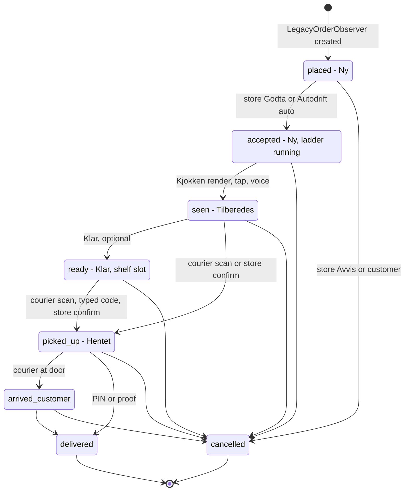

**Where in code**

| Layer | File | Key symbols |
|---|---|---|
| App | [`ops_shell_screen.dart`](../../../../Hare-Store/lib/screens/ops/ops_shell_screen.dart) | `OpsShellScreen`, `_rolePill`, `_banners`, `_body` |
| App | [`kasse_board.dart`](../../../../Hare-Store/lib/screens/ops/kasse_board.dart) | `KasseBoard.sectionTitles`, `ordersIn` |
| App | [`kjokken_view.dart`](../../../../Hare-Store/lib/screens/ops/kjokken_view.dart) | `KjokkenView`, `onMarkReady`, `onSeen`, `onVoiceEntry` |
| App | [`ops_order_card.dart`](../../../../Hare-Store/lib/screens/ops/ops_order_card.dart), [`ops_consequence.dart`](../../../../Hare-Store/lib/screens/ops/ops_consequence.dart) | card, consequence line + undo |
| App | [`ops_api.dart`](../../../../Hare-Store/lib/networking/ops/ops_api.dart) | `transition` (422 → `OpsTransitionResult.rejected`), `eventsSince` |
| Backend | [`app/Ops/OrderState.php`](../../../../Hare-AdminPanel/app/Ops/OrderState.php) | `TRANSITIONS`, `canTransition`, `eventTypeFor`, `arbKeys` |
| Backend | [`app/Services/Ops/OrderTransitionService.php`](../../../../Hare-AdminPanel/app/Services/Ops/OrderTransitionService.php) | `transition` (idempotency, `ops_order_events`, shelf slot on ready, `TimeEngine::recompute` on accept, broadcast) |
| Backend | `app/Http/Controllers/Ops/OrderStateController.php` | `states`, `transition` |
| Tests | [`test/ops/kasse_board_test.dart`](../../../../Hare-Store/test/ops/kasse_board_test.dart) | re-sort on injected events, role switch |

**API / events / data** — `GET /api/ops/order-states`, `POST /api/ops/orders/{orderId}/transition`
(`to`, `actor_type`, `actor_id`, `payload`, `idempotency_key`; `422 INVALID_TRANSITION`),
`GET /api/ops/events?since=`. Columns on `user_store_product_booking`: `ops_state`, `ops_seen_at`,
`ops_code`, `ops_shelf_slot`, `ops_origin`, `ops_policy_version`, `ops_promised_end` (others not
enumerated here). Events `order.<state>` in `ops_order_events`.

**Use-case examples**
- Intended: a tablet set to Kjøkken renders Æ-42K; `onSeen` posts `partner/orders/{id}/seen`; the
  customer flips to "Tilberedes". Today: not possible from the app.
- Intended: the cashier taps "Godta" on Manuell level → `transition(to: accepted)` with a stable
  idempotency key; offline it queues in `OfflineOutbox`. Today: the legacy Accept is used instead.

**Status** — 🧪 app (widgets + tests only) · ✅ backend state machine and transition path. The spec's
`ORDER_STATE_CONFLICT` code is named `INVALID_TRANSITION` in code.

---

## 7. Devices, heartbeat, seen-signal and escalation (Enheter, sett-signal, eskaleringsstige)

**What it is / why** — The platform must know whether a human at the store has seen an order. Devices
heartbeat; liveness gates auto-accept; an unseen order escalates (sound → owner contact → auto-pause).

**Spec & design** — Order Ops §7.1–7.3, §8; Partner&Bud §7. Spec numbers: heartbeat **20 s**, liveness =
any `kasse` **or** `kjokken` device seen in the last **60 s**, ladder 0–60 s pushes every 20 s, 120 s owner
+ `agent.comms` call, 240 s `paused_auto` + exception + customer choice. Design: "Enheter" section, the
"Forklaringskort etter autopause" (explanation card), banners for muted / battery < 15 % / offline.

**How it works today**

1. Backend `DeviceLivenessService::heartbeat` upserts `store_devices`; `DeviceState::HEARTBEAT_SECONDS = 30`,
   `STALE_AFTER_SECONDS = 90`; `storeIsLive` counts **only `kasse`** devices.
2. `SeenSignalService::markSeen` accepts a seen only for `ops_state = accepted`, transitions to `seen`.
3. `ops:sweep` (every minute, `app/Console/Kernel.php`) runs `SeenSignalService::runEscalations` (writes
   `order.unseen_escalation_{1,2,3}` events for `ops_state = accepted AND ops_seen_at IS NULL`) and
   `EscalationLadder::run`:
   - step 1 `soundEveryDevice` writes a `store.escalation_sound` event (no push is sent);
   - step 2 `contactOwner` writes a `store.owner_contacted` event with a scripted SMS text (no SMS sent);
   - step 3 `autoPause` sets `store_details.ops_availability_state = paused_auto`, writes
     `store.paused_auto` with `customer_choice: [wait, cancel_with_refund]`, opens
     `ExceptionType::STORE_AUTO_PAUSED`, audits.
4. `EscalationLadder::resume` returns the explanation card payload.
5. App: `OpsHeartbeatService` (30 s timer, `storeIsLive` notifier) and `OpsApi.markSeen` exist and are
   never instantiated; `EnheterScreen` renders a device list from props.
6. **Because the live app never moves `ops_state` to `accepted`, steps 1–3 never fire for real orders.**

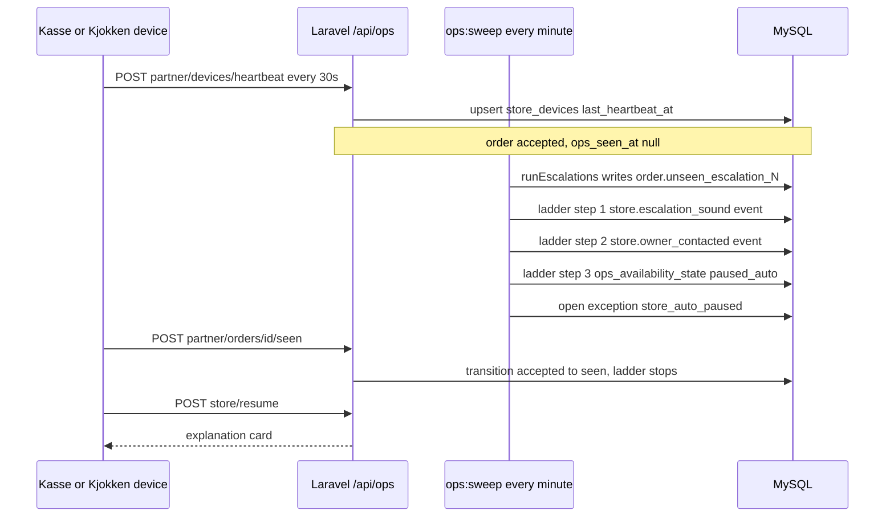

**Where in code**

| Layer | File | Key symbols |
|---|---|---|
| Backend | [`app/Ops/DeviceState.php`](../../../../Hare-AdminPanel/app/Ops/DeviceState.php) | `HEARTBEAT_SECONDS`, `STALE_AFTER_SECONDS`, roles |
| Backend | `app/Services/Ops/DeviceLivenessService.php` | `heartbeat`, `storeIsLive`, `markStaleDevices`, `summary` |
| Backend | `app/Services/Ops/SeenSignalService.php` | `markSeen`, `runEscalations`, `thresholds` |
| Backend | [`app/Services/Ops/EscalationLadder.php`](../../../../Hare-AdminPanel/app/Services/Ops/EscalationLadder.php) | `run`, `soundEveryDevice`, `contactOwner`, `autoPause`, `resume`, `pauseManually`, `autoAccept`, `availabilityState` |
| Backend | `app/Http/Controllers/Ops/PartnerDeviceController.php` | `heartbeat`, `devices`, `markSeen`, `unseenCount` |
| App | [`lib/services/ops/ops_heartbeat_service.dart`](../../../../Hare-Store/lib/services/ops/ops_heartbeat_service.dart) | `OpsHeartbeatService.start/beat`, `intervalSeconds = 30` |
| App | [`lib/screens/ops/butikk/enheter_screen.dart`](../../../../Hare-Store/lib/screens/ops/butikk/enheter_screen.dart) | `EnheterScreen`, `StoreDevice` |

**API / events / data** — `POST /api/ops/partner/devices/heartbeat` (`store_id`, `device_uid`, `role`,
`name`, `push_token`, `battery`, `sound_ok`, `muted`; returns `store_is_live`), `GET /api/ops/partner/devices`,
`POST /api/ops/partner/orders/{orderId}/seen`, `GET /api/ops/panel/unseen-count`. Policy
`escalation.unseen_s = [60, 120, 240]` (`docs/OPS_POLICY_KEYS.md`). Table `store_devices`.

**Use-case examples**
- Intended: the only Kasse tablet's battery dies at 19:10; 90 s later `storeIsLive` is false; an Auto-level
  store stops auto-accepting.
- Intended: an order sits unseen; at 240 s the store is paused and the customer is offered wait/refund.
  Today: no customer prompt is wired either (customer-side is [report 01](01-AGENTIC-WORKFLOW-REPORT.md)'s scope).

**Status** — 🟡 backend ✅ (with spec deviations: 30/90 s instead of 20/60 s; Kjøkken does not count
toward liveness; steps 1–2 write events but do not deliver push/SMS) · app 🧪.

---

## 8. Pickup handoff — QR, samle-QR, hylleplass, fallbacks (Henting)

**What it is / why** — The "no paper" handover: the Henting display shows a 60-second ES256 QR; the
courier scans it; `picked_up` is applied with five ordered checks. A courier must never be stuck, so
there are fallbacks (typed code, store confirm, panel override, customer self-pickup).

**Spec & design** — Order Ops §10.1–10.8; Partner&Bud §10. Design "Henting {{ h.kode }}", sheets
"Utlevert til bud" (store confirm: "Budet må bekrefte i sin app innen 2 minutter, ellers går ordren
tilbake til Klar"), "Kunden henter" (scan customer QR or type the code), "Tast kode".

**How it works today**

1. Backend `PickupHandoffService::mintForOrder` signs `{o, s, iat, exp, n, kid}` with
   `PickupTokenCodec::sign` (ES256, `TTL_SECONDS = 60`, `OFFLINE_TTL_SECONDS = 3600`); `mintForAssignment`
   makes a samle-QR for a stacked run.
2. `scan` (rate-limited `MAX_SCANS_PER_MINUTE = 10`) runs signature → expiry → nonce → order state →
   courier assignment, then transitions to `picked_up`.
3. `acceptTypedCode`, `storeConfirm`, `panelOverride`, `selfPickup` are the fallbacks.
4. `assignShelfSlot` gives the lowest free slot when an order becomes `ready`
   (`OrderTransitionService::transition`).
5. App: `HentingScreen` shows ready tiles, a 60 s countdown ring, samle-card when one courier holds several
   ready orders, slide-to-confirm, typed-code and self-pickup actions. **The QR itself is a placeholder**:
   `_qrPlaceholder` expects "the host app's QR widget" and `pubspec.yaml` has no QR package. `tokenFor` is a
   callback no one supplies; nothing calls `/api/ops/pickup/orders/{id}/token`.
6. The spec's offline token **batch** endpoint (`POST /stores/{id}/pickup_tokens/batch`) does not exist as
   a route; `mintForOrder(..., offlineBatch: true)` exists as a parameter only.
7. The legacy shipping app has no pickup verification at all (takeaway "complete" is one tap).

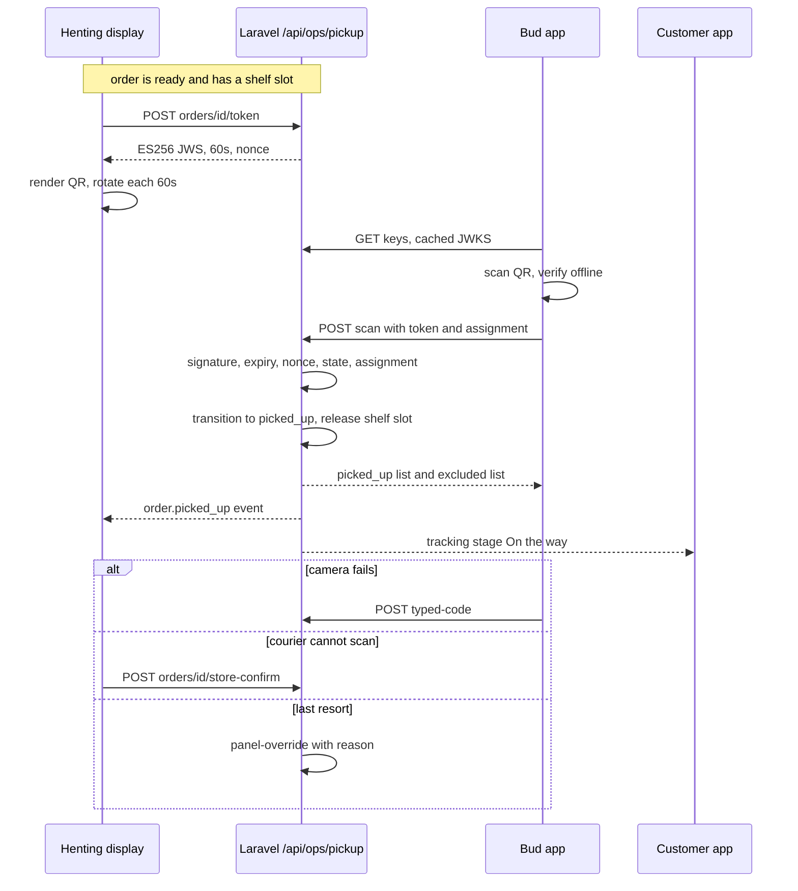

**Where in code**

| Layer | File | Key symbols |
|---|---|---|
| Backend | [`app/Ops/PickupTokenCodec.php`](../../../../Hare-AdminPanel/app/Ops/PickupTokenCodec.php) | `sign`, `verify`, `TTL_SECONDS`, `OFFLINE_TTL_SECONDS` |
| Backend | `app/Services/Ops/PickupHandoffService.php` | `mintForOrder`, `mintForAssignment`, `scan`, `acceptTypedCode`, `storeConfirm`, `panelOverride`, `assignShelfSlot`, `selfPickup`, `publicKeyBundle` |
| Backend | `app/Http/Controllers/Ops/PickupController.php` | `keys`, `mint`, `mintForAssignment`, `scan`, `typedCode`, `storeConfirm`, `selfPickup`, `panelOverride` |
| Backend | `app/Ops/ScanError.php` | named scan rejections |
| App | [`lib/screens/ops/henting_screen.dart`](../../../../Hare-Store/lib/screens/ops/henting_screen.dart) | `HentingScreen`, `qrTtlSeconds`, `showSamleQr`, `_qrPlaceholder` |
| Tests | [`test/ops/henting_screen_test.dart`](../../../../Hare-Store/test/ops/henting_screen_test.dart) | rotation, samle, fallbacks |

**API / events / data** — `GET /api/ops/pickup/keys`, `POST /api/ops/pickup/orders/{orderId}/token`,
`POST /api/ops/pickup/assignment-token`, `POST /api/ops/pickup/scan` (throttled),
`POST /api/ops/pickup/typed-code`, `POST /api/ops/pickup/orders/{orderId}/store-confirm`,
`POST /api/ops/pickup/orders/{orderId}/self-pickup`, `POST /api/ops/pickup/orders/{orderId}/panel-override`.
Env `OPS_PICKUP_KEY_ID`, `OPS_PICKUP_PRIVATE_KEY(_PATH)`, `OPS_PICKUP_PUBLIC_KEY`,
`OPS_PICKUP_PREVIOUS_PUBLIC_KEYS`; command `ops:generate-pickup-keys`, `ops:key-rotation-drill`.

**Use-case examples**
- A courier with two orders from the same sushi bar scans one samle-QR; one bag is not ready, so the scan
  response lists it as excluded and the Bud app names the missing bag.
- The Henting tablet's camera-facing screen is cracked; the cashier slides "Utlevert til bud"; the courier
  confirms in Bud within 2 minutes.

**Status** — 🟡 backend ✅ (no batch endpoint) · app 🧪 (no QR renderer, no token fetch) · legacy app has
no handoff check. Driver-side scan status: see [report 02](02-CUSTOMER-APP-REPORT.md).

---

## 9. Timing and Autodrift (+5/+10/+15, Autodrift-nivå)

**What it is / why** — The time engine predicts ready time and the customer's window; the store can push
an order out (+5/+10/+15) with a stated consequence and undo; Autodrift sets how much the store does by
hand (Manuell: Godta/Avvis; Assistert: Bekreft tiden; Auto: nothing).

**Spec & design** — Order Ops §6 (layers, window, capacity, learning), §7.1 (`autodrift_level`);
Partner&Bud §6.6 (Assistert: confirmed times count double for 7 days / 50 orders). Design "Autodrift
hode", "Justeringer", sheet "Klargjøringstid · {kode}" ("Kunden ser den nye tiden med én gang").

**How it works today**

1. `TimeEngine` (`EWMA_ALPHA = 0.3`, `ASSISTERT_WEIGHT = 2.0`, confidence thresholds 5/20 samples) learns
   from `observeFromOrder` when an order becomes `ready`, `recompute` on `accepted`, `addTime` and
   `undoAdjustment` (tombstone, not delete).
2. `TimingController`: `window`, `addTime`, `undoAdjustment`, `autodrift` (read model), `setAutodrift`
   (writes `store_details.ops_autodrift_level`).
3. `EscalationLadder::autoAccept(orderId)` would accept + see an order for an `auto` store that is live —
   **but nothing calls it** (only `DispatchController` calls a *different* `autoAccept` on courier offers).
4. App: `AutodriftPanel` (level Manuell/Assistert, learned-minutes sentence, capacity stepper, default
   prep) and the card's +N buttons exist as widgets with callbacks only.
5. Legacy app: settings carry `is_auto_accept_order` and `eta_delivery_time`
   ([`settings_repo.dart`](../../../../Hare-Store/lib/screen/settingScreen/settings_repo.dart)); this is
   the auto-accept partners actually use today.

**Where in code**

| Layer | File | Key symbols |
|---|---|---|
| Backend | `app/Services/Ops/TimeEngine.php` | `defaultPrepMinutes`, `learnedPrep`, `observePrep`, `observeFromOrder`, `addTime`, `undoAdjustment`, `recompute` |
| Backend | `app/Http/Controllers/Ops/TimingController.php` | `window`, `addTime`, `undoAdjustment`, `autodrift`, `setAutodrift` |
| App | [`autodrift_panel.dart`](../../../../Hare-Store/lib/screens/ops/autodrift_panel.dart) | `AutodriftPanel`, `onLevelChange`, `onCapacityChange` |
| App | [`ops_consequence.dart`](../../../../Hare-Store/lib/screens/ops/ops_consequence.dart) | consequence text + undo |
| Tests | [`test/ops/autodrift_panel_test.dart`](../../../../Hare-Store/test/ops/autodrift_panel_test.dart) | |

**API / events / data** — `GET /api/ops/timing/orders/{orderId}/window`,
`POST /api/ops/timing/orders/{orderId}/add-time`, `DELETE /api/ops/timing/orders/{orderId}/adjustments/{adjustmentId}`,
`GET|POST /api/ops/timing/autodrift`. Policy `time.default_prep` (restaurant 25, dagligvare 15, mat_fisk 15,
mote 20, default 20 min). Event `order.time_adjusted` (spec name; code name not verified).

**Use-case examples**
- Friday rush, the kitchen is behind: cashier taps +10 on Æ-42K; the consequence line reads the new window
  "18:17–18:27"; Angre within the toast restores it.
- A new store on Assistert confirms 30 predicted times in the first week; those observations weigh double.

**Status** — 🟡 backend ✅ (EWMA α 0.3 vs spec 0.2; store-level auto-accept not wired; `extend_all`
missing) · app 🧪.

---

## 10. Availability, pause and opening hours (Åpen/Stengt, Travelmodus, Åpningstider)

**What it is / why** — Whether a customer can order from the store right now: opening hours, manual pause
(Travelmodus 15/30/60/rest of day), automatic pause from the ladder, and exceptions (holidays).

**Spec & design** — Order Ops §4.3 (availability machine; "Customer app shows paused as «Åpner igjen
snart»; new orders are blocked server-side"), §6.4 (`pause_new_orders`, `extend_all`), §17.7 P5 (hours
exceptions), design "Butikk hub", P5.1–P5.7 (free-text line, rows, holiday card, coherence with the store
page sentence). Register design: "Butikk åpen/stengt → Drift › Travelt: pause 15/30/60 min eller forleng
alle tider".

**How it works today — three separate truths**

| Truth | Where written | Who reads it |
|---|---|---|
| Legacy online/offline + `store_timings` | App: `store/update-current-status` (`provider_services.current_status`), legacy settings `store_timing` | Customer store list / store page `store_status` (`UserController` / `UserClassApi`: open if now within the day's `store_timings` **and** `current_status == 1`); customer app `BergenStoreInfo.open = storeStatus == 1` |
| Ops availability `open / paused_manual / paused_auto` | `POST /api/ops/store/pause|resume`, `EscalationLadder::autoPause` → `store_details.ops_availability_state`, `ops_paused_until` | `CustomerTrackingReadModel` category pulse `stores_open`, `PanelReadModel`, `MetricsService` |
| Ops opening hours grid + exceptions | `POST /api/ops/hours/day`, `/exceptions` → `ops_store_hours`, `ops_store_hour_exceptions` | `StoreHoursController` (week sentence), `ProductController::poser` (bag pickup status) |

Consequences verified in code:
- A store paused through ops is still shown **Åpen** in the customer app and can still receive orders —
  no checkout guard reads `ops_availability_state` (grep: only tracking/panel/metrics read it).
- `ops_paused_until` is written by `pauseManually` and cleared by `resume`; nothing auto-resumes at expiry
  (no other reader found).
- Hours edited in the new grid do not change `store_timings`, so the customer's open/closed ignores them.

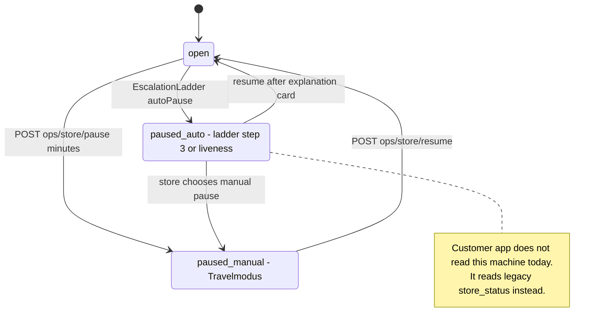

**Where in code**

| Layer | File | Key symbols |
|---|---|---|
| Backend | [`app/Ops/StoreAvailabilityState.php`](../../../../Hare-AdminPanel/app/Ops/StoreAvailabilityState.php) | `OPEN`, `PAUSED_MANUAL`, `PAUSED_AUTO`, `canTransition` |
| Backend | `app/Http/Controllers/Ops/ProblemController.php` | `availability`, `pause` (`minutes` 0..1440), `resume` |
| Backend | `app/Services/Ops/StoreHoursService.php` | `week`, `setDay`, `setException`, `removeException`, `statusAt`, `weekSentence`, `coherenceProblems` |
| Backend | `app/Http/Controllers/Api/Store/StoreController.php` | `postStoreUpdateCurrentStatus` (legacy toggle) |
| Backend | `app/Http/Controllers/Api/Store/UserController.php` | `store_time_status` computation |
| App (legacy) | [`home_repo.dart`](../../../../Hare-Store/lib/screen/homeScreen/home_repo.dart), [`settings_repo.dart`](../../../../Hare-Store/lib/screen/settingScreen/settings_repo.dart) | `endPointUpdateCurrentStatus`, `paramStoreTiming`, `paramIsStoreOpen` |
| App (ops) | [`butikk/apningstider_screen.dart`](../../../../Hare-Store/lib/screens/ops/butikk/apningstider_screen.dart) | `ApningstiderScreen`, `HoursDay`, `HoursException` |
| Customer | [`lib/data/ops/butikk_models.dart`](../../lib/data/ops/butikk_models.dart) | `BergenStoreInfo.fromPojo` `open: p.storeStatus == 1` |

**API / events / data** — `GET /api/ops/store/availability`, `POST /api/ops/store/pause`,
`POST /api/ops/store/resume`, `GET /api/ops/hours`, `POST /api/ops/hours/day`,
`POST /api/ops/hours/exceptions`, `DELETE /api/ops/hours/exceptions/{exceptionId}`; legacy
`POST /api/store/update-current-status`, `/get-and-update-settings`. Events `store.paused_auto`
(and manual pause event payload `{store_id, minutes}`).

**Use-case examples**
- The owner taps the legacy "offline" switch at 21:30: customer Hjem shows Stengt immediately — this works.
- Ops Travelmodus 30 min (once wired): today the customer would still see Åpen and still be able to pay.
- The owner enters "stengt julaften" in Åpningstider (once wired): the week sentence updates, but the
  customer store page's hours (from `store_timings`) do not.

**Status** — 🟡 Partial: legacy toggle ✅; ops pause/hours backend ✅ but not authoritative for customers;
app ops screens 🧪; `extend_all` ❌; auto-resume ❌; P5 agent ❌.

---

## 11. Problems and exceptions (Trenger deg, Avvik)

**What it is / why** — Exceptions are the only thing a human should need to act on: unseen orders, a
courier waiting, a courier problem (wrong order, store closed), allergen notes, sold-out suggestions,
device trouble.

**Spec & design** — Order Ops §13 (problem types and store effect: "Trenger deg card with courier words"),
§18.3 Unntak; design "Trenger deg", "Avvik"; utviklervedlegg §4 "Business codes the store must render"
(`ORDER_ALREADY_CANCELLED`, `ITEM_OUT_OF_STOCK`, `NO_COURIER_FOUND`, `STORE_DELAYED`, …) and §6 "Missing
partner counterparts" (customer "Noe mangler" after delivery has no store notification).

**How it works today**

1. Couriers report problems (`POST /api/ops/problems/orders/{orderId}/report`); `ProblemType` has
   `store_closed`, `wrong_order`, `customer_unreachable`, `wrong_address`, `damage` and resolutions
   (`take_anyway`, `wait_for_correct`, `return_to_store`, …).
2. `ProblemService::needsYou(storeId)` builds the store's list; `GET /api/ops/problems/needs-you?store_id=`.
3. `ExceptionInbox` holds panel exceptions (`unseen_order`, `store_auto_paused`, `courier_waiting`,
   `problem_raised`, `device_offline`, …), surfaced in admin `/admin/drift/unntak`.
4. Customer problems (`ops.customer.problem` `kind=door|missing|wait|cancel`) create problems too
   ([report 01](01-AGENTIC-WORKFLOW-REPORT.md)).
5. App: `NeedsYouList` + `NeedsYouItem.fromJson` with kinds `unseenOrder`, `courierWaiting`,
   `courierProblem`, `allergenNote`, `soldOutSuggestion` — widget only.

**Where in code**

| Layer | File | Key symbols |
|---|---|---|
| Backend | [`app/Ops/ProblemType.php`](../../../../Hare-AdminPanel/app/Ops/ProblemType.php), [`app/Ops/ExceptionType.php`](../../../../Hare-AdminPanel/app/Ops/ExceptionType.php) | constants, `storeStatus` |
| Backend | `app/Services/Ops/ProblemService.php` | `report`, `resolve`, `applyTriageDefaults`, `needsYou` |
| Backend | `app/Services/Ops/ExceptionInbox.php` | `open`, `claim`, `resolve`, `queue` |
| App | [`lib/screens/ops/needs_you_list.dart`](../../../../Hare-Store/lib/screens/ops/needs_you_list.dart) | `NeedsYouItem`, `NeedsYouList.sorted`, `_actionsFor` |
| Admin | `resources/views/admin/pages/super_admin/ops/unntak.blade.php` | `Admin\OpsAdminController@exceptions` |

**Use-case examples**
- A courier reports `wrong_order` with photo; the store's Trenger deg shows the courier's words with
  "Gi riktig ordre" / "Ta med likevel" (design). Today the store learns this by phone.
- Customer reports a missing item after delivery: no store-side notification exists (design §6 flags it).

**Status** — 🟡 backend ✅ · app 🧪 · push to store devices ❌ (not found).

---

## 12. Catalogue — products, prices, sold-out, change log, AI import (Varer)

**What it is / why** — Stores manage their own products and prices, live immediately, every change
logged; sold-out in one tap with a return time; AI-assisted import produces drafts the store approves.

**Spec & design** — `aerendvstore feed update spec.md` §2.1–2.2 (create/edit/archive, live immediately,
every change logged), §4.3 (change log, compliance takeover); Order Ops §21 `POST /items/{id}/sold_out`;
`aerend-ai-agents-spec.docx` §4 (Agent A, "Hare-Store — Products → «AI-assistert import»");
utviklervedlegg §6 ("Product options … Missing — no editor for option groups"); design "Butikk hub",
`leveranser` §1 Meny.

**How it works today**

1. Legacy shipping app: `ProductScreen` lists products (`store/product-list`, search) and toggles
   availability (`store/update-product-status`). No create, edit, price or image editing in the app;
   offers are percentage/fixed/none per store (`store/get-and-update-offer`). Legacy toggles are **not**
   written to the change log (`ProductChangeLogger` is used only by `Ops\ProductController`,
   `Admin\OpsAdminController` and the agent `DraftApprovalService`).
2. Backend ops: `ProductController::index` (store products in øre + `feed_eligible`), `update` (name ≤ 30,
   description, `price_ore`, `category_id`, `available`, `image`, `reason`; one change-log row per changed
   field; no-op logs nothing; price change emits `product.price_changed` via `FeedBridge`), `soldOut`
   (`available_again_at` is only written into the log reason — **nothing restores availability**),
   `history`, `takeover` (admin), `changeLog`.
3. App ops: `VarerScreen` (search, availability toggle with undo, price edit with sync consequence,
   sold-out suggestion) — widget only. Plan notes create/archive were never built.
4. AI import (agil-3): `/api/agentops/imports` start → drafts in `agtp_product_drafts` → approve/reject/bulk;
   approval goes through `DraftApprovalService` → real product + change log. No Partner UI.
5. Ownership check: `ProductController::update` does not verify the product belongs to a calling store
   (no caller identity exists — see [§24 P1](#24-gap-analysis)).

**Where in code**

| Layer | File | Key symbols |
|---|---|---|
| App (legacy) | [`lib/screen/productsScreen/*`](../../../../Hare-Store/lib/screen/productsScreen/) | `ProductBloc`, `ProductRepo` (`paramProductStatus`) |
| App (legacy) | [`lib/screen/offerScreen/*`](../../../../Hare-Store/lib/screen/offerScreen/) | `OfferRepo` |
| App (ops) | [`lib/screens/ops/varer_screen.dart`](../../../../Hare-Store/lib/screens/ops/varer_screen.dart), [`lib/data/ops/ops_product.dart`](../../../../Hare-Store/lib/data/ops/ops_product.dart) | `VarerScreen`, `OpsProduct` |
| Backend | `app/Http/Controllers/Ops/ProductController.php` | `index`, `update`, `soldOut`, `history`, `takeover`, `changeLog`, `poser`, `populaert` |
| Backend | `app/Services/Ops/ProductChangeLogger.php` | `applyAndLog`, `PRODUCTS_TABLE = store_product_details` |
| Backend | `app/Http/Controllers/AgentOps/ProductImportController.php` | `start`, `drafts`, `bulkApprove`, `approve`, `reject` |
| Backend | `app/Services/AgentOps/ProductOnboardingAgent.php`, `DraftApprovalService.php` | per AGIL-3-PLAN Phase 3 |
| Tests | [`test/ops/varer_test.dart`](../../../../Hare-Store/test/ops/varer_test.dart) | sold-out undo, price edit |

**API / events / data** — `GET /api/ops/products?store_id=`, `POST /api/ops/products/{productId}`,
`POST /api/ops/products/{productId}/sold-out`, `GET /api/ops/products/{productId}/history`,
`POST /api/ops/products/{productId}/takeover` (admin), `GET /api/ops/change-log`;
`POST /api/agentops/imports` (`agentops.imports.store`), `GET /api/agentops/imports/{importRef}/drafts`,
`POST /api/agentops/imports/{importRef}/approve-bulk`, `POST /api/agentops/drafts/{id}/approve|reject`.
Tables `store_product_details`, `product_change_log` (spec name; model `ProductChangeLogEntry`),
`agtp_product_drafts`, `agtp_content_authorizations`. Policy `agt.product_onboarding.first_approval`
(default `aerend`), `agt.product_onboarding.bulk_threshold` (0.9).

**Use-case examples**
- A fish shop sells out of laks at 17:40: legacy toggle hides it (not logged); ops `sold-out` would log it
  with "Tilbake i morgen 10:00" but nothing turns it back on tomorrow.
- A new grocery partner uploads an EAN list; Agent A drafts 40 products with `price_ore_suggested`; today
  only Ærend can approve them in Agentsenter → Produktonboarding.

**Status** — 🟡: legacy availability ✅ · ops edit/price/log backend ✅ · app editor 🧪 · create/archive ❌
· option-group editor ❌ · sold-out auto-restore ❌ · AI import backend ✅ / app ❌.

---

## 13. Surprise bags (Forundringspose / Poser)

**What it is / why** — End-of-day bags: quantity, price (≤ half the value floor), pickup window, allergen
exclusions, reservations with pickup code.

**Spec & design** — feed update spec §2.3 (defers to a separate Surprise Bags spec, not in this repo);
Order Ops §16.2 (promo cards from `GET /forundringsposer/nearby`); design Poser tab, "Tast kode" sheet for
bag reservations.

**How it works today**

1. App: `ForundringsposeScreen` (settings model, inline validation of the half-value floor, reservations,
   collect by code) — widget only, `onSave` callback unconsumed.
2. Backend: **no surprise-bag table or write endpoint** (plan `AGIL-1-PLAN.md` Phase 8 says so explicitly).
   `ProductController::poser()` derives "bags" by matching product names / categories containing
   "forundringspose" / "pose" and joins `StoreHoursService::statusAt` — the customer Poseautomaten reads that.

**Where in code** — [`lib/screens/ops/forundringspose_screen.dart`](../../../../Hare-Store/lib/screens/ops/forundringspose_screen.dart)
(`ForundringsposeScreen`, `ForundringsposeReservation`), `ProductController::poser`
(`GET /api/ops/products?kind=pose`).

**Use-case examples** — A bakery wants 6 bags at 49 kr, pickup 20–21: today it must create a product named
"Forundringspose" in the web panel; reservations and pickup codes do not exist.

**Status** — 🧪 app · ❌ backend persistence (⛔ until the Surprise Bags spec is in scope).

---

## 14. Feed publishing (Feed, Innlegg, Historier)

**What it is / why** — Stores publish product highlights to the Ærend feed; customers see them in Utforsk
("Publisert av butikker"), and Ægil can suggest them. Admin moderates after the fact; the support/refunds
spec moves to pre-publication screening by Agent G.

**Spec & design**
- `aerendvstore feed update spec.md` §2.4: pick **one own product**, headline + short text, image defaults
  to the product image, **post linked to the product** (tap → live price), live immediately, own list,
  unpublish/delete, honest «Skjult av Ærend». Price-marketing flag: no free-text "før 199,-". Open
  questions: stories not v1 (#1), edit vs re-post (#2).
- Order Ops §16.2: store posts typed `dagens_rett | ny_i_hyllene | bak_disken | apent_na | tilbud`,
  optional `product_id`; §16.6 agent drafts published "with one tap in Partner"; §16.7 Partner queues
  posts when the feed is down.
- `aerend-support-refunds-feed-spec.docx` §4 / §4.5: supersedes "live immediately" — status «Til
  gjennomgang» → «Publisert» / «Avvist» with reason and «Endre og send på nytt».
- Design: Partner "Feed" (3-step composer), `leveranser` §14 Feed.

**How it works today**

1. Live path: `HomeScreen` app bar → `StoreFeedProfileScreen` (profile stats, posts grid, stories) →
   `FeedCreateOptionsSheet` → `FeedComposerScreen` (post) or story flow.
2. Auth: `StoreFeedJwtService._mintViaLaravel` posts `api/auth/feed-token` with `access_token`,
   `actor_type: store`, `provider_service_id`; JWT cached with expiry in prefs; `StoreFeedAuthInterceptor`
   adds it.
3. Upload: `StoreFeedRepo.signUpload` → `POST v1/uploads/sign` → `CloudinaryUploader` (cloud `dybew1yxr`);
   10 MB pre-check and inline error + Retry (Phase 9 T5).
4. Publish: `StoreFeedRepo.createPost` → `POST v1/store/posts` with `caption`, `location_name`, `media`.
   The feed's `createStorePostBodySchema` accepts **only** those fields — **no `store_product_id`**, so
   store posts cannot be product-linked (only admin posts and inbound webhooks carry
   `store_product_id`).
5. Manage: list/detail/update caption/delete posts, delete comments, stories create/list/delete,
   profile stats. Stories and post editing exist although the spec parks both (Q1, Q2).
6. Not in the live path: `FeedComposerFlow` (product-first, 3 steps, preview, `FeedCompliance`
   "før-pris" block, offline queue), `StorePostListScreen` (posts sorted by attributed orders, «Skjult av
   Ærend» + reason, "Ærend kan skrive om butikken min" + frequency, "Din bestillingslenke") — widgets only.
   The live `StoreFeedPost` model has no status/hidden field.
7. Moderation: feed posts default to `status = live`; admin hides with `hidden_reason`; the only text check
   is `containsProfanity` on comments. No Agent G screening, no «Til gjennomgang».
8. Store data reaching the feed: `store-sync` worker pulls `GET /api/internal/feed-stores/changed-since`
   (service token) into `feed_stores` (`id`, `provider_service_id`, `slug`, `name`, `logo_url`,
   `cover_url`, `is_active`, `service_category_id`, `deeplink_path`); `FeedInternalStoreTest` covers auth,
   shape, ordering, limits. Open/closed is not part of that payload.

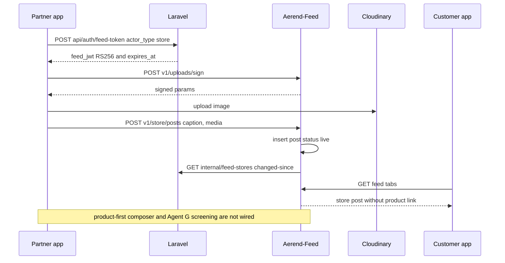

**Where in code**

| Layer | File | Key symbols |
|---|---|---|
| App | [`lib/services/store_feed_jwt_service.dart`](../../../../Hare-Store/lib/services/store_feed_jwt_service.dart) | `getValidToken`, `_mintViaLaravel` |
| App | [`lib/networking/feed/store_feed_repo.dart`](../../../../Hare-Store/lib/networking/feed/store_feed_repo.dart) | `createPost`, `listMyPosts`, `updatePost`, `deletePost`, `createStory`, `signUpload`, `fetchMyProfileStats` |
| App | [`lib/networking/feed/feed_api_constant.dart`](../../../../Hare-Store/lib/networking/feed/feed_api_constant.dart) | `FeedBaseUrl.prodDomain`, `setOverride` (`dev_feed_api_override`) |
| App | [`lib/screens/feed/*`](../../../../Hare-Store/lib/screens/feed/) | `StoreFeedProfileScreen`, `FeedComposerScreen`, `FeedManagementScreen`, `StorePostDetailScreen`, `StoreStoryViewerScreen` |
| App (unwired) | [`lib/screens/ops/feed/*`](../../../../Hare-Store/lib/screens/ops/feed/), [`lib/data/ops/feed_compliance.dart`](../../../../Hare-Store/lib/data/ops/feed_compliance.dart) | `FeedComposerFlow`, `StorePostListScreen`, `FeedCompliance.blockingMessage` |
| Feed | [`src/routes/store-publish.ts`](../../../../Aerend-Feed/src/routes/store-publish.ts), [`src/feed/store-publish/schemas.ts`](../../../../Aerend-Feed/src/feed/store-publish/schemas.ts) | `/v1/store/posts`, `createStorePostBodySchema` |
| Feed | [`src/queues/store-sync-worker.ts`](../../../../Aerend-Feed/src/queues/store-sync-worker.ts) | `sync-changed` job → `feed_stores` |
| Backend | `app/Http/Controllers/Api/Internal/FeedStoreController.php`, `app/Services/FeedSync/StoreFeedDataResolver.php` | `changedSince`, `byIds` |
| Backend | `app/Services/Ops/FeedBridge.php` | `isEligible`, `setEligibility`, `enqueuePriceChanged`, `drainOutbox`, `verifySignature` |
| Tests | [`test/feed/*`](../../../../Hare-Store/test/feed/), [`test/ops/feed_composer_test.dart`](../../../../Hare-Store/test/ops/feed_composer_test.dart), `Hare-AdminPanel/tests/Feature/FeedInternalStoreTest.php` | |

**API / events / data** — Feed: `POST|GET v1/store/posts`, `GET|PATCH|DELETE v1/store/posts/:id`,
`DELETE v1/store/posts/:postId/comments/:commentId`, `POST|GET v1/store/stories`,
`DELETE v1/store/stories/:id`, `GET v1/store/profile`, `POST v1/uploads/sign`. Laravel:
`POST /api/auth/feed-token`, `GET /api/internal/feed-stores`, `GET /api/internal/feed-stores/changed-since`,
`POST /api/ops/feed/events` (inbound, HMAC), `POST /api/ops/feed/stores/{storeId}/eligibility`.
Push types to the store: `feed_new_comment`, `feed_new_follower`.

**Use-case examples**
- A café posts a photo of today's cinnamon bun with a caption: it goes live instantly; customers can like
  and comment; the store gets a `feed_new_comment` push. Tapping the post does **not** open the product.
- Once wired, the product-first composer would block "før 199, nå 149" with the compliance message and
  attach exactly one product.

**Status** — 🟡: live caption/media posts + stories ✅ (stories beyond v1 scope) · product-linked posts ❌
(feed API refuses the field) · compliance + status list 🧪 · Agent G screening ❌ · agent drafts ❌ ·
offline queueing of posts 🧪.

---

## 15. Partner self-delivery (Egenlevering, Leveringsvisning)

**What it is / why** — A store may deliver its own orders, keep 100 % of the delivery fee, and run the
delivery from a phone view with «På vei» and «Levert». One field — `delivery_actor` — decides everything.

**Spec & design** — `aerend-partner-self-delivery-spec.docx` §2 (settings model; both off → 422),
§3 (lifecycle with two actors), §4 (Partner app: per-order choice, switching rules, Leveringsvisning, PIN or
«Levert uten kode» + reason, ETA at «På vei»), §4.4 (Oppgjør line «Leveringsinntekt · Du beholder 29 kr»),
§8 (money, edge cases), §11 build order. Design `Ærend Partner.dc.html`: "Levering · modus",
"Leveringsvisning", "Leveringsinntekt", sheets «Hvem leverer {kode}?», «Kjør ut · {kode}» (ETA ±5),
«Bytt til Ærend-bud / Bytt til egen levering», «Levert uten kode». Utviklervedlegg §7 lists the ARB keys
(`delivery_actor_courier`, `delivery_choose_self`, `delivery_on_the_way`, `delivery_delivered_no_code`, …).

**How it works today**

1. Backend (agil-3) is complete per `docs/PARTNER_DELIVERY_GUIDE.md`: five `pd_*` columns on
   `store_details`, four on `user_store_product_booking`, `pd_actor_changes`; `SettingsService`
   (derived mode `courier_only | self_only | per_order`), `ActorService` (`chooseAtAccept`, switching
   rules), `StoreDeliveryService` (`onTheWay` → `OrderTransitionService::transition(picked_up, actor_type=store)`,
   `delivered` with `DeliveryProofService::verifyPin` or reason), dispatch skip via
   `PdAwareCandidateSource` (`PD_PARTNER_DELIVERS`), reminder `pd:remind-on-the-way` (every minute),
   delivery income line in `PaymentSortingAgent`, admin `/admin/egenlevering`.
2. Customer tracking reads `pd_delivery_actor` / `pd_store_eta_minutes` ([report 01](01-AGENTIC-WORKFLOW-REPORT.md)).
3. **App: nothing.** No Dart code references `partner-delivery`, `on-the-way`, `pd_` or `delivery_actor`.
   The guide itself says "Partner UI deferred"; `AGIL-CONTRACT.md` §5 row for Hare-Store: "UI out of scope
   for both plans by decision (2026-09-25)".
4. Prerequisite gap: `onTheWay` transitions `ready → picked_up` (or `seen → picked_up`), so the order must
   already be in the ops machine — which the legacy app does not do ([§23.3](#233-two-status-machines-not-bridged)).

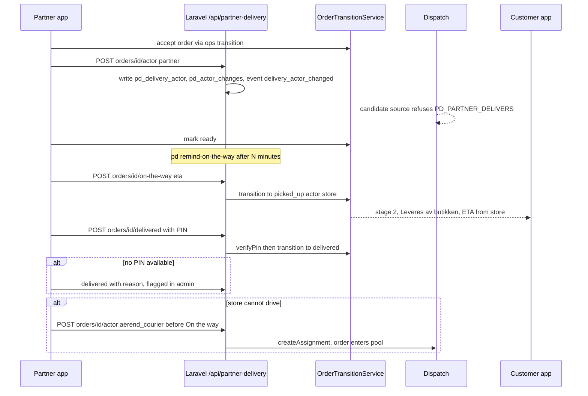

**Where in code**

| Layer | File | Key symbols |
|---|---|---|
| Backend routes | [`routes/api_partner_delivery.php`](../../../../Hare-AdminPanel/routes/api_partner_delivery.php) | `pd.settings.show/update`, `pd.orders.actor`, `pd.orders.on-the-way`, `pd.orders.delivered`, `pd.orders.delivery-view` |
| Backend | `app/Http/Controllers/PartnerDelivery/PartnerDeliveryController.php` | `showSettings`, `updateSettings`, `actor`, `onTheWay`, `delivered`, `deliveryView` |
| Backend | `app/Services/PartnerDelivery/*` | `SettingsService`, `ActorService`, `StoreDeliveryService`, `PdEligibility`, `PdAwareCandidateSource`, `PdPolicyKeys`, `PdPayoutKinds` |
| Backend | `app/Console/Commands/PartnerDelivery/PdRemindOnTheWay.php` | reminder |
| Admin | `resources/views/admin/pages/super_admin/partner_delivery/index.blade.php` | `Admin\PartnerDeliveryAdminController@index/saveStore/savePolicy` |
| Doc | [`docs/PARTNER_DELIVERY_GUIDE.md`](../../../../Hare-AdminPanel/docs/PARTNER_DELIVERY_GUIDE.md) | lifecycle + 422 table |
| App | — | not found |

**API / events / data** — `GET|POST /api/partner-delivery/settings`, `POST /api/partner-delivery/orders/{id}/actor`,
`POST .../on-the-way`, `POST .../delivered`, `GET .../delivery-view`. 422s `PD_MIN_ONE_MODE`,
`PD_NOT_APPROVED`, `PD_NOT_ALLOWED`, `PD_COURIER_ALREADY_ACCEPTED`, `PD_OUTSIDE_RADIUS`,
`PD_ON_THE_WAY_ALREADY`, `PD_WRONG_STATE`, `PD_REASON_REQUIRED`, `PD_WRONG_PIN`, `PD_DISABLED`,
`PD_PARTNER_DELIVERS`. Event `order.delivery_actor_changed`. Header `X-Pd-Driver-Pin` when
`pd.driver_pin_enabled`. Policies `pd.require_aerend_approval` (on), `pd.default_store_eta_minutes` (20),
`pd.reminder_after_ready_minutes`, flag `pd.self_delivery`, `pd.customer.tracking_variant`.
Note: the design appendix names the 422s `DELIVERY_MODE_REQUIRED`, `COURIER_ALREADY_ACCEPTED`,
`DELIVERY_REASON_REQUIRED`; the code uses the `PD_*` names from `AGIL-CONTRACT.md` §3.3.

**Use-case examples**
- A per_order pizzeria accepts Æ-46P, picks «Vi leverer selv», its own driver taps «På vei» with ETA 20
  min, enters the customer's PIN at the door → delivered; Oppgjør shows «Leveringsinntekt · Du beholder
  29 kr». Today: only reachable with curl.
- The store's driver is sick: before «På vei» the cashier switches to Ærend-bud → offer goes to the pool;
  after a courier accepts, switching back returns `PD_COURIER_ALREADY_ACCEPTED`.

**Status** — 🟡 backend ✅ / admin ✅ · Partner app ❌ (not started) · v2 butikkmodus ❌ (out of scope).

---

## 16. Money — Innsikt, Oppgjør, wallet, payouts

**What it is / why** — Partners must see what they sold and what they are paid, framed as what they keep,
with daily/monthly statements and accounting export; owners only.

**Spec & design** — Order Ops §18.8 (Økonomi), Partner&Bud §11 (payout), `aerend-ai-agents-spec.docx` §6.5
("Hare-Store — Oppgjør: the partner's own lines with status Foreslått / Godkjent / Utbetalt … No approve
action"), self-delivery §4.4, support-refunds §2 (partner-borne adjustments as lines; «Bestrid» window).
Design "Leveringsinntekt", "Utbetalingsløsning", P3 card in Innsikt, register design "Oppgjør — ingen
egen skjerm (N)", "Regnskapseksport (Fiken, Tripletex, PowerOffice) (N)", "Kort / innskudd — Flagget",
"Overføring til bruker — Flagget".

**How it works today**

1. Legacy app (live): Wallet balance, add balance (card / WebView payment), transactions, wallet-to-user
   transfer, saved cards, bank details (`store/get-bank-details`, `update-bank-details`). The register design
   flags cards and transfers for removal.
2. Backend ops: `PartnerBusinessController::insights` (`InsightsService::rows`, `eightWeekSeries`,
   `weeklyMessage`), `settlement` (7 days default, `paid_yesterday`), `settlementDay`, `settlementMonth`,
   `settlementExport` (CSV `oppgjor-{store}-{month}.csv`).
3. Money gating: `maySeeMoney` asks `SecurityService::maySeeMoney(storeId, X-Ops-Actor-Id)`, then lets
   `X-Ops-View-As` only downgrade. **`X-Ops-Actor-Id` is a client-supplied header**, so the gate is only as
   strong as the client. Also `SecurityService::MONEY_ROLES = ['owner']` while
   `PartnerBusinessController::MONEY_ROLES = ['owner', 'admin']` (the second list governs `View-As` only).
4. Agent C: `GET /api/agentops/settlements/partner/{storeId}` returns the partner's lines with
   `settlement_status_proposed|_approved|_paid`; delivery income lines for partner-delivered orders.
5. Payout execution: `ops:payout-batch` is bound to `UnavailablePayoutTransport` until a Vipps Utbetaling
   agreement exists.
6. App ops: `InnsiktScreen`, `OppgjorScreen` + `OppgjorDaySheet` with `roleLocked` states — widgets only.

**Where in code**

| Layer | File | Key symbols |
|---|---|---|
| App (legacy) | [`lib/screen/wallet/*`](../../../../Hare-Store/lib/screen/wallet/), [`walletTransfer/*`](../../../../Hare-Store/lib/screen/walletTransfer/), [`manageCard/*`](../../../../Hare-Store/lib/screen/manageCard/), [`bankDetailScreen/*`](../../../../Hare-Store/lib/screen/bankDetailScreen/) | wallet, cards, bank |
| App (ops) | [`lib/screens/ops/business/*`](../../../../Hare-Store/lib/screens/ops/business/), [`lib/data/ops/ops_business.dart`](../../../../Hare-Store/lib/data/ops/ops_business.dart) | `InnsiktScreen`, `OppgjorScreen`, `InsightWeek` |
| Backend | `app/Http/Controllers/Ops/PartnerBusinessController.php` | `insights`, `settlement`, `settlementDay`, `settlementMonth`, `settlementExport`, `maySeeMoney` |
| Backend | `app/Services/Ops/SettlementService.php`, `InsightsService.php`, `MoneyEngine.php` | `day`, `recentDays`, `month`, `toCsv` |
| Backend | `app/Http/Controllers/AgentOps/SettlementReadController.php` | `partner` |
| Tests | [`test/ops/business_test.dart`](../../../../Hare-Store/test/ops/business_test.dart) | drift role sees Oppgjør locked |

**API / events / data** — `GET /api/ops/partner/insights?store_id=`, `GET /api/ops/partner/settlement`,
`/settlement/day/{day}`, `/settlement/month/{month}`, `/settlement/export/{month}`;
`GET /api/agentops/settlements/partner/{storeId}`. Policies `money.store_commission_bps` 1400 (PENDING),
`money.store_payment_fee_bps` 155 (PENDING), `money.store_own_link_commission_bps` 800. Tables
`ops_store_staff`, `agtp_settlement_batches`, `agtp_settlement_lines`, `ops_payout_lines`.

**Use-case examples**
- Owner opens Oppgjør (once wired): yesterday's paid figure first; month CSV for the accountant.
- A shift worker on a drift role opens Innsikt: 403 `role_not_permitted` "Denne siden er bare for eier".

**Status** — 🟡 backend ✅ · app 🧪 · legacy wallet ✅ (slated for removal) · payouts ⛔ (Vipps Utbetaling)
· partner disputes ❌.

---

## 17. Staff, devices, settings, photos and onboarding (Tilgang, Enheter, Innstillinger, Bilder, Kom i gang)

**What it is / why** — The Butikk half of the redesign: who can see what (roles), which devices run which
role, store-level preferences, photo quality, and a 7-step onboarding that replaces sign-up forms.

**Spec & design** — Order Ops §19 (least privilege), §8 (device roles); design "Butikk hub", "Kom i gang",
"Onboarding", "Developer appendix · onboarding", sheets «Partneravtale», «Hvem skal signere?» (BankID
e-sign), «Stripe · koble utbetaling» (design) vs "Vipps connect" (plan), «Litt igjen før du kan åpne»,
«Forhåndsvisning»; P4 (onboarding chat). `leveranser` §1 screen 3.2 Onboarding.

**How it works today**

1. Backend: `SecurityController::staffRole` / `setStaffRole` over `ops_store_staff`
   (roles `owner`, `drift`, `drift_menu`); `GET /api/ops/security/retention`.
2. App: `TilgangScreen` (roles, invite, "vis appen som"), `EnheterScreen` (devices, pairing code, mute,
   test sound), `InnstillingerScreen` (nb/nn/en, sound, push, support, re-run onboarding, "Ærend kan
   skrive om butikken min"), `BilderScreen` (requirements, missing list with impact line, photographer
   booking), `PartnerOnboarding` (7 steps with saved position: identity → agreement → payout → menu →
   photos → hours → devices) — all widgets fed by props/mocks; BankID, e-sign and payout connect are mocks.
3. Legacy live: Profile, Change password, Language & currency, Settings (ETA, radius, min order,
   packaging, tax, store timing, open, auto-accept), Pending screen for unapproved stores.

**Where in code**

| Layer | File | Key symbols |
|---|---|---|
| App (ops) | [`lib/screens/ops/butikk/*`](../../../../Hare-Store/lib/screens/ops/butikk/) | `TilgangScreen`, `StoreStaff`, `EnheterScreen`, `InnstillingerScreen`, `PartnerSettings`, `BilderScreen` |
| App (ops) | [`lib/screens/ops/onboarding/*`](../../../../Hare-Store/lib/screens/ops/onboarding/) | `PartnerOnboarding`, `PartnerOnboardingState`, `OnboardingFlow` |
| App (legacy) | [`lib/screen/settingScreen/*`](../../../../Hare-Store/lib/screen/settingScreen/), [`myProfileScreen/*`](../../../../Hare-Store/lib/screen/myProfileScreen/) | settings, profile |
| Backend | `app/Http/Controllers/Ops/SecurityController.php`, `app/Services/Ops/SecurityService.php` | `staffRole`, `setStaffRole`, `roleFor`, `maySeeMoney`, `ROLE_*` |
| Tests | [`test/ops/butikk_test.dart`](../../../../Hare-Store/test/ops/butikk_test.dart), [`onboarding_test.dart`](../../../../Hare-Store/test/ops/onboarding_test.dart) | |

**API / events / data** — `GET|POST /api/ops/security/staff-role`, `GET /api/ops/security/retention`;
legacy `POST /api/store/get-and-update-settings`, `/edit-profile`, `/change-password`,
`/update-country-and-currency`.

**Use-case examples** — The owner invites a kitchen worker as `drift`; on the kitchen tablet Oppgjør is
locked. Today the invite has no backend endpoint in the app (setStaffRole exists; invitation flow not
verified).

**Status** — 🟡 backend roles ✅ · app 🧪 · BankID/e-sign/payout connect ⛔/❌ · legacy settings ✅.

---

## 18. Voice, Ægil and partner agents P1–P5

**What it is / why** — Ægil as operator: "Æ-42 klar", "ikke mer laks" by voice with confirm + undo; and
five partner agents that draft (never apply) menu copy, photo enhancements, campaigns, onboarding settings
and hours exceptions. Agent depth (platform, autonomy, guardrails) is in **[report 01](01-AGENTIC-WORKFLOW-REPORT.md)**; this section lists
the Partner surfaces.

**Spec & design** — Order Ops §17.7 Partner P1–P5 and §22 "Additions in v3.0"; design
`Ærend Partner - agentfunksjoner P1-P5.dc.html`:

| Agent | Spec (§17.7) | Design screens | Code |
|---|---|---|---|
| P1 `agent.menu_copy` (L0) | description ≤ 240 chars, allergens as unchecked chips, category proposal; "Bruk / Skriv om / Forkast" | P1.1–P1.7 (tomt felt, utkast, allergener foreslått, kategori-chip, uten bilde, «Beskrivelser å se over (14)», fallback) | Registered `menu_copy` (L1, disabled) in `AgentRegisterSeeder`; no service, no table `menu_copy_drafts`, no UI |
| P2 `agent.photo_enhance` (L2) | crop/exposure/wb/bg_clean/resize, perceptual-diff guard, "Original / Forbedret" | P2.1–P2.5 | Registered `photo_enhance` (L1) and `photo_qa` (L0); nothing else |
| P3 `agent.campaign_planner` (L0) | ≤ 1 campaign/week, deterministic forecast, post draft, "Publiser" is a human tap | P3.1–P3.6 (card in Innsikt, Ukens melding, endre, publisert, resultat) | Registered `campaign_planner` (L1); `InnsiktScreen.weeklyMessage` slot only |
| P4 `agent.onboarding` chat (L0) | five questions → settings draft → one summary confirmation | P4.1–P4.8 | Not registered as a partner agent (the `onboarding` row is the customer agent); `PartnerOnboarding` has a manual hours step only |
| P5 `agent.hours_exceptions` (L0) | free text → structured exceptions, sentence from structure | P5.1–P5.7 | Registered `hours_exceptions` (L1); `ApningstiderScreen` manual only; `StoreHoursService::coherenceProblems` exists |

Voice: `VoiceEntrySheet` + `HoldToSpeak` + `VoiceInterpreter` — a **local pattern matcher** for four
phrases with confirm-then-undo and a first-use disclosure. `transcribe` is an injected callback; there is no
speech-to-text package in `pubspec.yaml`, so there is nothing to transcribe with. The shell's mic is
`onPressed: null`. Ægil chat in Butikk: not built (plan Phase 11 says "belongs with the blocked items").

**Where in code** — [`lib/screens/ops/voice/*`](../../../../Hare-Store/lib/screens/ops/voice/)
(`VoiceEntrySheet`, `HoldToSpeak`), [`test/ops/voice_test.dart`](../../../../Hare-Store/test/ops/voice_test.dart);
`Hare-AdminPanel/database/seeders/AgentRegisterSeeder.php` (`register()` partner block).

**Use-case examples** — Kitchen worker holds the mic and says "Æ-42 klar": the sheet shows "Merk Æ-42 klar?"
→ confirm → toast with Angre (in tests). In the running app: unreachable.

**Status** — P1–P5 ❌ (registry rows only; autonomy levels in the registry differ from the spec: P1 L1 vs
spec L0, P2 L1 vs spec L2) · voice 🧪 · Ægil chat ❌.

---

## 19. Support, chat and refunds (Support, Hjelp)

**What it is / why** — Partners need help during service (urgent lane), answers about settlements, and a
fair way to dispute cost adjustments when an order goes wrong.

**Spec & design** — `aerend-support-system-spec.docx` §6 (Hare-Store entry points: Order → «Hjelp»,
Oppgjør → «Spørsmål om oppgjør», Products/Feed → «Hjelp», Settings → «Support», urgent phone; settlement /
adjustment cards, dispute links, human name on takeover), §5.3 (partner urgent lane: outage during service,
payment failure → phone + Haster queue). `aerend-support-refunds-feed-spec.docx` §2 (partner-triggered
case types `partner_shortfall · partner_reject · delay · no_pin`; partner notified of a proposed
partner-cost adjustment with evidence and «Bestrid» within ~48 h; adjustments as Oppgjør lines). Design
"Support-chat".

**How it works today**

1. Legacy live: `SupportScreen` (`store/support-pages` HTML pages), "Chat with admin" and "Live chat" via
   Firebase RTDB (`ChattingScreen`, `ChatHistoryScreen`), FCM relay `store/chat-fcm-relay`.
2. Backend: no `conversation`/`support_case`/ledger tables found (migrations grep: only Snurre
   conversations). Agent F / G not implemented.
3. No store-side case notifications, no dispute flow.

**Where in code** — [`lib/screen/supportScreen/*`](../../../../Hare-Store/lib/screen/supportScreen/),
[`lib/screen/liveChatScreen/*`](../../../../Hare-Store/lib/screen/liveChatScreen/),
`app/Http/Controllers/Api/ChatFcmPushController.php` (`postStoreChatFcmRelay`).

**Use-case examples** — The card terminal is down mid-rush: the spec wants an urgent phone lane from the
app; today the owner opens "Chat with admin" and waits.

**Status** — legacy chat/support pages ✅ · AI support, cases, refunds, disputes ❌ (spec not started on
any side).

---

## 20. Partner prizes (Tilby en premie)

**What it is / why** — Partners propose prizes for Premiehylla (the customer prize shelf) in kroner value;
Ærend sets the point price on approval; claims redeem as a 0-kr order line.

**Spec & design** — `AEREND POINTS SPEC v2 .md` §Partner: Tilby en premie; `AGIL-2-PLAN.md` Phase 5
(`[x]` Hare-Store `lib/screens/points/tilby_premie_*`).

**How it works today** — `TilbyPremieRepo` posts/gets `points/partner/proposals` with `store_id` +
`access_token`; backend routes `points.partner.proposals` / `.store` →
`Points\PartnerPrizeController@index/store`. The screen is not reachable from the app (no constructor
reference outside its own file). Merged into agil-1 by `6ce38b3`.

**Where in code** — [`lib/screens/points/*`](../../../../Hare-Store/lib/screens/points/),
[`test/points/tilby_premie_bloc_test.dart`](../../../../Hare-Store/test/points/tilby_premie_bloc_test.dart),
`Hare-AdminPanel/routes/api_points.php` (lines with `/partner/proposals`).

**Use-case examples** — A bakery proposes "Kaffe og bolle for to", value 120 kr, 20 units; Ærend approves at
N points; a customer's claim adds a 0-kr line with `prize_claim_id`.

**Status** — 🟡 backend ✅ · screen built but unreachable (🧪). Points detail: report on points/Ægil.

---

## 21. Geo placement and footprint (Hentested, Område)

**What it is / why** — Stores are placed automatically: org.nr → Brønnøysund → partner confirms the pickup
pin → cell → zone → footprint (cells the store delivers to). No manual zone drawing, no store↔courier links.

**Spec & design** — `aerend-geo-coverage-spec.docx` §3 (automated placement, «Er dette riktig hentested?»,
`waiting_zone` «Vi jobber med å åpne [område]»), §2 (footprint, self-delivery radius honoured), partner
notifications («Butikken din er klar i Bergenhus»). Design "Hentested", "Hentested innstilling".

**How it works today**

1. Backend: `PlacementService` (Brreg + Kartverket adapters, confidence < 0.7 → Agent E proposal),
   `FootprintService` (clipped to `pd_self_delivery_radius_km` for `self_only`), routes
   `POST /api/geo/stores/{id}/place` (`geo.stores.place`), `POST /api/geo/stores/{id}/confirm-pin`
   (`geo.stores.confirm-pin`); admin Områder `/admin/omrader`; cut-over behind `geo.engine` /
   `geo.engine.cutover` flags (`docs/GEO_GUIDE.md`).
2. Legacy: the store's `service_radius` in settings and legacy geofence polygons still drive coverage
   until cut-over; legacy "assign driver" (store→courier link) exists in `HomeRepo.assignDriver` but has no
   UI caller.
3. App: no pin confirmation, no placement state, no zone message.

**Where in code** — `Hare-AdminPanel/routes/api_geo.php`, [`docs/GEO_GUIDE.md`](../../../../Hare-AdminPanel/docs/GEO_GUIDE.md),
`app/Services/Geo/*`; app — not found.

**Use-case examples** — A new café in Fana is geocoded to its accountant's office; the spec asks the
partner to drag the pin to the outlet. Today an admin would correct it via the API/admin.

**Status** — 🟡 backend ✅ (shadow/cut-over flags) · Partner UI ❌ (deferred by `GEO_GUIDE.md`).

---

## 22. Offline outbox, realtime and push

**What it is / why** — A café's wifi drops constantly. Every mutating action should queue locally with an
idempotency key, show as pending, replay FIFO with backoff, and surface server-wins conflicts. State
should arrive by websocket with polling fallback; new orders must ring.

**Spec & design** — Order Ops §5 (fan-out `private-store.{id}`, polling `GET /stores/{id}/live` every 10 s),
§14 (outbox fields, backoff 2 s → 60 s, terminal 422 surfaced), §15 (NEW_ORDER / ORDER_UNSEEN push + sound,
audio focus, override ringer).

**How it works today**

1. `OfflineOutbox` (in-memory list + optional `persist` callback, ordered `flush`, conflict list,
   `hasPendingFor(orderId)`) — class + 8 test cases; **no persistence implementation is supplied and no
   caller exists**.
2. Realtime: backend broadcasts `OrderEventBroadcast` to `store.{storeId}` / `courier.{id}` /
   `customer.{id}` / `panel` (`routes/channels.php`); `.env.example` has `BROADCAST_DRIVER=log` and empty
   Pusher/Soketi settings. The app has no Pusher/Soketi client in `pubspec.yaml`.
3. Polling: `OpsApi.eventsSince` (unused); the legacy app polls `store/home` every 20 s.
4. Push: `PushNotificationService` (FCM + `flutter_local_notifications`, channel `high_importance_channel`)
   plays `assets/audio/sring.mp3` on every foreground message and navigates to `HomeScreen`; on tap opens
   `OrderDetailScreen(playRing: true)` for `order_id`, `WalletTransaction` for `notification_type == 6`,
   chat for `user_id`, and handles `feed_new_comment` / `feed_new_follower`. No `ORDER_UNSEEN` category,
   no audio-focus / ringer override.
5. Device push token is sent at login (`device_token`); the ops heartbeat's `push_token` field is unused.

**Where in code** — [`lib/services/ops/offline_outbox.dart`](../../../../Hare-Store/lib/services/ops/offline_outbox.dart)
(`OfflineOutbox.enqueue/flush`, `OutboxAction`, `OutboxResult`),
[`lib/service/push_notification_service.dart`](../../../../Hare-Store/lib/service/push_notification_service.dart)
(`init`, `setListener`, `handleNotificationClick`, `refreshStream`),
`Hare-AdminPanel/routes/channels.php`, `app/Events/Ops/OrderEventBroadcast.php` (`ShouldBroadcast`,
fired from `OrderTransitionService::transition`).

**Status** — outbox 🧪 · realtime ❌ in app (backend broadcast ✅, driver not configured by default) · legacy
FCM ring ✅.

---

## 23. How the other apps/services interact with the store app

### 23.1 Integration matrix

| Counterpart | Direction | Today (live) | Intended (spec) | Status |
|---|---|---|---|---|
| Customer app → store | order placed | Legacy checkout creates `user_store_product_booking` → FCM to store → `store/home` poll | Same row + `ops_state=placed`, `order.placed`, Soketi to `private-store` | 🟡 order arrives; ops event written but store does not read it |
| Store → customer | accept / reject / ready | Legacy `status` 2/3/5/8; customer legacy screens | `ops_state` transitions drive tracking stages 0–3 | 🟡 ops tracking does not move from store actions |
| Store → customer | open/closed | `current_status` + `store_timings` → `store_status` → Hjem/Butikk Åpen/Stengt | `ops_availability_state` + hours; paused blocks checkout | 🟡 legacy only |
| Store products → customer menu | read | `store_product_details` → `categoryWiseProductList` → `BergenMenuCategory` | same, plus change log + `product.price_changed` to feed | ✅ data path; ops editor 🧪 |
| Store posts → feed → customer Utforsk / Ægil | publish | `v1/store/posts` caption+media → feed tabs | product-linked post, screening, attribution `source_post_id` | 🟡 |
| Feed → Laravel | store data | `store-sync` pulls `internal/feed-stores` | same + `store.updated`/`store.status_changed` webhooks | 🟡 pull ✅, status not included |
| Courier app ↔ store | pickup | Legacy driver completes order | QR scan / typed code / store confirm via `/api/ops/pickup/*` | ❌ on store side (see [report 02](02-CUSTOMER-APP-REPORT.md) for Bud) |
| Courier problems → store | exceptions | none | Trenger deg card | 🟡 backend only |
| Self-delivery | store drives | none | `/api/partner-delivery/*` | 🟡 backend only |
| Admin → store | moderation, overrides, egenlevering | admin Drift / Egenlevering / Agentsenter screens write tables | same + push to store | 🟡 admin ✅, store does not read |

### 23.2 Order lifecycle from the store's perspective (intended, with who triggers what)

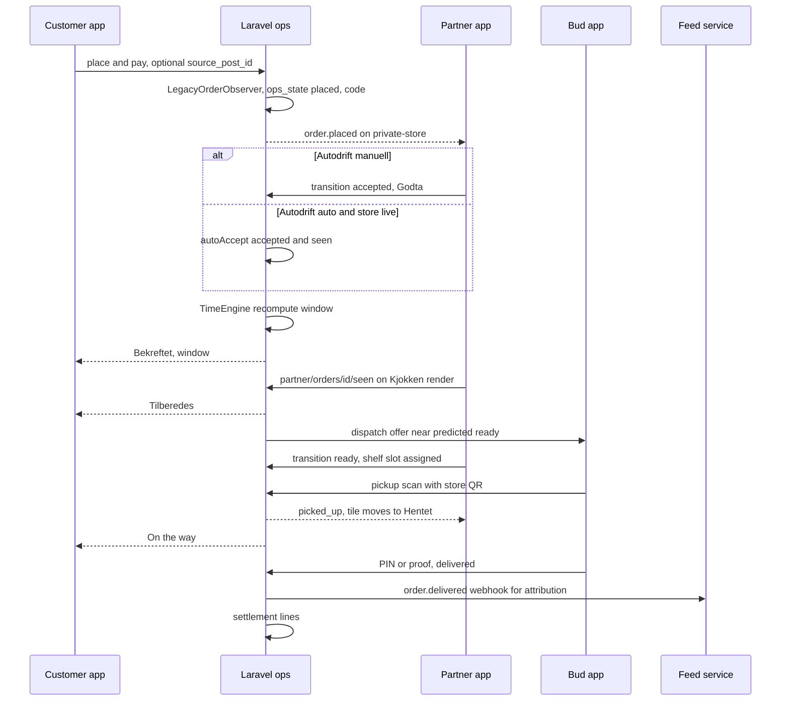

Today, the arrows from `S` are legacy `store/update-order-status` calls instead, and `L-->>S` is FCM +
polling of `store/home`.

### 23.3 Two status machines, not bridged

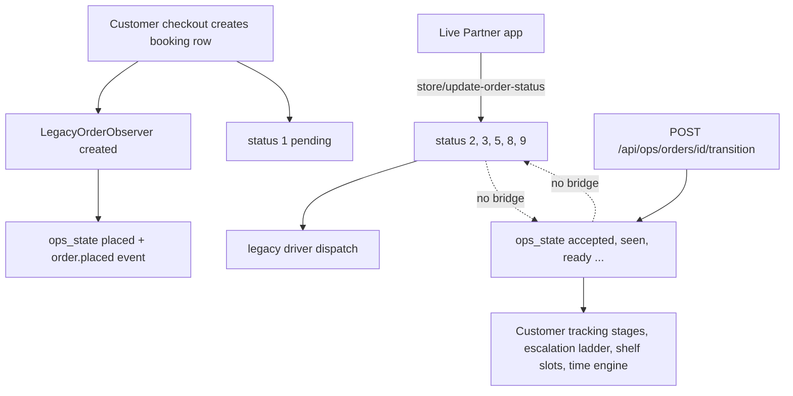

Evidence: `LegacyOrderObserver` implements only `created`; `OrderTransitionService::transition` updates only
`ops_state` (+ `ops_seen_at`); `StoreController::postStoreUpdateOrderStatus` does not reference `ops_state`
or `OrderTransitionService` (grep). `SurfaceFlags` rollback text for `ops.order_machine` says
"Transitions fall back to the legacy status column", implying the legacy column is the fallback — but no
dual-write exists in either direction.

**Practical effect:** `EscalationLadder` (keys on `ops_state = accepted`), `TimeEngine` (on accepted/ready),
shelf slots (on ready), `pd:remind-on-the-way` (on ready + partner), customer `stage` derivation and the
panel's Nå board do not see what stores do in the live app.

### 23.4 Self-delivery path (store ↔ customer, no courier)

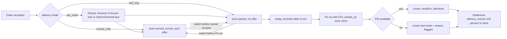

---

## 24. GAP analysis

The store app is **not developed to the new specs**. Only the legacy app and the feed composer ship; the
new Partner exists as tested widgets without data or routes; most new-spec requirements are built only in
the backend.

| # | Feature / requirement | Spec / plan ref | Status | Evidence (file or "not found") | What's missing / next step | Owner app(s) |
|---|---|---|---|---|---|---|
| P1 | Authenticated Partner API (bearer + `X-Device-Id`) | Order Ops §21, P&B §18 | ❌ | `routes/api_ops.php` has no auth middleware; controllers read `store_id` from request; `PartnerBusinessController::maySeeMoney` uses header `X-Ops-Actor-Id`; `api_partner_delivery.php` "store-scoped by `store_id`" | Add store-token / device auth middleware to `/api/ops/partner/*`, transition, products, hours, pickup mint, store pause, `/api/partner-delivery/*`, `/api/agentops/imports`; derive store and actor server-side | Laravel |
| P2 | Store live snapshot `GET /stores/{id}/live` | P&B §5/§18, Order Ops §5/§21 | ❌ | not found; `OpsApi` has no list call; `AGIL-1-REMAINING.md` §3 | Build snapshot endpoint (orders in `OpsOrder.fromJson` shape + availability + devices + autodrift) | Laravel |
| P3 | Mount the Partner shell (containers + navigation) | AGIL-1 Phases 2–11 | 🧪 | `OpsShellScreen` referenced only in own file + test | Container blocs mapping snapshot/events → props, callbacks → `OpsApi`/outbox; replace or sit beside `HomeScreen` | Partner |
| P4 | Bridge legacy status ↔ `ops_state` | Order Ops §1 server-authoritative | ❌ | `LegacyOrderObserver::created` only; `postStoreUpdateOrderStatus` no ops write | Either route legacy store actions through `OrderTransitionService` (map 2→accepted, 5→seen, 6→ready, 8→picked_up for takeaway) or cut the app over to ops transitions | Laravel, Partner |
| P5 | Accept / reject through state machine with reason + refund copy | Order Ops §4.1, design reject sheet | 🟡 | backend `OrderStateController::transition`; app uses legacy reject dialog | Wire `onPrimaryAction/onReject`; reject reason enum (utviklervedlegg gap) | Partner, Laravel |
| P6 | Kasse board four sections | design Ordretavle; AGIL-1 Ph2 | 🧪 | `kasse_board.dart` | Data + route (P2, P3) | Partner |
| P7 | Kjøkken view with allergen acknowledgement | Order Ops §8; design Kjøkken | 🧪 | `kjokken_view.dart` | Same | Partner |
| P8 | Device registration, roles, heartbeat 20 s, liveness kasse/kjokken 60 s | Order Ops §7.1, §8 | 🟡 | `DeviceState` 30/90 s; `storeIsLive` kasse only; `OpsHeartbeatService` never started | Start heartbeat after login per role; align thresholds or update spec; count Kjøkken | Partner, Laravel |
| P9 | Seen-signal on ≥ 1 s render | Order Ops §7.2 | 🟡 | `PartnerDeviceController::markSeen` ✅; `OpsApi.markSeen` unused | Emit from Kasse/Kjøkken cards | Partner |
| P10 | Escalation ladder with push, sound override, owner SMS/call | Order Ops §7.3, §15 | 🟡 | `EscalationLadder::run` writes events only for steps 1–2; never triggers while P4 open | Deliver step 1 push to `store_devices.push_token`, step 2 SMS / `agent.comms`; fix P4 | Laravel |
| P11 | Store auto-accept on Autodrift `auto` | Order Ops §7.1 | 🟡 | `EscalationLadder::autoAccept` has no caller | Call from intake/sweep when level = auto and store live | Laravel |
| P12 | Wake lock, audio focus, muted / battery < 15 % / offline banners | Order Ops §8, §15 | ❌ | no wakelock/battery plugin in `pubspec.yaml`; banners are props | Add plugins; feed banner props from heartbeat + connectivity | Partner |
| P13 | Æ-code on store surfaces ("same words everywhere") | Order Ops §3, P&B §1.8 | 🟡 | `OrderCode`, `ops_code` assigned at intake; legacy store app shows order ids; alphabet includes Q, Z (spec excludes) | Expose `ops_code` in store payloads; reconcile alphabet with spec | Laravel, Partner |
| P14 | Kundeblikk line on each card | design; register "N" | 🧪 | `OpsOrder.kundeblikkArbKey` | Needs P2/P3 | Partner |
| P15 | +5/+10/+15 with consequence + undo | Order Ops §6.4; design Justeringer | 🟡 | `TimingController::addTime/undoAdjustment` ✅; card UI 🧪 | Wire | Partner |
| P16 | `extend_all` / busy mode | Order Ops §6.4 | ❌ | no route | Add store-level adjustment with expiry | Laravel, Partner |
| P17 | Autodrift panel (level, capacity, learned times) | Order Ops §6, §7.1 | 🟡 | `TimingController::autodrift/setAutodrift` ✅; `AutodriftPanel` 🧪 | Wire; EWMA α 0.3 vs spec 0.2 decision | Partner |
| P18 | Henting rotating QR (60 s) | Order Ops §10.1 | 🟡 | `PickupHandoffService::mintForOrder` ✅; `_qrPlaceholder`, no QR package | Add QR renderer, call `pickup/orders/{id}/token`, refresh on ring | Partner |
| P19 | Offline token batch for Henting | Order Ops §10.2 | ❌ | no batch route (param `offlineBatch` only) | Add `POST` batch endpoint + device cache | Laravel, Partner |
| P20 | Samle-QR | Order Ops §10.3 | 🟡 | `mintForAssignment` ✅; app placeholder | Wire | Partner |
| P21 | Store-confirm handoff fallback | Order Ops §10.5 | 🟡 | `PickupHandoffService::storeConfirm` ✅; slide UI 🧪 | Wire | Partner |
| P22 | Hylleplass | Order Ops §10.7 | 🟡 | `assignShelfSlot` on ready ✅; shown in widget only | Needs P4 + P3 | Partner, Laravel |
| P23 | Customer self-pickup with QR / code | Order Ops §10.8 | 🟡 | `selfPickup` route ✅ (caller C); legacy takeaway "complete" without code | Store-side scan / key-in (`pickups/customer_scan`) | Partner, Laravel |
| P24 | Trenger deg list | Order Ops §13; design | 🟡 | `ProblemService::needsYou` ✅; `NeedsYouList` 🧪 | Wire + push on new item | Partner |
| P25 | Manual pause 15/30/60 with explanation card on resume | Order Ops §4.3 | 🟡 | `ProblemController::pause/resume` ✅; app has only legacy online toggle | Wire Travelmodus sheet; auto-resume at `ops_paused_until` (not found) | Partner, Laravel |
| P26 | Paused store blocks new orders, customer sees «Åpner igjen snart» | Order Ops §4.3 | ❌ | checkout does not read `ops_availability_state` (grep) | Guard checkout + customer store status | Laravel, Customer |
| P27 | One opening-hours truth (grid + exceptions + sentence) | Order Ops §17.7 P5; Phase 11 | 🟡 | `ops_store_hours` vs legacy `store_timings` (customer reads legacy) | Migrate customer status to `StoreHoursService::statusAt` or sync tables | Laravel, Customer, Partner |
| P28 | Offline outbox for all mutations | Order Ops §14 | 🧪 | `OfflineOutbox` no persistence, no caller | Persist (SharedPreferences/sqlite), wire into containers | Partner |
| P29 | Realtime `private-store.{id}` | Order Ops §5 | 🟡 | `OrderEventBroadcast` + `channels.php` ✅; `BROADCAST_DRIVER=log`; no client | Soketi + client, or polling `eventsSince` | Partner, infra |
| P30 | Product create / archive | feed spec §2.1 | ❌ | not in app or ops routes (plan notes "not built") | Endpoint + composer (Cloudinary path) | Laravel, Partner |
| P31 | Product edit + price edit with change log | feed spec §2.2, §4.3 | 🟡 | `ProductController::update` + `ProductChangeLogger` ✅; `VarerScreen` 🧪; legacy toggles not logged | Wire Varer; log legacy toggles too | Partner, Laravel |
| P32 | Sold out until a time | Order Ops §21 `sold_out {until}` | 🟡 | `soldOut` stores time only in log reason | Persist `available_again_at` + sweep to restore | Laravel |
| P33 | Option-group editor (size/extras) | utviklervedlegg §6 | ❌ | not found | Design + endpoint | Partner, Laravel |
| P34 | AI-assisted import review in app | agents spec §4.5 | 🟡 | `/api/agentops/imports*` ✅; app not found | Partner screen «AI-assistert import» | Partner |
| P35 | Forundringspose management + reservations | feed spec §2.3 (Surprise Bags spec) | 🧪 | `ForundringsposeScreen`; no backend table | Backend model + endpoints; wire | Laravel, Partner |
| P36 | Product-linked store posts | feed spec §2.4 | ❌ | feed `createStorePostBodySchema` has no `store_product_id`; live composer caption+media | Add field to feed store API; mount `FeedComposerFlow` | Feed, Partner |
| P37 | Price-marketing compliance (no "før-pris") | feed spec §2.4 | 🧪 | `FeedCompliance` in unwired flow | Wire; mirror check server-side | Partner, Feed |
| P38 | Own posts list with «Skjult av Ærend» + reason | feed spec §2.4 | 🟡 | feed stores `hidden_reason`; live `StoreFeedPost` has no status | Return status to store; show it | Feed, Partner |
| P39 | Agent G pre-publication screening, «Til gjennomgang / Avvist» | support-refunds-feed §4 | ❌ | posts default `status = live`; no screening | Pipeline in feed + statuses in app | Feed, Partner, Admin |
| P40 | Agent feed drafts published with one tap | Order Ops §16.6 | ❌ | not found | `GET /feed/drafts`, publish | Feed, Partner |
| P41 | Self-delivery settings (modes, radius) | PD spec §2 | 🟡 | `/api/partner-delivery/settings` ✅; app not found | Settings + onboarding step «Levering» | Partner |
| P42 | Per-order actor choice and switching | PD spec §4.1–4.2 | 🟡 | `ActorService` ✅; app not found | Sheet «Hvem leverer …?» | Partner |
| P43 | Leveringsvisning (På vei with ETA, Levert with PIN / reason) | PD spec §4.3 | 🟡 | `StoreDeliveryService` ✅; app not found | Phone view + driver PIN header | Partner |
| P44 | Delivery income in Oppgjør | PD spec §4.4 | 🟡 | `PaymentSortingAgent` delivery_income ✅; `PayoutLine::KIND_DELIVERY_INCOME` still an ask (AGIL-3-PLAN asks of agil-1) | Settlement + UI line | Laravel, Partner |
| P45 | Innsikt | design; Order Ops §18 | 🟡 | `PartnerBusinessController::insights` ✅; `InnsiktScreen` 🧪 | Wire | Partner |
| P46 | Oppgjør day/month/export | design; register "N" | 🟡 | `settlement*` ✅; `OppgjorScreen` 🧪 | Wire | Partner |
| P47 | Settlement statuses Foreslått / Godkjent / Utbetalt | agents spec §6.5 | 🟡 | `SettlementReadController::partner` ✅ | Show in Oppgjør | Partner |
| P48 | Payout execution | Order Ops §12, P&B §11.4 | ⛔ | `UnavailablePayoutTransport` | Vipps Utbetaling agreement | Business |
| P49 | Partner adjustment notice + «Bestrid» | support-refunds §2 | ❌ | no tables | Case/ledger model, notify, dispute | Laravel, Partner |
| P50 | In-app AI support with entry points + urgent lane | support spec §5.3, §6 | ❌ | legacy chat only | Conversation model, Agent F, entries | Laravel, Partner, Admin |
| P51 | Staff roles with least-privilege money gate | Order Ops §19 | 🟡 | `ops_store_staff`, `maySeeMoney` ✅ but header-based actor; role list mismatch | Server-side actor identity (P1); unify `MONEY_ROLES` | Laravel |
| P52 | Tilgang / Enheter / Innstillinger / Bilder screens | design Butikk | 🧪 | `lib/screens/ops/butikk/*` | Wire | Partner |
| P53 | 7-step onboarding (BankID, e-sign, payout, import, photos, hours, devices, Autodrift, test order) | design Kom i gang; AGIL-1 Ph11 | 🧪 / ⛔ | `PartnerOnboarding` mocks | BankID/e-sign/payout providers; placement step (geo) | Partner, Laravel |
| P54 | Geo placement pin confirm, «Venter på område» | geo spec §3 | 🟡 | `/api/geo/stores/{id}/place|confirm-pin` ✅; app not found | Onboarding/Hentested screen | Partner |
| P55 | P1 menu copy agent | Order Ops §17.7 | ❌ | registry row only | Service + drafts table + editor UI | Laravel, Partner |
| P56 | P2 photo enhance | §17.7 | ❌ | registry row only | Same | Laravel, Partner |
| P57 | P3 campaign planner | §17.7 | ❌ | registry row only | Same | Laravel, Partner |
| P58 | P4 onboarding chat | §17.7 | ❌ | not registered as partner agent | Same | Laravel, Partner |
| P59 | P5 hours exceptions | §17.7 | ❌ | registry row only | Same | Laravel, Partner |
| P60 | Voice entry («Æ-42 klar») | §17.7 / AGIL-1 Ph10 | 🧪 | `VoiceEntrySheet`; no STT package; mic `onPressed: null` | Add on-device STT; wire | Partner |
| P61 | Partner prize proposals | Points spec | 🟡 | routes `points.partner.proposals` ✅; screen unreachable | Add to Mer menu | Partner |
| P62 | Surface flags actually gate surfaces | `SurfaceFlags`, OPS_ROLLBACK | 🟡 | flags seeded/flipped by `ops:flags`; ops controllers do not read them (grep) | Enforce in API + expose to app | Laravel, Partner |
| P63 | Store receives NEW_ORDER / ORDER_UNSEEN categories with ringer override | Order Ops §15 | 🟡 | legacy FCM ring on any message; no categories | Typed pushes + audio focus | Laravel, Partner |
| P64 | Release hygiene (README, DEPLOY_IOS, ids, base URL switch) | — | 🟡 | README is Flutter template; `DEPLOY_IOS.md` says `com.hare.store`/`com.example.temp` but code is `com.reen.store`; base URL is a `const` (prod) | Update docs; add dev-env override like the customer app | Partner |
| P65 | Firebase chat auth hard-coded password | — (security) | ❌ | `firebaseAuth()` uses `"123456"` for `d_<email>` | Custom tokens from Laravel | Partner, Laravel |
| P66 | Stories / post editing (spec says not v1) | feed spec Q1/Q2 | ✅ (beyond scope) | `StoreFeedRepo.createStory/updatePost` | Product decision: keep or hide | Partner |

### Top 10 gaps to close next (ranked by impact)

1. **P1 — Authenticate `/api/ops/*` partner routes, `/api/partner-delivery/*` and `/api/agentops/imports`.**
   Today anyone who knows a `store_id` can transition orders, change prices, pause stores, read settlement
   (with a forged header). Must precede wiring any client.
2. **P4 — Bridge or replace the legacy status writes.** Without it the escalation ladder, time engine,
   shelf slots, self-delivery reminders, customer tracking stages and admin Nå board are blind to real store
   actions.
3. **P2 — Store snapshot endpoint** (`/api/ops/partner/live` or similar) in `OpsOrder` shape; the single
   blocker named in `AGIL-1-REMAINING.md` §3.
4. **P3 — Containers + navigation for `OpsShellScreen`** (Drift first: Kasse, Kjøkken, Henting), then
   heartbeat and seen-signal (P8, P9) so liveness becomes true.
5. **P26/P27 — One open/closed truth** for customers (ops pause + ops hours honoured at checkout and on
   Hjem/Butikk), with auto-resume at pause expiry.
6. **P18/P20/P21 — Henting QR handoff end-to-end** with a QR renderer and token refresh (paired with the Bud
   scan in [report 02](02-CUSTOMER-APP-REPORT.md)).
7. **P41–P43 — Self-delivery Partner UI** (settings, per-order sheet, Leveringsvisning). Backend is done; a
   "pure UI" plan as promised in `AGIL-CONTRACT.md`.
8. **P36/P37/P38 — Product-linked feed posts** (feed API field + mount the product-first composer +
   status list), then P39 screening.
9. **P31/P32/P30 — Varer**: wire edit/price/sold-out with the change log, persist return time, add create
   / archive; log legacy toggles meanwhile.
10. **P10/P63/P12 — Make escalation real on the device**: typed pushes to `store_devices`, sound override,
    wake lock and status banners.

---

## 25. Configuration, flags and environment

### Hare-Store (Flutter)

| Setting | Where | Value / note |
|---|---|---|
| Laravel base URL | [`lib/network/endpoints.dart`](../../../../Hare-Store/lib/network/endpoints.dart) `EndPoint.baseUrl` | `const "https://api.ailogistics.no/api/"`; local IP commented out; no runtime override (change the const for local testing) |
| Ops base URL | `OpsApi(baseUrl:)` default | `${EndPoint.baseUrl}ops/` |
| Feed base URL | [`feed_api_constant.dart`](../../../../Hare-Store/lib/networking/feed/feed_api_constant.dart) | prod `https://aerend-feed-88chd.ondigitalocean.app/` + `v1/`; override stored in prefs key `dev_feed_api_override` (`FeedBaseUrl.setOverride`); `localIOS` / `localAndroid` constants; no UI to set it |
| Cloudinary | `FeedCloudinaryConfig.cloudName` | `dybew1yxr` (must match feed sign) |
| Firebase | `lib/firebase_options.dart`, `DEPLOY_IOS.md` | project `hare-89094`; anonymous auth + email/password chat user |
| App ids | `android/app/build.gradle.kts`, `ios/Runner.xcodeproj` | `com.reen.store` (DEPLOY_IOS.md is stale) |
| Localisation | `l10n.yaml`, `lib/l10n/intl_*.arb` | en, no, da, sv, es; ops status keys `ops_status_*_partner/_customer`; `scripts/fix_l10n.dart` + `strings.json` |
| Printer | `sunmi_printer_plus` | Sunmi devices only |

### Hare-AdminPanel (Laravel) — what the store-facing backend needs

| Key / flag | Purpose |
|---|---|
| `OPS_PICKUP_KEY_ID`, `OPS_PICKUP_PRIVATE_KEY_PATH` (or `OPS_PICKUP_PRIVATE_KEY`), `OPS_PICKUP_PUBLIC_KEY`, `OPS_PICKUP_PREVIOUS_PUBLIC_KEYS` | ES256 pickup tokens (`php artisan ops:generate-pickup-keys`) |
| `BROADCAST_DRIVER`, `PUSHER_*` (`PUSHER_HOST` for Soketi) | realtime fan-out; default `log` |
| `OPS_FEED_BASE_URL`, `OPS_FEED_EVENTS_PATH`, `OPS_FEED_WEBHOOK_SECRET`, `OPS_FEED_SERVICE_TOKEN`, `OPS_FEED_TIMEOUT` | feed outbox bridge (`config/ops.php`) |
| `FEED_JWT_PRIVATE_KEY`, `FEED_JWT_PUBLIC_KEY` (+ commented `FEED_JWT_*`) | store feed JWT minted at `/api/auth/feed-token` (`docs/FEED_JWT_KEYS.md`) |
| `FEED_INTERNAL_TOKEN` | service token for `/api/internal/feed-stores` |
| `OPS_RELAY_PROVIDER`, `OPS_RELAY_PROXY_STORE` | masked calls to the store |
| `GEO_GEOCODER`, `GEO_GEOCODER_FALLBACK`, `GEO_KARTVERKET_BASE_URL`, `GEO_BRREG_BASE_URL` | store placement |
| `AGENTOPS_MODEL_DRIVER` (`fake`), `AGENTOPS_KASSAL_API_KEY`, `AGENTOPS_API_TOKEN_*` | AI import / settlement agents |
| Surface flags (`app/Ops/SurfaceFlags.php`, stage `partner_floor`): `ops.partner.board`, `ops.partner.qr_handoff`, `ops.partner.autodrift`, `ops.partner.varer`, `ops.partner.hours`, `ops.partner.access`, `ops.partner.voice`, `ops.partner.devices`; stage `money`: `ops.money.settlement`; stage `storefront`: `ops.feed.bridge`, `ops.feed.composer`, `ops.feed.oversight` | all ship **off**; `php artisan ops:flags seed|list|on|off|stage`. Not read by the ops API controllers (see P62). |
| `pd.self_delivery` flag, `pd.require_aerend_approval`, `pd.default_store_eta_minutes`, `pd.reminder_after_ready_minutes`, `pd.driver_pin_enabled`, `pd.customer.tracking_variant` | self-delivery (`pd:seed-policies`) |
| `geo.engine`, `geo.engine.cutover`, `geo.customer.coverage` | geo shadow / cut-over |
| Policies (`ops:seed-policies`, `docs/OPS_POLICY_KEYS.md`) | `time.default_prep`, `escalation.unseen_s`, `money.store_commission_bps`, `money.store_own_link_commission_bps`, `dispatch.*` |
| Scheduler (`app/Console/Kernel.php`) | `ops:sweep` (every minute), `ops:feed-outbox`, `ops:retention`, `ops:payout-batch` 04:00, `pd:remind-on-the-way` (every minute), `geo:recompute-footprints` 04:20, `agentops:settle --auto` 06:10 |

---

## 26. Developer quick-start / where to look first

### File map (store app)

| You want to… | Start here |
|---|---|
| Understand what partners run today | [`lib/screen/homeScreen/home_screen.dart`](../../../../Hare-Store/lib/screen/homeScreen/home_screen.dart), [`home_bloc.dart`](../../../../Hare-Store/lib/screen/homeScreen/home_bloc.dart) |
| See every legacy endpoint | [`lib/network/endpoints.dart`](../../../../Hare-Store/lib/network/endpoints.dart) |
| Work on the new Partner | [`lib/screens/ops/ops_shell_screen.dart`](../../../../Hare-Store/lib/screens/ops/ops_shell_screen.dart), [`lib/data/ops/`](../../../../Hare-Store/lib/data/ops/), [`lib/networking/ops/ops_api.dart`](../../../../Hare-Store/lib/networking/ops/ops_api.dart) |
| Work on the feed | [`lib/screens/feed/store_feed_profile_screen.dart`](../../../../Hare-Store/lib/screens/feed/store_feed_profile_screen.dart), [`lib/networking/feed/`](../../../../Hare-Store/lib/networking/feed/) |
| Push handling | [`lib/service/push_notification_service.dart`](../../../../Hare-Store/lib/service/push_notification_service.dart) |
| Backend routes for the Partner | [`routes/api_ops.php`](../../../../Hare-AdminPanel/routes/api_ops.php), [`routes/api_partner_delivery.php`](../../../../Hare-AdminPanel/routes/api_partner_delivery.php), [`docs/OPS_API.md`](../../../../Hare-AdminPanel/docs/OPS_API.md) |
| Backend state machines | [`app/Ops/`](../../../../Hare-AdminPanel/app/Ops/) |
| Legacy store backend | `Hare-AdminPanel/app/Http/Controllers/Api/Store/StoreController.php` |

Ignore the `*.bak` files in `lib/` — they are committed copies of the legacy sources.

### Run

1. Backend locally: in `Hare-AdminPanel`, `php -S 0.0.0.0:8000 -t public server.php` (team practice),
   `php artisan migrate`, `php artisan ops:seed-policies`, `php artisan ops:flags seed`,
   `php artisan pd:seed-policies`, `php artisan ops:generate-pickup-keys` (for pickup work).
2. Store app: change `EndPoint.baseUrl` to your host (`http://10.0.2.2:8000/api/` for the Android emulator,
   or use `adb reverse tcp:8000 tcp:8000` and `http://localhost:8000/api/` on a device), `flutter pub get`,
   `flutter run`. For a local feed service, call `FeedBaseUrl.setOverride('http://10.0.2.2:3000/')` from a
   debug hook (no UI exists).
3. To *see* the new widgets today, write a throwaway debug route that builds `OpsShellScreen(orders: [...])`
   from fixtures (as the widget tests do) — there is no data path yet.

### Test

- `flutter test` in `Hare-Store` — suites in [`test/ops`](../../../../Hare-Store/test/ops/) (11 files),
  [`test/feed`](../../../../Hare-Store/test/feed/) (8), [`test/points`](../../../../Hare-Store/test/points/) (1).
  `AGIL-1-REMAINING.md` reports 235 passing on Hare-Store; **not re-run for this report**. These tests pump
  widgets with hand-built props; they do not prove reachability or data flow.
- Backend: `php artisan test --filter="Ops|PartnerDelivery|Geo|FeedInternalStore"` (feature tests under
  `tests/Feature/Ops`, `tests/Feature/PartnerDelivery`, `tests/Feature/FeedInternalStoreTest.php`); MySQL
  group per plan notes.
- Manual pass still open (plan): composer image picker (10 MB gate, airplane mode retry).

---

## 27. Glossary

| Term | Meaning |
|---|---|
| Partner | The store/merchant app (Hare-Store, "Ærend Partner"); also the merchant itself |
| Bud | Courier; the courier app (Hare-Driver, "Ærend Bud") |
| Kunde | Customer; the customer app (Aerend-app) |
| Ægil | Ærend's AI assistant/operator persona (chat and voice) |
| Drift | "Operations" — the live half of the Partner app (order board) |
| Butikk | "Shop" — the admin half of the Partner app (Varer, Feed, settings); also the customer store page |
| Kasse | Counter/till device role |
| Kjøkken | Kitchen device role |
| Henting | Pickup display device role; "pickup" |
| Ordretavle / Ordrekø | Order board / order queue |
| Ny · Tilberedes · Klar · Hentet | Board sections: New · Being prepared · Ready · Picked up |
| Godta / Avvis | Accept / Reject |
| Sett / sett-signal | Seen / the seen-signal |
| Eskaleringsstige | Escalation ladder for unseen orders |
| Trenger deg | "Needs you" — the exceptions list |
| Avvik | Deviation/exception |
| Kundeblikk | "Customer view" line: what the customer is told right now |
| Autodrift (Manuell / Assistert / Auto) | Automation level of the store |
| Travelmodus / Travelt | Busy mode (pause or extend) |
| Åpen / Stengt | Open / Closed |
| Åpningstider | Opening hours |
| Hylleplass | Shelf slot (A–F) for ready orders |
| Samle-QR / samle-kode | One QR for several orders on one courier run |
| Utlevert til bud / til kunden | Handed to courier / to customer |
| Tast kode | Type the code (fallback) |
| Varer | Products/items |
| Utsolgt | Sold out |
| Forundringspose / Poser | Surprise bag(s) |
| Innsikt | Insights |
| Oppgjør | Settlement/statement |
| Leveringsinntekt | Delivery income (self-delivery) |
| Utbetaling | Payout |
| Egenlevering | Self-delivery |
| Leveringsvisning | Delivery view for the store's own driver |
| Vi leverer selv / Send til Ærend-bud | "We deliver ourselves" / "Send to an Ærend courier" |
| På vei / Levert / Levert uten kode | On the way / Delivered / Delivered without code |
| Butikkmodus | v2 "store mode" for store drivers in Ærend Bud |
| Tilgang | Access (staff roles) |
| Enheter | Devices |
| Innstillinger | Settings |
| Bilder | Photos |
| Kom i gang | Get started (onboarding) |
| Hentested | Pickup location (store pin) |
| Ukens melding | Weekly message (Innsikt) |
| Skjult av Ærend | Hidden by Ærend (moderation status) |
| Til gjennomgang / Publisert / Avvist | Under review / Published / Rejected (feed screening) |
| Bestrid | Dispute |
| Tilby en premie | Offer a prize (partner prize proposal) |
| Premiehylla | The prize shelf (points) |
| Utforsk | Explore tab in the customer app (feed) |
| Hjem | Home tab (customer) |
| Mer | "More" tab (Partner) |
| Vågen | Daily one-pull feed suggestion ("the bay") |
| Æ-42K | Order code format: `Æ-` + digits + check letter |

---

## Appendix: source index

**Specs**
- [`AEREND ORDER OPS SPEC FINAL STATEv3.md`](../../../docs/AEREND%20ORDER%20OPS%20SPEC%20FINAL%20STATEv3.md) — §3, §4.1–4.4, §5, §6.4–6.5, §7.1–7.3, §8, §10.1–10.8, §13, §14, §15, §16.1–16.8, §17.7 Partner P1–P5, §21, §22, §25, §26.
- [`AEREND PARTNER & BUD UPGRADE SPEC.md`](../../../docs/AEREND%20PARTNER%20%26%20BUD%20UPGRADE%20SPEC.md) — §1, §3, §4, §5, §6.6, §7, §8, §10, §12, §13.3, §18 Partner, §19 Partner, §21, Appendix A/B.
- [`aerendvstore feed update spec.md`](../../../docs/aerendvstore%20feed%20update%20spec.md) — §1.1, §2.1–2.4, §4.2–4.3, §5, §6.
- [`aerend-partner-self-delivery-spec.docx`](../../../docs/aerend-partner-self-delivery-spec.docx) — §1.1, §2.1–2.3, §3, §4.1–4.4, §5, §6, §7, §8, §10, §11, §12.
- [`aerend-support-system-spec.docx`](../../../docs/aerend-support-system-spec.docx) — §2.2, §5.2–5.3, §6.
- [`aerend-support-refunds-feed-spec.docx`](../../../docs/aerend-support-refunds-feed-spec.docx) — §2 (intake, partner case types, adjustments), §4 (Agent G), §4.4, §4.5.
- [`aerend-geo-coverage-spec.docx`](../../../docs/aerend-geo-coverage-spec.docx) — §2 (footprint), §3 (placement), partner notifications, data model.
- [`aerend-ai-agents-spec.docx`](../../../docs/aerend-ai-agents-spec.docx) — §4 (Agent A surfaces), §5.6, §6.5.

**Plans**
- [`AGIL-1-PLAN.md`](../AGIL-1-PLAN.md) — Context, Phases 2, 3, 4, 6, 7, 8, 9, 10, 11, end-of-phase notes (flags, tests).
- [`AGIL-1-REMAINING.md`](../AGIL-1-REMAINING.md) — §3 "Partner app (Hare-Store) — feed yes, ops no", "Why Partner and Bud are harder", §4 manual passes, §11 suggested order.
- [`AGIL-1-PLAN-v2.md`](../AGIL-1-PLAN-v2.md) — scope note (Hare-Store out of scope), self-delivery customer variants.
- [`AGIL-2-PLAN.md`](../AGIL-2-PLAN.md) — Phase 5 "Tilby en premie".
- [`AGIL-3-PLAN.md`](../AGIL-3-PLAN.md) — Phases 2 (settlements), 3 (Agent A), 4 (self-delivery), 5 (geo placement); deferred list.
- [`AGIL-3-REMAINING.md`](../AGIL-3-REMAINING.md) — deferred Partner UI.
- [`AGIL-CONTRACT.md`](../AGIL-CONTRACT.md) — §3.3 (`pd_*`, `agtp_*`, routes), §5 Hare-Store row.
- [`8-10-WEEK-IMPLEMENTATION-PLAN.md`](../8-10-WEEK-IMPLEMENTATION-PLAN.md) — Phases 2.3, 3.3, 4.3, 6.3, 7.6, 8.1, 8.5, 9.6.

**Designs**
- [`Ærend Partner.dc.html`](../../../../designs/21des/%C3%86rend%20Partner.dc.html) — screens Ordretavle, Kjøkken, Henting, Trenger deg, Autodrift hode, Justeringer, Avvik, Kveldspuls, Butikk hub, Levering · modus, Leveringsvisning, Leveringsinntekt, Hentested, Utbetalingsløsning, Support-chat, Onboarding, Kom i gang, Ærend AI veileder; sheets listed in §15/§17.
- [`Ærend Partner - agentfunksjoner P1-P5.dc.html`](../../../../designs/21des/%C3%86rend%20Partner%20-%20agentfunksjoner%20P1-P5.dc.html) — P1.1–P5.7.
- [`Ærend Partner - utviklervedlegg (ordre, kommunikasjon, agenter).dc.html`](../../../../designs/21des/%C3%86rend%20Partner%20-%20utviklervedlegg%20%28ordre,%20kommunikasjon,%20agenter%29.dc.html) — §1 status table, §2 communication matrix, §3 agent matrix, §4 business codes, §5 gaps, §6 missing partner counterparts, §7 self-delivery.
- [`Ærend Bud og Partner - register og system.dc.html`](../../../../designs/21des/%C3%86rend%20Bud%20og%20Partner%20-%20register%20og%20system.dc.html) — partner capability register, shared status language, 18 components.
- [`Ærend Partner - inventar (steg 1).dc.html`](../../../../designs/21des/%C3%86rend%20Partner%20-%20inventar%20%28steg%201%29.dc.html) — screen map before, button ledger, build order.
- [`Ærend Partner - leveranser (steg 4).dc.html`](../../../../designs/21des/%C3%86rend%20Partner%20-%20leveranser%20%28steg%204%29.dc.html) — screen map after, state coverage, known gaps, handoff notes (17 demo actions).
- [`Partner app.dc.html`](../../../../designs/21des/Partner%20app.dc.html) — frame that embeds `ui_kits/partner/index.html`.

**Code (primary)**
- Hare-Store: `lib/main.dart`, `lib/network/endpoints.dart`, `lib/network/api_base_helper.dart`, `lib/screen/homeScreen/*`, `lib/screen/orderDetailScreen/*`, `lib/screen/loginScreen/*`, `lib/screen/settingScreen/*`, `lib/screen/productsScreen/*`, `lib/utils/order_status.dart`, `lib/utils/common_util.dart`, `lib/service/push_notification_service.dart`, `lib/networking/ops/ops_api.dart`, `lib/networking/feed/*`, `lib/services/*`, `lib/data/ops/*`, `lib/screens/ops/**`, `lib/screens/feed/*`, `lib/screens/points/*`, `pubspec.yaml`, `README.md`, `DEPLOY_IOS.md`, `android/app/build.gradle.kts`, `test/**`; `git log` (`6ce38b3` … `9363a03`).
- Hare-AdminPanel: `routes/api.php` (store section, `require api_ops.php`), `routes/api_ops.php`, `routes/api_partner_delivery.php`, `routes/api_agentops.php`, `routes/api_geo.php`, `routes/api_points.php`, `routes/channels.php`, `routes/web.php` (drift, egenlevering, omrader, agentsenter); `app/Ops/{OrderState,StoreAvailabilityState,PickupTokenCodec,OrderCode,DeviceState,ProblemType,ExceptionType,SurfaceFlags}.php`; `app/Services/Ops/{OrderTransitionService,LegacyOrderObserver,EscalationLadder,SeenSignalService,DeviceLivenessService,PickupHandoffService,TimeEngine,ProblemService,ExceptionInbox,StoreHoursService,SettlementService,SecurityService,FeedBridge,NotificationService,CustomerTrackingReadModel}.php`; `app/Http/Controllers/Ops/{PartnerDeviceController,OrderStateController,ProblemController,ProductController,PartnerBusinessController}.php`; `app/Http/Controllers/Api/Store/StoreController.php`, `app/Http/Controllers/Api/Store/UserController.php`; `app/Http/Controllers/AgentOps/ProductImportController.php`; `app/Services/FeedSync/StoreFeedDataResolver.php`; `app/Console/Kernel.php`; `database/seeders/AgentRegisterSeeder.php`; `.env.example`; `config/ops.php`; docs `OPS_API.md`, `PARTNER_DELIVERY_GUIDE.md`, `GEO_GUIDE.md`, `OPS_POLICY_KEYS.md`; `tests/Feature/FeedInternalStoreTest.php`.
- Aerend-Feed: `src/routes/store-publish.ts`, `src/feed/store-publish/schemas.ts`, `src/queues/store-sync-worker.ts`, `src/moderation/check.ts`, `src/db/schema/posts.ts`.
- Aerend-app: `lib/data/ops/butikk_models.dart`, `lib/screens/common/home/bergen/bergen_home.dart` (`open: storeStatus == 1`).
