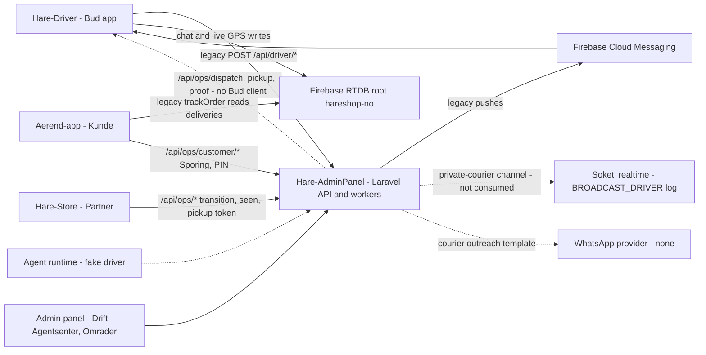
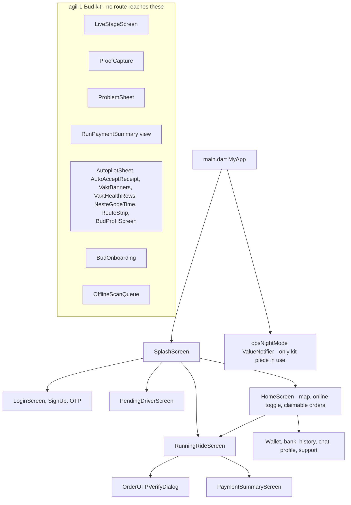
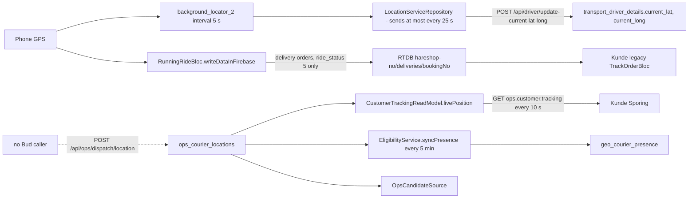
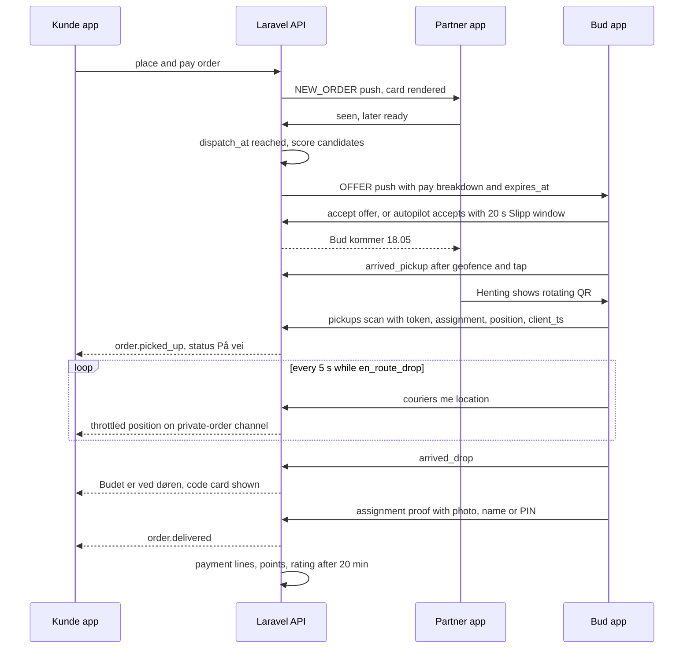
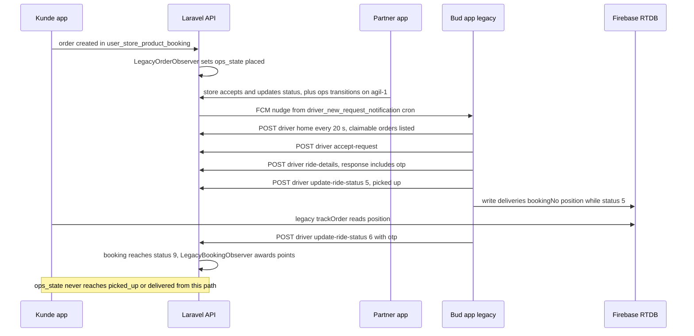
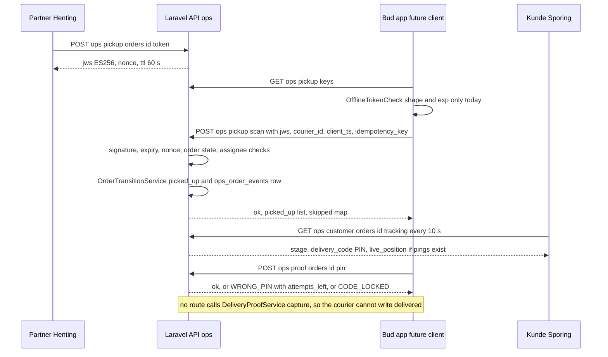
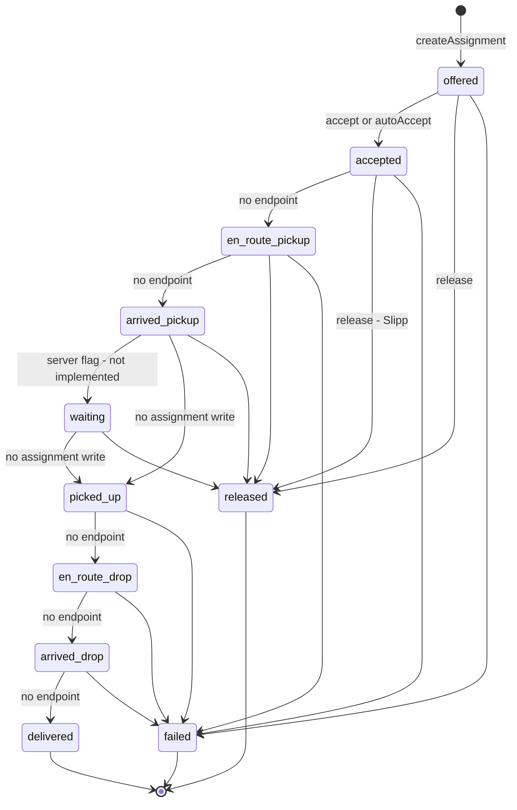
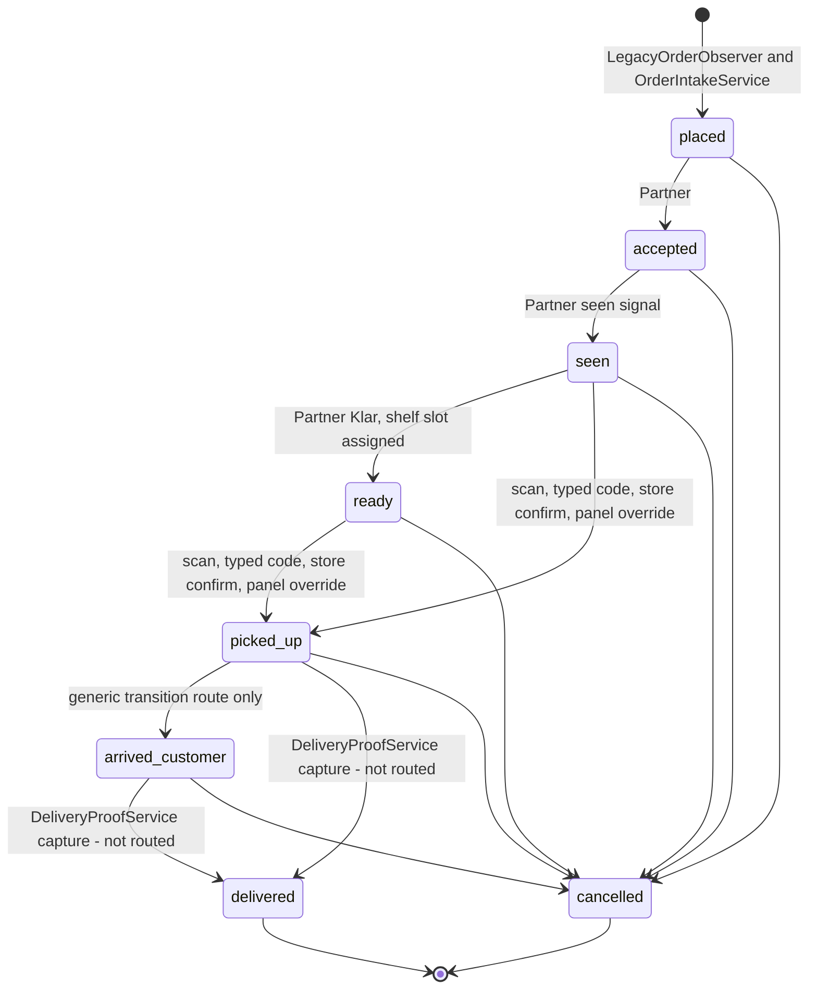
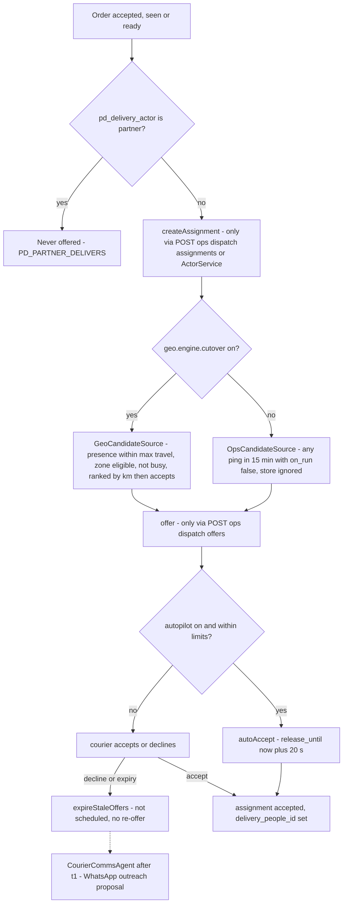
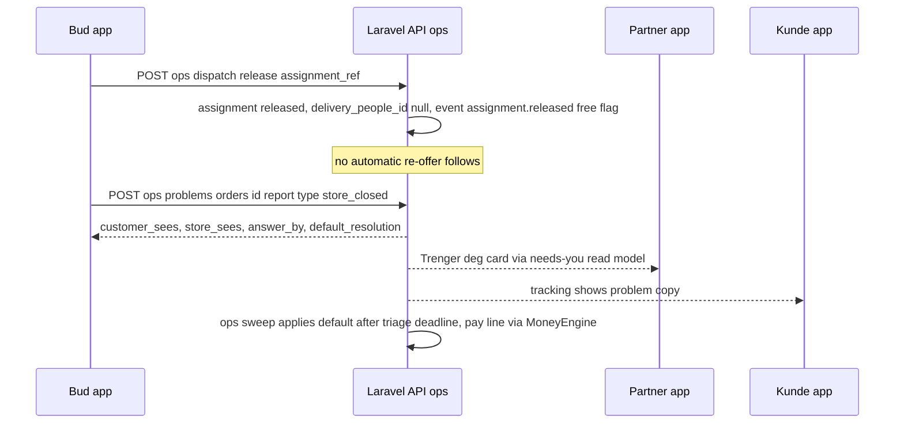

# Ærend driver app (Hare-Driver, Bud) — features, delivery workflow, integrations and gaps

> **Audience:** Flutter, Laravel and Node developers on the Ærend team · **As of:** 2026-10-02 ·
> **Repos (branch `agil-1`):** Hare-Driver `a71b33e` · Hare-AdminPanel `ec1dfe8` · Aerend-app `824c478` · Hare-Store `6ce38b3` (Aerend-Feed `d1f7a2f` has no courier surface) ·
> **Sources read:** `Hare-Driver/lib/**`, `Hare-Driver/test/ops/**`, `git log` of Hare-Driver (Phases 1–12); Hare-AdminPanel `app/Ops/*`, `app/Services/Ops/*`, `app/Services/Geo/*`, `app/Services/AgentOps/CourierCommsAgent.php`, `app/Services/PartnerDelivery/ActorService.php`, `app/Http/Controllers/Ops/*`, `routes/api.php` (driver block), `routes/api_ops.php`, `routes/api_geo.php`, `routes/api_agentops.php`, `routes/channels.php`, ops/geo/agtp migrations, `app/Console/Kernel.php`, docs `OPS_API.md`, `OPS_ADMIN_GUIDE.md`, `GEO_GUIDE.md`, `AGENTOPS_COURIER_COMMS.md`, `T1_T2_SMOKE_TEST.md`; specs `AEREND ORDER OPS SPEC FINAL STATEv3.md`, `AEREND PARTNER & BUD UPGRADE SPEC.md`, `aerend-geo-coverage-spec.docx`, `aerend-partner-self-delivery-spec.docx`, `aerend-support-system-spec.docx`, `aerend-support-refunds-feed-spec.docx`, `aerend-ai-agents-spec.docx`; plans `8-10-WEEK-IMPLEMENTATION-PLAN.md`, `AGIL-1-PLAN.md`, `AGIL-1-PLAN-v2.md`, `AGIL-1-REMAINING.md`, `AGIL-3-PLAN.md`, `AGIL-CONTRACT.md`, `AGIL-UI-CONTRACT.md`; designs `Ærend Bud.dc.html`, `Ærend Bud - agentfunksjoner B1-B4.dc.html`, `Ærend Bud - utviklervedlegg (ordrelivssyklus).dc.html`, `Ærend Bud og Partner - register og system.dc.html`, `Ærend Bud - inventar (steg 1).dc.html`, `Ærend Bud - leveranser (steg 4).dc.html`, `Sjåfør app.dc.html`, `aerend-ordre.js`.

---

## Table of contents

- [0. How to read this report](#0-how-to-read-this-report)
- [1. TL;DR](#1-tldr)
- [2. System context](#2-system-context)
- [3. Architecture of Hare-Driver today (two layers)](#3-architecture-of-hare-driver-today-two-layers)
- [4. Login, registration and onboarding (Innlogging / Onboarding)](#4-login-registration-and-onboarding-innlogging--onboarding)
- [5. Identity, documents and vehicle (Identitet, Dokumenter og kjøretøy, ID-kort)](#5-identity-documents-and-vehicle-identitet-dokumenter-og-kjøretøy-id-kort)
- [6. Shift and online status (Av vakt / På vakt / På oppdrag)](#6-shift-and-online-status-av-vakt--på-vakt--på-oppdrag)
- [7. Offers, acceptance and dispatch (Tilbud, Godta / Avslå)](#7-offers-acceptance-and-dispatch-tilbud-godta--avslå)
- [8. Autopilot, limits and stacking (Autopilot, Slipp, Samlet tur)](#8-autopilot-limits-and-stacking-autopilot-slipp-samlet-tur)
- [9. The live run and navigation (Hent → Levert, Naviger)](#9-the-live-run-and-navigation-hent--levert-naviger)
- [10. Pickup handoff (Skann, Skriv kode, Hylle)](#10-pickup-handoff-skann-skriv-kode-hylle)
- [11. Delivery proof (Bevis: Ved døren / Til person / Med kode)](#11-delivery-proof-bevis-ved-døren--til-person--med-kode)
- [12. Live location and customer tracking (Sporing)](#12-live-location-and-customer-tracking-sporing)
- [13. Problems and exceptions (Problem)](#13-problems-and-exceptions-problem)
- [14. Earnings, run pay and payouts (Tjent nå, Inntekt, Utbetaling)](#14-earnings-run-pay-and-payouts-tjent-nå-inntekt-utbetaling)
- [15. Communication: chat, calls, push (Ring, Melding, Varsler)](#15-communication-chat-calls-push-ring-melding-varsler)
- [16. Offline outbox (Ventende kø)](#16-offline-outbox-ventende-kø)
- [17. Night mode and Big-weather (Nattmodus, Storværsmodus)](#17-night-mode-and-big-weather-nattmodus-storværsmodus)
- [18. Courier zones, homes and presence (Områdene dine)](#18-courier-zones-homes-and-presence-områdene-dine)
- [19. Partner self-delivery and store mode (Vi leverer, butikkmodus)](#19-partner-self-delivery-and-store-mode-vi-leverer-butikkmodus)
- [20. Agents for couriers (B1–B4, Agent B «Fra Ærend AI») and support (Ring Ærend)](#20-agents-for-couriers-b1b4-agent-b-fra-ærend-ai-and-support-ring-ærend)
- [21. Admin panel courier surfaces (Drift › Bud, Budkontakt, Områder)](#21-admin-panel-courier-surfaces-drift--bud-budkontakt-områder)
- [22. How the other apps and services interact with the Bud app](#22-how-the-other-apps-and-services-interact-with-the-bud-app)
- [23. GAP analysis](#23-gap-analysis)
- [24. Configuration, flags and environment](#24-configuration-flags-and-environment)
- [25. Developer quick-start / where to look first](#25-developer-quick-start--where-to-look-first)
- [26. Glossary](#26-glossary)
- [Appendix A: source index](#appendix-a-source-index)
- [Appendix B: contradictions between spec, plan, design and code](#appendix-b-contradictions-between-spec-plan-design-and-code)

---

## 0. How to read this report

**Status legend** (used in every section and in the GAP table):

| Mark | Meaning in this report |
|---|---|
| ✅ Built | Works end to end in code that a user can reach (for the app: reachable from `main.dart` navigation and calling a real endpoint). |
| 🟡 Partial | Some of the requirement exists and runs; named parts are missing. "Built backend only" rows are 🟡 with the words *backend only*. |
| 🧪 Stub/mock only | Code exists and has tests, but nothing reachable calls it (no route, no data source, no API call). Most of the agil-1 Bud widgets are here. |
| ❌ Not built | No code found (the evidence column says what was searched). |
| ⛔ Blocked | Needs a business decision or an external contract (Vipps Utbetaling, BankID/Idura, WhatsApp provider, relay-number provider, legal sign-off). |

**The most important reading rule for this app:** Hare-Driver has **two layers** (section 3). The *legacy* layer is a white-label driver app that is what couriers actually run today and talks only to the legacy `/api/driver/*` endpoints. The *agil-1 Bud layer* (Phases 1–12 on `agil-1`) is a set of well-tested, self-contained widgets and models under `lib/screens/live`, `lib/screens/vakt`, `lib/screens/money`, `lib/data/ops`, `lib/services/ops` — **none of them is reachable from the app's navigation and none of them calls the backend**. When this report says "Built in app" it means the legacy layer unless stated otherwise.

**"Spec says / Design shows / Code does"** are kept apart. A plan checkbox (`[x]`) is quoted as a claim; the status always comes from code.

**Link conventions** (the report lives in `aerend-app/Aerend-app/plans/reports/`):
driver `../../../../Hare-Driver/…`, backend `../../../../Hare-AdminPanel/…`, customer app `../../lib/…`, store `../../../../Hare-Store/…`, specs `../../../docs/…`, plans `../…`, designs `../../../../designs/21des/…`. `.docx` specs are cited by their original name (text copies were used for reading).

Endpoint notation: legacy driver endpoints are all `POST /api/driver/<name>` with `driver_id` + `access_token` + `driver_service_id` in the body; ops endpoints are under `/api/ops/…` (file [`routes/api_ops.php`](../../../../Hare-AdminPanel/routes/api_ops.php)).

---

## 1. TL;DR

1. **What it is.** `Hare-Driver` (package `hare_driver`, bundle `com.reen.driver`, README still says `fox_food_driver`) is the courier ("Bud") app. It is a white-label ride/courier/delivery template adapted for Ærend, with BLoC-style screens, Dio networking to `https://api.ailogistics.no/api/driver/`, Firebase (FCM, RTDB chat and live GPS) and background location.
2. **What works end to end today (legacy layer):** login/registration/OTP, document and vehicle upload, admin approval wait, online/offline toggle, polling a list of claimable store orders (every 20 s + FCM nudge), accept/reject, a running-ride screen with Google Maps route, "picked up" → "delivered with 4-digit OTP", invoice/payment summary, wallet, bank details, history, Firebase chat, push notifications, background GPS to `update-current-lat-long`, and live GPS to Firebase RTDB `hareshop-no/deliveries/{bookingNo}` that the customer app's *legacy* tracking screen reads.
3. **What agil-1 added to the app (Phases 1–12):** a 7-stage live screen (`LiveStageScreen`), proof capture (`ProofCapture`), problem sheet, run pay breakdown, autopilot sheet + auto-accept receipt with *Slipp*, vakt banners/health rows, *Neste gode time*, stacked route strip, Bud profile, 6-step onboarding, offline outbox class, solar night mode, Big-weather sizing, ops status ARB keys — **129 passing widget/unit tests, but zero routes into these widgets and zero ops API calls**. `AGIL-1-REMAINING.md` confirms: "`LiveStageScreen` is referenced in exactly one file, its own."
4. **The backend for couriers is much further along than the app**: assignment/offer/limits/location tables and `DispatchService` (offer, accept, decline, auto-accept within limits, 20 s free release), `PickupHandoffService` (ES256 JWS QR, samle-QR, typed code, store confirm, panel override, offline-replay idempotency), `DeliveryProofService` (proof-type policy, 4-digit PIN with 3-attempt lock, photo prevalidation, photo+name fallback), `ProblemService` (5 types, triage defaults, relay chase steps), `MoneyEngine` + `ops:payout-batch`, geo eligibility/presence and the courier-comms agent.
5. **But the backend courier surface has holes that block a real Bud client:** no endpoint advances an assignment past `accepted` (`en_route_pickup`, `arrived_pickup`, `arrived_drop`, `delivered` have no writer); `DeliveryProofService::capture()` (the only code that writes `order.delivered` for a courier) has **no route**; nothing creates assignments or offers automatically for normal orders; `expireStaleOffers()` is not scheduled and does not re-offer; ops notifications are written to `ops_notifications` but never sent.
6. **No courier authentication on `/api/ops/*`.** Dispatch, pickup scan, PIN proof, location, shift and limits all take `courier_id` from the request body; `GET /api/ops/events` returns every order's events unscoped.
7. **Two parallel worlds that do not meet:** the legacy driver flow never writes `ops_state`, `ops_courier_locations` or `ops_order_events`. So the customer app's new *Sporing* (which reads `ops.customer.tracking`) will not move past the store's states and will show no live courier position for a legacy-driver delivery; the ops PIN shown to the customer is not the legacy OTP the driver app asks for.
8. **Pickup QR scanning is not possible in the app:** there is no camera/QR scanner package in `pubspec.yaml`; `OfflineTokenCheck` checks token shape and expiry only (no signature, no JWKS fetch).
9. **Money:** couriers see legacy invoices/wallet. In ops, a normal delivery is never priced (`MoneyEngine::priceRun` is only called from `ProblemService`), there is no courier earnings/payout API, and payout sending is ⛔ blocked on Vipps Utbetaling (`UnavailablePayoutTransport`).
10. **Identity:** the server refuses `shift/start` for couriers without a BankID row, but nothing writes that row (`SecurityService::markVerified` has no caller) — BankID/Idura is ⛔/❌.
11. **Geo (agil-3):** courier home/zone eligibility, presence mirror and `GeoCandidateSource` exist behind `geo.engine.cutover`; the Bud UI for *Områdene dine* is deferred and presence has no input because the app never posts ops locations.
12. **Self-delivery:** ops dispatch refuses partner-delivered orders (`PD_PARTNER_DELIVERS`); the legacy driver dispatch path does not read `pd_delivery_actor` at all. *Butikkmodus* (store drivers in Bud) is not built.
13. **Agents:** B1–B4 (translate, problem by voice, door note, explain) are ❌ blocked on the agent substrate; the widgets keep present-but-disabled slots. Agent B courier comms (WhatsApp outreach) is built backend-only with `NoneProvider` and a legal gate; the app has no `hare-driver://offer/{id}` deep link.
14. **Bottom line:** the driver app is **not developed to the new specs**. The new specs are implemented as (a) backend services with partial HTTP exposure and (b) isolated Flutter widgets. The work left is mostly *integration*: an ops API client + auth, containers that feed the widgets, the missing assignment/proof endpoints, dispatch automation, and a cut-over from the legacy flow.

---

## 2. System context



Solid arrows are wired and used today; dashed arrows exist on one side only.

| Component | Role for couriers | Evidence |
|---|---|---|
| Hare-Driver legacy layer | Everything couriers actually do today | [`lib/networking/api_constant.dart`](../../../../Hare-Driver/lib/networking/api_constant.dart) (`BaseUrl.baseUrl`, `ApiConst.*`) |
| Hare-Driver agil-1 layer | Widgets for the new Bud design, not routed | [`lib/screens/live/live_stage_screen.dart`](../../../../Hare-Driver/lib/screens/live/live_stage_screen.dart) (`LiveStageScreen`) |
| Legacy driver API | `/api/driver/*`, 6,160-line controller | [`app/Http/Controllers/Api/Transport/DriverController.php`](../../../../Hare-AdminPanel/app/Http/Controllers/Api/Transport/DriverController.php) |
| Ops API | `/api/ops/dispatch|pickup|proof|problems|security|timing|events` | [`routes/api_ops.php`](../../../../Hare-AdminPanel/routes/api_ops.php) |
| Geo API | `/api/geo/couriers/{id}/home|zones` | [`routes/api_geo.php`](../../../../Hare-AdminPanel/routes/api_geo.php) |
| AgentOps | courier outreach, consent, offer badge, settlement read | [`routes/api_agentops.php`](../../../../Hare-AdminPanel/routes/api_agentops.php) |
| Firebase RTDB | chat (`hareshop-no/messages`, `users`), live GPS (`hareshop-no/deliveries/{bookingNo}`) | [`lib/constant/chat_constant.dart`](../../../../Hare-Driver/lib/constant/chat_constant.dart) (`ChatConstant.chat = "hareshop-no"`) |

---

## 3. Architecture of Hare-Driver today (two layers)

**What it is / why** — The repo is one Flutter app with two generations of code side by side. Knowing which layer a file belongs to is the single most useful thing when working here.

**Spec & design** — Order Ops §22 "Client requirements → Bud" and Partner & Bud spec §19 describe the target client: camera scan with local ES256 verification, outbox, typed-code fallback, relay calls, Cloudinary signed upload, geofence pre-arm, Night/Big-weather, voice. The design register ([`Ærend Bud og Partner - register og system.dc.html`](../../../../designs/21des/%C3%86rend%20Bud%20og%20Partner%20-%20register%20og%20system.dc.html), table 11a) audits every legacy capability and gives it a "ny plass" in the redesign.

**How it works today**

| Layer | Folders | Reached from `main.dart`? | Talks to |
|---|---|---|---|
| Legacy (white-label "Fox" template) | `lib/screens/{splashScreen,loginScreen,signUpScreen,otpScreen,pendingDriverScreen,requireDocumentScreen,manageVehicleScreen,homeScreen,newRequestScreen,runningRideScreen,rideDetailScreen,orderDetailScreen,orderHistoryScreen,paymentSummaryScreen,wallet*,bankDetailScreen,addCard,manageCard,liveChatScreen,notifications,profileScreen,supportScreen,customerFeedbackScreen,languageCurrencyScreen}`, `lib/dialog/*`, `lib/googleMap/*`, `lib/services/backgroundService/*`, `lib/services/push_notification_service.dart` | Yes | `/api/driver/*`, `/api/store/*` (helper only), Google Maps proxy, Firebase |
| agil-1 Bud kit | `lib/screens/live/*`, `lib/screens/vakt/**`, `lib/screens/money/run_summary.dart`, `lib/data/ops/*`, `lib/services/ops/*` | **No** (only `opsNightMode` is used by `main.dart`) | Nothing — every widget takes props and callbacks |



**Where in code**

| Layer | File | Key symbols |
|---|---|---|
| Entry | [`lib/main.dart`](../../../../Hare-Driver/lib/main.dart) | `main`, `MyApp`, `firebaseMessagingBackgroundHandler` (body commented out), `ValueListenableBuilder<ThemeMode>(opsNightMode)` |
| State mgmt | [`lib/util/bloc.dart`](../../../../Hare-Driver/lib/util/bloc.dart), [`lib/util/bloc_provider.dart`](../../../../Hare-Driver/lib/util/bloc_provider.dart) | hand-rolled `Bloc` + rxdart `BehaviorSubject`/`PublishSubject` per screen (`HomeBloc`, `RunningRideBloc`, …); `flutter_bloc` is a dependency but the legacy screens use the custom pattern |
| Networking | [`lib/networking/api_base_helper.dart`](../../../../Hare-Driver/lib/networking/api_base_helper.dart), [`api_constant.dart`](../../../../Hare-Driver/lib/networking/api_constant.dart) | `ApiBaseHelper` (Dio, `select-language` header), `BaseUrl.domain = "https://api.ailogistics.no/"` (local IP commented), `ApiConst.*`, `ApiParam.*` |
| Session | [`lib/util/shared_pref_util.dart`](../../../../Hare-Driver/lib/util/shared_pref_util.dart) | `prefDriverId`, `prefAccessToken`, `prefDriverServiceId`, `prefDeviceToken` |
| l10n | [`lib/l10n/intl_no.arb`](../../../../Hare-Driver/lib/l10n/intl_no.arb) etc. | no/en/da/sv/es; `ops_status_*_courier` keys added in Phase 1 (unused by any widget) |
| Constants | [`lib/constant/constant.dart`](../../../../Hare-Driver/lib/constant/constant.dart) | `isDemoApp=false`, `isDeliveryOTP=true`, `isMultiOrderDelivery=true`, service types `courierServiceType=4` |
| Tests | [`test/ops/`](../../../../Hare-Driver/test/ops) | 9 files, 129 tests per the Phase 11 commit message (not re-run for this report); no legacy tests (Phase 12 deleted the template counter test) |

**API / events / data** — the legacy layer posts `driver_id`, `access_token`, `driver_service_id` in every body ("house handshake"); there is **no** `lib/networking/ops/` client in Hare-Driver (contrast Hare-Store's [`lib/networking/ops/ops_api.dart`](../../../../Hare-Store/lib/networking/ops/ops_api.dart) and the customer app's [`lib/networking/ops/ops_customer_api.dart`](../../lib/networking/ops/ops_customer_api.dart)).

**Commit history (read-only `git log`, Hare-Driver `agil-1`)**

| Commit | Phase | What landed |
|---|---|---|
| `cde9433` | 1 (sync-A) | Shared ops status vocabulary in ARB (no/en; da/sv/es fall back to English) |
| `75c5740` | 2 | `LiveStageScreen`, `OpsAssignmentState` mirror, `NightModeController`, `main.dart` theme follows it |
| `c346897` | 3 | `OfflineScanQueue`, `QueuedScan`, `OfflineTokenCheck` |
| `10f9f9e` | 5 | `ProofCapture`, `RunPaymentSummary` view |
| `2a45aef` | 6 | `ProblemSheet` |
| `5631279` | 7 | `CourierLimits`, `AutopilotSheet`, `AutoAcceptReceipt`, `VaktBanners`, `VaktHealthRows`, `NesteGodeTime`, `RouteStrip`, `BudProfilScreen`; queue carries all mutating kinds |
| `90c6f4b` | 11 | `BudOnboarding` (6 steps) |
| `7e92660` | 11 | `SolarClock` real sunset, Big-weather ≥64 pt test across seven stages, Ægil slot present-but-disabled |
| `a71b33e` | 12 | Removed the template counter test |

Earlier commits (`3f2cfc0` … `ebaeec0`, messages like "hh", "noti", "chat", "api change") are the legacy app's own history.

**Use-case examples**
- A developer searches for "Godta" to find the offer screen: there is none in either layer; the legacy app shows claimable orders inside `HomeScreen`, and the agil-1 kit only has the *auto-accept receipt*.
- A developer wants to demo the 7-stage screen: they must build a container that passes `assignmentState`, `orderCode`, `address` and callbacks, because no route exists (see `AGIL-1-REMAINING.md` "Why Partner and Bud are harder than the customer app").

**Status** — 🟡 Partial: legacy app ✅ (shipping), new-spec Bud layer 🧪 (widgets + tests only).

---

## 4. Login, registration and onboarding (Innlogging / Onboarding)

**What it is / why** — How a courier gets an account and is allowed to work. The new design turns this into a six-step onboarding that ends on *Av vakt* (off shift) rather than dropping the courier into a live shift.

**Spec & design**
- Order Ops §19 / Partner & Bud §15: "Courier identity: BankID via Idura OIDC at onboarding; `identity_verified_at`."
- Geo spec §5 (`aerend-geo-coverage-spec.docx`): onboarding captures the **home area** (address or map tap) → home zone; "no «velg butikker»".
- AI agents spec §5 / `AGENTOPS_COURIER_COMMS.md`: WhatsApp consent captured in Bud onboarding with a `wording_version`.
- Design `Ærend Bud.dc.html` screen 3.2 (per [`leveranser (steg 4)`](../../../../designs/21des/%C3%86rend%20Bud%20-%20leveranser%20%28steg%204%29.dc.html)): "Six steps … Identitet (BankID → Verifisert in profile), Dokumenter og kjøretøy, Utbetaling (Vipps/bank), Tillatelser (posisjon alltid, kamera, varsler with what stops working), Slik virker en tur (seven-stage test with demo-QR and demo-proof), Autopilot (off by default) + Språk. Ends in Av vakt."
- Design register 11a: Registrering, OTP and Bankkonto are "F" (fold into onboarding); "BankID-identitet — finnes ikke — dagens flyt er passord + SMS" = "N" (new).

**How it works today**
1. `SplashScreen` → `SplashBloc` calls `app-version-check` and `get-running-service`; if a run is active it opens `RunningRideScreen` directly ([`splash_bloc.dart`](../../../../Hare-Driver/lib/screens/splashScreen/splash_bloc.dart) line ~171).
2. Login by email/password or Google/Facebook/Apple (`loginTypeEmail|Google|Facebook|Apple` in `constant.dart`; `lib/commonView/social_login.dart`) → `POST /api/driver/login` (`LoginController@postTransportDriverLogin`).
3. Registration → `POST /api/driver/register`; SMS OTP → `contact-verification`, `resend-otp-verification`; social sign-ups complete missing fields via `social-required-field`.
4. Service registration (vehicle + required documents) → `PendingDriverScreen` polls `check-service-status` until an admin approves.
5. The agil-1 `BudOnboarding` ([`lib/screens/vakt/onboarding/bud_onboarding.dart`](../../../../Hare-Driver/lib/screens/vakt/onboarding/bud_onboarding.dart)) renders the six designed steps (`stepKeys = identity, documents, payout, permissions, how_a_run_works, autopilot_language`) from a `BudOnboardingState` prop, blocks progress on the three payment-critical steps, and calls `onFinished` so a host can land on *Av vakt*. No host exists.

**Where in code**

| Layer | File | Key symbols |
|---|---|---|
| App (legacy) | [`lib/screens/loginScreen/login_repo.dart`](../../../../Hare-Driver/lib/screens/loginScreen/login_repo.dart), [`signUpScreen/`](../../../../Hare-Driver/lib/screens/signUpScreen), [`otpScreen/`](../../../../Hare-Driver/lib/screens/otpScreen), [`pendingDriverScreen/`](../../../../Hare-Driver/lib/screens/pendingDriverScreen) | `ApiConst.endPointLogin`, `endPointRegister`, `endPointVerifyOtp`, `endPointCheckServiceStatus` |
| App (kit) | [`bud_onboarding.dart`](../../../../Hare-Driver/lib/screens/vakt/onboarding/bud_onboarding.dart), [`onboarding_flow.dart`](../../../../Hare-Driver/lib/screens/vakt/onboarding/onboarding_flow.dart) | `BudOnboarding`, `BudOnboardingState`, `OnboardingStep` |
| Backend | [`routes/api.php`](../../../../Hare-AdminPanel/routes/api.php) driver block | `post:driver:login`, `post:driver:register`, `post:driver:contact_verification`, `post:driver:check_service_status` |
| Tests | [`test/ops/bud_onboarding_test.dart`](../../../../Hare-Driver/test/ops/bud_onboarding_test.dart) | 18 tests (Phase 11 commit) |

**API / events / data** — legacy tables `providers`, `provider_services`, `transport_driver_details` (not changed by agil-1). No ops/geo/agentops call in any onboarding path: `POST /api/geo/couriers/{id}/home` and `POST /api/agentops/couriers/{id}/whatsapp-consent` exist but have no app caller.

**Use-case examples**
- *New courier, today:* registers with email + SMS OTP, uploads licence and insurance, waits on "pending" until an admin approves in the legacy admin. No BankID, no home zone, no consent row.
- *New courier, target:* Identitet (BankID) → Dokumenter → Utbetaling → Tillatelser → demo run → Autopilot/Språk → lands on *Av vakt*; behind the scenes `geo_courier_homes` and `agtp_courier_consents` rows are written.

**Status** — Legacy login/registration ✅; six-step onboarding 🧪 (unrouted widget); BankID ❌/⛔; home-zone capture ❌ in app (backend route exists); WhatsApp consent capture ❌ in app.

---

## 5. Identity, documents and vehicle (Identitet, Dokumenter og kjøretøy, ID-kort)

**What it is / why** — Trust at the door and compliance: the customer sees who is coming, and an unverified courier cannot take work.

**Spec & design**
- Order Ops §11.5: tracking shows courier first name, photo and "BankID-verifisert" from `en_route_drop`; Bud has an **ID-kort** screen reachable in one tap from any live stage. "No surname, no phone number, no vehicle registration."
- Order Ops §18.5 (panel): courier detail shows verification status, documents.
- Design 3.11 Profil: "Verification badge with date, documents, vehicle, limits …"; onboarding copy: "Vi varsler deg 30 dager før noe utløper."

**How it works today**
1. Documents and vehicle: legacy `RequireDocumentScreen` (`manage-document-list`, `upload-single-document`) and `ManageVehicleScreen` (`get-service-type-document-list`, `get-vehicle-details`, `update-vehicle-details`, `service-register`).
2. Backend identity: [`SecurityService`](../../../../Hare-AdminPanel/app/Services/Ops/SecurityService.php) keeps `ops_courier_verification` (`bankid_verified_at`, `verified_name`, `documents_valid_until`). `idCard()` returns `{verified, name, verified_on}`; `shiftBlocker()` returns a Norwegian reason when not verified or documents expired.
3. `GET /api/ops/security/id-card?courier_id=` returns `id_card`, `on_shift`, `shift_blocked_reason` ([`SecurityController::idCard`](../../../../Hare-AdminPanel/app/Http/Controllers/Ops/SecurityController.php)).
4. **Nothing writes the verification row**: `SecurityService::markVerified()` has no caller in `app/` or `routes/` (grep). No Idura/BankID client exists.
5. App: `LiveStageScreen` always renders an `bud-id-kort` strip with `courierName` and "Verifisert {year}" from props; `BudProfilScreen` shows "Verifisert med BankID" or "Ikke verifisert — du kan ikke kjøre ennå" from props. Neither is routed.
6. Customer side: `CustomerTrackingReadModel::courier()` returns `first_name`, `avatar_url`, `verified` (from `ops_courier_verification`) and `vehicle` (from legacy `transport_driver_details` → `transport_vehicle_type`).

**Where in code**

| Layer | File | Key symbols |
|---|---|---|
| App legacy | [`requireDocumentScreen/`](../../../../Hare-Driver/lib/screens/requireDocumentScreen), [`manageVehicleScreen/`](../../../../Hare-Driver/lib/screens/manageVehicleScreen) | `RequiredDocumentRepo`, `ManageVehicleRepo` |
| App kit | [`live_stage_screen.dart`](../../../../Hare-Driver/lib/screens/live/live_stage_screen.dart), [`bud_profil_screen.dart`](../../../../Hare-Driver/lib/screens/vakt/bud_profil_screen.dart) | `_idCard`, `BudProfilScreen.verifiedOn` |
| Backend | [`SecurityService.php`](../../../../Hare-AdminPanel/app/Services/Ops/SecurityService.php), [`SecurityController.php`](../../../../Hare-AdminPanel/app/Http/Controllers/Ops/SecurityController.php) | `markVerified`, `idCard`, `shiftBlocker`, route `GET /api/ops/security/id-card` |
| Backend read model | [`CustomerTrackingReadModel.php`](../../../../Hare-AdminPanel/app/Services/Ops/CustomerTrackingReadModel.php) | `courier()`, `vehicle()` |
| Tables | [`2026_09_22_102000_ops_create_security_tables.php`](../../../../Hare-AdminPanel/database/migrations/2026_09_22_102000_ops_create_security_tables.php) | `ops_courier_verification`, `ops_courier_shifts` |

**Use-case examples**
- A customer opens *Sporing* while a legacy driver carries the order: the `courier` block reads `providers` by `delivery_people_id`, but legacy code stores `transport_driver_details.id` there (see Appendix B #10), so the name/avatar may be wrong or null — not verified at runtime.
- An admin wants to mark Kari verified after a manual ID check: there is no admin action or endpoint for it.

**Status** — Documents/vehicle ✅ (legacy); ID-kort 🧪 app / ✅ backend read; BankID verification ❌ (⛔ Idura agreement); 30-day expiry warning ❌ (copy only).

---

## 6. Shift and online status (Av vakt / På vakt / På oppdrag)

**What it is / why** — Whether the courier is available for offers. The design has three modes and a deliberate "Gå på vakt" decision.

**Spec & design**
- Partner & Bud §18 (Bud API): `POST /couriers/me/shift {state, autopilot}`; Order Ops §21 same.
- Design 3.3 *Av vakt* (earnings summary, menu, Vaktsammendrag, single primary "Gå på vakt") and 3.4 *På vakt* (Tjent nå, Mitt mål, Neste gode time, health rows, Autopilot toggle).
- Support spec §5.3: big "Ring Ærend" safety button on the on-shift screen.

**How it works today**
1. Legacy `HomeScreen` online toggle → `HomeBloc` → `HomeRepo.updateCurrentStatusApi(updateStatus)` → `POST /api/driver/update-current-status`.
2. When online, `BackgroundLocationService` registers `background_locator_2` updates (see §12).
3. Ops shift exists server-side: `POST /api/ops/security/shift/start` (403 `not_verified` with the reason unless verified) and `/shift/end`, rows in `ops_courier_shifts`. **Not called by the app.**
4. Kit widgets: `BudMode` enum (`avVakt`, `paVakt`, `paOppdrag`) and the mode pill in `LiveStageScreen`; [`vakt_banners.dart`](../../../../Hare-Driver/lib/screens/vakt/vakt_banners.dart) (autopilot rule banner, offline banner listing queued items); [`vakt_health_rows.dart`](../../../../Hare-Driver/lib/screens/vakt/vakt_health_rows.dart) (only broken settings, each with the consequence and a fix action); [`neste_gode_time.dart`](../../../../Hare-Driver/lib/screens/vakt/neste_gode_time.dart) (historical heat-map card + sheet with a non-predictive disclaimer asserted by a test).
5. *Neste gode time* has no data source; a legacy `POST /api/driver/heat-map` (`HeatMapController@postDriverHeatMap`) exists but is not in `ApiConst`.

**Where in code**

| Layer | File | Key symbols |
|---|---|---|
| App legacy | [`home_repo.dart`](../../../../Hare-Driver/lib/screens/homeScreen/home_repo.dart), [`home_bloc.dart`](../../../../Hare-Driver/lib/screens/homeScreen/home_bloc.dart) | `updateCurrentStatusApi`, `callHomeApi`, `_startAutoRefresh` |
| App kit | [`ops_assignment_state.dart`](../../../../Hare-Driver/lib/data/ops/ops_assignment_state.dart), `vakt_*`, `neste_gode_time.dart` | `BudMode`, `VaktHealthRows`, `NesteGodeTimeCard`, `NesteGodeTimeSheet` |
| Backend | [`SecurityController.php`](../../../../Hare-AdminPanel/app/Http/Controllers/Ops/SecurityController.php) | `goOnShift`, `goOffShift` (`/api/ops/security/shift/start|end`, throttle 60/min) |

**Use-case examples**
- Kari taps the legacy online switch at 17:00: the legacy `provider_services.current_status` flips (not verified which column) and she starts receiving FCM nudges; no `ops_courier_shifts` row is written and `OpsCandidateSource` never sees her (no ops location pings).
- Target: Kari taps *Gå på vakt*, the autopilot limits sheet opens first (Phase 7 design decision), she confirms, `shift/start` succeeds because her BankID row exists.

**Status** — Online/offline ✅ legacy; ops shift ✅ backend only (and unusable until BankID rows exist); new *Av vakt/På vakt* screens 🧪.

---

## 7. Offers, acceptance and dispatch (Tilbud, Godta / Avslå)

**What it is / why** — Getting a run to a courier: who is offered what, when, and how they answer.

**Spec & design**
- Order Ops §9.1: `dispatch_at = predicted_ready_at − arrival_lead (2 min) − travel_estimate`; candidates scored at `dispatch_at − 60 s`; early `ready` dispatches immediately.
- §9.2 offer payload: `order_short_codes[]`, store `{name, strok, lat, lng}`, `drop_area` (strøk only), `distance_to_pickup_m`, `run_distance_m`, `pickup_at`, `delivery_window`, `payment {base, distance, expected_waiting: 0, stacked_bonus, total}`, `stacked`, `expires_at`; full drop address only after acceptance.
- §4.2 / §9.4: offer expires (default 40 s) → next candidate; decline costs nothing; no acceptance rate shown to couriers.
- §15: `OFFER` notification = push + in-app per offer.
- Geo spec §2.2: candidates = online couriers whose live cell is within T minutes of the store cell, zone-eligible, not on hold, not mid-delivery; ranked by proximity then acceptance history.
- Design 3.5 *Offer*: single / stacked / auto-accepted variants, full components ("grunn · avstand · stabling · venting · værtillegg"), "Ventetillegg fra 3 min", calm countdown ring, equal-weight Godta / Avslå, decline → next, expiry → "Neste tilbud". Developer appendix ([`utviklervedlegg (ordrelivssyklus)`](../../../../designs/21des/%C3%86rend%20Bud%20-%20utviklervedlegg%20%28ordrelivssyklus%29.dc.html)) business codes `OFFER_ALREADY_TAKEN` ("Tilbudet er tatt"), `ORDER_CANCELLED_BY_CUSTOMER`, `NO_COURIER_FOUND`.

**How it works today — legacy (what couriers use)**
1. Cron `driver_new_request_notification` (twice a minute: `--delay=0` and `--delay=15`, [`Kernel.php`](../../../../Hare-AdminPanel/app/Console/Kernel.php)) sends FCM pushes for pending requests ([`DriverNewRequestNotification.php`](../../../../Hare-AdminPanel/app/Console/Commands/DriverNewRequestNotification.php)).
2. The app does **not** open an offer screen from the push: `firebaseMessagingBackgroundHandler` has the `setPrefNotificationData` block commented out, so `isBackgroundNotification()` never finds a stored request and `NewRequestScreen` is effectively dead code. Foreground pushes open `HomeScreen` and trigger `PushNotificationService.refreshStream`.
3. `HomeBloc` polls `POST /api/driver/home` every 20 s and on every push; orders with `is_claimable = true` are listed first.
4. Accept → `HomeRepo.acceptOrderRequestApi` → `POST /api/driver/accept-request`; reject → `reject-request`. Client-side cap: `DriverOrderLimits.maxConcurrentStoreOrders = 3` (`HomeBloc.atStoreOrderCapacity`, snackbar `languages.maxConcurrentStoreOrders`). The file comment says "Server must enforce the same cap" — server enforcement not verified.
5. Accept opens `RunningRideScreen`.

**How it works today — ops backend (no app client)**
1. `POST /api/ops/dispatch/assignments {order_ids[], store_id}` → `DispatchService::createAssignment` (ref `asg_…`, state `offered`, `ops_assignment_orders` with `sequence`). Refuses partner-delivered orders with `PD_PARTNER_DELIVERS`. Callers: this route and `PartnerDelivery\ActorService` when a store hands an order back to the courier pool. **Nothing creates assignments automatically when an order is accepted/ready.**
2. `POST /api/ops/dispatch/offers {assignment_ref, courier_id, distance_metres?, weather?}` → `offer()`: expiry from policy `dispatch.offer_timeout_s` (45), `estimatePay()` breakdown (`base_ore`, `distance_ore`, `stacking_ore`, `weather_ore`, `total_ore`), `waiting_note` "Ventetid betales etter 3 min." **Caller is "S A" per `OPS_API.md`; no scheduler calls it.**
3. `GET /api/ops/dispatch/offers?courier_id=` lists pending offers (no store/strøk/drop area/pickup time — only ids, pay, distance, breakdown, expiry).
4. `POST /api/ops/dispatch/offers/{id}/accept` → assignment `accepted`, `accepted_at`, and `user_store_product_booking.delivery_people_id = courier_id`; expired → `{ok:false, error:"OFFER_EXPIRED"}`; already answered → `OFFER_NOT_PENDING`.
5. `…/decline {reason?}` → `declined`, `{ok:true, next:"reoffer"}` (nothing re-offers).
6. `DispatchService::expireStaleOffers()` marks expired offers and counts assignments that *could* be re-offered — it is **not scheduled** (not in `OpsSweep::handle`) and creates no new offer.
7. `candidatesFor($storeId)` delegates to the `CandidateSource` seam (section 22 diagram). `OpsCandidateSource` ignores `storeId` and returns every courier with an `ops_courier_locations` ping in 15 min and `on_run = false`.
8. `dispatchAtFor($orderId, $travelSeconds = 600)` computes the spec's dispatch time but has no caller.

**Where in code**

| Layer | File | Key symbols |
|---|---|---|
| App legacy | [`home_bloc.dart`](../../../../Hare-Driver/lib/screens/homeScreen/home_bloc.dart), [`home_repo.dart`](../../../../Hare-Driver/lib/screens/homeScreen/home_repo.dart), [`driver_order_limits.dart`](../../../../Hare-Driver/lib/constant/driver_order_limits.dart), [`new_request_screen.dart`](../../../../Hare-Driver/lib/screens/newRequestScreen/new_request_screen.dart), [`utils.dart`](../../../../Hare-Driver/lib/util/utils.dart) | `acceptOrderRequestApi`, `rejectOrderRequestApi`, `atStoreOrderCapacity`, `isBackgroundNotification` |
| Backend legacy | [`DriverController.php`](../../../../Hare-AdminPanel/app/Http/Controllers/Api/Transport/DriverController.php), [`DriverNewRequestNotification.php`](../../../../Hare-AdminPanel/app/Console/Commands/DriverNewRequestNotification.php) | `postDriverHome`, `postDriverAcceptRequest`, `postDriverRejectRequest` |
| Backend ops | [`DispatchService.php`](../../../../Hare-AdminPanel/app/Services/Ops/DispatchService.php), [`DispatchController.php`](../../../../Hare-AdminPanel/app/Http/Controllers/Ops/DispatchController.php) | `createAssignment`, `offer`, `estimatePay`, `accept`, `decline`, `expireStaleOffers`, `dispatchAtFor`, `candidatesFor` |
| Seam | [`CandidateSource.php`](../../../../Hare-AdminPanel/app/Ops/Dispatch/CandidateSource.php), [`OpsCandidateSource.php`](../../../../Hare-AdminPanel/app/Ops/Dispatch/OpsCandidateSource.php), [`GeoCandidateSource.php`](../../../../Hare-AdminPanel/app/Services/Geo/GeoCandidateSource.php) | `candidates`, `eligible`; bound in `AppServiceProvider`, extended in `AgentOpsServiceProvider` |
| Tables | [`2026_09_22_097000_ops_create_dispatch_tables.php`](../../../../Hare-AdminPanel/database/migrations/2026_09_22_097000_ops_create_dispatch_tables.php) | `ops_assignments`, `ops_assignment_orders`, `ops_offers`, `ops_courier_limits`, `ops_courier_locations`, `ops_notifications` |
| Tests | `tests/Feature/Ops/DispatchTest.php` | 30 cases per plan (not re-run) |

**API / events / data** — `ops_offers(state pending|accepted|declined|expired, estimated_pay_ore, distance_metres, payload json, expires_at, answered_at, decline_reason)`. No `assignment.offered|accepted|declined|expired` events are written by `DispatchService` (only `assignment.released` is, see §8). The spec's event list includes them.

**Use-case examples**
- *Today:* a Burger King order is accepted by the store; within ~15–60 s Kari's phone buzzes (legacy FCM), her home list shows it as claimable; she taps accept and gets the running-ride screen.
- *Ops backend demo:* support posts `/api/ops/dispatch/assignments` then `/offers` for courier 17; courier 17's (hypothetical) client would poll `GET /offers?courier_id=17` and accept. No push is sent — `NotificationService::send` only queues rows.
- *Expiry:* an ops offer passes `expires_at`; nobody runs `expireStaleOffers()`, so it stays `pending` until someone tries to accept (then it is marked `expired` inside `accept()`).

**Status** — Legacy offers ✅; ops offer/accept/decline 🟡 backend only (manual creation, no expiry loop, no push, payload thinner than spec); new offer screen ❌ (design 3.5 not implemented in the kit).

---

## 8. Autopilot, limits and stacking (Autopilot, Slipp, Samlet tur)

**What it is / why** — Couriers can let the server accept runs on their behalf within limits they set, with a free grace window to release; and two orders can travel together.

**Spec & design**
- Order Ops §9.3: limits `vehicle, max_pickup_distance_m, min_payment, areas[], accept_stacked`; server accepts and emits `assignment.accepted {auto:true}`; release within `autopilot_grace` 20 s free; **grace starts at delivery of the push**, not at server acceptance (§24 edge case).
- §9.5 stacking: same store or stores within 400 m, drop-offs within 1.5 km, second `predicted_ready_at` within 6 min; one assignment with `orders[]`; samle-QR; stack total shown before acceptance.
- Design 3.4 / Phase 7 commit: *På vakt* toggle opens the limits sheet first; banner keeps the rule visible ("tar alt under 4 km over 95 kr"); auto-accept receipt offers *Slipp* free for 20 s, then says the release will be recorded; stacked route strip shows both codes and numbered stops.

**How it works today**
1. Backend limits: `GET/POST /api/ops/dispatch/limits` → `ops_courier_limits(autopilot_enabled, max_distance_metres, min_payout_ore, areas json, stacking_allowed, goal_ore)`; the GET also returns `release_window_seconds = 20`.
2. `POST /api/ops/dispatch/offers/{id}/auto-accept` → `withinLimits()` checks autopilot on, distance, minimum pay, stacking — **not `areas`** — then `accept()` and sets `auto_accepted = true`, `release_until = now + 20 s` (server time).
3. `POST /api/ops/dispatch/release {assignment_ref}` → assignment `released`, `delivery_people_id = null` on its orders, writes one `ops_order_events` row `assignment.released {free, auto_accepted}`. Release is allowed at any state (no state guard, unlike `AssignmentState::TRANSITIONS` which forbids release after `picked_up`).
4. Stacking: `GET /api/ops/dispatch/can-stack?order_id_a&order_id_b&courier_id` → `canStack()`: same `store_id` only (no "stores within 400 m"), courier allows stacking, ready times within `dispatch.stack_window_s` (480 s), drop distance ≤ `dispatch.stack_proximity_m` (400 m) by equirectangular approximation.
5. Samle-QR: `POST /api/ops/pickup/assignment-token` (Partner) → one ES256 token with `ords[]`; scan picks up the ready ones and returns `skipped` for the rest.
6. App kit: [`CourierLimits`](../../../../Hare-Driver/lib/data/ops/courier_limits.dart) (defaults 4 km, 95 kr, `Bergenhus`/`Årstad`, stacking on; `refusalFor()` names the limit that stopped an offer, including areas), [`AutopilotSheet`](../../../../Hare-Driver/lib/screens/vakt/autopilot_sheet.dart), [`AutoAcceptReceipt`](../../../../Hare-Driver/lib/screens/vakt/auto_accept_receipt.dart) (20 s countdown, then copy changes), [`RouteStrip`](../../../../Hare-Driver/lib/screens/vakt/route_strip.dart) (stops in server route order, current marked).
7. **JSON contract mismatch:** `CourierLimits.fromJson/toJson` use `autopilot`, `max_pickup_km`, `min_payout_ore`, `areas`, `stacking`; the server uses `autopilot_enabled`, `max_distance_metres`, `min_payout_ore`, `areas`, `stacking_allowed`, `goal_ore`. Only `min_payout_ore` and `areas` would round-trip.
8. Legacy: no autopilot; multi-order handled by `isMultiOrderDelivery = true` and the 3-order cap.

**Where in code**

| Layer | File | Key symbols |
|---|---|---|
| App kit | `courier_limits.dart`, `autopilot_sheet.dart`, `auto_accept_receipt.dart`, `route_strip.dart`, `vakt_banners.dart` | `CourierLimits.refusalFor`, `CourierLimits.releaseGraceSeconds = 20`, `AutopilotOffer` |
| Backend | [`DispatchService.php`](../../../../Hare-AdminPanel/app/Services/Ops/DispatchService.php) | `limitsFor`, `setLimits`, `withinLimits`, `autoAccept`, `release`, `canStack`, `RELEASE_WINDOW_SECONDS` |
| Backend | [`PickupController.php`](../../../../Hare-AdminPanel/app/Http/Controllers/Ops/PickupController.php) | `mintForAssignment` |
| Tests | [`test/ops/vakt_test.dart`](../../../../Hare-Driver/test/ops/vakt_test.dart), `tests/Feature/Ops/SamleQrTest.php`, `DispatchTest.php` | "a 5 km offer is refused at a 3 km limit, and says why", "Slipp inside the window is free and says so" |

**Use-case examples**
- Kari sets 4 km / 95 kr / Bergenhus + Årstad. An offer from Fana (outside her areas) is auto-accepted by the server (areas not checked) while her app — once wired — would say "Utenfor Bergenhus og Årstad". Fix one side before shipping.
- Kari's phone is in her pocket on a weak signal; the server auto-accepts at 18:00:00 and `release_until` is 18:00:20; the push arrives 18:00:25 — per spec her free window should still be open; per code it has closed.

**Status** — Autopilot/limits/release ✅ backend (minus areas and push-anchored grace); stacking 🟡 backend (same store only, thresholds differ from spec); app widgets 🧪 with a JSON mismatch.

---

## 9. The live run and navigation (Hent → Levert, Naviger)

**What it is / why** — The screens a courier uses between accepting and finishing a run. The design fixes seven stages and a lower-third control row that never moves.

**Spec & design**
- Order Ops §4.2 assignment machine `offered → accepted → en_route_pickup → arrived_pickup → (waiting) → picked_up → en_route_drop → arrived_drop → delivered | released | failed`; `waiting` set by the server when `now > predicted_ready_at + waiting_threshold`.
- §1 principle 2: "three courier taps (arrived, scan, delivered)"; §19 geofences 150 m pickup / 100 m drop, pre-arm on the client as a hint only.
- Partner & Bud §18 Bud API: `POST /assignments/{id}/arrived_pickup`, `/arrived_drop`, `/proof`, `GET /couriers/me/live`.
- Design 3.6: seven stages Hent → Ankommet henting → Skann → Lever → Ankommet levering → Bevis → Levert; fixed controls (next action, Naviger, Ring, Ægil, Problem); fixed ID-kort slot; address largest with door line; "Butikken ser / Kunden ser"; "kode kreves" on code orders; geofence pre-arm pulse; route strip on stacked runs; Tjent nå in header.

**How it works today — legacy**
1. `RunningRideScreen(rideId, serviceCateId)` → `RunningRideBloc.callRideDetailsApi` (`POST /api/driver/ride-details`) and, for delivery categories 5–10, `delivery-order-details`.
2. Map with markers and Google Directions polyline (`lib/googleMap/google_api_dl.dart`, `get_route_utils.dart`, proxied through `/api/driver/google-map`).
3. One primary button whose label and target come from `getRideStatusForApi()`: for deliveries, statuses 1–3 jump straight to 5 ("Order picked up", the explicit "arrived at store" step was removed in commit `7eb08d5 Arrived remove`), 5 → 6 opens the OTP dialog (`isDeliveryOTP = true`), then 7/8/9 for payment completion.
4. Each tap → `POST /api/driver/update-ride-status {ride_status, otp, route_lat_long_list, way_point_status, …}`. Completion → `PaymentSummaryScreen`.
5. Cancel dialogs `rideCancelDialog/`, `runningRideCancelDialog/`.

**How it works today — kit and backend**
1. [`OpsAssignmentState`](../../../../Hare-Driver/lib/data/ops/ops_assignment_state.dart) mirrors `App\Ops\AssignmentState::TRANSITIONS` exactly; `courierNextState()` derives the next action from the state (Hent spans `accepted` and `en_route_pickup`); `BudStageX.forState()` maps states to the seven stages — the same map as the server's `AssignmentState::budStage()`.
2. `LiveStageScreen` renders stepper, order code (22 pt, 28 pt in Big-weather), address, door line, shelf slot, waiting minutes, "Butikken ser / Kunden ser", ID-kort, and the lower third; `canAdvance` refuses taps the machine would refuse; Ægil slot present-but-disabled.
3. **Backend has no endpoint to move an assignment** to `en_route_pickup`, `arrived_pickup`, `waiting`, `picked_up`, `en_route_drop`, `arrived_drop` or `delivered`: grep for `AssignmentState::EN_ROUTE|ARRIVED|WAITING|PICKED|DELIVERED` finds only *readers* (`GeoCandidateSource`, `ActorService`, `CustomerTrackingReadModel`, `CourierCommsAgent`). The pickup scan moves the **order** to `picked_up` but leaves the assignment at `accepted`.
4. Order side: `OrderState` allows `picked_up → arrived_customer → delivered` and `picked_up → delivered`; the generic `POST /api/ops/orders/{id}/transition` (caller "P B A" in `OPS_API.md`) could be used by a courier to set `arrived_customer` — it accepts any `actor_type` from the body and has no auth.
5. Geofences: not implemented on either side (no distance check in `PickupHandoffService::scan` or anywhere for drop).
6. Door intelligence: `DeliveryProofService::saveDoorProfile/doorProfileFor` and `ops_door_profiles` exist; **no route** exposes them.

**Where in code**

| Layer | File | Key symbols |
|---|---|---|
| App legacy | [`running_ride_bloc.dart`](../../../../Hare-Driver/lib/screens/runningRideScreen/running_ride_bloc.dart), [`running_ride_repo.dart`](../../../../Hare-Driver/lib/screens/runningRideScreen/running_ride_repo.dart) | `getRideStatusForApi`, `rideButtonAction`, `callUpdateRideStatusApi`, `updateRideStatusApi` |
| App kit | [`live_stage_screen.dart`](../../../../Hare-Driver/lib/screens/live/live_stage_screen.dart), [`ops_assignment_state.dart`](../../../../Hare-Driver/lib/data/ops/ops_assignment_state.dart) | `LiveStageScreen`, `OpsAssignmentState.courierNextState`, `BudStage` |
| Backend | [`app/Ops/AssignmentState.php`](../../../../Hare-AdminPanel/app/Ops/AssignmentState.php), [`app/Ops/OrderState.php`](../../../../Hare-AdminPanel/app/Ops/OrderState.php), [`OrderStateController.php`](../../../../Hare-AdminPanel/app/Http/Controllers/Ops/OrderStateController.php) | `TRANSITIONS`, `budStage`, `transition`, `states` |
| Tests | [`live_stage_test.dart`](../../../../Hare-Driver/test/ops/live_stage_test.dart), [`big_weather_test.dart`](../../../../Hare-Driver/test/ops/big_weather_test.dart) | out-of-order taps rejected; every control ≥ 64 pt in Big-weather |

**Use-case examples**
- *Today:* Kari arrives at Torgboden, taps "Order picked up" (one tap, no scan), drives, at the door taps "Delivered", types the customer's 4-digit OTP in `OrderOTPVerifyDialog`, and sees the payment summary.
- *Target:* Kari's stage moves Hent → Ankommet henting (geofence pre-arm + tap) → Skann (QR) → Lever → Ankommet levering → Bevis → Levert, each tap a server call. Three of those calls have no endpoint today.

**Status** — Legacy run ✅; 7-stage UI 🧪; assignment progress endpoints ❌; geofence ❌; door profiles 🟡 backend service only.

---

## 10. Pickup handoff (Skann, Skriv kode, Hylle)

**What it is / why** — The paperless handoff: the store's *Henting* screen shows a rotating signed QR, the courier scans it, the order becomes `picked_up`. Fallbacks make sure a courier is never stuck at the counter.

**Spec & design**
- Order Ops §10.1: JWS ES256 `{v:1, o:[order_id…], s:store_id, iat, exp, n:nonce, kid}`, `exp = iat + 60 s`, JWKS via `GET /keys`.
- §10.4 `POST /pickups/scan {token, assignment_id, lat, lng, accuracy, client_ts, idempotency_key}`; checks signature/kid, `exp ≥ client_ts − 120 s`, nonce unused, **assignment belongs to the courier**, orders on the assignment and `seen|ready`, **distance ≤ 150 m**; responses `SCAN_TOKEN_EXPIRED | SCAN_NOT_ASSIGNED | SCAN_STATE_CONFLICT | SCAN_OUT_OF_RANGE | SCAN_REPLAY`.
- §10.5 fallbacks: typed code (works offline because codes come with the offer), store confirm (`HANDOFF_PENDING_CONFIRM` on Bud), panel override. §10.6 offline scan with local JWS verification. §10.7 Hylleplass shown on Bud's Skann screen.
- Design 3.7 *Pickup*: code largest with "Hylle B"; not-ready → waiting counter → "Ventetillegg påløper · +12 kr"; camera frame; Skann OK → Hentet; Skann avvist; samle-QR with one missing; Skriv kode works offline; Be butikken bekrefte → pending; offline scan queued.

**How it works today — backend (built)**
1. Partner mints: `POST /api/ops/pickup/orders/{orderId}/token` → `PickupHandoffService::mintForOrder` signs claims `{iss:"aerend-ops", sub:"pickup", ord, sto, nnc, iat, exp}` with `kid` in the header, TTL 60 s (`offline_batch` → 3600 s); row in `ops_pickup_tokens`.
2. `GET /api/ops/pickup/keys` → `publicKeyBundle()` (current + retired keys).
3. `POST /api/ops/pickup/scan {jws, courier_id, client_ts?, idempotency_key?}` (throttle 10/min): idempotent replay by `idempotency_key` → per-courier rate limit → signature/exp (`SIG_INVALID`, `TOKEN_EXPIRED`) → token row by nonce → server-side expiry → `NONCE_REUSED` → per order: `UNKNOWN_ORDER`, `WRONG_STATE` (must be able to go to `picked_up`), `NOT_ASSIGNED` → `OrderTransitionService::transition(…, PICKED_UP, actor courier, idempotency "scan:{nonce}:{orderId}", occurred_at = client_ts)` → `ops_scans` row. Response `{ok, picked_up[], skipped{order_id: code}, replayed}`.
4. **Loophole:** the assignment check is `if ($order->delivery_people_id !== null && … !== $courierId)` — an order with **no** assigned courier can be picked up by any courier id that scans it. No `assignment_id`, no position, no geofence.
5. `POST /api/ops/pickup/typed-code {code, courier_id}` → matches `ops_code` (`Æ-42K` style), same state/assignee checks, `ops_scans.source = typed`.
6. `POST /api/ops/pickup/orders/{id}/store-confirm {store_id, courier_id?}` (Partner) and `/panel-override {admin_id, reason}` (admin `Drift › Ordre › Overstyr`).
7. Hylleplass: `OrderTransitionService` calls `PickupHandoffService::assignShelfSlot()` when an order becomes `ready` (rows A–D); exposed to the customer tracking and Partner.

**How it works today — app**
1. Legacy: no scan. "Order picked up" is a button.
2. Kit: [`OfflineScanQueue`](../../../../Hare-Driver/lib/services/ops/offline_scan_queue.dart) (oldest-first drain, stop on first failure, stable idempotency keys, `persist`/`restore` hooks, `changes` stream, kinds `qr|typed|status|problem|door_note|proof`) and `OfflineTokenCheck.inspect(jws)` (3 parts, decodes payload, rejects expired with `TOKEN_EXPIRED`, malformed with `SIG_INVALID`, reads `nnc` and `ord`). **It does not verify the signature**, does not fetch `/pickup/keys`, does not read `ords` (samle-QR), and the `send` function and persistence store are left to a host that does not exist.
3. **No camera/QR package** in [`pubspec.yaml`](../../../../Hare-Driver/pubspec.yaml) (`image_picker` only; no `mobile_scanner`, `qr_code_scanner`, etc.).
4. `LiveStageScreen` shows `Hylle {shelfSlot}` and `Venter {waitingMinutes} min` from props.

**Where in code**

| Layer | File | Key symbols |
|---|---|---|
| Backend | [`PickupHandoffService.php`](../../../../Hare-AdminPanel/app/Services/Ops/PickupHandoffService.php) | `mintForOrder`, `mintForAssignment`, `scan`, `acceptTypedCode`, `storeConfirm`, `panelOverride`, `assignShelfSlot`, `publicKeyBundle`, `MAX_SCANS_PER_MINUTE = 10` |
| Backend | [`PickupTokenCodec.php`](../../../../Hare-AdminPanel/app/Ops/PickupTokenCodec.php), [`ScanError.php`](../../../../Hare-AdminPanel/app/Ops/ScanError.php) | `ALGORITHM = ES256`, `TTL_SECONDS = 60`, `OFFLINE_TTL_SECONDS = 3600`; `SIG_INVALID`, `TOKEN_EXPIRED`, `NONCE_REUSED`, `WRONG_STATE`, `NOT_ASSIGNED`, `UNKNOWN_ORDER`, `RATE_LIMITED` with Norwegian `MESSAGES` |
| Backend | [`PickupController.php`](../../../../Hare-AdminPanel/app/Http/Controllers/Ops/PickupController.php) | routes under `/api/ops/pickup/*` |
| App kit | [`offline_scan_queue.dart`](../../../../Hare-Driver/lib/services/ops/offline_scan_queue.dart) | `OfflineScanQueue.enqueue/flush/restore`, `QueuedScan`, `OfflineTokenCheck.inspect` |
| Tables | [`2026_09_22_092000_ops_create_pickup_tokens_and_scans.php`](../../../../Hare-AdminPanel/database/migrations/2026_09_22_092000_ops_create_pickup_tokens_and_scans.php) | `ops_pickup_tokens`, `ops_scans` |
| Tests | `tests/Feature/Ops/ScanTest.php`, `SamleQrTest.php`; [`offline_scan_queue_test.dart`](../../../../Hare-Driver/test/ops/offline_scan_queue_test.dart) | nonce reuse, expiry, other courier, tampered, rate limit; queue order/persistence |

**Use-case examples**
- *Basement pickup (target):* no signal; Kari scans, the app verifies the JWS with cached keys, queues `QueuedScan(kind: qr, client_ts 18:04)`, shows pending; at 18:09 the queue drains and the server records `occurred_at = 18:04`. Today only the server half and the queue class exist.
- *Samle-QR with one bag missing:* server returns `picked_up: [Æ-42K]`, `skipped: {Æ-43L: WRONG_STATE}`; the design's "Vent på Æ-43L / Kjør med Æ-42K" sheet is not in the kit.

**Status** — Backend scan/typed/store-confirm/override ✅ (with the null-assignee loophole and no geofence); app scanning ❌; offline queue 🧪; Hylle display 🧪.

---

## 11. Delivery proof (Bevis: Ved døren / Til person / Med kode)

**What it is / why** — What proves the bag reached the right door or person. Risky orders require a 4-digit code the customer shows.

**Spec & design**
- Order Ops §11.1: `proof_type ∈ {door_photo (default), to_person_name, code}` decided by the policy engine **at order creation**; media via Cloudinary signed upload. §11.2 `POST /assignments/{id}/proof/prevalidate` (agent.photo_qa, one retake).
- §11.4 delivery code: triggers (value threshold, age-restricted, customer choice, risk history, business address); PIN 4 digits **generated at `picked_up`**, hashed, shown in the customer app and **sent by SMS**; Bud scans the customer's QR (`POST /deliveries/scan`) or types the PIN (`POST /deliveries/code`); 3 attempts → `DELIVERY_CODE_LOCKED` → photo + first name fallback flagged `elevated_risk` + exception `delivery.code_fallback`; "the hash is not shipped to Bud"; a code order can never be left at the door.
- Design 3.8 *Delivery*: door intelligence before arrival, proof by type, PIN with attempts, locked → photo + name + "merkes for gjennomgang"; run summary.

**How it works today — backend**
1. `DeliveryProofService::decideProofType()` implements the trigger order (age → customer choice → value ≥ 150 000 øre → business → risk) and `assignProof()` writes `ops_proof_type` and issues a code. **Only caller:** `CustomerController::code` (customer opts in to a code before the order is on its way). It is **not** called at intake (`OrderIntakeService` assigns `ops_code` only), so the value/age/risk rules never fire.
2. `issueCode()` creates `ops_delivery_codes` (`pin_hash` bcrypt, `pin_ciphertext` with the `encrypted` cast so the customer can see their own PIN, `max_attempts = 3`, `reason`).
3. `POST /api/ops/proof/orders/{orderId}/pin {pin, courier_id}` (`ops.proof.pin`) → `verifyPin()`: `NO_CODE`, `CODE_LOCKED`, `WRONG_PIN` with `attempts_left`, or `ok` and `verified_at`. **Does not check that `courier_id` is the assigned courier, and does not mark the order delivered.**
4. `capture($orderId, $courierId, {photo_path?, recipient_name?, pin?, photo_meta?, retake?})` enforces the proof type, allows the fallback only after lock (photo + name, `elevated_risk`, audit `ops.delivery.elevated_risk`), runs `prevalidatePhoto()` (too small / too dark / too blurry, one retake), writes `ops_delivery_proofs`, and transitions the order to `delivered`. **No route calls `capture()`** (grep: only the service itself).
5. `mayLeaveAtDoor()` refuses for code orders; door profiles kept 24 months (`purgeExpiredDoorProfiles`, `ops:retention`).
6. No media upload endpoint; `photo_path` is a string.

**How it works today — app**
1. Legacy: `OrderOTPVerifyDialog` → `update-ride-status` with `otp`; the server compares against **`user_store_product_booking.otp`** (legacy code), not `ops_delivery_codes`. The legacy `ride-details` response includes `"otp" => $ride_details->otp` (DriverController ~L1322), i.e. the courier's device receives the customer's code; the app only pre-fills it when `isDemoApp` is true, and push text is scrubbed by `_redactOtpFromText`.
2. Kit: [`ProofCapture`](../../../../Hare-Driver/lib/screens/live/proof_capture.dart) renders photo / name / PIN pad by `proofType` (`door_photo`, `to_person_name`, `code` — same strings as `ProofType`), shows attempts left, switches to photo + first name after lock with "will be reviewed" copy, shows a `retakePrompt`. Callbacks `onSubmitPhoto/onSubmitName/onSubmitPin` have no host.

**Where in code**

| Layer | File | Key symbols |
|---|---|---|
| Backend | [`DeliveryProofService.php`](../../../../Hare-AdminPanel/app/Services/Ops/DeliveryProofService.php) | `decideProofType`, `assignProof`, `issueCode`, `verifyPin`, `prevalidatePhoto`, `capture`, `mayLeaveAtDoor`, `saveDoorProfile`, `VALUE_THRESHOLD_ORE = 150000`, `MAX_PIN_ATTEMPTS = 3` |
| Backend | [`ProofType.php`](../../../../Hare-AdminPanel/app/Ops/ProofType.php), [`ProofController.php`](../../../../Hare-AdminPanel/app/Http/Controllers/Ops/ProofController.php) | `DOOR_PHOTO`, `TO_PERSON_NAME`, `CODE`, `SELF_PICKUP`, `reasonCopy`; route `ops.proof.pin` |
| Tables | [`2026_09_22_095000_ops_create_proof_tables.php`](../../../../Hare-AdminPanel/database/migrations/2026_09_22_095000_ops_create_proof_tables.php), `2026_10_01_010100_ops2_add_pin_ciphertext_to_delivery_codes.php` | `ops_delivery_codes`, `ops_delivery_proofs`, `ops_door_profiles` |
| App legacy | [`order_otp_verify_dialog.dart`](../../../../Hare-Driver/lib/dialog/orderOTPVerifyDialog/order_otp_verify_dialog.dart), `running_ride_bloc.dart` | `openOTPVerifyDialog`, `preFillOTP` |
| App kit | [`proof_capture.dart`](../../../../Hare-Driver/lib/screens/live/proof_capture.dart) | `ProofCapture`, `requiresFallback` |
| Customer | [`ops_customer_api.dart`](../../lib/networking/ops/ops_customer_api.dart) | debug demo panel posts `api/ops/proof/orders/{id}/pin` |
| Tests | `tests/Feature/Ops/DeliveryProofTest.php`, `ProofRouteTest.php`; [`proof_and_money_test.dart`](../../../../Hare-Driver/test/ops/proof_and_money_test.dart) | lock after 3, fallback, keypad 64 pt |

**Use-case examples**
- *Code order today:* Live opts into "Krev kode ved levering" in the new Kurv; *Sporing* shows PIN 4831 (from `ops_delivery_codes`). The legacy driver app asks for the legacy OTP from `user_store_product_booking.otp` — a different number — so the courier cannot complete with the PIN the customer sees (not reproduced at runtime; follows from the two code paths).
- *Lockout target:* three wrong PINs → `CODE_LOCKED`; Bud takes a photo and first name → `capture()` writes `elevated_risk` and `delivered`. Server logic exists; no route, no upload.

**Status** — Proof policy/PIN/photo QA/fallback 🟡 backend only (capture not routed, decision not run at intake, no upload, no assignee check on PIN); legacy OTP ✅ but leaks to the device; `ProofCapture` 🧪; delivery QR scan ❌.

---

## 12. Live location and customer tracking (Sporing)

**What it is / why** — The courier's position drives dispatch candidates, geo presence and the customer's live map.

**Spec & design**
- Order Ops §9.6: every 10 s on shift, 5 s on a run, batched offline, to `POST /couriers/me/location`; customer channel gets ≤ 1 position per 5 s **only while `en_route_drop`**; panel map all positions every 5 s.
- Geo spec §10 / design onboarding copy: location only while online; cell-level for eligibility, precise only during delivery; retention ~30 days.

**How it works today**



1. Legacy background: `BackgroundLocationService` registers `background_locator_2` (interval 5 s, `distanceFilter: 0`); the callback in `LocationServiceRepository` sends at most every 25 s and only when lat *and* lng changed, to `update-current-lat-long` (writes `transport_driver_details.current_lat/current_long/last_online_date_time`).
2. Legacy live run: `RunningRideBloc.writeDataInFirebase()` updates `hareshop-no/deliveries/{bookingNo}` `{driverId, latitude, longitude}` only while `ride_status == 5` for deliveries (`_shouldPublishCustomerLiveLocation`); the customer app's legacy [`track_order_bloc.dart`](../../lib/screens/deliveryService/trackOrder/track_order_bloc.dart) listens there.
3. Ops: `POST /api/ops/dispatch/location {courier_id, lat, lng, on_run?, accuracy_metres?}` → `ops_courier_locations` and returns `next_in_seconds` (15 on shift / 5 on run). **No app caller.**
4. `CustomerTrackingReadModel::livePosition()` returns the latest ops ping when the order is `picked_up` or `arrived_customer` (not limited to `en_route_drop`, not throttled). With no pings, *Sporing* shows the route without a courier marker.
5. Realtime: `OrderEventBroadcast` targets `private-courier.{id}`, `private-customer.{id}`, `private-store.{id}`, `private-panel`, but `.env.example` has `BROADCAST_DRIVER=log` and no app has a socket client. Positions are not broadcast at all.

**Where in code**

| Layer | File | Key symbols |
|---|---|---|
| App legacy | [`background_location_service.dart`](../../../../Hare-Driver/lib/services/backgroundService/background_location_service.dart), [`location_service_repository.dart`](../../../../Hare-Driver/lib/services/backgroundService/location_service_repository.dart), `running_ride_bloc.dart` | `_startLocator`, `callback`, `callUpdateCurrentLatLongApi`, `setFirebaseReference`, `writeDataInFirebase` |
| Backend | [`DispatchService.php`](../../../../Hare-AdminPanel/app/Services/Ops/DispatchService.php) | `recordLocation`, `locationIntervalSeconds`, `LOCATION_INTERVAL_ON_SHIFT = 15`, `LOCATION_INTERVAL_ON_RUN = 5` |
| Backend | [`CustomerTrackingReadModel.php`](../../../../Hare-AdminPanel/app/Services/Ops/CustomerTrackingReadModel.php), [`EligibilityService.php`](../../../../Hare-AdminPanel/app/Services/Geo/EligibilityService.php) | `livePosition`, `syncPresence` |
| Customer | [`tracking_models.dart`](../../lib/data/ops/tracking_models.dart) | `livePosition` parse of `live_position` |

**Use-case examples**
- A customer on the new *Sporing* while a legacy courier rides: the stage reflects only what the Partner app transitions; `live_position` is null; the legacy track-order screen (RTDB) would show the courier.
- Geo cut-over turned on: `GeoCandidateSource` reads `geo_courier_presence`, which is mirrored only from `ops_courier_locations` — empty — so the candidate list is empty.

**Status** — Legacy GPS ✅ (two channels); ops location ✅ backend only; customer live map from ops ❌ end to end; realtime position fan-out ❌.

---

## 13. Problems and exceptions (Problem)

**What it is / why** — When something goes wrong mid-run, the courier reports it in one place and the server drives the outcome, the pay line and what the store and customer see.

**Spec & design**
- Order Ops §13 / Partner & Bud §12: `POST /assignments/{id}/problems {type, note?, photo_ids?, lat, lng}`; types `store_closed/store_not_started`, `wrong_order/missing_item`, `customer_unreachable` (relay call → SMS → 8 min → policy), `wrong_address`, `damage_incident`; `agent.exception_triage` proposes within 60 s, else policy default after 5 min; every outcome writes courier compensation and customer refund lines.
- Support/refunds spec §2: courier reasons `pickup_shortfall · unreachable · address · courier_cancel`; courier-caused loss absorbed by Ærend in v1, "Saken er håndtert av Ærend", no deductions.
- Design 3.9 *Problems*: tap → five types with consequence lines; hold → voice (B2); photo with per-type hint; outcomes with pay lines (60/25/45/8/118 kr illustrative); offline "Sendes når nettet er tilbake".
- Design developer appendix business codes: `ITEM_MISSING_AT_PICKUP`, `ITEM_OUT_OF_STOCK`, `CUSTOMER_UNREACHABLE`, `COURIER_ABORTED_BEFORE_PICKUP`, `STORE_DELAYED`.

**How it works today**
1. Backend: `GET /api/ops/problems/types` returns, per type, resolutions, default, customer and store copy, photo hint, and `triage_deadline_seconds`.
2. `POST /api/ops/problems/orders/{orderId}/report {type, source tap|voice|photo, words?, photo_path?, reported_by_type?, reported_by_id?}` → `ProblemService::report` → `{problem_id, customer_sees, store_sees, resolutions, answer_by, default_resolution}`.
3. `POST /api/ops/problems/{id}/resolve {resolution, resolver_type?}` → payment via `MoneyEngine::problemPay` and, where the run closes, `priceRun(...)`.
4. `ops:sweep` (every minute) runs `ProblemService::applyTriageDefaults()`.
5. `POST /api/ops/problems/orders/{orderId}/chase-customer {courier_id}` → `chaseUnreachableCustomer()`: step 1 creates an `ops_relay_calls` row (`called`, next in 60 s), step 2 flags `sms_fallback_sent`, step 3 waits `UNREACHABLE_TIMEOUT_SECONDS`, then an outcome. No telephony/SMS provider is wired, so this is a state machine over rows.
6. Kit: [`ProblemSheet`](../../../../Hare-Driver/lib/screens/live/problem_sheet.dart) with `BudProblemType.all` (same five ids as `App\Ops\ProblemType`, copy duplicated client-side rather than read from `/problems/types`), photo hint per type, "what the customer will see", answer-by line, offline wording; `onReport(typeId, words, hasPhoto)` has no host.
7. Legacy: cancel-ride dialogs with a reason (`ride_cancel_dialog.dart`, `running_ride_cancel_dialog.dart`) — no problem taxonomy.

**Where in code**

| Layer | File | Key symbols |
|---|---|---|
| Backend | [`ProblemService.php`](../../../../Hare-AdminPanel/app/Services/Ops/ProblemService.php), [`ProblemController.php`](../../../../Hare-AdminPanel/app/Http/Controllers/Ops/ProblemController.php), [`ProblemType.php`](../../../../Hare-AdminPanel/app/Ops/ProblemType.php) | `report`, `resolve`, `applyTriageDefaults`, `chaseUnreachableCustomer`, `needsYou`; `resolutionsFor`, `defaultResolutionFor`, `customerStatus`, `storeStatus`, `photoHint`, `closesRun` |
| Tables | [`2026_09_22_096000_ops_create_problems_and_exceptions.php`](../../../../Hare-AdminPanel/database/migrations/2026_09_22_096000_ops_create_problems_and_exceptions.php) | `ops_problems`, `ops_exceptions`, `ops_relay_calls` |
| App kit | `problem_sheet.dart` | `BudProblemType`, `ProblemSheet` |
| Tests | `tests/Feature/Ops/ProblemsTest.php`; [`problem_sheet_test.dart`](../../../../Hare-Driver/test/ops/problem_sheet_test.dart) | each type → payment line, store card, customer status; sheet copy per type |

**Use-case examples**
- Kari finds Torgboden closed at 21:05: (target) Problem → "Butikken er stengt" → photo → send; customer sees "Butikken er dessverre stengt. Vi ordner det."; Partner gets "Budet fant butikken stengt."; after 5 min with no triage the default `run_closed` applies and her pay line is computed. Server side works when called; the app cannot call it.
- Customer unreachable on a code order: outcome must be `return_to_store` (never leave at door) — `ProblemType::resolutionsFor(CUSTOMER_UNREACHABLE)` allows `left_in_safe_place` too; the code-order restriction lives in `DeliveryProofService::mayLeaveAtDoor()`, which has no caller outside its own class (grep), so `ProblemService` does not apply it.

**Status** — Problems ✅ backend (no telephony); `ProblemSheet` 🧪; voice/photo B2 ❌; relay chase 🟡 rows only.

---

## 14. Earnings, run pay and payouts (Tjent nå, Inntekt, Utbetaling)

**What it is / why** — What the courier earns per run, how the number was reached, and when it is paid.

**Spec & design**
- Order Ops §12: `waiting_started_at = max(arrived_pickup_at, predicted_ready_at)`; waiting pay after 3 min, capped; `payment = base + distance + waiting + stacked_bonus`; tips separate line and transfer; trip compensation; daily 04:00 payout above a minimum; yearly export; all amounts from the policy engine.
- Partner & Bud §18: `GET /couriers/me/earnings?period=`, `/payouts`, `/exports/{year}`.
- AI agents spec §6 Agent C: courier lines with Proposed / Approved / Paid; "Existing screen extended, not replaced".
- Design 3.10 *Money*: Dag/Uke/Måned, per-run component rows, tips separately, payouts with states (Utbetalt / Venter, Vipps 04:00), Beste dag, Årsoppgave export, Forklar (B4). Developer appendix §7 motivation guardrails (no streak pressure, no random bonuses, no speed rewards, no public rankings).

**How it works today**
1. Legacy: `PaymentSummaryScreen` (invoice after a run; `delivery-ride-invoice`, `transport-ride-invoice`), `wallet/` (`get-wallet-balance`, `wallet-transaction`, `add-wallet-balance`), `walletTransfer/`, `addCard/`, `manageCard/`, `bankDetailScreen/` (`get-bank-details`, `update-bank-details`), `orderHistoryScreen/` (`ride-history` with filters). The design register flags wallet transfer and cards as "X" (flagged, no place in the redesign).
2. Ops money: `MoneyEngine::priceRun()` writes `ops_run_payments` (`base_ore`, `distance_ore`, `waiting_ore`, `stacking_ore`, `weather_ore`, `problem_ore`, `trip_compensation_ore`, `tip_ore`, `total_ore`, `breakdown`, `state accrued|batched|paid`). **Only caller: `ProblemService`.** A normal delivery is never priced in ops.
3. `MoneyEngine::earnings($courierId, $from, $to)` exists with no route. `GET /api/agentops/settlements/courier/{courierId}` (agil-3) is a party-facing read API, "UI deferred".
4. `ops:payout-batch` (scheduled 04:00) builds `ops_payouts` + `ops_payout_lines` per courier per day; `PayoutTransport` is bound to `UnavailablePayoutTransport`, so payouts stay `pending` (⛔ Vipps Utbetaling). **This report did not run it.**
5. Kit: [`run_summary.dart`](../../../../Hare-Driver/lib/screens/money/run_summary.dart) — `RunPaymentSummary.fromJson` reads exactly the `ops_run_payments` column names, shows every line, tips beside the total, flags a mismatch when lines ≠ total, and has `onExplain` ("Forklar", B4) and "Si noe om døren" (B3) slots. `LiveStageScreen` shows "Tjent nå" from `earnedNowOre`.
6. `MoneyEngine::waitingPay()` exists; nothing records `arrived_pickup_at`, so waiting is computed from other timestamps (`waitedSecondsFor`) — not verified in depth.

**Where in code**

| Layer | File | Key symbols |
|---|---|---|
| Backend | [`MoneyEngine.php`](../../../../Hare-AdminPanel/app/Services/Ops/MoneyEngine.php) | `waitingPay`, `priceRun`, `tripCompensation`, `problemPay`, `buildPayout`, `markPaid`, `markFailed`, `adjustPayout`, `earnings` |
| Backend | [`OpsPayoutBatch.php`](../../../../Hare-AdminPanel/app/Console/Commands/Ops/OpsPayoutBatch.php), `UnavailablePayoutTransport.php`, `FakePayoutTransport.php` | `ops:payout-batch {--date} {--courier} {--dry-run}` |
| Tables | [`2026_09_22_094000_ops_create_money_tables.php`](../../../../Hare-AdminPanel/database/migrations/2026_09_22_094000_ops_create_money_tables.php) | `ops_run_payments` (unique order+courier), `ops_payouts` (unique courier+for_date), `ops_payout_lines` |
| Policy | [`PolicyKeys.php`](../../../../Hare-AdminPanel/app/Ops/PolicyKeys.php) | `money.base_pay` 5500 øre, `money.distance_rate` 900 øre/km, `money.stacking_bonus` 2500, `money.weather_bonus` 2000 (disabled), `money.waiting_threshold_s` 180, `money.waiting_rate` 400/min, `money.waiting_cap` 12000, `money.trip_compensation` 6000 |
| App legacy | [`paymentSummaryScreen/`](../../../../Hare-Driver/lib/screens/paymentSummaryScreen), [`wallet/`](../../../../Hare-Driver/lib/screens/wallet), [`bankDetailScreen/`](../../../../Hare-Driver/lib/screens/bankDetailScreen) | `PaymentSummaryBloc`, `WalletBloc`, `BankDetailBloc` |
| App kit | `run_summary.dart` | `RunPaymentSummary`, `isConsistent` |

**Use-case examples**
- Kari finishes three ops-path runs (once wired): none produces an `ops_run_payments` row, so `ops:payout-batch` finds "Nothing accrued" — her money exists only in the legacy wallet/invoice.
- A problem run closed as `damage` (118 kr protected in the design) does produce a run payment via `ProblemService` — the only ops pay a courier would see.

**Status** — Legacy wallet/invoices ✅; ops pricing at delivery ❌; earnings/payout API ❌; payout batch 🟡 / ⛔; `RunPaymentSummary` 🧪.

---

## 15. Communication: chat, calls, push (Ring, Melding, Varsler)

**What it is / why** — How the courier is reached (offers, changes) and reaches the customer, store and support.

**Spec & design**
- Order Ops §15: `OFFER` (push + in-app), `TIME_ADJUSTED`, `STORE_PAUSED` (in-app) for couriers; §19: calls via relay/masked numbers, real numbers never delivered to clients.
- Partner & Bud §5: realtime `private-courier.{id}` + polling `GET /couriers/me/live` every 10 s when the socket is down.
- Developer appendix §6 "Missing courier counterparts": customer *Ring bud* (no incoming-call state on Bud), *Melding til bud* (no inbound message banner), *Finner ikke døra* (no live "customer says" card), *Noe mangler* (partial).
- Design 3.x: "Butikk/kunde chat replaced by the relay call sheet with two quick messages; support is a sheet under Profil and Av vakt."

**How it works today**
1. Legacy push: `PushNotificationService` (FCM + `flutter_local_notifications`); `notification_type == 0` with a user id opens `ChattingScreen`; everything else opens `HomeScreen`; OTP digits are stripped from notification text (`_redactOtpFromText`); a `refreshStream` makes the home list reload. Order cancel/reassign dialogs via `showOrderCancelOrReassignDialog`.
2. Legacy chat: Firebase RTDB `hareshop-no/messages/{driverId}_{otherId}` and `users/…`, push relayed through `POST /api/driver/chat-fcm-relay` (`ChatFcmPushController@postDriverChatFcmRelay`).
3. Legacy calls: phone dialer via `url_launcher` (`CALL_PHONE` permission) using `store_contact_number` from `ride-details` — real numbers.
4. Ops: `NotificationService::send()` applies category rules (quiet hours 22–07, daily caps) and **writes `ops_notifications` rows only** — no code sets `state = sent` or calls FCM.
5. Ops customer → courier contact: `POST /api/ops/customer/orders/{id}/contact` creates `ops_relay_calls` (kind `call`) or an `ops_notifications` row (kind `message`); nothing reaches the courier.
6. Realtime: see §12 (no consumer). `GET /api/ops/events?since=` is the polling fallback but returns **all** events, unauthenticated and unscoped.

**Where in code**

| Layer | File | Key symbols |
|---|---|---|
| App legacy | [`push_notification_service.dart`](../../../../Hare-Driver/lib/services/push_notification_service.dart), [`liveChatScreen/`](../../../../Hare-Driver/lib/screens/liveChatScreen), [`chat_constant.dart`](../../../../Hare-Driver/lib/constant/chat_constant.dart) | `handleNotificationClick`, `_redactOtpFromText`, `ChattingBloc`, `ChatConstant.chat` |
| Backend | [`NotificationService.php`](../../../../Hare-AdminPanel/app/Services/Ops/NotificationService.php), [`EventsController.php`](../../../../Hare-AdminPanel/app/Http/Controllers/Ops/EventsController.php), [`routes/channels.php`](../../../../Hare-AdminPanel/routes/channels.php), [`OrderEventBroadcast.php`](../../../../Hare-AdminPanel/app/Events/Ops/OrderEventBroadcast.php) | `send`, `releaseDeferred`, `index`, channel `courier.{courierId}` |

**Use-case examples**
- The customer taps *Ring bud* in *Sporing*: an `ops_relay_calls` row is written and the customer sees a masked/placeholder number; Kari's phone does not ring through Ærend.
- A store taps "+10 min": per spec Kari gets an in-app `TIME_ADJUSTED`; today nothing is pushed to her.

**Status** — Legacy push/chat ✅; ops notifications ❌ (queued, never sent); relay calls ❌ (⛔ provider); realtime ❌; polling fallback 🟡 (unscoped).

---

## 16. Offline outbox (Ventende kø)

**What it is / why** — Couriers work in basements and lifts; every action must queue and replay safely.

**Spec & design** — Order Ops §14 / Partner & Bud §13.1: outbox row `id, endpoint, payload, idempotency_key, client_ts, lat, lng, attempts, last_error`; pending UI; exponential backoff 2 s → 60 s; FIFO drain; terminal 422 surfaced and removed. Design 3.15: "Banner lists exactly the unsent items (scan client_ts 18:04, door note, problem); typed code works; scan queues with a pending toast; reconnect empties the banner."

**How it works today**
1. `OfflineScanQueue` covers ordering, stable idempotency keys, stop-on-failure, persistence hooks and a change stream; `QueuedScan.label` produces the banner wording ("Tastet kode Æ-42K", "Problemmelding · ordre 812").
2. Missing vs spec: no `endpoint`/`payload` (only `jws`/`code`/`orderId`), no `lat/lng`, no `attempts/last_error`, no backoff timer, no connectivity listener, no distinction between retryable failure and terminal 422.
3. Backend supports replays: `ops_scans.idempotency_key` lookup in `scan()`; `OrderTransitionService` returns the original event for a repeated key; `occurred_at = client_ts`.
4. `VaktBanners` renders the offline banner from a list of `QueuedScan`.
5. Legacy app: `connectivity_plus` checks before each call and shows "internet lost" snackbars; nothing is queued.

**Where in code** — [`offline_scan_queue.dart`](../../../../Hare-Driver/lib/services/ops/offline_scan_queue.dart) (`OfflineScanQueue`, `QueuedScan.kind*`), [`vakt_banners.dart`](../../../../Hare-Driver/lib/screens/vakt/vakt_banners.dart); backend [`OrderTransitionService.php`](../../../../Hare-AdminPanel/app/Services/Ops/OrderTransitionService.php) (`transition` idempotency).

**Use-case examples** — Kari types the code in a lift: (target) queued and shown; (today) the legacy app shows a snackbar and does nothing.

**Status** — 🧪 (class + 10 unit tests, no host, no backoff).

---

## 17. Night mode and Big-weather (Nattmodus, Storværsmodus)

**What it is / why** — Readability in Bergen's dark evenings and rain.

**Spec & design** — Order Ops §22 Bud: "Night mode by sunset; Big-weather layout variant." Design 3.13: night recolours every screen; Big-weather from Profil: 64 pt targets, larger address, full-width next action.

**How it works today**
1. `main.dart` wraps `MaterialApp` in `ValueListenableBuilder<ThemeMode>(opsNightMode)`; `ScSaasTheme.dark()` is the dark theme.
2. `NightModeController` has `enable/disable/toggle/setManual` and `followSystemClock()` using `SolarClock` (Bergen 60.3913 N, 5.3221 E; sun altitude, handles midnight sun/polar night). **No code calls `followSystemClock()` or any setter from a reachable screen**, so the running app is always light.
3. `BigWeatherController opsBigWeather` exists; every kit widget takes a `bigWeather` bool prop; nothing reads `opsBigWeather`.

**Where in code** — [`night_mode_controller.dart`](../../../../Hare-Driver/lib/services/ops/night_mode_controller.dart) (`opsNightMode`, `opsBigWeather`), [`sunset.dart`](../../../../Hare-Driver/lib/services/ops/sunset.dart) (`SolarClock.isDarkAt`, `sunsetOn`), tests [`sunset_test.dart`](../../../../Hare-Driver/test/ops/sunset_test.dart), [`big_weather_test.dart`](../../../../Hare-Driver/test/ops/big_weather_test.dart).

**Use-case examples** — A December courier at 16:00 should get the dark theme (sunset ≈ 15:30); today they get light, because nothing calls `followSystemClock()`.

**Status** — Night mode 🟡 (plumbing in `main.dart`, never switched on); Big-weather 🧪.

---

## 18. Courier zones, homes and presence (Områdene dine)

**What it is / why** — Couriers are eligible for **zones**, not linked to stores; dispatch matches live.

**Spec & design** — `aerend-geo-coverage-spec.docx` §2 principle 2 ("No store-to-courier links"), §5 Courier side (home area → home zone; eligibility = home + adjacent; auto-extension when online in an adjacent gap zone for couriers in good standing, else Geo-agent proposal; «Områdene dine» read-only list with an opt-out; «Nytt område: Årstad» notification), §8 communication matrix («Du kan nå ta oppdrag i Årstad», «Levering pauset i [område] til 18:00» → "Offers stop"), §10 privacy (cell level except on a run, 30-day precise retention).

**How it works today**
1. `POST /api/geo/couriers/{id}/home` → `EligibilityService` (home → `geo_courier_homes`; eligibility `home|adjacent` → `geo_courier_zone_eligibility`).
2. `GET /api/geo/couriers/{id}/zones[?opt_out_zone_id=]` → «Områdene dine» read model with `source` and `opted_out`.
3. `geo:prune-presence` (every 5 min) runs `syncPresence()` (mirror `ops_courier_locations` → `geo_courier_presence`, parent cell unless `on_run`) and prunes.
4. `GeoCandidateSource` is used only when `geo.engine.cutover` is on; wrapped by `PdAwareCandidateSource` either way.
5. App: nothing — no home capture, no zones list, no "Nytt område" notification. `GEO_GUIDE.md` and `AGIL-3-PLAN.md` say "Bud UI deferred".
6. Legacy dispatch still uses store polygons/radius (`ServiceSettings.provider_search_radius` in `DriverNewRequestNotification`; restricted-area polygon checks in `DriverController`).

**Where in code** — [`EligibilityService.php`](../../../../Hare-AdminPanel/app/Services/Geo/EligibilityService.php), [`GeoCandidateSource.php`](../../../../Hare-AdminPanel/app/Services/Geo/GeoCandidateSource.php), [`GeoController.php`](../../../../Hare-AdminPanel/app/Http/Controllers/Geo/GeoController.php) (`courierHome`, `courierZones`), migration [`2026_10_06_000000_a3_create_geo_tables.php`](../../../../Hare-AdminPanel/database/migrations/2026_10_06_000000_a3_create_geo_tables.php), [`AgentOpsServiceProvider.php`](../../../../Hare-AdminPanel/app/Providers/AgentOpsServiceProvider.php) (`cutoverOn`), doc [`GEO_GUIDE.md`](../../../../Hare-AdminPanel/docs/GEO_GUIDE.md).

**Use-case examples** — Kari lives in Årstad; onboarding (target) sets home → eligible Årstad + Bergenhus + Fana; going online in Laksevåg with a gap auto-extends eligibility; the panel shows aggregated presence per cell. Today none of this has an app input.

**Status** — ✅ backend (behind flags); ❌ app; presence 🟡 (no data source).

---

## 19. Partner self-delivery and store mode (Vi leverer, butikkmodus)

**What it is / why** — Some stores deliver themselves; then no courier is involved and the store keeps the delivery fee.

**Spec & design** — `aerend-partner-self-delivery-spec.docx` §3 (`delivery_actor = aerend_courier | partner`; courier statuses not emitted for partner orders), §4.2 (self → courier allowed until «På vei»; courier → self only until a courier has accepted, else 422 «Et bud har allerede tatt ordren»), §6.1 Hare-Driver ("Orders with delivery_actor = partner never enter the pool and never appear as offers"), §7.2 v2 «butikkmodus» (store drivers log into Ærend Bud and see only their store's partner orders, never the pool or Ærend earnings).

**How it works today**
1. Ops dispatch: `DispatchService::refuseIneligible()` throws `DispatchRefusedException::PD_PARTNER_DELIVERS` in `createAssignment` and `offer`; `OpsCandidateSource::eligible()` / `PdAwareCandidateSource` read `pd_delivery_actor`.
2. `ActorService` hands an order back to couriers by creating an assignment when switched to `aerend_courier` in `accepted|seen|ready`; `courierHasAccepted()` backs `PD_COURIER_ALREADY_ACCEPTED`.
3. `CourierCommsAgent` skips partner orders.
4. **Legacy driver path ignores `pd_delivery_actor`:** grep finds the column only in `PartnerDelivery`, `Ops`, `Ops/Dispatch` and `PaymentSortingAgent` — not in `DriverController`, `NotificationClass` or `DriverNewRequestNotification`. A partner-delivered order can therefore still reach couriers through the legacy home list/cron (not reproduced at runtime).
5. Butikkmodus: ❌ (no store-driver accounts, no mode in the app).

**Where in code** — [`ActorService.php`](../../../../Hare-AdminPanel/app/Services/PartnerDelivery/ActorService.php), [`DispatchRefusedException.php`](../../../../Hare-AdminPanel/app/Ops/Dispatch/DispatchRefusedException.php), [`routes/api_partner_delivery.php`](../../../../Hare-AdminPanel/routes/api_partner_delivery.php) (`pd.orders.on-the-way`, `pd.orders.delivered`), doc `PARTNER_DELIVERY_GUIDE.md`.

**Use-case examples** — A pizzeria in `self_only` mode: ops never offers its orders; but the legacy `driver_new_request_notification` cron has no such filter, so whether couriers still see them depends on legacy order fields (not verified).

**Status** — Ops exclusion ✅; legacy exclusion ❌; butikkmodus ❌.

---

## 20. Agents for couriers (B1–B4, Agent B «Fra Ærend AI») and support (Ring Ærend)

**What it is / why** — Optional AI help in the courier's language and voice, plus outreach when nobody accepts. [Report 01](01-AGENTIC-WORKFLOW-REPORT.md) (agents) covers the agent platform in depth; this section lists only what touches the Bud app. Note the **naming collision**: Order Ops §17.7 "B1–B4" are Bud agents (`agent.bud_translate`, `bud_problem`, `bud_door`, `bud_explain`); `aerend-ai-agents-spec.docx` "Agent B" is *courier communication via WhatsApp* (`courier_comms`).

**Spec & design**
- Order Ops §17.7 Bud: **B1** translate live-stage fields (nb ↔ courier language; numbers, codes, addresses, times untouched; 3 s deadline; "Vis original"); **B2** problem by voice/photo, classification only, one-tap confirm, confidence < 0.7 → two options; **B3** spoken door note → structured `door_profiles` update with consent; **B4** "hvorfor betaler denne 118?" from payment lines only, 5 s deadline. All flagged `agent.bud_*`, rollout A4.
- Design [`Ærend Bud - agentfunksjoner B1-B4.dc.html`](../../../../designs/21des/%C3%86rend%20Bud%20-%20agentfunksjoner%20B1-B4.dc.html): B1.1–B1.7 (Polish/English offer card, stage, ID-kort, language list incl. Українська, العربية, Tigrinya), B2.1–B2.x (hold to speak, transcript, high/low confidence sheets), B3, B4.
- AI agents spec §5 / [`AGENTOPS_COURIER_COMMS.md`](../../../../Hare-AdminPanel/docs/AGENTOPS_COURIER_COMMS.md): outreach after T1 (3 min) to K couriers per wave, W waves, consent required, quiet hours; offer marked «Fra Ærend AI» at the top of available offers; deep link `hare-driver://offer/{id}`; same race state «Tilbudet er tatt».
- Support spec §5.3/§6: on-shift «Hjelp» with order context, big «Ring Ærend» safety button, Inntekt → «Spørsmål om utbetaling», Profile → «Support»; never any mention of deductions.

**How it works today**
- B1–B4: ❌ blocked — `AGIL-1-PLAN.md` Phases 10–11 mark them "**blocked**" on `sync-B`. Kit slots: Ægil mic (`LiveStageScreen.onVoice`, disabled), `RunPaymentSummary` "Forklar" and "Si noe om døren" buttons (callbacks only), onboarding "Språk" copy.
- Agent B: [`CourierCommsAgent`](../../../../Hare-AdminPanel/app/Services/AgentOps/CourierCommsAgent.php) (`scan`, `proposeWave`, `excludeReasons`, `inQuietHours`, `mayAutoApprove`, `proposeShiftReminder`), `OutreachSender`, `WhatsApp\NoneProvider`/`MetaCloudProvider`; scheduled `agentops:run courier_comms` every minute; tables `agtp_courier_consents`, `agtp_courier_outreach` ([`2026_10_07_000000_a3_create_agtp_courier_tables.php`](../../../../Hare-AdminPanel/database/migrations/2026_10_07_000000_a3_create_agtp_courier_tables.php)); routes `GET /api/agentops/offers/{id}/badge`, `POST /api/agentops/couriers/{id}/whatsapp-consent`. Its shortlist uses `CandidateSource::candidates()` — empty while no ops pings exist.
- App: no deep-link scheme for `hare-driver://` in `AndroidManifest.xml`/`Info.plist` (only Facebook and `https`/`tel` intents); no badge, no consent toggle.
- Support: legacy `supportScreen/` lists static pages (`support-pages`); `showChatWithAdmin = true` enables admin chat via Firebase. No «Ring Ærend» safety button, no support threads.

**Where in code** — see paths above; design screen ids B1.1–B4.x; plan [`AGIL-1-PLAN.md`](../AGIL-1-PLAN.md) Phases 10–11; [`AGIL-3-PLAN.md`](../AGIL-3-PLAN.md) "Courier-side fields (Bud UI deferred)".

**Use-case examples** — No courier accepts Æ-42K for 3 minutes: `CourierCommsAgent` (flag `agt.courier_comms` on) proposes a WhatsApp wave; an admin approves in Agentsenter → Budkontakt; `NoneProvider` logs the template; tracking shows "Finner bud". The courier who taps the link has no app route to land on.

**Status** — B1–B4 ❌ (⛔ agent substrate); Agent B ✅ backend / ⛔ legal + provider / ❌ app; support for couriers ❌ (legacy pages only).

---

## 21. Admin panel courier surfaces (Drift › Bud, Budkontakt, Områder)

**What it is / why** — Where ops staff see and act on couriers.

**Spec & design** — Order Ops §18.5: shift board (couriers by state, autopilot, current assignment, waiting minutes, today's runs and earnings); courier detail (BankID status, documents, limits, run history, problems, offline-scan share, device/app version); actions (relay message, release/reassign with reason, suspend, adjust limits).

**How it works today**
1. `GET /admin/drift/bud` (`OpsAdminController@couriers`, Blade [`ops/bud.blade.php`](../../../../Hare-AdminPanel/resources/views/admin/pages/super_admin/ops/bud.blade.php)) over `PanelReadModel::couriers()`: **only couriers with orders in `picked_up|arrived_customer`** (by `delivery_people_id`), with `active_runs`, `open_problems`, `payout_pending`. Same data at `GET /api/ops/panel/couriers`.
2. `Drift › Ordre › Overstyr` → pickup panel override.
3. Agentsenter → Budkontakt ([`_budkontakt.blade.php`](../../../../Hare-AdminPanel/resources/views/admin/pages/super_admin/agentops/_budkontakt.blade.php)): outreach log, consent count, auto-approve state.
4. Områder (`/admin/omrader`): couriers aggregated per cell, zone health.
5. Legacy admin: driver approval and documents (legacy screens, not reviewed in depth).
6. Missing vs spec: no courier detail page, no shift board of on-shift couriers without a run, no release/reassign/suspend actions, no limit editing.

**Status** — 🟡 Partial (read-only board of active couriers; actions missing).

---

## 22. How the other apps and services interact with the Bud app

### 22.1 Integration matrix

| Counterpart | → Bud (what reaches the courier) | Bud → (what the courier sends) | Channel today | Target channel | Status |
|---|---|---|---|---|---|
| Customer app (Kunde) | delivery address, door note, tip; legacy OTP; *(target)* customer messages/calls, "Finner ikke døra" | GPS for tracking; arrival; delivered | Legacy RTDB `deliveries/{bookingNo}`; legacy order rows | `ops.customer.tracking` (live_position from `ops_courier_locations`), relay, PIN via `ops_delivery_codes` | 🟡 legacy only; ops path ❌ |
| Partner app (Hare-Store) | order ready/seen, pickup QR, shelf slot, "+10 min", store confirm | arrival, scan, problems (store sees "Bud venter") | Legacy store/driver status fields | ops transition + pickup tokens + problems | 🟡 Partner side built, Bud side ❌ |
| Backend dispatch | offers, auto-accept receipts, releases | accept/decline/limits/location | Legacy `/api/driver/home` poll + FCM | `/api/ops/dispatch/*` + `OFFER` push + `private-courier` | ❌ for Bud |
| Backend money | run lines, payouts | — | Legacy invoice/wallet | `ops_run_payments`, `ops_payouts` | ❌ |
| Geo engine | eligible zones, "Nytt område" | home, presence | none | `/api/geo/couriers/*`, presence mirror | ❌ app |
| Agent B | WhatsApp offer nudge, «Fra Ærend AI» badge | consent | none | WhatsApp + deep link + badge API | ❌ app, ⛔ provider |
| Points (agil-2) | — | delivery completion triggers customer points | `LegacyBookingObserver` on legacy status 9 | `OrderEventsSource` on `order.delivered` (flag `POINTS_ORDER_SOURCE=order_events`) | ✅ legacy; ⚠ breaks for Bud deliveries if flipped before Bud writes `order.delivered` |
| Admin panel | reassignment, overrides | problems | legacy admin | Drift › Bud, Unntak | 🟡 |
| Feed service | — | `order.delivered` webhook if `source_post_id` | none from Bud | via ops events | ❌ (depends on delivered events) |

### 22.2 Target dispatch-to-delivery sequence (spec)



### 22.3 What actually happens today (legacy courier path)



The final step's mapping from `ride_status 6` to booking `status 9` is inferred from `config('points.legacy_source.delivered_status', 9)` and not traced through `DriverController`; treat it as not verified.

### 22.4 Pickup and delivery proof as the backend implements it



### 22.5 Assignment state machine (server `App\Ops\AssignmentState`, mirrored in Dart)



Only `offered`, `accepted` and `released` are ever written (`DispatchService`). `release()` itself does not check the state, so a picked-up run can be "released" in practice.

### 22.6 Order state machine from the courier's perspective (`App\Ops\OrderState`)



### 22.7 Dispatch decision flow (code as built)



### 22.8 Reassignment, release and problems



---

## 23. GAP analysis

Status is from code. "App" = Hare-Driver; "BE" = Hare-AdminPanel. The headline: **the driver app is not developed to the new specs** — almost every new-spec row is either backend-only or a unrouted widget.

| # | Feature / requirement | Spec / plan ref | Status | Evidence (file or "not found") | What's missing / next step | Owner app(s) |
|---|---|---|---|---|---|---|
| 1 | Ops API client in the Bud app (auth, base URL, 422 body handling) | OO §21, §22; P&B §18 | ❌ | No `lib/networking/ops/` in Hare-Driver; `ApiConst` has only legacy names | Add an `OpsCourierApi` like Hare-Store's `ops_api.dart`, using `postAllowClientError`-style 422 reading | App |
| 2 | Courier authentication on `/api/ops/*` | OO §21 "bearer tokens per app" | ❌ | `DispatchController`, `PickupController::scan`, `ProofController::pin`, `SecurityController` take `courier_id` from the body; no middleware in `api_ops.php` | Add a courier guard (reuse house `driver_id`+`access_token` check or issue bearer tokens); derive `courier_id` server-side | BE |
| 3 | Navigation into the new Bud screens | Design 3.1–3.15; `AGIL-1-REMAINING` §3 | 🧪 | `LiveStageScreen` referenced only in its own file; no imports of `screens/live|vakt|money` from legacy code | Containers that map ops state to props + routes from Home/Splash/push | App |
| 4 | Six-step onboarding ending on Av vakt | Design 3.2; Phase 11 | 🧪 | `bud_onboarding.dart` unrouted | Host it after login; persist step | App |
| 5 | BankID (Idura OIDC) verification | OO §19; P&B §15 | ❌ / ⛔ | `SecurityService::markVerified` has no caller; no Idura client | Integrate Idura, write `ops_courier_verification` | BE, App |
| 6 | Server refuses shift for unverified couriers | OO §19; Phase 12 | ✅ BE only | `SecurityController::goOnShift` 403 `not_verified` | App must call `shift/start|end`; note it blocks everyone until #5 | BE, App |
| 7 | ID-kort screen (one tap from any stage) | OO §11.5 | 🧪 app / ✅ BE | `LiveStageScreen._idCard`; `GET /api/ops/security/id-card` | Wire to `id-card`; full-screen card | App |
| 8 | Documents/vehicle upload | design register 11a | ✅ legacy | `requireDocumentScreen/`, `manageVehicleScreen/` | Move into onboarding step 2; 30-day expiry warning ❌ | App, BE |
| 9 | Shift modes Av vakt / På vakt / På oppdrag | Design 3.3–3.4 | 🧪 | `BudMode`; legacy `update-current-status` toggle ✅ | Build Av/På vakt screens; call ops shift | App |
| 10 | Health rows, Neste gode time, Mitt mål | Design 3.4; Phase 7 | 🧪 | `vakt_health_rows.dart`, `neste_gode_time.dart`; Mitt mål not found | Data source (legacy `/driver/heat-map` exists, unused) | App, BE |
| 11 | Automatic dispatch (`dispatch_at`, candidate scoring, offer creation) | OO §9.1 | 🟡 BE only | `dispatchAtFor`, `candidatesFor` have no callers; no scheduler creates assignments/offers | Dispatch job on `accepted|ready` + scheduler | BE |
| 12 | Offer payload (strøk, drop area, pickup_at, window, short codes) | OO §9.2 | 🟡 | `DispatchController::offer/pendingOffers` return ids, pay, distance, expiry only | Extend payload; release full address only after accept | BE |
| 13 | Offer screen (single/stacked/auto, countdown, Godta/Avslå) | Design 3.5; Phase 6 `[x]` claim | ❌ | No widget found (`grep Godta|Avslå` → only receipt comment) | Build per design; legacy list in Home ✅ | App |
| 14 | Accept/decline via ops | OO §9.4 | ✅ BE / ❌ App | `DispatchService::accept/decline` | Client + auth | App |
| 15 | Offer expiry → next candidate | OO §4.2, §9.4 | 🟡 | `expireStaleOffers` not in `OpsSweep`; no re-offer | Schedule + re-offer to next candidate; events `assignment.expired` | BE |
| 16 | `OFFER` push + in-app | OO §15 | ❌ | `NotificationService::send` only inserts `ops_notifications`; no sender | FCM sender for ops notifications; Bud handler | BE, App |
| 17 | Autopilot within limits + 20 s Slipp | OO §9.3 | 🟡 | `withinLimits` ignores `areas`; `release_until` from server accept time | Enforce areas; anchor grace at push delivery | BE |
| 18 | Autopilot UI (limits sheet, banner, receipt) | Design 3.4; Phase 7 | 🧪 | `autopilot_sheet.dart`, `auto_accept_receipt.dart` | Fix JSON names (`autopilot_enabled`, `max_distance_metres`, `stacking_allowed`) and wire | App |
| 19 | Stacking rules | OO §9.5 | 🟡 BE | `canStack`: same store only, 480 s window, 400 m drop distance | Align thresholds (400 m stores, 1.5 km drops, 6 min) | BE |
| 20 | Route strip / samle-QR on Bud | OO §10.3; Design 3.6–3.7 | 🧪 app / ✅ BE token | `route_strip.dart`; `mintForAssignment`; `OfflineTokenCheck` ignores `ords` | Wire; read `ords` | App |
| 21 | Assignment progress endpoints (`en_route_pickup`, `arrived_pickup`, `arrived_drop`) | OO §4.2, §21 | ❌ | No writer of these states (grep `AssignmentState::EN_ROUTE|ARRIVED`) | Add `/assignments/{ref}/…` routes using `AssignmentState::canTransition` | BE |
| 22 | Server-set `waiting` + waiting pay accrual | OO §4.2, §12 | ❌ | No writer of `WAITING`; `MoneyEngine::waitingPay` only used inside `priceRun` | Set on arrived_pickup + threshold; show live on Bud | BE, App |
| 23 | Geofences 150 m / 100 m + pre-arm | OO §19, §22 | ❌ | No distance checks in `PickupHandoffService::scan`; none in app | Add position to scan/arrived calls; client pre-arm hint | BE, App |
| 24 | 7-stage live screen | Design 3.6; Phase 2 | 🧪 | `live_stage_screen.dart` | Container + `onAdvance` → endpoints of #21 | App |
| 25 | Navigation (Naviger) | P&B §19 | ✅ legacy / 🧪 kit | `RunningRideBloc` route polylines; kit `onNavigate` callback | Reuse legacy map/open Google Maps | App |
| 26 | Camera QR scan | OO §10, §22 | ❌ | No scanner package in `pubspec.yaml` | Add `mobile_scanner` (or similar) | App |
| 27 | Scan validation server-side | OO §10.4 | 🟡 BE | `scan()` lacks `assignment_id`, position, geofence; passes when `delivery_people_id` is null | Require active assignment of this courier; add geofence | BE |
| 28 | Local JWS verification with cached JWKS | OO §10.6 | ❌ | `OfflineTokenCheck` checks shape/exp only; no `/pickup/keys` fetch | ES256 verify in Dart; cache keys; refresh on `kid` miss | App |
| 29 | Typed-code fallback | OO §10.5 | ✅ BE / ❌ App UI | `acceptTypedCode`; queue kind `typed` only | "Skriv kode" UI | App |
| 30 | Store-confirm fallback with `HANDOFF_PENDING_CONFIRM` on Bud | OO §10.5 | 🟡 | `storeConfirm` ✅; nothing notifies Bud | Event/push to courier; confirm step | BE, App |
| 31 | Hylleplass on Bud | OO §10.7 | 🟡 | `assignShelfSlot` on `ready` ✅; `LiveStageScreen.shelfSlot` prop | Feed slot to the stage | App |
| 32 | Offline outbox (all mutations, backoff, terminal 422) | OO §14 | 🧪 | `OfflineScanQueue` (no backoff, no endpoint/payload, no host) | Generalise + persist + connectivity drain | App |
| 33 | Proof type decided at order creation | OO §11.1, §11.4.1 | 🟡 | `decideProofType/assignProof` only called from `CustomerController::code` | Call in `OrderIntakeService`; expose `proof_type` + reason to Bud | BE |
| 34 | PIN generated at `picked_up` + SMS | OO §11.4.2 | ❌ | PIN issued on customer request; no SMS | Generate on pickup; SMS provider | BE |
| 35 | PIN entry by courier | OO §11.4.4 | 🟡 | `ops.proof.pin` ✅ but no assignee check, no delivered transition; `ProofCapture` 🧪 | Assignee check; on success call capture | BE, App |
| 36 | Photo / name proof submit and `delivered` | OO §11.1–11.2 | ❌ HTTP | `DeliveryProofService::capture` has no route | Add `/assignments/{ref}/proof` + prevalidate route | BE |
| 37 | Proof media upload (Cloudinary signed) | OO §11.1 | ❌ | `photo_path` is a string; no upload endpoint | Signed upload, `media_id` | BE, App |
| 38 | Delivery QR scan (`/deliveries/scan`) | OO §11.4.4 | ❌ | not found | Delivery token mint + scan | BE, App, Kunde |
| 39 | One delivery code across apps | OO §11.4 | ❌ | Legacy OTP (`user_store_product_booking.otp`) vs ops PIN (`ops_delivery_codes`) | Retire legacy OTP or bridge; stop returning `otp` in `ride-details` | BE, App |
| 40 | Door profiles before arrival / after delivery | OO §11.3 | 🟡 BE service | `saveDoorProfile`, `doorProfileFor`; no route | Routes + consent + Bud UI | BE, App |
| 41 | Ops location reporting (10/5 s, batched) | OO §9.6 | ✅ BE / ❌ App | `POST /api/ops/dispatch/location`; app posts legacy `update-current-lat-long` every ≥25 s | Post ops location with `on_run`; honour `next_in_seconds` | App |
| 42 | Customer live position from ops (throttled, en_route_drop only) | OO §9.6 | ❌ e2e | `livePosition` reads ops pings (none); no broadcast | #41 + throttle + restrict to `en_route_drop` | BE, App |
| 43 | Realtime `private-courier` + polling `couriers/me/live` | OO §5 | ❌ | `BROADCAST_DRIVER=log`; no socket client; `/api/ops/events` unscoped | Soketi + Bud client, or a scoped courier snapshot endpoint | BE, App |
| 44 | Problem reporting | OO §13 | ✅ BE / 🧪 App | `ProblemService::report`; `ProblemSheet` | Wire sheet; read `/problems/types` instead of duplicating copy | App |
| 45 | Customer-unreachable forløp (relay → SMS → 8 min) | OO §11.3, §13 | 🟡 | `chaseUnreachableCustomer` over `ops_relay_calls` rows; no provider | ⛔ relay/SMS provider; Bud timer UI | BE, App |
| 46 | Relay calls courier ↔ customer/store | OO §19 | ❌ / ⛔ | Legacy dials real numbers (`store_contact_number`) | Relay provider; incoming-call state on Bud | BE, App |
| 47 | Run pricing at delivered | OO §12 | ❌ | `priceRun` only called from `ProblemService` | Price on `delivered` (and on release with travel) | BE |
| 48 | Courier earnings / payouts / yearly export API | P&B §18 | ❌ | `MoneyEngine::earnings` unrouted; `agentops.settlements.courier` read API only | Courier-facing endpoints | BE |
| 49 | Run summary + Inntekt screens | Design 3.10; Phase 5 | 🧪 / ❌ | `run_summary.dart` 🧪; Inntekt Dag/Uke/Måned not found | Build; consume #48 | App |
| 50 | Daily payout transfer | OO §12 | ⛔ | `UnavailablePayoutTransport` | Vipps Utbetaling agreement | BE |
| 51 | Night mode by sunset | OO §22 | 🟡 | `main.dart` follows `opsNightMode`; `followSystemClock()` never called | Call on start + timer; Profil toggle | App |
| 52 | Big-weather mode | Design 3.13 | 🧪 | `opsBigWeather` unread; `bigWeather` props | Global toggle feeding widgets | App |
| 53 | Shared status vocabulary in UI | OO §1.8; Phase 1 | 🟡 | `ops_status_*_courier` ARB keys; no widget uses them | Use in stage/offer/history | App |
| 54 | Courier home zone + «Områdene dine» | Geo spec §5 | ✅ BE / ❌ App | `geo.couriers.home`, `geo.couriers.zones` | Onboarding step + Profil list | App |
| 55 | Presence → geo candidates | Geo spec §2.2 | 🟡 | `syncPresence` reads ops pings (none) | #41 | App |
| 56 | Partner orders never offered | Self-delivery §6.1 | 🟡 | Ops ✅ (`PD_PARTNER_DELIVERS`); legacy dispatch does not read `pd_delivery_actor` | Filter legacy home/cron or retire legacy dispatch | BE |
| 57 | Butikkmodus (store drivers in Bud) | Self-delivery §7.2 | ❌ | not found | v2 | App, BE, Store |
| 58 | B1 translate / B2 voice problem / B3 door note / B4 explain | OO §17.7 | ❌ / ⛔ | Plan Phases 10–11 "blocked"; slots disabled | Agent substrate (`sync-B`) | App, BE |
| 59 | «Fra Ærend AI» offer badge + WhatsApp consent + deep link | AI agents spec §5 | ✅ BE / ❌ App / ⛔ | `agentops.offers.badge`, `agentops.couriers.consent`; no `hare-driver://` scheme | Deep link, badge, consent toggle; legal sign-off | App |
| 60 | Support for couriers («Hjelp», «Ring Ærend») | Support spec §5.3, §6 | ❌ | Legacy `supportScreen/` static pages | Support module + urgent lane button | App, BE |
| 61 | Admin courier board/detail/actions | OO §18.5 | 🟡 | `ops/bud.blade.php` read-only, active runs only | Detail page, release/reassign/suspend, limits | BE |
| 62 | Courier ID consistency (`delivery_people_id`) | AGIL-CONTRACT §2 (FK to `providers`) | ❌ (risk) | Legacy writes `transport_driver_details.id` (`StoreController` ~L1779, `NotificationClass` ~L2911); ops reads `providers.id` | Decide one courier id; migrate/bridge | BE |
| 63 | Legacy ↔ ops state bridge | OO §1.1 server-authoritative | ❌ | `DriverController` never calls `OrderTransitionService`; no `ops_` writes | Either Bud writes ops transitions, or legacy status changes are projected into ops | BE, App |
| 64 | `ops.bud.*` surface flags gate the routes | `SurfaceFlags` stage `courier` | ❌ | Flags declared in `SurfaceFlags.php`; no route/service checks them (grep) | Enforce or document as client-only | BE |
| 65 | Courier smoke test on devices | — | ❌ | `T1_T2_SMOKE_TEST.md` covers feed push only | Write a Bud device runbook | QA |

### Top 10 gaps to close next (ranked by impact)

1. **Build the integration layer in Hare-Driver** (#1, #3): an ops API client, containers that feed `LiveStageScreen`/`ProofCapture`/`ProblemSheet`/vakt widgets from server state, and routes from Splash/Home/push. Nothing else in the new spec reaches a courier until this exists.
2. **Courier authentication on `/api/ops/*`** (#2, #43): today any caller can accept offers, scan, verify PINs or post locations for any `courier_id`, and read every order event. Must precede any production client.
3. **Missing courier endpoints** (#21, #36, #37): assignment progress (`arrived_pickup`, `arrived_drop`, `en_route_*`), proof submit (route to `DeliveryProofService::capture`) with media upload. Without them a Bud client cannot finish a run in ops.
4. **Dispatch automation** (#11, #15, #16): create assignments on `accepted|ready`, offer to candidates, expire and re-offer on a schedule, send `OFFER` pushes.
5. **Ops location from the app** (#41, #42, #55): unlocks the customer's live map in *Sporing*, geo presence and both candidate sources in one change.
6. **Legacy ↔ ops bridge and courier identity** (#62, #63, #56): decide whether the legacy flow writes ops transitions during cut-over; fix the `delivery_people_id` id space; filter partner orders from legacy dispatch. Also guards the agil-2 merge-day flip of `POINTS_ORDER_SOURCE=order_events` (Bud deliveries must produce `order.delivered`).
7. **One delivery code** (#33–#35, #39): run `decideProofType` at intake, issue the PIN at pickup, make the courier verify the ops PIN (with assignee check), retire the legacy OTP and stop sending it to the courier's device.
8. **Real pickup scanning** (#26–#28, #32): camera scanner, ES256 verification with cached keys, persisted outbox with backoff; server-side assignment + geofence checks and closing the null-assignee loophole.
9. **Identity** (#5, #6): BankID/Idura onboarding writing `ops_courier_verification`; otherwise turning on ops shifts blocks every courier.
10. **Money** (#47–#50): price every delivered run, expose earnings/payouts to couriers, keep tips separate; payout transfer stays ⛔ on Vipps Utbetaling.

---

## 24. Configuration, flags and environment

### 24.1 Hare-Driver (app)

| Setting | Where | Effect |
|---|---|---|
| `BaseUrl.domain` | [`api_constant.dart`](../../../../Hare-Driver/lib/networking/api_constant.dart) | Hard-coded `https://api.ailogistics.no/`; the local IP line is commented. No env/flavor switch — edit to point at a local backend. |
| `isDemoApp` (false), `isDeliveryOTP` (true), `isRideOTP` (true), `isMultiOrderDelivery` (true), `showChatWithAdmin` (true) | [`constant.dart`](../../../../Hare-Driver/lib/constant/constant.dart) | Legacy behaviour switches. `isDemoApp` also gates the white-label "WarningDialog" and OTP pre-fill. |
| `DriverOrderLimits.maxConcurrentStoreOrders` (3) | [`driver_order_limits.dart`](../../../../Hare-Driver/lib/constant/driver_order_limits.dart) | Client-side cap on simultaneous store orders. |
| `ChatConstant.chat = "hareshop-no"` | [`chat_constant.dart`](../../../../Hare-Driver/lib/constant/chat_constant.dart) | RTDB root for chat and live GPS — must match Firebase rules and the customer app. |
| Firebase | [`firebase_options.dart`](../../../../Hare-Driver/lib/firebase_options.dart), `android/app/google-services.json`, iOS plist | FCM topic `HareDriver` (`firebaseTopicName`). |
| Bundle ids | `android/app/build.gradle` (`com.reen.driver`), iOS `PRODUCT_BUNDLE_IDENTIFIER` | Store listings. |
| Permissions | `AndroidManifest.xml` | Fine/coarse/background location, call phone, overlay, `CAMERA` (used by `image_picker` today; a QR scanner would reuse it). |
| Night/Big-weather | `opsNightMode`, `opsBigWeather` | In-memory only; not persisted. |

### 24.2 Hare-AdminPanel (backend) — what couriers depend on

| Setting | Where | Notes |
|---|---|---|
| `OPS_PICKUP_KEY_ID`, `OPS_PICKUP_PRIVATE_KEY_PATH` (preferred) / `OPS_PICKUP_PRIVATE_KEY`, `OPS_PICKUP_PUBLIC_KEY`, `OPS_PICKUP_PREVIOUS_PUBLIC_KEYS` | `.env.example`, [`config/ops.php`](../../../../Hare-AdminPanel/config/ops.php) | Generate with `php artisan ops:generate-pickup-keys`; without keys `PickupTokenCodec::sign` throws. Rotation drill: `ops:key-rotation-drill`. |
| `BROADCAST_DRIVER` (`log`) + `PUSHER_*` | `.env.example`, `config/broadcasting.php` | Realtime is off; channels in `routes/channels.php`. |
| `POINTS_ORDER_SOURCE` (`legacy`), `POINTS_SIGNAL_SOURCE` (`fixtures`) | [`PointsServiceProvider.php`](../../../../Hare-AdminPanel/app/Providers/PointsServiceProvider.php) | Flip to `order_events` only once couriers produce `order.delivered` in ops. |
| `AGENTOPS_WHATSAPP_PROVIDER` (`none`), `AGENTOPS_API_TOKEN_COURIER_COMMS` | `config/agentops.php` | Courier outreach; legal gate in `AGENTOPS_COURIER_COMMS.md`. |
| Feature flags (`ops_feature_flags`) | `php artisan ops:flags seed|list|on|off|stage` ([`SurfaceFlags.php`](../../../../Hare-AdminPanel/app/Ops/SurfaceFlags.php)) | `ops.bud.dispatch`, `ops.bud.autopilot`, `ops.bud.stacking`, `ops.bud.live`, `ops.bud.proof`, `ops.bud.problems`, `ops.bud.verification` — declared, **not enforced** by routes. Geo: `geo.engine`, `geo.engine.cutover`, `geo.courier.eligibility`. Agents: `agt.courier_comms`, `agt.courier_comms.auto_approve`. |
| Policy keys | [`PolicyKeys.php`](../../../../Hare-AdminPanel/app/Ops/PolicyKeys.php), `docs/OPS_POLICY_KEYS.md`, `ops:seed-policies` | `dispatch.offer_timeout_s` 45, `dispatch.stack_window_s` 480, `dispatch.stack_proximity_m` 400, `money.*` (see §14); agents `agt.courier_comms.t1_minutes` 3, `t2_minutes` 2, `k_per_wave` 3, `w_waves` 2, `quiet_hours` 22:00–07:00; geo `geo.max_travel_min` (25 default in code), `geo.presence_retention_days`. |
| Code constants | services | `DispatchService::RELEASE_WINDOW_SECONDS` 20, `LOCATION_INTERVAL_ON_SHIFT` 15 / `_ON_RUN` 5; `OpsCandidateSource::RECENT_SECONDS` 900; `PickupHandoffService::MAX_SCANS_PER_MINUTE` 10; `PickupTokenCodec::TTL_SECONDS` 60 / `OFFLINE_TTL_SECONDS` 3600; `DeliveryProofService::VALUE_THRESHOLD_ORE` 150000, `MAX_PIN_ATTEMPTS` 3, `DOOR_PROFILE_RETENTION_MONTHS` 24; `DeviceState::STALE_AFTER_SECONDS` 90 (store devices, not couriers); `NotificationService` quiet hours 22–07. |
| Scheduler | [`Kernel.php`](../../../../Hare-AdminPanel/app/Console/Kernel.php) | `driver_new_request_notification` (every minute, delays 0 and 15 s — legacy offers), `ops:sweep` (stale devices, escalations, triage defaults — **not** offer expiry), `geo:prune-presence` (5 min), `agentops:run courier_comms` (every minute), `ops:payout-batch` 04:00 (**do not run manually**; transport refuses anyway). |
| Payout transport | `AppServiceProvider` binds `PayoutTransport` → `UnavailablePayoutTransport` | ⛔ until Vipps Utbetaling exists. |

### 24.3 What must be true for a real Bud ops flow (checklist)

1. Pickup keys present; `GET /api/ops/pickup/keys` returns a bundle.
2. Couriers have `ops_courier_verification` rows (or the shift call is skipped) — today only possible by hand in the DB.
3. Something creates assignments and offers (today: manual `POST /api/ops/dispatch/assignments` + `/offers`).
4. The Bud client posts `/api/ops/dispatch/location` so candidates exist.
5. A route for proof capture exists (today: none).

---

## 25. Developer quick-start / where to look first

**File map (start here)**

| Question | Look at |
|---|---|
| What does the courier actually see today? | `lib/screens/homeScreen/home_screen.dart` + `home_bloc.dart`, `lib/screens/runningRideScreen/*` |
| Where are endpoints and params? | `lib/networking/api_constant.dart` (`ApiConst`, `ApiParam`) |
| How do pushes route? | `lib/services/push_notification_service.dart` (`handleNotificationClick`) |
| How does GPS get out? | `lib/services/backgroundService/*`, `RunningRideBloc.writeDataInFirebase` |
| What did agil-1 build for Bud? | `lib/screens/live/*`, `lib/screens/vakt/**`, `lib/screens/money/run_summary.dart`, `lib/data/ops/*`, `lib/services/ops/*` and `test/ops/*` |
| What is the server's courier contract? | `Hare-AdminPanel/routes/api_ops.php`, `docs/OPS_API.md`, `app/Ops/*`, `app/Services/Ops/{DispatchService,PickupHandoffService,DeliveryProofService,ProblemService,MoneyEngine,SecurityService}.php` |
| Geo for couriers? | `routes/api_geo.php`, `app/Services/Geo/{EligibilityService,GeoCandidateSource}.php`, `docs/GEO_GUIDE.md` |
| Courier outreach agent? | `app/Services/AgentOps/CourierCommsAgent.php`, `docs/AGENTOPS_COURIER_COMMS.md` |
| The design truth? | `designs/21des/Ærend Bud.dc.html` (prototype; five taps on the Æ mark opens the demo drawer), `… - leveranser (steg 4).dc.html` (screen map 3.1–3.15, ledger), `… - utviklervedlegg (ordrelivssyklus).dc.html` + `aerend-ordre.js` (status keys, business codes), `ui_kits/driver/*.jsx` (cleaner React recreations) |

**Run the app**
1. `cd Hare-Driver && flutter pub get` (the repo pins `sdk: ">=2.19.0 <3.0.0"`; the kit uses newer Material APIs such as `Color.withValues`, so use the Flutter version the team builds with — not verified here).
2. To hit a local backend, change `BaseUrl.domain` in `api_constant.dart` (and use `adb reverse tcp:8000 tcp:8000` on Android if the backend runs on your machine).
3. `flutter run` → Splash → Login with a driver account approved in the legacy admin.

**Run the tests**
- App: `cd Hare-Driver && flutter test test/ops` (129 per the Phase 11 commit; not re-run for this report).
- Backend: `php artisan test --group=requires-mysql --filter='DispatchTest|ScanTest|SamleQrTest|DeliveryProofTest|ProofRouteTest|ProblemsTest|SecurityTest|MoneyEngineTest|DemoScenarioTest'` (MySQL required per plan notes).
- Never run `php artisan ops:payout-batch` outside a disposable database.

**Poke the ops courier API by hand (local)**
```bash
# Create an assignment and offer it to courier 17 (no auth today)
curl -X POST localhost:8000/api/ops/dispatch/assignments -d 'order_ids[]=812&store_id=5'
curl -X POST localhost:8000/api/ops/dispatch/offers -d 'assignment_ref=asg_xxx&courier_id=17&distance_metres=2400'
curl 'localhost:8000/api/ops/dispatch/offers?courier_id=17'
curl -X POST localhost:8000/api/ops/dispatch/offers/1/accept
curl -X POST localhost:8000/api/ops/dispatch/location -d 'courier_id=17&lat=60.39&lng=5.32&on_run=1'
curl -X POST localhost:8000/api/ops/proof/orders/812/pin -d 'pin=4831&courier_id=17'
```

**Adding the first real ops call to the app (suggested order)**
1. `lib/networking/ops/ops_courier_api.dart` with auth + 422 parsing.
2. Location: post to `/api/ops/dispatch/location` from `LocationServiceRepository.callback` alongside the legacy call.
3. A `LiveRunContainer` that reads state (assignment + order snapshot — needs a backend "courier live" endpoint) and hosts `LiveStageScreen`.
4. Pickup: scanner → `OfflineScanQueue` → `/api/ops/pickup/scan`.

---

## 26. Glossary

| Norwegian term | Meaning |
|---|---|
| Bud | Courier; also the courier app ("Ærend Bud") |
| Partner | The store/merchant; also the store app (Hare-Store) |
| Kunde | Customer; the customer app (Aerend-app, "Ærend Kunde Bergen") |
| Sjåfør | Driver (older design name for the courier app, `Sjåfør app.dc.html`) |
| Av vakt / På vakt / På oppdrag | Off shift / on shift (available) / on a run |
| Gå på vakt / Avslutt vakt | Go on shift / end shift |
| Vaktsammendrag | Shift summary |
| Tjent nå | "Earned now" — running total in the header |
| Tilbud | Offer |
| Godta / Avslå | Accept / Decline |
| Autopilot | Server-side auto-accept within the courier's own limits |
| Slipp | "Release" — drop an auto-accepted run (free within 20 s) |
| Grenser | Limits (distance, minimum pay, areas, stacking) |
| Samlet tur / stablet | Stacked run (several orders, one assignment) |
| Samle-QR | One pickup QR covering every order in a stacked run |
| Hent | Pick up (first live stage) |
| Ankommet henting / Ankommet levering | Arrived at pickup / arrived at drop-off |
| Skann | Scan (pickup stage) |
| Skriv kode | Type the code (typed-code fallback) |
| Be butikken bekrefte | Ask the store to confirm (store-confirm fallback) |
| Hylle / Hylleplass | Shelf / shelf slot (A–D) where the bag waits |
| Henting | The Partner device role/screen that shows the pickup QR |
| Kasse / Kjøkken | Partner device roles: till / kitchen |
| Lever / Levert | Deliver / Delivered |
| Bevis | Proof (of delivery) |
| Ved døren / Til person / Med kode | Proof types: at the door (photo) / to a person (first name) / with code (PIN/QR) |
| Kode kreves | "Code required" flag on a code order |
| Leveringskode | Delivery code (PIN or QR the customer shows) |
| ID-kort | Courier ID card shown at the door |
| Butikken ser / Kunden ser | "The store sees / The customer sees" status lines on the courier's stage |
| Ventetillegg | Waiting supplement (waiting pay) |
| Inntekt / Utbetaling | Earnings / payout |
| Milepæler | Milestones (plain counts and dates) |
| Neste gode time | "Next good hour" — historical demand heat-map, never a forecast |
| Mitt mål | My goal (shift earnings target) |
| Nattmodus / Storværsmodus (Big-weather) | Night mode / storm mode (64 pt targets, larger text) |
| Ventende kø | Pending queue (offline outbox) |
| Naviger / Ring / Problem | Lower-third controls: navigate / call / report a problem |
| Ægil | Ærend's AI assistant persona (voice/chat) |
| Forklar | "Explain" — B4 earnings explanation |
| Områdene dine | "Your areas" — the courier's eligible zones list |
| Nytt område | New area (eligibility extended) |
| strøk / bydel | Neighbourhood / city district (used for zone-only info before accept) |
| Finner bud | "Finding a courier" — derived tracking state |
| Fra Ærend AI | Badge on an offer that came via agent outreach |
| Ring Ærend | Urgent-lane safety call button |
| Hjelp | Help |
| Vi leverer / butikkmodus | "We deliver" (partner self-delivery) / store mode for store drivers in Bud |
| Drift / Nå / Unntak | Admin operations area / "Now" board / exceptions inbox |
| Agentsenter / Budkontakt | Admin agent centre / courier-contact tab |
| Områder | Admin geo/zone module |
| Sporing | Customer tracking screen |
| Hjem, Meg, Kurv | Customer app tabs: Home, Me, Basket (mentioned only for context) |

---

## Appendix A: source index

**Specs** (`../../../docs/`)
- [`AEREND ORDER OPS SPEC FINAL STATEv3.md`](../../../docs/AEREND%20ORDER%20OPS%20SPEC%20FINAL%20STATEv3.md): §1 Principles, §4.1 Order, §4.2 Assignment, §5 Events, §9.1–9.6 Dispatch, §10.1–10.8 Pickup, §11.1–11.5 Proof and delivery code, §12 Money, §13 Problems, §14 Offline, §15 Notifications, §17.7 Bud B1–B4, §18.5 Panel Bud, §19 Security, §21 API, §22 Client requirements (Bud), §24 Edge cases, Appendix A/B2.
- [`AEREND PARTNER & BUD UPGRADE SPEC.md`](../../../docs/AEREND%20PARTNER%20%26%20BUD%20UPGRADE%20SPEC.md): §1, §4.2–4.3, §5, §9, §10, §11, §12, §13, §14, §15, §17 Data model, §18 API (Bud), §19 Client requirements (Bud), §21, §23, Appendix A/C.
- `aerend-geo-coverage-spec.docx`: §2 principles, §2.2 dispatch candidates, §5 Courier side (Hare-Driver), §8 communication matrix, §10 privacy, §11 data model.
- `aerend-partner-self-delivery-spec.docx`: §3 status table by `delivery_actor`, §4.2 switching, §6.1 Hare-Driver, §7.2 butikkmodus.
- `aerend-support-system-spec.docx`: §5.3 urgent lane, §6 conversation UI (Hare-Driver row).
- `aerend-support-refunds-feed-spec.docx`: §2 courier reasons, courier-caused loss rule, Hare-Driver row.
- `aerend-ai-agents-spec.docx`: §5 Agent B courier communication, §6 payment sorting (courier lines).

**Plans** (`../`)
- [`AGIL-1-PLAN.md`](../AGIL-1-PLAN.md): Phases 1–12 Hare-Driver checkboxes (2, 3, 5, 6, 7, 10, 11, 12; "blocked" notes for B1–B4, Vipps payout).
- [`AGIL-1-PLAN-v2.md`](../AGIL-1-PLAN-v2.md): header ("Hare-Store and Hare-Driver are out of scope"), tracking contract §5.1 rows, out-of-scope list.
- [`AGIL-1-REMAINING.md`](../AGIL-1-REMAINING.md): §3 "Courier app (Hare-Driver) — no", "Why Partner and Bud are harder", blocked decisions.
- [`AGIL-3-PLAN.md`](../AGIL-3-PLAN.md): courier side of geo, `CourierCommsAgent`, "Bud UI deferred".
- [`AGIL-CONTRACT.md`](../AGIL-CONTRACT.md): legacy tables (`providers`, `delivery_people_id`), state machines, agtp/geo names, §5.1 tracking payload, §5.6 dispatch skip.
- [`8-10-WEEK-IMPLEMENTATION-PLAN.md`](../8-10-WEEK-IMPLEMENTATION-PLAN.md): Phases 2.4, 3.4, 5.3–5.4, 6.4–6.5 (Bud items, `/courier/scan`).
- [`AGIL-UI-CONTRACT.md`](../AGIL-UI-CONTRACT.md): Hare-Driver row ("nothing").

**Backend docs** (`../../../../Hare-AdminPanel/docs/`)
- [`OPS_API.md`](../../../../Hare-AdminPanel/docs/OPS_API.md) (callers B, pickup, dispatch, broadcast channels, commands), [`OPS_ADMIN_GUIDE.md`](../../../../Hare-AdminPanel/docs/OPS_ADMIN_GUIDE.md) (§ Bud), [`GEO_GUIDE.md`](../../../../Hare-AdminPanel/docs/GEO_GUIDE.md), [`AGENTOPS_COURIER_COMMS.md`](../../../../Hare-AdminPanel/docs/AGENTOPS_COURIER_COMMS.md), [`T1_T2_SMOKE_TEST.md`](../../../../Hare-AdminPanel/docs/T1_T2_SMOKE_TEST.md) (feed push only).

**Designs** (`../../../../designs/21des/`)
- [`Ærend Bud.dc.html`](../../../../designs/21des/%C3%86rend%20Bud.dc.html) — prototype (Av vakt, På vakt, offer variants, seven stages, pickup/proof states, problems, Inntekt, Profil, onboarding, demo drawer).
- [`Ærend Bud - leveranser (steg 4).dc.html`](../../../../designs/21des/%C3%86rend%20Bud%20-%20leveranser%20%28steg%204%29.dc.html) — screen map 3.1–3.15, ledger, known gaps, handoff notes.
- [`Ærend Bud - inventar (steg 1).dc.html`](../../../../designs/21des/%C3%86rend%20Bud%20-%20inventar%20%28steg%201%29.dc.html) — pre-build inventory, build order.
- [`Ærend Bud - utviklervedlegg (ordrelivssyklus).dc.html`](../../../../designs/21des/%C3%86rend%20Bud%20-%20utviklervedlegg%20%28ordrelivssyklus%29.dc.html) + [`aerend-ordre.js`](../../../../designs/21des/aerend-ordre.js) — status keys, business codes, agent matrix, missing courier counterparts, motivation guardrails.
- [`Ærend Bud - agentfunksjoner B1-B4.dc.html`](../../../../designs/21des/%C3%86rend%20Bud%20-%20agentfunksjoner%20B1-B4.dc.html) — B1.1–B1.7, B2.x, B3, B4.
- [`Ærend Bud og Partner - register og system.dc.html`](../../../../designs/21des/%C3%86rend%20Bud%20og%20Partner%20-%20register%20og%20system.dc.html) — 11a Bud function register, 11c system sheet.
- [`Sjåfør app.dc.html`](../../../../designs/21des/Sj%C3%A5f%C3%B8r%20app.dc.html) — wrapper that iframes `ui_kits/driver/index.html` (older kit: `Home.jsx`, `Flow.jsx`, `Earnings.jsx`, `Onboarding.jsx`, `Support.jsx`).

**Code** — every path cited in sections 3–21.

---

## Appendix B: contradictions between spec, plan, design and code

1. **Plan says built, code says not.** `AGIL-1-PLAN.md` Phase 3 `[x]` "Hare-Driver pickup stage: … camera/QR scan → green confirm; … 'Skriv kode' offline; 'Be butikken bekrefte'; … cached-JWKS local verification; samle-QR with one-missing-order handling" — no scanner package, no pickup screen, no JWKS fetch, no signature check in Dart. Phase 6 `[x]` "offer screen single/stacked/auto-accepted variants … Godta/Avslå" and "customer-unreachable relay→SMS→timer" — no such widgets. Phase 12 `[x]` "BankID verification enforced" — enforced, but nothing can verify.
2. **Scope statements disagree.** `AGIL-1-PLAN.md` lists Hare-Driver in scope (Phases 2–12); `AGIL-1-PLAN-v2.md` says "Hare-Store and Hare-Driver are out of scope for both plans by decision"; `AGIL-1-REMAINING.md` confirms the Bud screens are unlinked.
3. **Scan route name.** Spec `POST /pickups/scan`; 8–10-week plan and `AGIL-1-PLAN.md` `POST /api/ops/courier/scan`; code `POST /api/ops/pickup/scan`.
4. **Scan error codes.** Spec `SCAN_TOKEN_EXPIRED | SCAN_NOT_ASSIGNED | SCAN_STATE_CONFLICT | SCAN_OUT_OF_RANGE | SCAN_REPLAY`; code `ScanError` `SIG_INVALID | TOKEN_EXPIRED | NONCE_REUSED | WRONG_STATE | NOT_ASSIGNED | UNKNOWN_ORDER | RATE_LIMITED`. Delivery codes in spec (`DELIVERY_PIN_WRONG`, `DELIVERY_CODE_LOCKED`) vs code (`WRONG_PIN`, `CODE_LOCKED`). Transition conflict: spec `ORDER_STATE_CONFLICT`, code `INVALID_TRANSITION` (per `OPS_API.md`).
5. **Status vocabulary.** The Bud developer appendix/`aerend-ordre.js` and the self-delivery spec use `order_status_received → preparing → ready → courier_to_store → courier_at_store → out_for_delivery → courier_arrived → delivered`; code uses `OrderState` (`placed … arrived_customer, delivered`) + `AssignmentState`. Design business codes (`ORDER_ALREADY_CANCELLED`, `OFFER_ALREADY_TAKEN`, `ITEM_MISSING_AT_PICKUP`, `COURIER_ABORTED_BEFORE_PICKUP`, …) have no backend equivalents; backend returns `OFFER_NOT_PENDING`, `OFFER_EXPIRED`.
6. **Token claims.** Spec `{v:1, o:[…], s, iat, exp, n, kid}`; code `{iss, sub, ord | ords + asg, sto, nnc, iat, exp}` with `kid` in the JWS header. The Dart check reads `ord`/`nnc` (matches code, not spec) and ignores `ords`.
7. **Numbers.** Offer timeout spec 40 s vs policy 45 s; location cadence spec 10 s on shift vs code 15 s; stacking window spec 6 min vs 480 s; spec "stores within 400 m, drops within 1.5 km" vs code "same store, drops within 400 m". Customer position: spec only while `en_route_drop`, throttled; code from `picked_up`, unthrottled.
8. **Autopilot grace anchor.** Spec: starts when the push is delivered; code: server accept time.
9. **Delivery code lifecycle.** Spec: proof type decided at order creation, PIN generated at `picked_up`, SMS to the customer, hash never shipped to Bud; code: proof type decided only on customer opt-in, PIN issued at that moment, no SMS; the legacy path ships the legacy OTP to the courier device in `ride-details`.
10. **Courier identity column.** `AGIL-CONTRACT.md`: "`delivery_people_id` is a FK to `providers`"; legacy code assigns `transport_driver_details.id` (`StoreController::postStoreAssignDriver` ~L1779; `NotificationClass` ~L2911 via `transport_driver_details`); `CustomerTrackingReadModel::courier()` and the admin Bud board read `providers` by that id.
11. **CourierLimits JSON.** App `autopilot, max_pickup_km, stacking`; server `autopilot_enabled, max_distance_metres, stacking_allowed`. App enforces `areas`; server does not.
12. **"Agent B" means two things.** `aerend-ai-agents-spec.docx` Agent B = courier communication (WhatsApp, `courier_comms`); Order Ops §17.7 B1–B4 = Bud in-app agents.
13. **Problem types.** Spec `store_closed/store_not_started`, `wrong_order/missing_item`, `damage_incident`; code (and app) `store_closed`, `wrong_order`, `customer_unreachable`, `wrong_address`, `damage`. Support/refunds spec uses `pickup_shortfall · unreachable · address · courier_cancel`.
14. **Night mode.** Commit `7e92660` describes a real-sunset night mode; nothing calls `NightModeController.followSystemClock()`, so the shipped app never switches.
15. **Surface flags.** `SurfaceFlags` describes rollbacks for `ops.bud.*` ("Courier app shows its previous run screen"); no route or the app reads these flags, so flipping them changes nothing.
16. **Design register baseline.** `register og system` audits `Aerend-driver@main` with 220 Dart files; the repo on disk is `Hare-Driver` (`agil-1`, 243 Dart files under `lib/`).
17. **Legacy dispatch ignores self-delivery.** Self-delivery spec §6.1 says partner orders never appear as offers; ops honours this, legacy `/api/driver/home` and `driver_new_request_notification` do not reference `pd_delivery_actor`.
18. **Release after pickup.** `AssignmentState` forbids `picked_up → released`; `DispatchService::release()` does not check state.
19. **Smoke tests.** `T1_T2_SMOKE_TEST.md` covers feed push notifications only; there is no device smoke test for any courier flow.

**Facts not verified at runtime** (read from code only): the two-code mismatch at the door (#9), wrong courier name on *Sporing* (#10), partner orders reaching legacy couriers (#17), the legacy `ride_status → booking status 9` mapping for points, server enforcement of the 3-order cap, and the Flutter toolchain version the kit requires.
