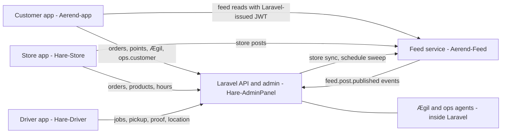

# Ærend system reports

Developer reference for how the Ærend system is meant to work (specs, plans, designs) and how it
works today on `agil-1`, with a gap analysis per area.

**As of 2026-10-02.** All repos were on `agil-1`:

| Repo | Commit |
|---|---|
| Hare-AdminPanel | `ec1dfe8` |
| aerend-app/Aerend-app | `824c478` |
| Aerend-Feed | `d1f7a2f` |
| Hare-Driver | `a71b33e` |
| Hare-Store | `6ce38b3` |

Every "built" claim in the reports links to the file that proves it. When code moves on, re-check
the GAP tables before relying on them.

## The five reports

| # | Report | Read it when you work on … |
|---|---|---|
| 01 | [Ærend agents: Ægil and the ops agents](01-AGENTIC-WORKFLOW-REPORT.md) | Ægil chat, suggestions and the tray, Fjordfiske deck, autonomy levels, memory, occasions, matching jobs, ops agents (A/B/C/E), partner agents P1–P5, courier agents B1–B4, the LLM calls |
| 02 | [Customer app (Aerend-app)](02-CUSTOMER-APP-REPORT.md) | Any customer screen (Hjem, Søk, Butikk, Kurv/Kasse, Sporing, Utforsk, Meg), the **points system** (earning, ledger, tiers, Premiehylla, league, missions), and how an order crosses all apps |
| 03 | [Store app (Hare-Store, Partner)](03-STORE-APP-REPORT.md) | Store order handling, pickup handover, open/closed and pause, products, self-delivery, payouts, store feed posts |
| 04 | [Driver app (Hare-Driver, Bud)](04-DRIVER-APP-REPORT.md) | Courier login and shifts, offers and dispatch, pickup scan, delivery proof, live location, earnings |
| 05 | [Feed](05-FEED-REPORT.md) | The Aerend-Feed service, store and Ærend publishing, moderation, tabs and ranking, the feed → Laravel event bridge, the customer Utforsk feed |

Each report has the same layout: TL;DR, a system diagram, one section per feature (spec, how it
works today, where in code, API and data, examples, status), how the other apps interact, a GAP
table with a ranked top 10, configuration, a quick-start and a glossary.

**Status legend used in every GAP table:** ✅ Built · 🟡 Partial · ❌ Not built · 🧪 Stub or mock
only · ⛔ Blocked on a business decision or an external party.

**Suggested reading order for a new developer:** 02 sections 1–3 for the big picture, then 02
section 14 for the order flow across apps, then the report for the area you will work on.

## How the pieces fit

## Findings that cut across several reports

These came up independently in more than one report. They matter more than any single screen gap.

1. **Two order state machines that don't talk.** Checkout, the store app and the driver app still
   move the legacy `status` column. The new `ops_state` machine only gets `placed` at creation.
   Customer tracking, escalation, shelf slots, self-delivery reminders and delivery proof all read
   `ops_state`, so they stall on real orders. Details are in report 02 section 14, report 03
   section 23 and report 04 section 22.
2. **The new Partner and Bud screens are built but unreachable.** Both apps ship the legacy screens.
   The agil-1 widgets are tested but have no data source and no navigation route. See reports 03
   and 04, section 3.
3. **Security issues to fix before production:**
   - Several `/api/ops/*`, `/api/ops/partner/*`, `/api/partner-delivery/*` and `/api/agentops/*`
     routes have no authentication and trust IDs sent by the client.
   - The Vipps return marks an order paid from a query parameter.
   - Live secrets are committed:
     - Anthropic key in `Hare-AdminPanel/.env` and `.env.prod`.
     - Cloudinary secret and FCM service-account key in `Aerend-Feed/do-app-platform.yaml`.
     - Google key files in Aerend-Feed.

     These should be rotated. The reports name the files but never quote the values.
4. **Ægil gets no live signals.** Three separate causes:
   - The feed posts its events to `/api/internal/feed/events`, but Laravel listens on
     `/api/ops/feed/events`.
   - `POINTS_SIGNAL_SOURCE` defaults to fixtures.
   - Store posts can't carry a product or type, so the matcher ignores them.

   See report 01 section 7 and report 05 section 14.
5. **Production feed runs `master`,** which has none of the agil-1 feed work. Pushing to `master`
   auto-deploys and migrates production. See report 05.
6. **Scheduled jobs:** the 2026-09-13 platform audit found the production scheduler not running.
   That stops every `agent:*`, `agentops:*` and `geo:*` job. See report 01.
7. **Plans overstate progress in places.** Several `[x]` items in AGIL-1-PLAN (Partner wake-lock and
   heartbeat, Bud camera pickup and offer screen, Hare-Store composer, FeedHome tabs and Vågen card)
   are not reachable in the running apps. Each report lists its spec, plan and code contradictions.

## Sources

- **Specs:** [`aerend-app/docs/`](../../../docs/). The Word specs were read as converted text.
- **Plans:** [`plans/`](../).
- **Backend docs:** [`Hare-AdminPanel/docs/`](../../../../Hare-AdminPanel/docs/) and
  [`Aerend-Feed/docs/`](../../../../Aerend-Feed/docs/).
- **Designs:** [`designs/21des/`](../../../../designs/21des/).

Each report's appendix lists the exact sections it used.
